<div style="position: absolute; top: 1rem; right: 1rem; font-size: 0.8em; opacity: 0.6;">
<SlideCurrentNo /> / <SlidesTotal />
</div>

<style>
.slidev-layout::before {
  content: '';
  background-image: url('./images/share/logo.png');
  background-size: contain;
  background-repeat: no-repeat;
  position: fixed;
  top: 1rem;
  left: 1rem;
  width: 100px;
  height: 40px;
  z-index: 100;
}

/* Add slide counter to bottom right of every slide */
.slidev-layout::after {
  content: counter(slide) '/' var(--slidev-page-total);
  position: fixed;
  bottom: 1rem;
  right: 1rem;
  font-size: 0.8em;
  opacity: 0.6;
}

/* Add padding to all slide content */
.slidev-layout {
  padding-top: 4rem !important;  /* Increased top padding to make room for logo */
}

/* Adjust specific layouts if needed */
.slidev-layout.default {
  padding-top: 4rem !important;
}

.slidev-layout.center {
  padding-top: 4rem !important;
}

/* Add professional font styling */
svg text {
  font-family: -apple-system, BlinkMacSystemFont, "Segoe UI", Roboto, Helvetica, Arial, sans-serif;
  letter-spacing: -0.2px;
}

/* Make text crisper */
svg {
  text-rendering: optimizeLegibility;
  -webkit-font-smoothing: antialiased;
  -moz-osx-font-smoothing: grayscale;
}
</style>

# ClickHouse in a day

A high-performance, column-oriented database management system

<div class="pt-12">
  <span class="px-2 py-1 rounded cursor-pointer" hover="bg-white bg-opacity-10">
    Press Space for next slide <carbon:arrow-right class="inline"/>
  </span>
</div>

---
layout: section
---
<div style="position: absolute; top: 1rem; right: 1rem; font-size: 0.8em; opacity: 0.6;">
<SlideCurrentNo /> / <SlidesTotal />
</div>
# Session 1: Introduction
---
layout: image-right
image: ./images/session1/clickhouse_an_open_source_column_oriented_database_management_system.jpeg
---
<div style="position: absolute; top: 1rem; right: 1rem; font-size: 0.8em; opacity: 0.6;">
<SlideCurrentNo /> / <SlidesTotal />
</div>


## What is ClickHouse?

- Open-source column-oriented DBMS
- Developed by Yandex
- Designed for online analytical processing (OLAP)
- Handles petabytes of data
- Real-time query processing
- High performance and scalability

---
layout: default
---
<div style="position: absolute; top: 1rem; right: 1rem; font-size: 0.8em; opacity: 0.6;">
<SlideCurrentNo /> / <SlidesTotal />
</div>


<div style="display: flex; justify-content: center; align-items: center; margin: 0.5rem auto;">
  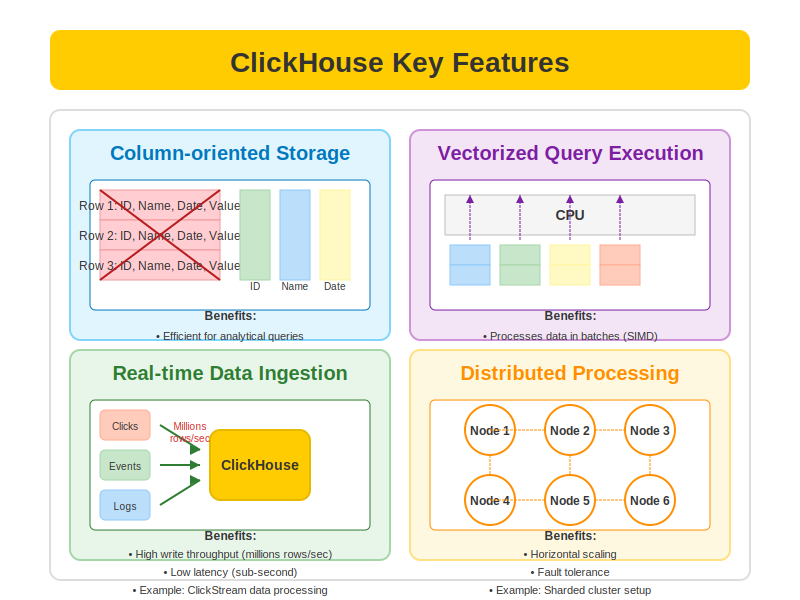
</div>

---
layout: default
---
<div style="position: absolute; top: 1rem; right: 1rem; font-size: 0.8em; opacity: 0.6;">
<SlideCurrentNo /> / <SlidesTotal />
</div>


<div style="display: flex; justify-content: center; align-items: center; margin: 2rem auto;">
  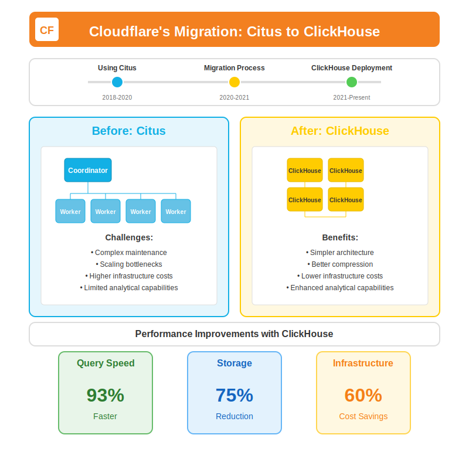
</div>

---
layout: default
---
<div style="position: absolute; top: 1rem; right: 1rem; font-size: 0.8em; opacity: 0.6;">
<SlideCurrentNo /> / <SlidesTotal />
</div>


<div style="display: flex; justify-content: center; align-items: center; margin: 2rem auto;">
  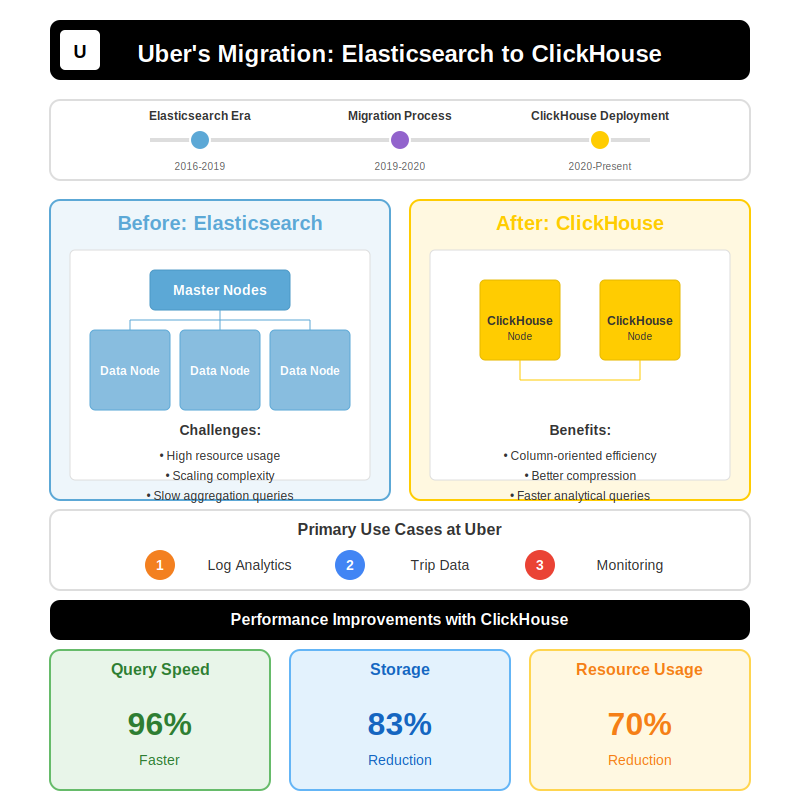
</div>

---
layout: default
---
<div style="position: absolute; top: 1rem; right: 1rem; font-size: 0.8em; opacity: 0.6;">
<SlideCurrentNo /> / <SlidesTotal />
</div>


# Installation and Setup
<div style="height: 400px; overflow-y: auto;">

```bash

    # Using Docker
    docker-compose --env-file .env up -d

    # docker-compose.yml file
    version: '3.8'

    services:
    clickhouse:
        image: clickhouse/clickhouse-server:latest
        container_name: clickhouse-labs
        ports:
        - "${CLICKHOUSE_PORT:-8123}:8123"       # HTTP port
        - "${CLICKHOUSE_TCP_PORT:-9000}:9000"   # Native port
        volumes:
        - ./data:/var/lib/clickhouse
        - ./logs:/var/log/clickhouse-server
        - ./config/users.xml:/etc/clickhouse-server/users.d/users.xml:ro
        environment:
        - CLICKHOUSE_USER=${CLICKHOUSE_USER:-default}
        - CLICKHOUSE_PASSWORD=${CLICKHOUSE_PASSWORD:-default}
        - CLICKHOUSE_DEFAULT_ACCESS_MANAGEMENT=1
        ulimits:
        nofile:
            soft: 262144
            hard: 262144

    volumes:
    clickhouse_data:
    clickhouse_logs:

```
</div>

---
layout: default
---
<div style="position: absolute; top: 1rem; right: 1rem; font-size: 0.8em; opacity: 0.6;">
<SlideCurrentNo /> / <SlidesTotal />
</div>

</div>
  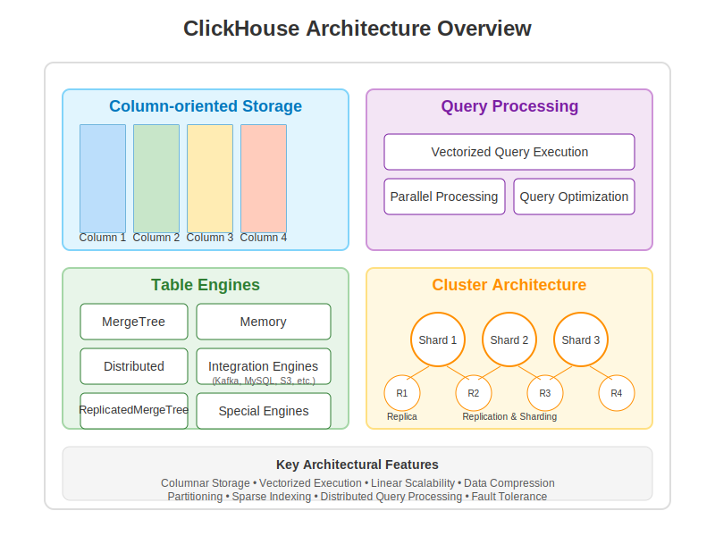

---
layout: default
---
<div style="position: absolute; top: 1rem; right: 1rem; font-size: 0.8em; opacity: 0.6;">
<SlideCurrentNo /> / <SlidesTotal />
</div>

# Why Clickhouse query so fast ?

<div style="display: flex; justify-content: center; align-items: center; margin:0rem auto;">
  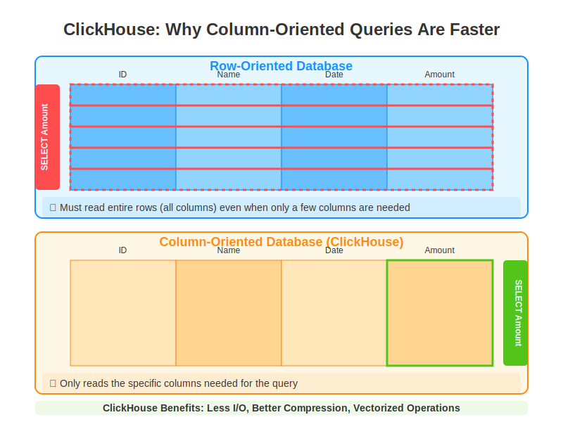
</div>


---
layout: default
---
<div style="position: absolute; top: 1rem; right: 1rem; font-size: 0.8em; opacity: 0.6;">
<SlideCurrentNo /> / <SlidesTotal />
</div>


# Granule

<div style="display: flex; justify-content: center; align-items: center; margin:0rem auto;">
  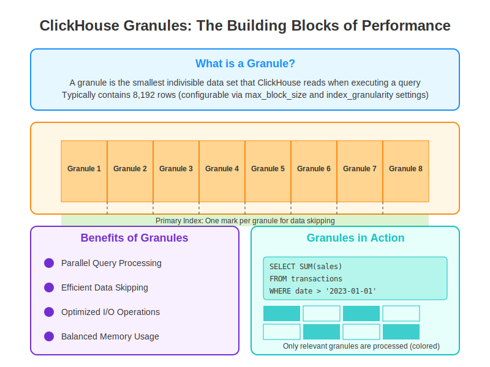
</div>

---
layout: default
---
<div style="position: absolute; top: 1rem; right: 1rem; font-size: 0.8em; opacity: 0.6;">
<SlideCurrentNo /> / <SlidesTotal />
</div>


# Granule Structure

<div style="display: flex; justify-content: center; align-items: center; margin:0rem auto;">
  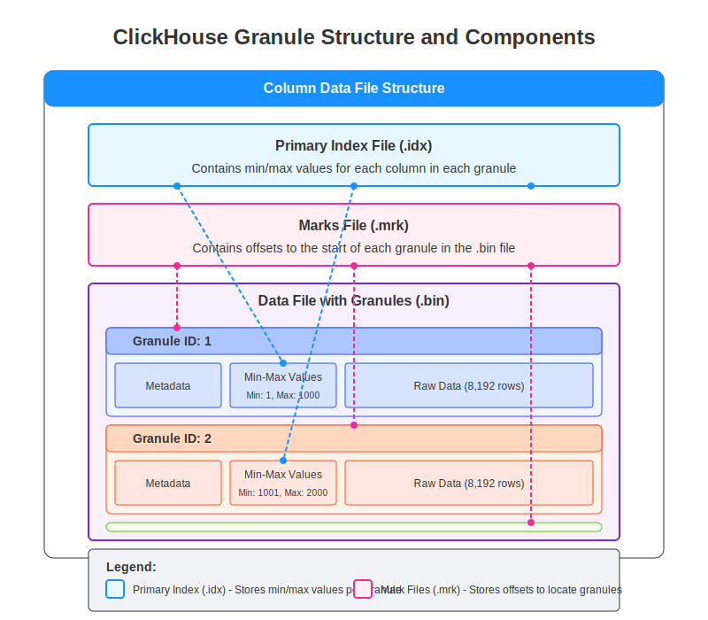
</div>

---
layout: section
---
<div style="position: absolute; top: 1rem; right: 1rem; font-size: 0.8em; opacity: 0.6;">
<SlideCurrentNo /> / <SlidesTotal />
</div>

# Session 1: Summary

<div class="grid grid-cols-2 gap-4 text-left text-sm" >
<div>

## Key Concepts Covered
- Introduction to ClickHouse
- Column-oriented DBMS architecture
- Installation and setup options
- Core features and capabilities
- Real-world use cases (Cloudflare, Uber)

## Main Benefits
- High performance for analytics
- Real-time query processing
- Handles petabytes of data
- Efficient data compression
- Horizontal scalability

</div>
<div>

## Technical Highlights
- Docker-based deployment
- Configuration management
- Port settings (8123, 9000)
- Volume management
- System architecture

## Next Steps
- Data types and schema design
- Table engines and operations
- Query optimization
- Performance tuning
- Distributed setups

</div>
</div>

---
layout: section
---
<div style="position: absolute; top: 1rem; right: 1rem; font-size: 0.8em; opacity: 0.6;">
<SlideCurrentNo /> / <SlidesTotal />
</div>

# Session 2: Data Types and Schema Design

---
layout: default
---
<div style="position: absolute; top: 1rem; right: 1rem; font-size: 0.8em; opacity: 0.6;">
<SlideCurrentNo /> / <SlidesTotal />
</div>


# 2.1 Native Types

 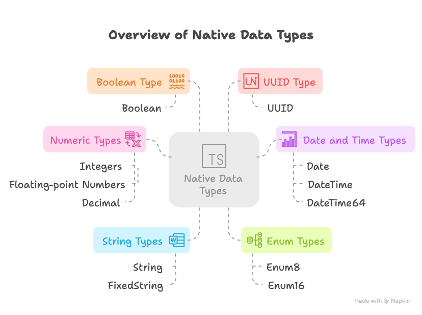


---
layout: two-cols
---
<div style="position: absolute; top: 1rem; right: 1rem; font-size: 0.8em; opacity: 0.6;">
<SlideCurrentNo /> / <SlidesTotal />
</div>


# Numeric Types

<div class="text-sm">

## Integers (Signed)
- `Int8`: -128 to 127 (1 byte)
- `Int16`: -32,768 to 32,767 (2 bytes)
- `Int32`: ~-2.1B to ~2.1B (4 bytes)
- `Int64`: ~-9.2E18 to ~9.2E18 (8 bytes)
- `Int128`: Very large range (16 bytes)
- `Int256`: Extremely large range (32 bytes)

## Integers (Unsigned)
- `UInt8`: 0 to 255 (1 byte)
- `UInt16`: 0 to 65,535 (2 bytes)
- `UInt32`: 0 to ~4.3B (4 bytes)
- `UInt64`: 0 to ~18.4E18 (8 bytes)
- `UInt128`/`UInt256`: For very large numbers

</div>

::right::

<div class="text-sm mt-12">

## Floating-Point Types
- `Float32`: Single precision (4 bytes)
- `Float64`: Double precision (8 bytes)

## Decimal Types (Fixed Precision)
- `Decimal32(scale)`: 9 digits, with scale decimal places
- `Decimal64(scale)`: 18 digits, with scale decimal places
- `Decimal128(scale)`: 38 digits, with scale decimal places
- `Decimal256(scale)`: 76 digits, with scale decimal places

```sql
-- Examples
user_id UInt32
views UInt64
temperature Float32
price Decimal64(2) -- For $123.45
```

</div>
---
layout: default
---
<div style="position: absolute; top: 1rem; right: 1rem; font-size: 0.8em; opacity: 0.6;">
<SlideCurrentNo /> / <SlidesTotal />
</div>

# Numeric Types - Code Examples

```sql
-- Create table with numeric types
CREATE TABLE numeric_example (
    -- Integers
    tiny_int Int8,                  -- For small numbers like flags
    small_int Int16,                -- For counters and small ranges
    regular_int Int32,              -- For most whole numbers
    big_int Int64,                  -- For large numbers like timestamps
    
    -- Unsigned Integers
    positive_small UInt8,           -- For positive small values (0-255)
    positive_medium UInt16,         -- For medium positive values
    positive_large UInt32,          -- For large positive values
    positive_very_large UInt64,     -- For very large values (timestamps in µs)
    
    -- Floating Point
    temperature Float32,            -- For measurements that need ~7 digits precision
    calculation_result Float64,     -- For values needing ~15 digits precision
    
    -- Fixed Precision (for financial data)
    price Decimal64(2),             -- For money values ($123.45)
    precise_metric Decimal128(6)    -- For values needing 6 decimal places
)
```

---
layout: two-cols
---
<div style="position: absolute; top: 1rem; right: 1rem; font-size: 0.8em; opacity: 0.6;">
<SlideCurrentNo /> / <SlidesTotal />
</div>


# String Types & UUID

<div class="text-sm"  style="height: 400px; overflow-y: auto;">

## String
- Variable-length strings
- No size limit (practically)
- UTF-8 encoded
- Uses less space for shorter strings

## FixedString(N)
- Fixed-length strings (N bytes)
- More space-efficient for fixed-length data
- Truncates or zero-pads data to fit N bytes
- Faster for exact-length strings

## UUID
- For 128-bit Universal Unique Identifiers
- Stored efficiently (16 bytes)
- Can generate automatically with UUID functions

</div>

::right::

<div class="text-sm mt-12">

## String Example Use Cases
```sql
-- Examples
comment String             -- Variable user comment
country_code FixedString(2) -- ISO country codes
transaction_id UUID        -- Unique identifiers
```

## Performance Optimization
- `LowCardinality(String)` for columns with few distinct values
  - Like countries, status codes, categories

```sql
-- Before
country String              -- Regular string

-- After (Much more efficient)
country LowCardinality(String) -- Dictionary-encoded
```

</div>

---
layout: default
---
<div style="position: absolute; top: 1rem; right: 1rem; font-size: 0.8em; opacity: 0.6;">
<SlideCurrentNo /> / <SlidesTotal />
</div>


# Date & Time Types

```sql
CREATE TABLE datetime_example (
    -- Date Types
    simple_date Date,              -- Range: 1970-01-01 to 2149-06-06 (2 bytes)
    extended_date Date32,          -- Range: 1900-01-01 to 2299-12-31 (4 bytes)
    
    -- DateTime Types (without timezone)
    timestamp DateTime,            -- Date and time with second precision (4 bytes)
    timestamp_ms DateTime64(3),    -- With millisecond precision (3 digits) (8 bytes)
    timestamp_ns DateTime64(9),    -- With nanosecond precision (9 digits) (8 bytes)
    
    -- DateTime Types (with timezone)
    timestamp_ny DateTime('America/New_York'),         -- With timezone
    timestamp_lon DateTime64(3, 'Europe/London'),      -- With timezone and ms precision
    
    -- Supported operations
    -- timestamp + INTERVAL 1 DAY
    -- timestamp - INTERVAL 3 HOUR
    -- toStartOfHour(timestamp)
    -- toYYYYMM(timestamp)
)
```

---
layout: two-cols
---
<div style="position: absolute; top: 1rem; right: 1rem; font-size: 0.8em; opacity: 0.6;">
<SlideCurrentNo /> / <SlidesTotal />
</div>


# Special Types

<div class="text-sm" style="height: 400px; overflow-y: auto;">

## Boolean Values
- Represented as `UInt8` (0 or 1)
- No dedicated Boolean type
```sql
is_active UInt8  -- 0 (false) or 1 (true)
```

## Enum Types
- Named constant values
- Stored efficiently as integers
- Two variants: `Enum8` and `Enum16`
```sql
status Enum8('active' = 1, 'inactive' = 0)
category Enum16('food' = 1, 'electronics' = 2, 
                'books' = 3)
```

## IP Addresses
- `IPv4`: Stored as UInt32
- `IPv6`: Stored as FixedString(16)
```sql
user_ip IPv4      -- 1 byte more efficient than UInt32
server_ip IPv6    -- Better semantics than FixedString
```

</div>

::right::

<div class="text-sm mt-12">

## Nullable Type
- Wrapper making any type nullable
- Has slight performance and storage overhead
```sql
-- Only use when NULLs are actually needed
optional_value Nullable(String)
optional_number Nullable(Int32)
```

## Domain Types
- Semantic wrappers over base types
```sql
url URL            -- String with URL functions
domain Domain      -- String optimized for domains
```

## Geo Types
- Types for geographical data
```sql
point Point        -- For 2D coordinates
ring Ring          -- Closed polygon without holes
polygon Polygon    -- Polygon with possible holes
```

</div>

---
layout: default
---
<div style="position: absolute; top: 1rem; right: 1rem; font-size: 0.8em; opacity: 0.6;">
<SlideCurrentNo /> / <SlidesTotal />
</div>


# Type Conversion & Casting

```sql
-- Implicit conversions happen automatically in compatible cases:
SELECT toUInt8(10), toString(42), toFloat64('3.14');

-- CAST operator for explicit conversion:
SELECT CAST('2023-01-01' AS Date), CAST(3.14 AS Decimal(10,2));

-- Conversion between numeric types:
SELECT CAST(count() AS Float64) / total AS ratio FROM ...

-- String to Date/DateTime conversion:
SELECT toDate('2023-01-01'), toDateTime('2023-01-01 12:30:00');

-- Type conversion in table definition
CREATE TABLE conversion_example (
    string_date String,
    parsed_date Date MATERIALIZED toDate(string_date)
)
```

---
layout: two-cols
---
<div style="position: absolute; top: 1rem; right: 1rem; font-size: 0.8em; opacity: 0.6;">
<SlideCurrentNo /> / <SlidesTotal />
</div>

# Type Selection Best Practices

<div class="text-sm" style="height: 400px; overflow-y: auto;">

## Use the most compact type possible
- `UInt8` instead of `Int64` for small positive numbers
- `Date` instead of `DateTime` if time not needed
- `FixedString(N)` for known-length strings

## Consider column cardinality
- `LowCardinality(String)` for columns with few unique values
- `Enum8/16` for fixed set of possible values

## Avoid unnecessary `Nullable` types
- Has performance cost (extra memory, slower processing)
- Consider default values instead when possible

</div>

::right::

<div class="text-sm mt-12">

## Optimize for query patterns
- Match types to how data will be queried
- Use appropriate Date/DateTime types for time-series data

## Storage impact
- Smaller types = less disk space & memory
- Better compression = better performance
- More efficient types = faster calculations

## Balance precision and performance
- `Float32` vs `Float64`
- `Decimal64(2)` vs `Decimal128(4)`
- Higher precision = more storage & processing cost

</div>


---
layout: default
---
<div style="position: absolute; top: 1rem; right: 1rem; font-size: 0.8em; opacity: 0.6;">
<SlideCurrentNo /> / <SlidesTotal />
</div>


## 2.2 Complex Data Types

<div style="display: flex; justify-content: center; align-items: center; margin: 2rem auto;">
  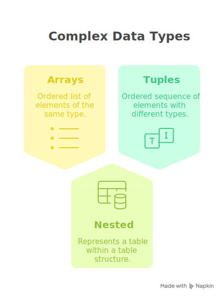
</div>

---
layout: default
---
<div style="position: absolute; top: 1rem; right: 1rem; font-size: 0.8em; opacity: 0.6;">
<SlideCurrentNo /> / <SlidesTotal />
</div>

# Arrays

<div style="height:400px;overflow-x:auto">

```sql
-- E-commerce product categories
CREATE TABLE products (
    product_id UInt32,
    name String,
    price Decimal64(2),
    -- Store multiple categories per product
    categories Array(String),
    -- Store multiple tag IDs
    tag_ids Array(UInt16),
    -- Store historical prices with timestamps
    price_history Array(Tuple(DateTime, Decimal64(2))),
    -- Multidimensional array for size variations (S,M,L × Red,Blue,Green)
    inventory Array(Array(UInt16))
) ENGINE = MergeTree()
ORDER BY product_id;

-- Insert example
INSERT INTO products VALUES (
    1001,
    'Ultra Comfort Running Shoes',
    89.99,
    ['Footwear', 'Sports', 'Running'],
    [42, 56, 73],
    [(toDateTime('2023-01-01 00:00:00'), 79.99), (toDateTime('2023-03-15 00:00:00'), 84.99), (toDateTime('2023-06-01 00:00:00'), 89.99)],
    [[25, 30, 15], [40, 35, 20], [30, 25, 10]]  -- Inventory: [S,M,L] × [Red,Blue,Green]
);
```
</div>

---
layout: two-cols
---
<div style="position: absolute; top: 1rem; right: 1rem; font-size: 0.8em; opacity: 0.6;">
<SlideCurrentNo /> / <SlidesTotal />
</div>


# Array Use Cases & Queries

<div class="text-sm" style="height:400px;overflow-x:auto">

## Real Use Cases for Arrays

1. **Product tags/categories**
   - Store multiple categories per product
   - Avoid separate junction tables

2. **Feature vectors**
   - Machine learning embeddings
   - Recommendation systems

3. **Time series data points**
   - Sensor readings over time 
   - Stock price fluctuations

4. **Multi-value attributes**
   - User interests/preferences
   - Product features

</div>

::right::

<div class="text-sm" style="height:450px;overflow-x:auto">

## Common Array Operations

```sql
-- Products with specific category
SELECT product_id, name 
FROM products 
WHERE has(categories, 'Running');

-- Count products per category
SELECT 
    category,
    count() AS product_count
FROM products
ARRAY JOIN categories AS category
GROUP BY category
ORDER BY product_count DESC;

-- Find products with at least 3 categories
SELECT product_id, name
FROM products
WHERE length(categories) >= 3;

-- Calculate average price
SELECT 
    product_id,
    name,
    avg(price_point.2) AS avg_price
FROM products
ARRAY JOIN price_history AS price_point
GROUP BY product_id, name;
```

</div>

---
layout: default
---
<div style="position: absolute; top: 1rem; right: 1rem; font-size: 0.8em; opacity: 0.6;">
<SlideCurrentNo /> / <SlidesTotal />
</div>


# Nested Data Type

<div class="text-sm" style="height:400px;overflow-x:auto">

```sql
-- E-commerce orders with line items
CREATE TABLE orders (
    order_id UInt32,
    customer_id UInt32,
    order_date DateTime,
    
    -- Nested structure for order items
    order_items Nested(
        product_id UInt32,
        quantity UInt16,
        price Decimal64(2),
        discount Decimal64(2)
    ),
    
    total_amount Decimal64(2),
    payment_method Enum8('credit_card' = 1, 'paypal' = 2, 'bank_transfer' = 3),
    shipping_address String
) ENGINE = MergeTree()
PARTITION BY toYYYYMM(order_date)
ORDER BY (customer_id, order_date);

-- Insert example
INSERT INTO orders VALUES (
    10001,
    5001,
    '2023-07-15 14:30:00',
    [1001, 2002, 3003],          -- product_id array
    [2, 1, 3],                   -- quantity array
    [89.99, 25.50, 12.99],       -- price array
    [0, 5.10, 0],                -- discount array
    157.36,
    1,
    '123 Main St, Anytown, US'
);
```
</div>
---
layout: two-cols
---
<div style="position: absolute; top: 1rem; right: 1rem; font-size: 0.8em; opacity: 0.6;">
<SlideCurrentNo /> / <SlidesTotal />
</div>


# Nested Use Cases & Queries

<div class="text-sm" style="height:400px;overflow-x:auto" >

## Real Use Cases for Nested

1. **Order line items**
   - Multiple products per order
   - Maintains order-item relationship

2. **User events with properties**
   - Web analytics events
   - IoT device readings

3. **Document storage**
   - JSON-like documents
   - Hierarchical data

4. **Transaction details**
   - Financial transactions
   - Payment processing data

</div>

::right::

<div class="text-sm" style="height:450px;overflow-x:auto">

## Working with Nested Types

```sql
-- Calculate total items sold per product
SELECT 
    order_items.product_id,
    sum(order_items.quantity) AS total_quantity
FROM orders
ARRAY JOIN order_items
GROUP BY order_items.product_id
ORDER BY total_quantity DESC;

-- Find orders with specific product
SELECT 
    order_id,
    order_date
FROM orders
ARRAY JOIN order_items
WHERE order_items.product_id = 1001;

-- Calculate revenue by product
SELECT
    order_items.product_id,
    sum(order_items.quantity * 
        (order_items.price - order_items.discount)) AS revenue
FROM orders
ARRAY JOIN order_items
GROUP BY order_items.product_id
ORDER BY revenue DESC;
```

</div>

---
layout: default
---
<div style="position: absolute; top: 1rem; right: 1rem; font-size: 0.8em; opacity: 0.6;">
<SlideCurrentNo /> / <SlidesTotal />
</div>


# Tuples

<div style="height:400px;overflow-x:auto"> 

```sql
-- Location data for ride-sharing application
CREATE TABLE ride_events (
    ride_id UInt64,
    driver_id UInt32,
    rider_id UInt32,
    event_time DateTime64(3),
    event_type Enum8('requested' = 1, 'accepted' = 2, 'started' = 3, 'completed' = 4, 'canceled' = 5),
    
    -- Coordinates as tuple (lat, lon)
    coordinates Tuple(Float64, Float64),
    
    -- Structured address as named tuple
    address Tuple(
        street String,
        city LowCardinality(String),
        state LowCardinality(String),
        zip FixedString(5)
    ),
    
    -- Ride statistics
    stats Tuple(
        distance_km Float32,
        duration_min UInt16,
        fare Decimal64(2)
    )
) ENGINE = MergeTree()
PARTITION BY toYYYYMMDD(event_time)
ORDER BY (driver_id, event_time);

-- Insert example
INSERT INTO ride_events VALUES (
    123456789,
    1001,
    5002,
    '2023-07-15 08:30:00.000',
    3,
    (37.7749, -122.4194),                 -- San Francisco coordinates
    ('123 Market St', 'San Francisco', 'CA', '94103'),
    (5.2, 18, 12.50)
);
```
</div>

---
layout: two-cols
---
<div style="position: absolute; top: 1rem; right: 1rem; font-size: 0.8em; opacity: 0.6;">
<SlideCurrentNo /> / <SlidesTotal />
</div>


# Tuple Use Cases & Queries

<div class="text-sm"  style="height:400px;overflow-x:auto">

## Real Use Cases for Tuples

1. **Geospatial data**
   - Coordinates (lat, lon)
   - Boundaries and regions

2. **Structured attributes**
   - Addresses and locations
   - Product dimensions (L×W×H)

3. **Multi-value metrics**
   - Performance stats
   - Financial indicators

4. **Parameter combinations**
   - Configuration settings
   - Test parameters

</div>

::right::

<div class="text-sm" style="height:450px;overflow-x:auto">

## Working with Tuples

```sql
SELECT 
    ride_id,
    driver_id,
    event_time
FROM ride_events
WHERE event_type = 3  
  AND coordinates.1 BETWEEN 37.7 AND 37.8  
  AND coordinates.2 BETWEEN -122.5 AND -122.4

-- Filter by address component
SELECT 
    count() AS ride_count
FROM ride_events
WHERE address.city = 'San Francisco'
  AND event_type = 4


-- Calculate average statistics
SELECT 
    avg(stats.1) AS avg_distance,
    avg(stats.2) AS avg_duration,
    avg(stats.3) AS avg_fare
FROM ride_events
WHERE event_type = 4 
```

</div>

---
layout: default
---
<div style="position: absolute; top: 1rem; right: 1rem; font-size: 0.8em; opacity: 0.6;">
<SlideCurrentNo /> / <SlidesTotal />
</div>


# Maps

<div style="height:400px;overflow-x:auto">

```sql
-- Web analytics events
CREATE TABLE user_events (
    event_id UUID,
    user_id UInt64,
    session_id UUID,
    event_time DateTime64(3),
    event_type LowCardinality(String),
    page_url String,
    
    -- Event properties as key-value pairs
    event_properties Map(LowCardinality(String), String),
    
    -- User properties
    user_properties Map(LowCardinality(String), String),
    
    -- Metrics
    metrics Map(LowCardinality(String), Float64),
    
    -- Device and browser info
    browser_info Map(LowCardinality(String), String)
) ENGINE = MergeTree()
PARTITION BY toYYYYMMDD(event_time)
ORDER BY (user_id, event_time, event_id);

-- Insert example
INSERT INTO user_events VALUES (
    generateUUIDv4(),
    123456,
    generateUUIDv4(),
    now(),
    'page_view',
    'https://example.com/products',
    {
        'referrer': 'https://google.com',
        'utm_source': 'email_campaign',
        'utm_medium': 'email'
    },
    {
        'country': 'US',
        'language': 'en',
        'segment': 'premium'
    },
    {
        'page_load_time': 1.24,
        'time_on_page': 45.7,
        'scroll_depth': 0.75
    },
    {
        'browser': 'Chrome',
        'os': 'Windows',
        'device': 'desktop',
        'viewport_width': '1920',
        'viewport_height': '1080'
    }
);
```
</div>

---
layout: two-cols
---
<div style="position: absolute; top: 1rem; right: 1rem; font-size: 0.8em; opacity: 0.6;">
<SlideCurrentNo /> / <SlidesTotal />
</div>


# Map Use Cases & Queries

<div class="text-sm" style="height:400px;overflow-x:auto">

## Real Use Cases for Maps

1. **Event properties**
   - Web analytics
   - Mobile app events
   - IoT sensor data

2. **User attributes**
   - Dynamic user properties
   - Preferences and settings

3. **Configuration settings**
   - Application configs
   - Feature flags

4. **Metadata storage**
   - Document metadata
   - Schema-less data storage

</div>

::right::

<div class="text-sm" style="height:450px;overflow-x:auto">

## Working with Maps

```sql
-- Find events with specific property value
SELECT 
    count() AS total_events
FROM user_events
WHERE event_properties['utm_source'] = 'email_campaign';

-- Get events where certain metric exceeds threshold
SELECT 
    event_id,
    event_time,
    event_type
FROM user_events
WHERE metrics['page_load_time'] > 5.0;

-- Aggregate by map value
SELECT 
    browser_info['browser'] AS browser,
    count() AS event_count
FROM user_events
WHERE event_time >= now() - INTERVAL 1 DAY
GROUP BY browser
ORDER BY event_count DESC;

-- Calculate average metric by user segment
SELECT 
    user_properties['segment'] AS segment,
    avg(metrics['time_on_page']) AS avg_time_on_page
FROM user_events
WHERE event_type = 'page_view'
GROUP BY segment;
```

</div>

---
layout: default
---
<div style="position: absolute; top: 1rem; right: 1rem; font-size: 0.8em; opacity: 0.6;">
<SlideCurrentNo /> / <SlidesTotal />
</div>


# Using Multiple Complex Types Together

<div style="height:400px;overflow-x:auto">

```sql
-- IoT sensor data from smart home system
CREATE TABLE sensor_readings (
    device_id UUID,
    timestamp DateTime64(3),
    device_type LowCardinality(String),
    location_id UInt16,
    
    -- Coordinates of the device
    coordinates Tuple(Float64, Float64, Float64), -- (x, y, z) coordinates in home
    
    -- Multiple sensor readings per event
    readings Nested(
        sensor_type LowCardinality(String),
        value Float64,
        unit LowCardinality(String)
    ),
    
    -- Historical readings (last 10 values)
    historical_values Array(Float64),
    historical_timestamps Array(DateTime64(3)),
    
    -- Device configuration and metadata
    configuration Map(LowCardinality(String), String)
) ENGINE = MergeTree()
PARTITION BY toYYYYMMDD(timestamp)
ORDER BY (device_id, timestamp);

-- 1. Basic array operations
SELECT 
    device_id,
    -- Get array length
    length(historical_values) as num_historical_values,
    -- Get first and last elements
    historical_values[1] as first_value,
    historical_values[-1] as last_value,
    -- Get array average using arrayAvg
    arrayAvg(historical_values) as avg_value
FROM sensor_readings
WHERE device_id = '55a7904c-02a6-4751-896f-74ab97b6a789';
```
</div>
---
layout: center
class: text-center
---
<div style="position: absolute; top: 1rem; right: 1rem; font-size: 0.8em; opacity: 0.6;">
<SlideCurrentNo /> / <SlidesTotal />
</div>


# Complex Data Type Selection Guide

<div class="grid grid-cols-2 gap-4 pt-4">
<div class="text-left text-sm">

### Use Arrays When:
- You need an ordered collection
- Items have the same type
- All items are accessed together
- You need random access by index

### Use Nested When:
- You have arrays of objects/structures
- Each object has multiple attributes
- You need to perform GROUP BY or filter on attributes

</div>
<div class="text-left text-sm">

### Use Tuples When:
- You need fixed-size collections
- Elements have different types
- Structure won't change
- Simple access by position is sufficient

### Use Maps When:
- You need key-value pairs
- Schema flexibility is required
- Dynamic attribute sets
- Keys are strings (typically)

</div>
</div>

<div class="pt-10 text-gray-500">
"Choose the right complex type based on your data structure and query patterns"
</div>

---
layout: default
---
<div style="position: absolute; top: 1rem; right: 1rem; font-size: 0.8em; opacity: 0.6;">
<SlideCurrentNo /> / <SlidesTotal />
</div>


## 2.3 Table engines 
<div style="display: flex; justify-content: center; align-items: center; margin:0rem auto;">
  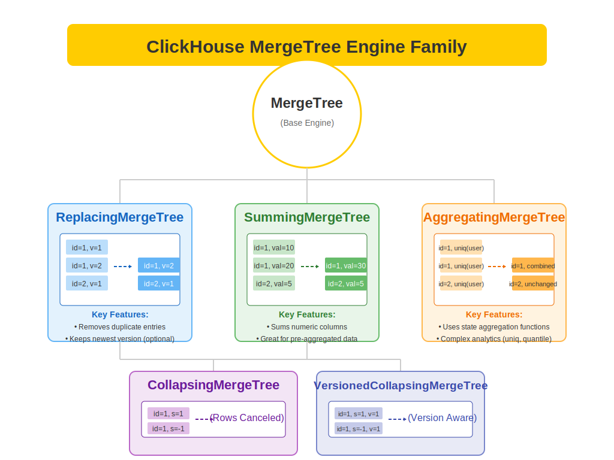
</div>

---
layout: two-cols
---
<div style="position: absolute; top: 1rem; right: 1rem; font-size: 0.8em; opacity: 0.6;">
<SlideCurrentNo /> / <SlidesTotal />
</div>


# ReplacingMergeTree

<div class="text-sm">

## Use Case
Managing product catalog where latest product information should replace old data.

```sql
CREATE TABLE product_catalog (
    product_id UInt32,
    product_name String,
    price Decimal(10,2),
    stock_quantity Int32,
    last_updated DateTime,
    version UInt32
) ENGINE = ReplacingMergeTree(version)
PRIMARY KEY product_id;
```

</div>

::right::

<div class="text-sm">

## Example Operations
```sql
-- Insert initial data
INSERT INTO product_catalog VALUES
(1, 'Laptop', 999.99, 50, 
 '2024-01-01 10:00:00', 1);

-- Update with new version
INSERT INTO product_catalog VALUES
(1, 'Laptop', 899.99, 45, 
 '2024-01-02 10:00:00', 2);

-- After optimization
OPTIMIZE TABLE product_catalog FINAL;
```

</div>

---
layout: two-cols
---
<div style="position: absolute; top: 1rem; right: 1rem; font-size: 0.8em; opacity: 0.6;">
<SlideCurrentNo /> / <SlidesTotal />
</div>


# CollapsingMergeTree

<div class="text-sm">

## Use Case
Real-time inventory tracking with increment/decrement operations.

```sql
CREATE TABLE inventory_movements (
    product_id UInt32,
    warehouse_id UInt16,
    quantity Int32,
    operation_time DateTime,
    sign Int8  -- 1 for add, -1 for subtract
) ENGINE = CollapsingMergeTree(sign)
ORDER BY (product_id, warehouse_id, 
         operation_time);
```

</div>

::right::

<div class="text-sm">

## Example Operations
```sql
-- Receive inventory
INSERT INTO inventory_movements VALUES
(1, 1, 100, now(), 1);  -- Add 100

-- Record sale
INSERT INTO inventory_movements VALUES
(1, 1, -20, now(), 1);  -- Remove 20

-- Cancel sale
INSERT INTO inventory_movements VALUES
(1, 1, 20, now(), -1);  -- Cancel removal

-- Check final state
SELECT * FROM inventory_movements FINAL;
```

</div>

---
layout: two-cols
---
<div style="position: absolute; top: 1rem; right: 1rem; font-size: 0.8em; opacity: 0.6;">
<SlideCurrentNo /> / <SlidesTotal />
</div>


# SummingMergeTree

<div class="text-sm">

## Use Case
Daily sales aggregation for e-commerce analytics.

```sql
CREATE TABLE daily_sales (
    date Date,
    product_id UInt32,
    total_revenue Decimal(15,2),
    items_sold UInt32,
    return_count UInt32
) ENGINE = SummingMergeTree()
ORDER BY (date, product_id)
PARTITION BY toYYYYMM(date);
```

</div>

::right::

<div class="text-sm">

## Example Operations
```sql
-- Record sales
INSERT INTO daily_sales VALUES
('2024-01-01', 1, 1000.00, 10, 1),
('2024-01-01', 1, 2000.00, 20, 2);

-- Add more sales
INSERT INTO daily_sales VALUES
('2024-01-01', 1, 1000.00, 10, 1);

-- View aggregated results
SELECT * FROM daily_sales FINAL;
```

</div>

---
layout: two-cols
---
<div style="position: absolute; top: 1rem; right: 1rem; font-size: 0.8em; opacity: 0.6;">
<SlideCurrentNo /> / <SlidesTotal />
</div>


# AggregatingMergeTree

<div class="text-sm">

## Use Case
Customer behavior analytics with complex aggregations.

```sql
CREATE TABLE customer_behavior (
    date Date,
    customer_id UInt32,
    total_visits AggregateFunction(sum, UInt8),
    avg_session_duration 
        AggregateFunction(avg, Float64),
    product_categories 
        AggregateFunction(groupUniqArray, String)
) ENGINE = AggregatingMergeTree()
PARTITION BY toYYYYMM(date)
ORDER BY (date, customer_id);
```

</div>

::right::

<div class="text-sm" style="height:450px;overflow-y:auto">

## Example Query

```sql
INSERT INTO customer_behavior
SELECT 
    date,
    customer_id,
    sumState(CAST(visits AS UInt8)), -- Explicitly cast to UInt8
    avgState(CAST(duration AS Float64)),
    groupUniqArrayState(category)
FROM 
(
    -- Sample raw data
    SELECT
        toDate('2024-01-01') as date,
        1 as customer_id,
        1 as visits,
        300.0 as duration, -- Added .0 to make it explicit Float64
        'Electronics' as category
    UNION ALL
    SELECT
        toDate('2024-01-01'),
        1,
        1,
        400.0,
        'Clothing'
) raw
GROUP BY date, customer_id;

-- Query aggregated results
SELECT
    date,
    customer_id,
    sumMerge(total_visits) as visits,
    avgMerge(avg_session_duration) as duration,
    groupUniqArrayMerge(product_categories) 
        as categories
FROM customer_behavior
GROUP BY date, customer_id;
```

</div>

---
layout: default
---
<div style="position: absolute; top: 1rem; right: 1rem; font-size: 0.8em; opacity: 0.6;">
<SlideCurrentNo /> / <SlidesTotal />
</div>


# MergeTree Engine Selection Guide

<div class="grid grid-cols-2 gap-4 pt-4 text-sm">
<div>

### Use ReplacingMergeTree When:
- Need to maintain latest version of records
- Handling data updates
- Managing product catalogs

### Use CollapsingMergeTree When:
- Need to track state changes
- Managing incremental updates
- Real-time balance calculations

</div>
<div>

### Use SummingMergeTree When:
- Aggregating numeric values
- Maintaining running totals
- Pre-calculating metrics

### Use AggregatingMergeTree When:
- Complex aggregations needed
- Working with state functions
- Advanced analytics required

</div>
</div>

<div class="pt-4 text-gray-500">
"Choose the right engine based on your data patterns and query requirements"
</div>

---
layout: default
---
<div style="position: absolute; top: 1rem; right: 1rem; font-size: 0.8em; opacity: 0.6;">
<SlideCurrentNo /> / <SlidesTotal />
</div>


## 2.4 Schema Design, Partitioning & Sharding for Chat Apps with Payment Attachment

<div class="grid grid-cols-2 gap-4">
<div>

Key strengths:
- High performance on analytical queries
- Efficient compression
- Columnar storage
- Data skipping mechanisms
- Parallelization capabilities
- Flexible scaling options

</div>
</div>

---
layout: section
---
<div style="position: absolute; top: 1rem; right: 1rem; font-size: 0.8em; opacity: 0.6;">
<SlideCurrentNo /> / <SlidesTotal />
</div>

# Schema Design Best Practices

---
layout: two-cols
---
<div style="position: absolute; top: 1rem; right: 1rem; font-size: 0.8em; opacity: 0.6;">
<SlideCurrentNo /> / <SlidesTotal />
</div>


# Schema Design Principles

1. Column-oriented thinking
2. Denormalization is often preferred
3. Use appropriate data types
4. Consider query patterns
5. Balance between read & write efficiency
6. Leverage materialized views
7. Use efficient sorting keys

::right::

<div class="ml-4" style="height:1000px;overflow-y:auto;transform: scale(0.5); transform-origin: top left; ">
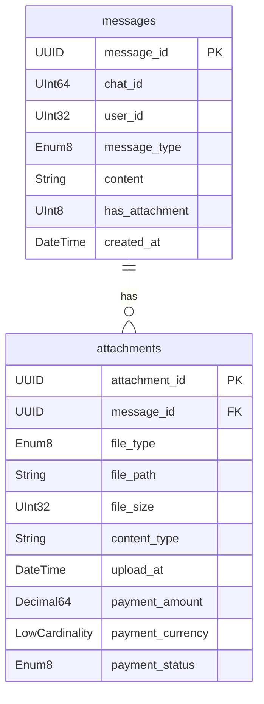
</div>

---
layout: default
---
<div style="position: absolute; top: 1rem; right: 1rem; font-size: 0.8em; opacity: 0.6;">
<SlideCurrentNo /> / <SlidesTotal />
</div>


# Data Types Selection

<div class="grid grid-cols-2 gap-4">

<div>

## Numeric Types
- Use smallest possible integer type
  - UInt8, UInt16, UInt32, UInt64
  - Int8, Int16, Int32, Int64
- For floats: Float32 or Float64
- Decimal64(N) or Decimal128(N) for money

</div>

<div>

## Special Data Types
- DateTime or DateTime64 for timestamps
- Date for just dates
- LowCardinality for low-unique-value strings
- Enum for fixed value sets
- IPv4/IPv6 for IP addresses
- Array for multiple values

</div>

</div>

---
layout: default
---
<div style="position: absolute; top: 1rem; right: 1rem; font-size: 0.8em; opacity: 0.6;">
<SlideCurrentNo /> / <SlidesTotal />
</div>


# ChatApp Payment Use Case: Schema Design

<div class="grid grid-cols-2 gap-4">

<div style="overflow-y:auto;height:400px">

## Core Tables Structure
```sql
-- Chat Rooms Table
CREATE TABLE chat_rooms (
    chat_id UInt64,
    room_name String,
    created_by UInt32,
    created_at DateTime,
    is_active UInt8,
    _sign Int8
) ENGINE = CollapsingMergeTree(_sign)
PARTITION BY toYYYYMM(created_at)
ORDER BY (chat_id, created_at);

-- Messages Table
CREATE TABLE messages (
    message_id UUID,
    chat_id UInt64,
    user_id UInt32,
    message_type Enum8('text'=1, 'file'=2, 'payment'=3),
    content String,
    has_attachment UInt8,
    created_at DateTime,
    _sign Int8,
    INDEX message_type_idx message_type TYPE bloom_filter GRANULARITY 1
) ENGINE = CollapsingMergeTree(_sign)
PARTITION BY toYYYYMM(created_at)
ORDER BY (chat_id, created_at);
```

</div>
<div>

## Attachments Table
```sql
CREATE TABLE attachments (
    attachment_id UUID,
    message_id UUID,
    file_type Enum8('invoice'=1, 'receipt'=2, 'other'=3),
    file_path String,
    file_size UInt32,
    content_type String,
    upload_at DateTime,
    payment_amount Decimal64(2),
    payment_currency LowCardinality(String),
    payment_status Enum8('pending'=1, 'paid'=2, 'declined'=3),
    _sign Int8,
    INDEX file_type_idx file_type TYPE bloom_filter GRANULARITY 1
) ENGINE = CollapsingMergeTree(_sign)
PARTITION BY toYYYYMM(upload_at)
ORDER BY (message_id, upload_at);
```

</div>
</div>

---
layout: default
---

<div style="position: absolute; top: 1rem; right: 1rem; font-size: 0.8em; opacity: 0.6;">
<SlideCurrentNo /> / <SlidesTotal />
</div>


# ER Diagram: Chat Application Schema

<div style="transform: scale(0.9);transform-origin: top left;height:800px;overflow-y:auto; ">
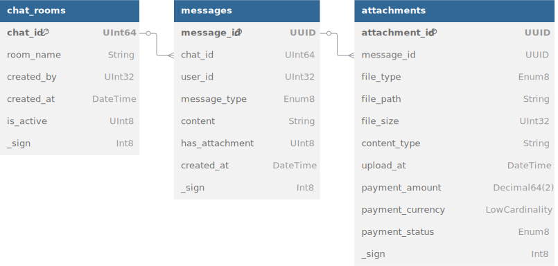

</div>

---
layout: default
---
<div style="position: absolute; top: 1rem; right: 1rem; font-size: 0.8em; opacity: 0.6;">
<SlideCurrentNo /> / <SlidesTotal />
</div>


# Key Schema Design Features

<div class="grid grid-cols-2 gap-4">
<div>

## CollapsingMergeTree Engine
- Supports data updates via _sign column
- -1 marks deleted rows, 1 marks active rows
- Automatically collapses during merges
- Perfect for mutable chat data

## Partitioning Strategy
- Monthly partitions by created_at/upload_at
- Efficient data lifecycle management
- Optimized for time-based queries

</div>
<div>

## Indexing & Performance
- Primary keys optimize data access
- Bloom filter indexes for message_type and file_type
- LowCardinality for repeated values
- Efficient joins via UUID relationships

## Data Types
- UUID for unique identifiers
- Enum8 for fixed value sets
- Decimal64(2) for payment amounts
- DateTime for timestamps

</div>
</div>

---
layout: default
---
<div style="position: absolute; top: 1rem; right: 1rem; font-size: 0.8em; opacity: 0.6;">
<SlideCurrentNo /> / <SlidesTotal />
</div>
<div style="position: absolute; top: 1rem; right: 1rem; font-size: 0.8em; opacity: 0.6;">
<SlideCurrentNo /> / <SlidesTotal />
</div>

# Schema Optimization Tips

<div class="grid grid-cols-2 gap-4">

<div>

## Primary Keys & Sorting
- ORDER BY determines physical data order
- Choose columns that:
  - Are used in WHERE conditions
  - Follow cardinality principle (high to low)
  - Enable data skipping
- For our case: (chat_id, created_at)

## Indexes
- Sparse indexes in ClickHouse
- Secondary indexes with expressions
- Use bloom filters for high-cardinality columns

</div>
<div>

## Optimizing for Queries
- Common query for payment analytics:

```sql
SELECT 
    toDate(upload_at) AS day,
    sum(payment_amount) AS total_amount,
    countIf(payment_status = 'paid') AS paid_count
FROM attachments
WHERE 
    file_type = 'invoice' 
    AND toYYYYMM(upload_at) >= 202301
    AND toYYYYMM(upload_at) <= 202312
GROUP BY day
ORDER BY day
```

</div>
</div>

---
layout: section
---
<div style="position: absolute; top: 1rem; right: 1rem; font-size: 0.8em; opacity: 0.6;">
<SlideCurrentNo /> / <SlidesTotal />
</div>

# Partitioning and Sharding

---
layout: two-cols
---
<div style="position: absolute; top: 1rem; right: 1rem; font-size: 0.8em; opacity: 0.6;">
<SlideCurrentNo /> / <SlidesTotal />
</div>

# Partitioning

Partitioning divides data within a single server

- Improves query performance
- Simplifies data management
- Enables efficient TTL policies
- Optimizes storage operations

### Best Practices:
- Partition on date/time for time-series data
- Aim for 10MB-100GB per partition
- Avoid too many small partitions
- Consider hardware limitations

::right::

<div class="ml-4 mt-10">

### Our Chat App Approach:
```sql
PARTITION BY toYYYYMM(created_at)
```

- Groups data by year and month
- Allows efficient historical queries
- Works well with time-based retention
- Partition by date component matching your typical query range

</div>

---
layout: default
---
<div style="position: absolute; top: 1rem; right: 1rem; font-size: 0.8em; opacity: 0.6;">
<SlideCurrentNo /> / <SlidesTotal />
</div>

# Sharding

<div class="grid grid-cols-2 gap-4">

<div>

## What is Sharding?
- Horizontal partitioning across multiple servers
- Distributes data and query load
- Scales out capacity
- Managed by ClickHouse Keeper
- Uses Distributed table engine as a view

## Sharding Key Selection
- Even data distribution
- Minimize cross-shard queries
- Align with business domains

</div>
<div>

## ChatApp Sharding Approach
```sql
-- On each shard
CREATE TABLE messages_local (
    -- same schema as before
) ENGINE = MergeTree()
PARTITION BY toYYYYMM(created_at)
ORDER BY (chat_id, created_at);

-- Distributed view
CREATE TABLE messages AS messages_local
ENGINE = Distributed(cluster_name, 
                    default, 
                    messages_local, 
                    sipHash64(chat_id));
```

Sharding by `chat_id` keeps all messages for a specific chat on the same shard, optimizing retrieval.

</div>
</div>

---
layout: default
---
<div style="position: absolute; top: 1rem; right: 1rem; font-size: 0.8em; opacity: 0.6;">
<SlideCurrentNo /> / <SlidesTotal />
</div>

# Real-World Use Case: Optimizing for Payment Analysis

<div class="grid grid-cols-2 gap-4">

<div>

## Common Access Patterns
1. Retrieve chat history with attachments
2. Search for payment documents
3. Calculate payment statistics
4. Generate financial reports
5. Filter payments by status

## Key Optimizations
- Materialized view for payment summaries
- Separate partition for payment attachments
- Pre-aggregated data for reporting
- Custom sharding strategy for payment processing

</div>
<div>

## Materialized View for Payments
```sql
CREATE MATERIALIZED VIEW payment_summary
ENGINE = SummingMergeTree()
PARTITION BY toYYYYMM(day)
ORDER BY (payment_currency, day)
AS
SELECT 
    toDate(upload_at) AS day,
    payment_currency,
    payment_status,
    count() AS payment_count,
    sum(payment_amount) AS total_amount
FROM attachments
WHERE file_type IN ('invoice', 'receipt')
GROUP BY day, payment_currency, payment_status;
```

</div>
</div>

---
layout: default
---
<div style="position: absolute; top: 1rem; right: 1rem; font-size: 0.8em; opacity: 0.6;">
<SlideCurrentNo /> / <SlidesTotal />
</div>

# Key Takeaways

<div class="grid grid-cols-2 gap-4">

<div>

## Schema Design
- Think in columns, not rows
- Optimize for your most common queries
- Use the smallest efficient data types
- Denormalize when it makes sense
- Use materialized views for pre-aggregation
- Apply proper ORDER BY for data locality

</div>
<div>

## Partitioning & Sharding
- Partition by date components for time-series data
- Shard by high-cardinality business entity
- Balance partition sizes (not too big, not too small)
- Consider read vs. write optimization
- Test with realistic data volumes
- Monitor and adjust based on query patterns

</div>
</div>

<div class="mt-4 p-4 bg-blue-50 rounded-lg">

## ChatApp Payment Use Case Lessons
1. Separate schema for attachments with specialized fields
2. Partition monthly for efficient data lifecycle management
3. Shard by chat_id to keep conversations together
4. Use materialized views for real-time payment analytics
5. Apply LowCardinality and appropriate Enums for dimension fields

</div>

---
layout: section

---
<div style="position: absolute; top: 1rem; right: 1rem; font-size: 0.8em; opacity: 0.6;">
<SlideCurrentNo /> / <SlidesTotal />
</div>

# Session:3 Basic Operations

## Working with Chat App Payment Data


---
layout: default
---
<div style="position: absolute; top: 1rem; right: 1rem; font-size: 0.8em; opacity: 0.6;">
<SlideCurrentNo /> / <SlidesTotal />
</div>

# Session Overview

<div class="grid grid-cols-2 gap-4">
<div>

## We'll cover:
- Creating databases and tables
- Inserting data
- Basic SELECT queries
- WHERE clauses and filtering
- ORDER BY and LIMIT
- Aggregation functions

</div>
<div>

## Use Case: Chat App with Payments
- Messaging platform with payment features
- Users can share invoices and receipts
- Admins need analytics on payment activity
- Data needs to be queryable for reporting

</div>
</div>

---
layout: section
---
<div style="position: absolute; top: 1rem; right: 1rem; font-size: 0.8em; opacity: 0.6;">
<SlideCurrentNo /> / <SlidesTotal />
</div>

# 1. Creating Databases and Tables

---
layout: default
---
<div style="position: absolute; top: 1rem; right: 1rem; font-size: 0.8em; opacity: 0.6;">
<SlideCurrentNo /> / <SlidesTotal />
</div>

# Database Creation

<div class="grid grid-cols-2 gap-4">
<div>

```sql
-- Creating a new database
CREATE DATABASE chat_payments;

-- Use the database
USE chat_payments;

-- List all databases
SHOW DATABASES;

```

### MergeTree Engine Family
Most common and powerful table engine


</div>
</div>

---
layout: two-cols
---
<div style="position: absolute; top: 1rem; right: 1rem; font-size: 0.8em; opacity: 0.6;">
<SlideCurrentNo /> / <SlidesTotal />
</div>

# Table Creation: Messages

```sql{all|1|3-17|6|8-10|12-13|16|all}
USE chat_payments;

CREATE TABLE messages (
    message_id UUID,
    chat_id UInt64,
    user_id UInt32,
    sent_timestamp DateTime,
    message_type Enum8(
        'text' = 1, 'image' = 2, 
        'invoice' = 3, 'receipt' = 4
    ),
    content String,
    has_attachment UInt8,
    sign Int8,
    INDEX message_type_idx message_type TYPE bloom_filter GRANULARITY 1
) ENGINE = CollapsingMergeTree(sign)
Primary Key (message_id)
PARTITION BY toYYYYMM(sent_timestamp)
ORDER BY (message_id, chat_id, sent_timestamp);
```

::right::

<div class="ml-4">

# Key Concepts

- **Engine = CollapsingMergeTree()** - Best for mutable data

- **PARTITION BY** - How data is split into files
  - Monthly partitioning works well for chat data
  - Enables efficient data lifecycle management

- **ORDER BY** - Critical for query performance
  - Defines primary key (if not specified separately)
  - Orders data physically on disk
  - Here: Group all messages by chat, then by time

- **Sparse Indexes** - ClickHouse creates automatic sparse indexes on ORDER BY columns

</div>

---
layout: two-cols
---
<div style="position: absolute; top: 1rem; right: 1rem; font-size: 0.8em; opacity: 0.6;">
<SlideCurrentNo /> / <SlidesTotal />
</div>

# Table Creation: Payments

```sql{all|1-12|4-7|10|14-15|17|all}
CREATE TABLE chat_payments.attachments (
    attachment_id UUID,
    message_id UUID,
    payment_amount Decimal64(2),
    payment_currency LowCardinality(String),
    invoice_date Date,
    payment_status Enum8(
        'pending' = 1, 'paid' = 2, 'canceled' = 3
    ),
    file_path String,
    file_size UInt32,
    uploaded_at DateTime,
    sign Int8,
    INDEX payment_status_idx payment_status TYPE set(0) GRANULARITY 1,
    INDEX currency_idx payment_currency TYPE set(0) GRANULARITY 1
) ENGINE = CollapsingMergeTree(sign)
Primary Key (attachment_id)
PARTITION BY toYYYYMM(uploaded_at)
ORDER BY (attachment_id, message_id, uploaded_at);
```

::right::

<div class="ml-4">

# Important Data Types

- **Decimal64(2)** - For currency values with 2 decimal places
- **LowCardinality(String)** - Optimized for low-unique-value strings
- **Enum8** - For fields with a fixed set of possible values
- **Date/DateTime** - Optimized date and time types

<div class="mt-6 bg-blue-50 p-4 rounded">
<strong>Best Practice:</strong> Use specialized data types where possible instead of generic ones. They provide better compression and performance.
</div>

<div class="mt-6">
<strong>Indexing:</strong> Secondary indices help with filtering on non-ORDER BY columns. Use sparingly.
</div>

</div>

---
layout: section
---
<div style="position: absolute; top: 1rem; right: 1rem; font-size: 0.8em; opacity: 0.6;">
<SlideCurrentNo /> / <SlidesTotal />
</div>

# 2. Inserting Data

---
layout: two-cols
---
<div style="position: absolute; top: 1rem; right: 1rem; font-size: 0.8em; opacity: 0.6;">
<SlideCurrentNo /> / <SlidesTotal />
</div>

# Basic INSERT Syntax

```sql{all|1-4|6-13|15-20|all}
-- Basic syntax
INSERT INTO table_name 
(column1, column2, ...)
VALUES (value1, value2, ...);

-- Insert into messages table
INSERT INTO messages 
(message_id, chat_id, user_id, sent_timestamp, 
 message_type, content, has_attachment,sign)
VALUES 
(generateUUIDv4(), 100, 1001, now(), 
 'text', 'Let me send you the invoice later', 0, a);

-- Insert multiple rows
INSERT INTO messages VALUES
(generateUUIDv4(), 100, 1001, now(), 'invoice', 'April Invoice', 1, 1),
(generateUUIDv4(), 100, 1002, now(), 'text', 'Got it, thanks!', 0, 1),
(generateUUIDv4(), 101, 1003, now(), 'receipt', 'Payment receipt', 1, 1),
(generateUUIDv4(), 101, 1001, now(), 'text', 'Payment confirmed', 0, 1);
```

::right::

<div class="ml-4">

## Insert Methods

- **Single row INSERT**
- **Multi-row INSERT**
- **INSERT FROM SELECT**
- **INSERT FROM file**

### Useful Functions for INSERTs

- `generateUUIDv4()` - Generate UUID
- `now()` - Current timestamp
- `today()` - Current date

<div class="mt-6 bg-yellow-50 p-4 rounded">
<strong>Performance Tip:</strong> Batch inserts are much more efficient than individual row inserts. Aim for 1000+ rows per batch in production.
</div>

</div>

---
layout: default
---
<div style="position: absolute; top: 1rem; right: 1rem; font-size: 0.8em; opacity: 0.6;">
<SlideCurrentNo /> / <SlidesTotal />
</div>

# Inserting Payment Data
<div style="height:500px; overflow-y:auto">

```sql{all|1-11|13-22|all}
-- Insert payment attachment records
INSERT INTO payment_attachments (
    attachment_id, message_id, payment_amount, payment_currency,
    invoice_date, payment_status, file_path, file_size, uploaded_at, sign
) VALUES (
    generateUUIDv4(), 'a0eebc99-9c0b-4ef8-bb6d-6bb9bd380a11',
    1250.00, 'USD', '2023-04-01', 'pending',
    '/storage/invoices/inv_12345.pdf', 
    128000, 
    parseDateTimeBestEffort('2023-04-02 14:30:00'),
    1
);

-- Insert multiple payment records
INSERT INTO payment_attachments VALUES
(generateUUIDv4(), 'a0eebc99-9c0b-4ef8-bb6d-6bb9bd380a11', 1250.00, 'USD', 
 '2023-04-01', 'pending', '/storage/invoices/inv_12345.pdf', 128000, '2023-04-02 14:30:00' ,1),
(generateUUIDv4(), 'b1ffc999-7d1a-4ef8-bb6d-6bb9bd380a12', 750.50, 'EUR', 
 '2023-04-05', 'paid', '/storage/receipts/rec_75421.pdf', 98500, '2023-04-06 09:15:00', 1),
(generateUUIDv4(), 'c2aac888-6e2b-4ef8-bb6d-6bb9bd380a13', 500.25, 'GBP', 
 '2023-04-10', 'canceled', '/storage/invoices/inv_33456.pdf', 115200, '2023-04-11 11:45:00', 1);
```

<div class="mt-4 grid grid-cols-2 gap-4" >
<div >

### Date/Time Functions
- `parseDateTimeBestEffort()` - Flexible datetime parsing
- `toDateTime()` - Convert to DateTime
- `toDate()` - Convert to Date

</div>
<div>

### Loading from Files
```sql
INSERT INTO payment_attachments FROM INFILE 'payments.csv'
FORMAT CSV;
```

</div>
</div>
</div>

---
layout: section
---
<div style="position: absolute; top: 1rem; right: 1rem; font-size: 0.8em; opacity: 0.6;">
<SlideCurrentNo /> / <SlidesTotal />
</div>

# 3. Basic SELECT Queries

---
layout: default
---
<div style="position: absolute; top: 1rem; right: 1rem; font-size: 0.8em; opacity: 0.6;">
<SlideCurrentNo /> / <SlidesTotal />
</div>

# Simple SELECT Statements

<div class="grid grid-cols-2 gap-4">
<div>

```sql{all|1|2|3|all}
SELECT *
FROM messages
LIMIT 5;

-- Select specific columns
SELECT 
    message_id,
    chat_id,
    user_id,
    message_type,
    sent_timestamp
FROM messages
LIMIT 10;
```

</div>
<div>

```sql
-- Examining table structure
DESCRIBE TABLE messages;

-- Inspecting data types
SELECT 
    name,
    type,
    default_kind,
    default_expression
FROM system.columns
WHERE table = 'messages';

-- Get count of rows
SELECT count()
FROM messages;
```

</div>
</div>

<div class="mt-4">

### Tips for SELECT Queries
- Avoid `SELECT *` in production - specify only needed columns
- Use `LIMIT` when exploring large tables
- ClickHouse has system tables (like `system.columns`) for metadata

</div>

---
layout: default
---
<div style="position: absolute; top: 1rem; right: 1rem; font-size: 0.8em; opacity: 0.6;">
<SlideCurrentNo /> / <SlidesTotal />
</div>

# Working with Chat Payment Data

<div class="grid grid-cols-2 gap-4">
<div>

```sql{all|1-6|8-13|15-21|all}
-- Get all invoice messages
SELECT 
    message_id, chat_id, sent_timestamp, content
FROM messages
WHERE message_type = 'invoice';

-- Find messages with attachments
SELECT 
    message_id, chat_id, user_id, 
    message_type, sent_timestamp
FROM messages
WHERE has_attachment = 1;

-- Get payment data
SELECT 
    attachment_id,
    message_id,
    payment_amount,
    payment_currency,
    payment_status
FROM payment_attachments;
```

</div>
<div>

```sql{all|1-7|9-14|all}
-- Join messages with payment data
SELECT 
    m.chat_id,
    m.user_id,
    p.payment_amount,
    p.payment_currency
FROM messages m
JOIN payment_attachments p ON m.message_id = p.message_id;

-- Calculate total by currency
SELECT 
    payment_currency,
    count() AS payment_count,
    sum(payment_amount) AS total_amount
FROM payment_attachments
GROUP BY payment_currency;
```

</div>
</div>

<div class="mt-4 bg-blue-50 p-4 rounded">
<strong>Performance Note:</strong> ClickHouse performs best when a small subset of columns is selected from tables. Always select only the columns you need.
</div>

---
layout: section
---
<div style="position: absolute; top: 1rem; right: 1rem; font-size: 0.8em; opacity: 0.6;">
<SlideCurrentNo /> / <SlidesTotal />
</div>

# 4. WHERE Clauses and Filtering

---
layout: default
---
<div style="position: absolute; top: 1rem; right: 1rem; font-size: 0.8em; opacity: 0.6;">
<SlideCurrentNo /> / <SlidesTotal />
</div>

# Filtering Data with WHERE

<div class="grid grid-cols-2 gap-4">
<div>

```sql{all|2|3|4|6-14|all}
SELECT * FROM payment_attachments
WHERE payment_status = 'paid'
  AND payment_amount > 500
  AND uploaded_at >= '2023-04-01';

-- Using date functions in filters
SELECT 
    attachment_id,
    payment_amount,
    payment_currency,
    payment_status,
    uploaded_at
FROM payment_attachments
WHERE toYYYYMM(uploaded_at) = 202304
  AND payment_currency = 'USD';
```

</div>
<div>

```sql{all|2-4|6-9|11-15|all}
-- Multiple conditions
SELECT * FROM messages
WHERE message_type IN ('invoice', 'receipt')
  AND sent_timestamp BETWEEN 
    '2023-04-01 00:00:00' AND '2023-04-30 23:59:59';

-- String pattern matching
SELECT * FROM messages
WHERE content LIKE '%invoice%'
  OR content LIKE '%payment%';

-- Using functions in filters
SELECT * FROM payment_attachments
WHERE formatDateTime(uploaded_at, '%Y-%m-%d') = '2023-04-15'
  AND (payment_status = 'pending' 
       OR payment_status = 'paid');
```

</div>
</div>

<div class="mt-4">

### ClickHouse WHERE Optimization Tips
- Filtering by columns in the primary key (ORDER BY) is most efficient
- Partition key filters allow partition pruning
- Secondary indexes can help with other filter conditions
- Avoid transformations on columns in filters when possible

</div>

---
layout: two-cols
---
<div style="position: absolute; top: 1rem; right: 1rem; font-size: 0.8em; opacity: 0.6;">
<SlideCurrentNo /> / <SlidesTotal />
</div>

# Advanced Filtering Examples

```sql{all|1-5|7-12|14-20|all}
-- Finding large payments
SELECT * FROM payment_attachments
WHERE payment_amount > 1000
  AND payment_status = 'pending'
ORDER BY payment_amount DESC;

-- Time-based filtering with chat context
SELECT m.*, p.payment_amount, p.payment_currency
FROM messages m
LEFT JOIN payment_attachments p ON m.message_id = p.message_id
WHERE m.chat_id = 100
  AND toDate(m.sent_timestamp) = today();

-- Finding specific file types
SELECT *
FROM payment_attachments
WHERE file_path LIKE '%.pdf'
  AND file_size > 100000
  AND payment_status != 'canceled'
ORDER BY file_size DESC;
```

::right::

<div class="ml-4">

## Filter Operators

- **Comparison:** =, !=, <, >, <=, >=
- **Logical:** AND, OR, NOT
- **Set Membership:** IN, NOT IN
- **Range:** BETWEEN
- **Pattern Matching:** LIKE, NOT LIKE
- **Null Checks:** IS NULL, IS NOT NULL

<div class="mt-6 bg-yellow-50 p-4 rounded">
<strong>Performance Tip:</strong> Combine filters on columns used in ORDER BY with other conditions for best performance. ClickHouse can use these for efficient data skipping.
</div>

</div>

---
layout: section
---
<div style="position: absolute; top: 1rem; right: 1rem; font-size: 0.8em; opacity: 0.6;">
<SlideCurrentNo /> / <SlidesTotal />
</div>

# 5. ORDER BY and LIMIT

---
layout: default
---
<div style="position: absolute; top: 1rem; right: 1rem; font-size: 0.8em; opacity: 0.6;">
<SlideCurrentNo /> / <SlidesTotal />
</div>

# Sorting Results

<div class="grid grid-cols-2 gap-4">
<div>

```sql{all|4|8-12|all}
-- Simple sorting
SELECT * FROM payment_attachments
WHERE payment_status = 'paid'
ORDER BY payment_amount DESC
LIMIT 10;

-- Multi-column sorting
SELECT 
    message_id, user_id, sent_timestamp, message_type
FROM messages
ORDER BY chat_id ASC, 
         sent_timestamp DESC
LIMIT 20;
```

</div>
<div>

```sql{all|2-4|8-13|all}
-- Order amounts by currency
SELECT * FROM payment_attachments
ORDER BY payment_currency ASC, 
         payment_amount DESC
LIMIT 100;

-- Sorting with expressions
SELECT 
    attachment_id,
    payment_amount,
    payment_currency,
    payment_status
FROM payment_attachments
ORDER BY payment_amount * 1.1 DESC;
```

</div>
</div>

<div class="mt-4">

### ORDER BY Rules in ClickHouse
- Can sort by any column or expression
- Direction can be ASC (default) or DESC
- Multiple sort columns create hierarchical sorting
- Always use LIMIT with ORDER BY on large tables
- Sorting in ClickHouse is only guaranteed within the LIMIT

</div>

---
layout: default
---
<div style="position: absolute; top: 1rem; right: 1rem; font-size: 0.8em; opacity: 0.6;">
<SlideCurrentNo /> / <SlidesTotal />
</div>

# ORDER BY Performance Considerations

<div class="grid grid-cols-2 gap-4">
<div>

### ORDER BY with LIMIT is optimized
```sql
SELECT 
    message_id, 
    chat_id,
    sent_timestamp
FROM messages
WHERE message_type = 'invoice'
ORDER BY sent_timestamp DESC
LIMIT 100;
```

### Effective for top-N queries
```sql
-- Find top 10 largest payments
SELECT * FROM payment_attachments
ORDER BY payment_amount DESC
LIMIT 10;
```

</div>
<div>

### Using BY clause for sampling

```sql
-- Get 10 random payments for review
SELECT *
FROM payment_attachments
ORDER BY rand()
LIMIT 10;
```

### With GROUP BY and aggregates

```sql
-- Largest payments by currency
SELECT 
    payment_currency,
    max(payment_amount) AS max_amount,
    sum(payment_amount) AS total
FROM payment_attachments
GROUP BY payment_currency
ORDER BY total DESC;
```

</div>
</div>

<div class="mt-4 bg-red-50 p-4 rounded">
<strong>Warning:</strong> Using ORDER BY without LIMIT on large tables can be resource-intensive and slow, as ClickHouse must sort the entire result set. Always include a LIMIT clause with ORDER BY for large tables.
</div>

---
layout: section
---
<div style="position: absolute; top: 1rem; right: 1rem; font-size: 0.8em; opacity: 0.6;">
<SlideCurrentNo /> / <SlidesTotal />
</div>

# 6. Aggregation Functions

---
layout: two-cols
---
<div style="position: absolute; top: 1rem; right: 1rem; font-size: 0.8em; opacity: 0.6;">
<SlideCurrentNo /> / <SlidesTotal />
</div>

# Basic Aggregation

<div style="height:400px;overflow-y:auto">
```sql{all|1-6|8-14|16-23|all}
-- Count, sum, average
SELECT
    count() AS total_payments,
    sum(payment_amount) AS total_amount,
    avg(payment_amount) AS average_amount
FROM payment_attachments;

-- Min, max, statistics
SELECT
    min(payment_amount) AS min_amount,
    max(payment_amount) AS max_amount,
    stddevPop(payment_amount) AS std_deviation,
    median(payment_amount) AS median_amount
FROM payment_attachments
WHERE payment_status = 'paid';

-- Group by with multiple aggregates
SELECT
    payment_currency,
    count() AS num_payments,
    sum(payment_amount) AS total,
    avg(payment_amount) AS average,
    min(payment_amount) AS minimum,
    max(payment_amount) AS maximum
FROM payment_attachments
GROUP BY payment_currency;
```
</div>

::right::

<div class="ml-4">

## Common Aggregation Functions

- **count()** - Count rows
- **sum()** - Sum values
- **avg()** - Average
- **min()/max()** - Minimum/maximum
- **any()** - Returns any value from the group
- **stddevPop()** - Standard deviation
- **median()** - Median value
- **quantile(0.XX)()** - Percentile values
- **uniq()** - Approximate distinct count
- **groupArray()** - Collect values into array

<div class="mt-6 bg-blue-50 p-4 rounded">
<strong>Note:</strong> ClickHouse is extremely fast at aggregations, which is one of its main strengths for analytical workloads.
</div>

</div>


---
layout: default
---
<div style="position: absolute; top: 1rem; right: 1rem; font-size: 0.8em; opacity: 0.6;">
<SlideCurrentNo /> / <SlidesTotal />
</div>

# Advanced Aggregations for Payment Analysis

<div class="grid grid-cols-2 gap-4">
<div>

```sql{all|2-5|7-15|all}
-- Payment status distribution
SELECT 
    payment_status,
    count() AS count
FROM payment_attachments
GROUP BY payment_status;

-- Monthly payment totals
SELECT 
    toYear(uploaded_at) AS year,
    toMonth(uploaded_at) AS month,
    payment_currency,
    count() AS payment_count,
    sum(payment_amount) AS monthly_total,
    round(avg(payment_amount), 2) AS avg_payment
FROM payment_attachments
GROUP BY year, month, payment_currency
ORDER BY year, month, payment_currency;
```

</div>
<div>

```sql{all|1-9|11-18|all}
-- Payments by user
SELECT 
    m.user_id,
    count() AS payment_count,
    sum(p.payment_amount) AS total_spent,
    avg(p.payment_amount) AS avg_payment
FROM messages m
JOIN payment_attachments p ON m.message_id = p.message_id
GROUP BY m.user_id
ORDER BY total_spent DESC;

-- Payment size categories
SELECT
    multiIf(payment_amount < 100, 'Small',
            payment_amount < 500, 'Medium',
            payment_amount < 1000, 'Large',
            'Very Large') AS payment_category,
    count() AS count
FROM payment_attachments
GROUP BY payment_category;
```

</div>
</div>

<div class="mt-4" style="height:100px;overflow-y:auto">

### Aggregate Function Modifiers
- **-If** suffix: Conditional aggregation (e.g., `countIf(condition)`)
- **-Array** suffix: Aggregation over arrays (e.g., `sumArray(array_column)`)
- **Combinators** like **-State**, **-Merge** for partial aggregations

</div>

---
layout: default
---
<div style="position: absolute; top: 1rem; right: 1rem; font-size: 0.8em; opacity: 0.6;">
<SlideCurrentNo /> / <SlidesTotal />
</div>

# Time-Based Aggregations

<div class="grid grid-cols-2 gap-4" >
<div>

```sql{all|2-8|10-17|all}
-- Daily payment totals
SELECT 
    toDate(uploaded_at) AS date,
    payment_currency,
    count() AS num_payments,
    sum(payment_amount) AS daily_total
FROM payment_attachments
GROUP BY date, payment_currency
ORDER BY date DESC, payment_currency;

-- Weekly summaries
SELECT 
    toStartOfWeek(uploaded_at) AS week_start,
    payment_currency,
    count() AS payment_count,
    sum(payment_amount) AS weekly_total
FROM payment_attachments
GROUP BY week_start, payment_currency
ORDER BY week_start DESC, payment_currency;
```

</div>
<div style="height:350px;overflow-y:auto">

```sql{all|2-11|13-21|all}
-- Payment success rate by month
SELECT 
    toStartOfMonth(uploaded_at) AS month,
    count() AS total_payments,
    countIf(payment_status = 'paid') AS paid_payments,
    countIf(payment_status = 'pending') AS pending_payments,
    countIf(payment_status = 'canceled') AS canceled_payments,
    round(countIf(payment_status = 'paid') / count() * 100, 2) AS success_rate
FROM payment_attachments
WHERE uploaded_at >= '2023-01-01'
GROUP BY month
ORDER BY month;

-- Moving average of payment amounts
SELECT 
    toDate(uploaded_at) AS date,
    payment_currency,
    avg(payment_amount) OVER 
        (PARTITION BY payment_currency 
         ORDER BY toDate(uploaded_at) 
         ROWS BETWEEN 6 PRECEDING AND CURRENT ROW) AS moving_avg_7day
FROM payment_attachments
WHERE payment_status = 'paid'
ORDER BY payment_currency, date;
```

</div>
</div>

<div class="mt-4 bg-blue-50 p-4 rounded">
<strong>Tip:</strong> ClickHouse has many date and time functions like `toStartOfDay()`, `toStartOfWeek()`, `toStartOfMonth()`, `toStartOfQuarter()`, `toStartOfYear()` that are useful for time-based grouping.
</div>

---
layout: default
---
<div style="position: absolute; top: 1rem; right: 1rem; font-size: 0.8em; opacity: 0.6;">
<SlideCurrentNo /> / <SlidesTotal />
</div>

# WITH ROLLUP, WITH CUBE, and HAVING

<div class="grid grid-cols-2 gap-4">
<div>

```sql{all|6|7-12|all}
-- ROLLUP for hierarchical summaries
SELECT 
    payment_currency,
    toYear(uploaded_at) AS year,
    sum(payment_amount) AS total
FROM payment_attachments
GROUP BY payment_currency, year
WITH ROLLUP
ORDER BY 
    IF(payment_currency = '', 1, 0),
    payment_currency,
    IF(year = 0, 1, 0),
    year;
```

</div>
<div>

```sql{all|7|9-13|all}
-- Using HAVING to filter groups
SELECT 
    payment_currency,
    payment_status,
    count() AS count,
    sum(payment_amount) AS total
FROM payment_attachments
GROUP BY payment_currency, payment_status
HAVING count > 5 
   AND total > 1000
ORDER BY 
    payment_currency, 
    payment_status;
```

</div>
</div>

<div class="mt-4">

### Multi-level Aggregation Options

- **WITH ROLLUP**: Creates subtotals and grand total hierarchically
- **WITH CUBE**: Creates subtotals for all possible combinations of grouping columns
- **WITH TOTALS**: Calculates totals across all groups
- **HAVING**: Filters groups after aggregation (similar to WHERE but for aggregate results)

</div>

---
layout: section
---
<div style="position: absolute; top: 1rem; right: 1rem; font-size: 0.8em; opacity: 0.6;">
<SlideCurrentNo /> / <SlidesTotal />
</div>

# Practical Examples

---
layout: default
---
<div style="position: absolute; top: 1rem; right: 1rem; font-size: 0.8em; opacity: 0.6;">
<SlideCurrentNo /> / <SlidesTotal />
</div>

# Real-World Queries for Chat Payment Analysis

<div class="grid grid-cols-2 gap-4">
<div>

## 1. Payment Trend Analysis

```sql
-- Monthly payment trends by currency
SELECT 
    toStartOfMonth(uploaded_at) AS month,
    payment_currency,
    count() AS payment_count,
    sum(payment_amount) AS monthly_total,
    round(avg(payment_amount), 2) AS average_payment
FROM payment_attachments
GROUP BY month, payment_currency
ORDER BY month DESC, payment_currency;
```

</div>
<div>

## 2. User Payment Activity

```sql
-- User payment statistics
SELECT 
    m.user_id,
    uniq(m.chat_id) AS active_chats,
    count(p.attachment_id) AS payment_count,
    sum(p.payment_amount) AS total_amount,
    max(p.payment_amount) AS largest_payment,
    min(p.uploaded_at) AS first_payment,
    max(p.uploaded_at) AS last_payment
FROM messages m
JOIN payment_attachments p ON m.message_id = p.message_id
GROUP BY m.user_id
HAVING payment_count > 0
ORDER BY total_amount DESC;
```

</div>
</div>

---
layout: default
---
<div style="position: absolute; top: 1rem; right: 1rem; font-size: 0.8em; opacity: 0.6;">
<SlideCurrentNo /> / <SlidesTotal />
</div>

# More Real-World Queries

<div class="grid grid-cols-2 gap-4">
<div>

## 3. Payment Status Flow

```sql
-- Status distribution by month
SELECT 
    toStartOfMonth(uploaded_at) AS month,
    payment_status,
    count() AS count,
    round(count() / sum(count()) OVER (PARTITION BY month) * 100, 2) AS percentage
FROM payment_attachments
GROUP BY month, payment_status
ORDER BY month DESC, payment_status;
```

</div>
<div>

## 4. Large Payment Alert Report

```sql
-- Find large payments for review
SELECT 
    p.attachment_id,
    m.chat_id,
    m.user_id,
    p.payment_amount,
    p.payment_currency,
    p.payment_status,
    p.uploaded_at,
    p.file_path
FROM payment_attachments p
JOIN messages m ON p.message_id = m.message_id
WHERE p.payment_amount > 5000
  AND p.payment_status = 'pending'
ORDER BY p.payment_amount DESC;
```

</div>
</div>

---
layout: default
---
<div style="position: absolute; top: 1rem; right: 1rem; font-size: 0.8em; opacity: 0.6;">
<SlideCurrentNo /> / <SlidesTotal />
</div>

# Performance Optimization Tips

<div class="grid grid-cols-2 gap-4" style="text-align: left;height:400px;overflow-y:auto">
<div>

## Query Optimization

1. **Select only needed columns**
   - Reduces I/O and memory usage

2. **Use ORDER BY columns in filtering**
   - Leverages primary key for data skipping

3. **Filter by partition key when possible**
   - Enables partition pruning

4. **Batch inserts for better performance**
   - Aim for 1000+ rows per insert

5. **Use LowCardinality for repeated values**
   - Improves compression and query speed

</div>
<div>

## Monitoring Query Performance

```sql
-- Check query execution times
SELECT 
    query_id,
    query,
    query_duration_ms,
    read_rows,
    read_bytes,
    memory_usage
FROM system.query_log
WHERE type = 'QueryFinish'
  AND query LIKE '%payment_attachments%'
  AND event_time > now() - INTERVAL 1 HOUR
ORDER BY query_duration_ms DESC
LIMIT 10;
```

</div>
</div>

---
layout: center
class: text-center
---
<div style="position: absolute; top: 1rem; right: 1rem; font-size: 0.8em; opacity: 0.6;">
<SlideCurrentNo /> / <SlidesTotal />
</div>

# Session Summary

<div class="grid grid-cols-2 gap-4">
<div>

## What We've Covered

- Creating databases and tables
- Inserting data into ClickHouse
- Basic SELECT queries
- Filtering with WHERE clauses
- Sorting with ORDER BY and LIMIT
- Aggregation functions and grouping

</div>
<div>

## Next Steps

- Advanced ClickHouse features
- Materialized views
- Window functions
- Array and map data types
- Performance optimization
- Distributed ClickHouse clusters

</div>
</div>

<div class="pt-12">
  <span class="px-2 py-1 rounded cursor-pointer" hover="bg-white bg-opacity-10">
    Questions?
  </span>
</div>


---
layout: section
---
<div style="position: absolute; top: 1rem; right: 1rem; font-size: 0.8em; opacity: 0.6;">
<SlideCurrentNo /> / <SlidesTotal />
</div>

# Session 4: ClickHouse Advanced Querying

## Mastering Complex Analytics for Chat Payment Data


---
layout: default
---
<div style="position: absolute; top: 1rem; right: 1rem; font-size: 0.8em; opacity: 0.6;">
<SlideCurrentNo /> / <SlidesTotal />
</div>

# Session Overview

<div class="grid grid-cols-2 gap-4">
<div>

## We'll cover:
- JOIN operations
- Window functions
- Subqueries
- Common Table Expressions (CTEs)
- Query optimization techniques

</div>
<div>

## Use Case: Chat App with Payments
- Messaging platform with payment features
- Users can share invoices and receipts
- Finance team needs detailed analytics
- High-volume data requiring optimization

</div>
</div>

---
layout: default
---
<div style="position: absolute; top: 1rem; right: 1rem; font-size: 0.8em; opacity: 0.6;">
<SlideCurrentNo /> / <SlidesTotal />
</div>

# Our Data Model

<div class="grid grid-cols-2 gap-4">
<div>

## Messages Table
```sql
CREATE TABLE messages (
    message_id UUID,
    chat_id UInt64,
    user_id UInt32,
    sent_timestamp DateTime,
    message_type Enum8('text'=1, 'image'=2, 
                       'invoice'=3, 'receipt'=4),
    content String,
    has_attachment UInt8
) ENGINE = MergeTree()
PARTITION BY toYYYYMM(sent_timestamp)
ORDER BY (chat_id, sent_timestamp);
```

</div>
<div>

## Payment Attachments Table
```sql
CREATE TABLE payment_attachments (
    attachment_id UUID,
    message_id UUID,
    payment_amount Decimal64(2),
    payment_currency LowCardinality(String),
    invoice_date Date,
    payment_status Enum8('pending'=1, 'paid'=2, 
                         'canceled'=3),
    file_path String,
    file_size UInt32,
    uploaded_at DateTime
) ENGINE = MergeTree()
PARTITION BY toYYYYMM(uploaded_at)
ORDER BY (message_id, uploaded_at);
```

</div>
</div>

<div class="mt-4">

## Users Table
```sql
CREATE TABLE users (
    user_id UInt32,
    username String,
    email String,
    company_id UInt16,
    created_at DateTime
) ENGINE = MergeTree()
ORDER BY user_id;
```

</div>

---
layout: section
---
<div style="position: absolute; top: 1rem; right: 1rem; font-size: 0.8em; opacity: 0.6;">
<SlideCurrentNo /> / <SlidesTotal />
</div>

# 1. JOIN Operations

---
layout: default
---
<div style="position: absolute; top: 1rem; right: 1rem; font-size: 0.8em; opacity: 0.6;">
<SlideCurrentNo /> / <SlidesTotal />
</div>

# Basic JOIN Types

<div class="grid grid-cols-2 gap-4">
<div>

## INNER JOIN
```sql{all|1-2|3|4-6|all}
-- Match messages with their payment attachments
SELECT m.message_id, m.chat_id, m.user_id, 
       p.payment_amount, p.payment_currency
FROM messages m
INNER JOIN payment_attachments p 
ON m.message_id = p.message_id;
```

## LEFT JOIN
```sql{all|3|4-6|all}
-- Get all messages and any payment attachments
SELECT m.message_id, m.content, 
       p.payment_amount, p.payment_status
FROM messages m
LEFT JOIN payment_attachments p 
ON m.message_id = p.message_id;
```

</div>
<div>

## RIGHT JOIN
```sql{all|4-6|all}
-- Get all payments and their messages
SELECT m.message_id, m.content, 
       p.payment_amount, p.payment_status
FROM messages m
RIGHT JOIN payment_attachments p 
ON m.message_id = p.message_id;
```

## FULL JOIN
```sql{all|4-6|all}
-- Get all messages and all payments
SELECT m.message_id, m.content, 
       p.attachment_id, p.payment_amount
FROM messages m
FULL JOIN payment_attachments p 
ON m.message_id = p.message_id;
```

</div>
</div>

<div class="mt-4 bg-blue-50 p-4 rounded">
<strong>ClickHouse JOIN Behavior:</strong> By default, ClickHouse executes JOIN operations in memory and loads the right table completely. For large tables, use the JOIN hint or distributed JOINs.
</div>

---
layout: two-cols
---
<div style="position: absolute; top: 1rem; right: 1rem; font-size: 0.8em; opacity: 0.6;">
<SlideCurrentNo /> / <SlidesTotal />
</div>

# Multi-Table JOINs

```sql{all|1-2|4-10|12-14|all}
-- Payment data with message and user information
SELECT 
    -- User information
    u.user_id,
    u.username,
    u.company_id,
    
    -- Message information
    m.chat_id,
    m.message_type,
    m.sent_timestamp,
    
    -- Payment information
    p.payment_amount,
    p.payment_currency,
    p.payment_status
FROM messages m
JOIN payment_attachments p 
    ON m.message_id = p.message_id
JOIN users u 
    ON m.user_id = u.user_id
WHERE p.payment_status = 'paid'
  AND m.sent_timestamp >= '2023-04-01 00:00:00'
  AND m.sent_timestamp < '2023-05-01 00:00:00'
ORDER BY p.payment_amount DESC;
```

::right::

<div class="ml-4">

# JOIN Performance Tips

- **Use the smallest table on the right side** of the JOIN when possible
- **Include JOIN columns in ORDER BY** clauses for better performance
- **Filter data before joining** to reduce the size of the dataset
- **Consider using the JOIN HINTS**:
  ```sql
  SELECT ... FROM table1
  JOIN[GLOBAL | LOCAL] table2 ON ...
  ```
- **For distributed tables**, GLOBAL JOIN broadcasts the right table to all nodes

<div class="mt-6 bg-yellow-50 p-4 rounded">
<strong>Best Practice:</strong> When joining large tables, always filter with WHERE clauses before the JOIN to reduce the amount of data processed.
</div>

</div>

---
layout: default
---
<div style="position: absolute; top: 1rem; right: 1rem; font-size: 0.8em; opacity: 0.6;">
<SlideCurrentNo /> / <SlidesTotal />
</div>

# Advanced JOIN Techniques

<div class="grid grid-cols-2 gap-4">
<div>

## CROSS JOIN
```sql{all|3-5|all}
-- All possible combinations
SELECT u.user_id, u.username, c.currency_code
FROM 
(SELECT distinct payment_currency AS currency_code
 FROM payment_attachments) AS c
CROSS JOIN 
(SELECT user_id, username FROM users LIMIT 10) AS u;
```

## JOIN with USING
```sql{all|4|all}
-- Simplified join syntax when column names match
SELECT m.chat_id, m.user_id, p.payment_amount
FROM messages m
JOIN payment_attachments p
USING (message_id);
```

</div>
<div>

## JOIN with Complex Conditions
```sql{all|4-6|all}
-- Matching payments within a time window
SELECT m.message_id, m.content, p.payment_amount
FROM messages m
JOIN payment_attachments p
ON p.message_id = m.message_id
   AND p.uploaded_at > m.sent_timestamp
   AND p.uploaded_at < m.sent_timestamp + INTERVAL 1 DAY;
```

## ARRAY JOIN
```sql{all|2-3|all}
-- Explode array values into rows
SELECT user_id, tag
FROM users
ARRAY JOIN splitByChar(',', tags) AS tag
WHERE length(tag) > 0;
```

</div>
</div>

<div class="mt-4 bg-blue-50 p-4 rounded">
<strong>Performance Note:</strong> ARRAY JOIN is a powerful ClickHouse feature that expands arrays into separate rows, useful for analyzing array data. It's more efficient than doing this expansion in application code.
</div>

---
layout: default
---
<div style="position: absolute; top: 1rem; right: 1rem; font-size: 0.8em; opacity: 0.6;">
<SlideCurrentNo /> / <SlidesTotal />
</div>

# Real-World JOIN Queries for Payment Analysis

<div class="grid grid-cols-2 gap-4">
<div>

## Monthly Payment Summaries by Company
```sql{all|1-5|7-11|13-15|all}
SELECT 
    toStartOfMonth(p.uploaded_at) AS month,
    u.company_id,
    count() AS payment_count,
    sum(p.payment_amount) AS total_amount
    
FROM payment_attachments p
JOIN messages m 
    ON p.message_id = m.message_id
JOIN users u 
    ON m.user_id = u.user_id
    
WHERE p.payment_status = 'paid'
GROUP BY month, u.company_id
ORDER BY month DESC, total_amount DESC;
```

</div>
<div>

## User Payment History with Chat Context
```sql{all|1-8|10-13|15-16|all}
SELECT 
    u.username,
    m.chat_id,
    p.payment_amount,
    p.payment_currency,
    p.payment_status,
    p.uploaded_at,
    m.content AS message_content
    
FROM users u
JOIN messages m 
    ON u.user_id = m.user_id
JOIN payment_attachments p 
    ON m.message_id = p.message_id
    
WHERE u.user_id = 1001
ORDER BY p.uploaded_at DESC;
```

</div>
</div>

<div class="mt-4 bg-yellow-50 p-4 rounded">
<strong>Query Planning Tip:</strong> When joining multiple tables, start with the most restrictive filters to minimize the data volume early in the query execution plan.
</div>

---
layout: section
---
<div style="position: absolute; top: 1rem; right: 1rem; font-size: 0.8em; opacity: 0.6;">
<SlideCurrentNo /> / <SlidesTotal />
</div>

# 2. Window Functions

---
layout: two-cols
---
<div style="position: absolute; top: 1rem; right: 1rem; font-size: 0.8em; opacity: 0.6;">
<SlideCurrentNo /> / <SlidesTotal />
</div>

# Window Functions Basics

```sql{all|1-10|12-13|15-16|18-19|all}
-- Basic window function example
SELECT 
    payment_currency,
    uploaded_at,
    payment_amount,
    
    -- Running total by currency
    sum(payment_amount) OVER (
        PARTITION BY payment_currency 
        ORDER BY uploaded_at
    ) AS running_total
    
    -- Row number within each currency group
    row_number() OVER (
        PARTITION BY payment_currency) AS row_num,
        
    -- Average in the currency group
    avg(payment_amount) OVER (
        PARTITION BY payment_currency) AS currency_avg,
        
    -- Overall average
    avg(payment_amount) OVER () AS overall_avg
    
FROM payment_attachments
WHERE payment_status = 'paid'
ORDER BY payment_currency, uploaded_at;
```

::right::

<div class="ml-4">

# Key Window Function Concepts

### OVER Clause Components
- **PARTITION BY**: Divides rows into groups
- **ORDER BY**: Defines ordering within partitions
- **FRAME**: Specifies row range for calculations

### Types of Window Functions
- **Aggregate**: sum(), avg(), count(), etc.
- **Ranking**: row_number(), rank(), dense_rank()
- **Value**: first_value(), last_value(), lead(), lag()

<div class="mt-6 bg-blue-50 p-4 rounded">
<strong>ClickHouse Note:</strong> Window functions were introduced in version 21.3 and continue to be enhanced. They work well for analytical queries but may have performance implications on very large datasets.
</div>

</div>

---
layout: default
---
<div style="position: absolute; top: 1rem; right: 1rem; font-size: 0.8em; opacity: 0.6;">
<SlideCurrentNo /> / <SlidesTotal />
</div>

# Ranking and Row Position Window Functions

<div class="grid grid-cols-2 gap-4">
<div>

## Ranking Functions
```sql{all|4-8|10-14|16-20|all}
SELECT 
    payment_currency,
    payment_amount,
    -- Regular rank (with gaps)
    rank() OVER (
        PARTITION BY payment_currency 
        ORDER BY payment_amount DESC
    ) AS payment_rank,
    
    -- Dense rank (no gaps)
    dense_rank() OVER (
        PARTITION BY payment_currency 
        ORDER BY payment_amount DESC
    ) AS dense_payment_rank,
    
    -- Percentile rank
    percent_rank() OVER (
        PARTITION BY payment_currency 
        ORDER BY payment_amount
    ) AS percentile
    
FROM payment_attachments
WHERE payment_status = 'paid';
```

</div>
<div>

## Row Position Functions
```sql{all|4-8|10-15|17-22|all}
SELECT 
    payment_currency,
    uploaded_at,
    -- Row number
    row_number() OVER (
        PARTITION BY payment_currency 
        ORDER BY uploaded_at
    ) AS row_num,
    
    -- Access previous row's value
    lag(payment_amount) OVER (
        PARTITION BY payment_currency 
        ORDER BY uploaded_at
    ) AS previous_payment,
    
    -- Access next row's value
    lead(payment_amount) OVER (
        PARTITION BY payment_currency 
        ORDER BY uploaded_at
    ) AS next_payment
    
FROM payment_attachments
WHERE payment_status = 'paid';
```

</div>
</div>

<div class="mt-4 bg-blue-50 p-4 rounded">
<strong>Use Case:</strong> Ranking functions are excellent for identifying top performers, while lag/lead functions help with time-series analysis, detecting changes between consecutive values.
</div>

---
layout: default
---
<div style="position: absolute; top: 1rem; right: 1rem; font-size: 0.8em; opacity: 0.6;">
<SlideCurrentNo /> / <SlidesTotal />
</div>

# Window Functions for Time Series Analysis

<div class="grid grid-cols-2 gap-4">
<div>

## Running Aggregates
```sql{all|4-8|10-14|all}
SELECT 
    toDate(uploaded_at) AS date,
    payment_currency,
    -- Running sum (cumulative total)
    sum(payment_amount) OVER (
        PARTITION BY payment_currency 
        ORDER BY toDate(uploaded_at)
    ) AS running_total,
    
    -- Daily total
    sum(payment_amount) OVER (
        PARTITION BY payment_currency, toDate(uploaded_at)
    ) AS daily_total
    
FROM payment_attachments
WHERE payment_status = 'paid'
ORDER BY payment_currency, date;
```

</div>
<div>

## Moving Averages
```sql{all|4-9|11-16|all}
SELECT 
    toDate(uploaded_at) AS date,
    payment_currency,
    -- 7-day moving average
    avg(payment_amount) OVER (
        PARTITION BY payment_currency 
        ORDER BY toDate(uploaded_at)
        ROWS BETWEEN 6 PRECEDING AND CURRENT ROW
    ) AS moving_avg_7day,
    
    -- Moving average with range
    avg(payment_amount) OVER (
        PARTITION BY payment_currency 
        ORDER BY toDate(uploaded_at)
        RANGE BETWEEN INTERVAL 7 DAY PRECEDING AND CURRENT ROW
    ) AS moving_avg_7day_range
    
FROM payment_attachments
WHERE payment_status = 'paid'
ORDER BY payment_currency, date;
```

</div>
</div>

<div class="mt-4 bg-blue-50 p-4 rounded">
<strong>Window Frame Types:</strong> ROWS defines a frame based on physical row count, while RANGE uses a value range for the ordering column. RANGE works well with dates for time-based windows.
</div>

---
layout: default
---
<div style="position: absolute; top: 1rem; right: 1rem; font-size: 0.8em; opacity: 0.6;">
<SlideCurrentNo /> / <SlidesTotal />
</div>

# Practical Window Function Examples for Payment Analysis

<div class="grid grid-cols-2 gap-4">
<div>

## Payment Trend Analysis
```sql{all|1-6|8-13|15-20|all}
SELECT 
    toDate(p.uploaded_at) AS date,
    p.payment_currency,
    count() AS payment_count,
    sum(p.payment_amount) AS daily_total,
    
    -- 7-day moving average
    avg(sum(p.payment_amount)) OVER (
        PARTITION BY p.payment_currency 
        ORDER BY toDate(p.uploaded_at)
        ROWS BETWEEN 6 PRECEDING AND CURRENT ROW
    ) AS moving_avg_7day,
    
    -- Month-to-date running total
    sum(p.payment_amount) OVER (
        PARTITION BY p.payment_currency, toStartOfMonth(p.uploaded_at)
        ORDER BY toDate(p.uploaded_at)
    ) AS month_to_date_total
    
FROM payment_attachments p
GROUP BY date, p.payment_currency
ORDER BY p.payment_currency, date;
```

</div>
<div>

## User Payment Behavior
```sql{all|1-4|6-11|13-19|all}
SELECT 
    u.user_id,
    u.username,
    p.payment_amount,
    
    -- Current payment amount vs user average
    p.payment_amount - avg(p.payment_amount) OVER (
        PARTITION BY u.user_id
    ) AS diff_from_user_avg,
    
    -- Rank of payment amount for this user
    rank() OVER (
        PARTITION BY u.user_id
        ORDER BY p.payment_amount DESC
    ) AS payment_rank_for_user,
    
    -- Time since previous payment
    dateDiff('day', 
        lag(p.uploaded_at) OVER (
            PARTITION BY u.user_id ORDER BY p.uploaded_at
        ), p.uploaded_at) AS days_since_previous
        
FROM payment_attachments p
JOIN messages m ON p.message_id = m.message_id
JOIN users u ON m.user_id = u.user_id
WHERE p.payment_status = 'paid'
ORDER BY u.user_id, p.uploaded_at;
```

</div>
</div>

---
layout: section
---
<div style="position: absolute; top: 1rem; right: 1rem; font-size: 0.8em; opacity: 0.6;">
<SlideCurrentNo /> / <SlidesTotal />
</div>

# 3. Subqueries

---
layout: two-cols
---
<div style="position: absolute; top: 1rem; right: 1rem; font-size: 0.8em; opacity: 0.6;">
<SlideCurrentNo /> / <SlidesTotal />
</div>

# Subquery Basics

```sql{all|2-5|7-11|13-16|all}
-- Subquery in WHERE clause
SELECT *
FROM payment_attachments
WHERE payment_amount > (
    SELECT avg(payment_amount) FROM payment_attachments
);

-- Subquery in FROM clause
SELECT currency, avg_amount
FROM (
    SELECT payment_currency AS currency, avg(payment_amount) AS avg_amount
    FROM payment_attachments
    GROUP BY payment_currency
) AS currency_avgs;

-- Subquery in SELECT clause
SELECT 
    payment_currency,
    payment_amount,
    payment_amount / (SELECT avg(payment_amount) FROM payment_attachments) AS relative_to_avg
FROM payment_attachments;
```

::right::

<div class="ml-4">

# Subquery Types

### By Location
- **WHERE clause subqueries**
- **FROM clause subqueries**
- **SELECT clause subqueries**
- **HAVING clause subqueries**

### By Result Type
- **Scalar**: Returns a single value
- **Column**: Returns a single column with multiple values
- **Table**: Returns multiple columns and rows
- **Correlated**: References columns from outer query

<div class="mt-6 bg-blue-50 p-4 rounded">
<strong>ClickHouse Note:</strong> Subqueries in ClickHouse are generally well-optimized. The query planner often flattens and optimizes nested subqueries.
</div>

</div>

---
layout: default
---
<div style="position: absolute; top: 1rem; right: 1rem; font-size: 0.8em; opacity: 0.6;">
<SlideCurrentNo /> / <SlidesTotal />
</div>

# Advanced Subquery Techniques

<div class="grid grid-cols-2 gap-4">
<div>

## Correlated Subqueries
```sql{all|5-9|all}
-- Find payments above average for their currency
SELECT 
    payment_currency,
    payment_amount
FROM payment_attachments p1
WHERE payment_amount > (
    SELECT avg(payment_amount) 
    FROM payment_attachments p2
    WHERE p2.payment_currency = p1.payment_currency
)
ORDER BY payment_currency, payment_amount DESC;
```

## Subqueries with EXISTS
```sql{all|5-9|all}
-- Find users who have made payments
SELECT 
    user_id,
    username
FROM users u
WHERE EXISTS (
    SELECT 1 
    FROM messages m
    JOIN payment_attachments p ON m.message_id = p.message_id
    WHERE m.user_id = u.user_id
);
```

</div>
<div>

## Subqueries with IN
```sql{all|5-10|all}
-- Find messages with paid payments
SELECT 
    message_id,
    content
FROM messages
WHERE message_id IN (
    SELECT message_id
    FROM payment_attachments
    WHERE payment_status = 'paid'
    AND payment_amount > 1000
);
```

## Subqueries with ANY/ALL
```sql{all|5-9|all}
-- Find payments greater than ANY USD payment
SELECT 
    payment_currency,
    payment_amount
FROM payment_attachments
WHERE payment_amount > ANY (
    SELECT payment_amount
    FROM payment_attachments
    WHERE payment_currency = 'USD'
);
```

</div>
</div>

<div class="mt-4 bg-blue-50 p-4 rounded">
<strong>Performance Tip:</strong> While correlated subqueries are powerful, they can be performance-intensive on large tables. Consider rewriting as JOINs when possible.
</div>

---
layout: default
---
<div style="position: absolute; top: 1rem; right: 1rem; font-size: 0.8em; opacity: 0.6;">
<SlideCurrentNo /> / <SlidesTotal />
</div>

# Practical Subquery Examples for Payment Analysis

<div class="grid grid-cols-2 gap-4">
<div>

## Top Paying Users by Currency
```sql{all|1-7|9-17|all}
-- Find top 3 users by total payment for each currency
SELECT 
    currency_ranking.payment_currency,
    currency_ranking.user_id,
    currency_ranking.username,
    currency_ranking.total_amount
FROM (
    SELECT 
        p.payment_currency,
        u.user_id,
        u.username,
        sum(p.payment_amount) AS total_amount,
        row_number() OVER (
            PARTITION BY p.payment_currency 
            ORDER BY sum(p.payment_amount) DESC
        ) AS currency_rank
    FROM payment_attachments p
    JOIN messages m ON p.message_id = m.message_id
    JOIN users u ON m.user_id = u.user_id
    WHERE p.payment_status = 'paid'
    GROUP BY p.payment_currency, u.user_id, u.username
) AS currency_ranking
WHERE currency_ranking.currency_rank <= 3
ORDER BY currency_ranking.payment_currency, currency_ranking.currency_rank;
```

</div>
<div>

## Payments Above Daily Average
```sql{all|1-8|10-16|all}
-- Find payments that exceed the daily average by 50%+
SELECT 
    toDate(p1.uploaded_at) AS date,
    p1.payment_currency,
    p1.payment_amount,
    p1.payment_status,
    m.user_id
FROM payment_attachments p1
JOIN messages m ON p1.message_id = m.message_id
WHERE p1.payment_amount > (
    SELECT avg(p2.payment_amount) * 1.5
    FROM payment_attachments p2
    WHERE toDate(p2.uploaded_at) = toDate(p1.uploaded_at)
    AND p2.payment_currency = p1.payment_currency
)
ORDER BY date DESC, p1.payment_currency, p1.payment_amount DESC;
```

</div>
</div>

<div class="mt-4 bg-blue-50 p-4 rounded">
<strong>Insight:</strong> Subqueries shine for complex analytical questions that require multiple steps of filtering or calculations, especially when working with aggregated data.
</div>

---
layout: section
---
<div style="position: absolute; top: 1rem; right: 1rem; font-size: 0.8em; opacity: 0.6;">
<SlideCurrentNo /> / <SlidesTotal />
</div>

# 4. Common Table Expressions (CTEs)

---
layout: two-cols
---
<div style="position: absolute; top: 1rem; right: 1rem; font-size: 0.8em; opacity: 0.6;">
<SlideCurrentNo /> / <SlidesTotal />
</div>

# CTE Basics

```sql{all|1-5|7-13|15-19|all}
-- Basic WITH clause example
WITH avg_by_currency AS (
    SELECT payment_currency, avg(payment_amount) AS avg_amount
    FROM payment_attachments
    GROUP BY payment_currency
)

SELECT 
    p.payment_currency,
    p.payment_amount,
    a.avg_amount,
    p.payment_amount - a.avg_amount AS diff_from_avg
FROM payment_attachments p
JOIN avg_by_currency a ON p.payment_currency = a.payment_currency
WHERE p.payment_status = 'paid'

-- Filter results after joining with CTE
HAVING p.payment_amount > a.avg_amount * 1.5
ORDER BY p.payment_currency, diff_from_avg DESC;
```

::right::

<div class="ml-4">

# Benefits of CTEs

- **Readability**: Makes complex queries more readable
- **Reusability**: Define a result set once, use it multiple times
- **Modularity**: Break complex queries into manageable pieces
- **Self-referencing**: Can reference themselves for recursive queries

<div class="mt-6 bg-blue-50 p-4 rounded">
<strong>ClickHouse Note:</strong> CTEs in ClickHouse are often optimized to the same execution plan as equivalent subqueries. The main benefit is code readability and maintainability.
</div>

<div class="mt-6">
<strong>Syntax:</strong> CTEs use the WITH clause at the beginning of the query. Multiple CTEs can be defined with commas between them.
</div>

</div>

---
layout: default
---
<div style="position: absolute; top: 1rem; right: 1rem; font-size: 0.8em; opacity: 0.6;">
<SlideCurrentNo /> / <SlidesTotal />
</div>

# Multiple CTEs and CTE Chaining

<div class="grid grid-cols-2 gap-4">
<div>

## Multiple CTEs
```sql{all|1-5|7-12|14-19|21-27|all}
-- Calculate daily totals
WITH daily_totals AS (
    SELECT toDate(uploaded_at) AS date, sum(payment_amount) AS total
    FROM payment_attachments
    GROUP BY date
),

-- Calculate daily active users
daily_users AS (
    SELECT toDate(sent_timestamp) AS date, count(DISTINCT user_id) AS active_users
    FROM messages
    WHERE has_attachment = 1
    GROUP BY date
)

-- Combine the CTEs to get metrics
SELECT 
    d.date,
    d.total AS daily_payment_total,
    u.active_users,
    d.total / u.active_users AS avg_payment_per_user
FROM daily_totals d
JOIN daily_users u ON d.date = u.date
WHERE d.date >= '2023-04-01'
  AND d.date <= '2023-04-30'
ORDER BY d.date;
```

</div>
<div>

## Chained CTEs
```sql{all|1-6|8-15|17-25|all}
-- Step 1: Get payment data by user
WITH user_payments AS (
    SELECT m.user_id, p.payment_amount, p.payment_currency
    FROM messages m
    JOIN payment_attachments p ON m.message_id = p.message_id
    WHERE p.payment_status = 'paid'
),

-- Step 2: Aggregate by user
user_totals AS (
    SELECT 
        user_id,
        sum(payment_amount) AS total_paid,
        count() AS payment_count,
        avg(payment_amount) AS avg_payment
    FROM user_payments
    GROUP BY user_id
)

-- Step 3: Categorize users
SELECT 
    u.username,
    t.total_paid,
    t.payment_count,
    multiIf(t.total_paid < 1000, 'Low',
           t.total_paid < 5000, 'Medium',
           'High') AS spending_category
FROM user_totals t
JOIN users u ON t.user_id = u.user_id
ORDER BY t.total_paid DESC;
```

</div>
</div>

<div class="mt-4 bg-blue-50 p-4 rounded">
<strong>Readability Tip:</strong> CTEs are especially valuable for step-by-step data transformations, making the query logic easier to follow and debug.
</div>

---
layout: default
---
<div style="position: absolute; top: 1rem; right: 1rem; font-size: 0.8em; opacity: 0.6;">
<SlideCurrentNo /> / <SlidesTotal />
</div>

# Real-World CTE Examples for Payment Analytics

<div class="grid grid-cols-2 gap-4">
<div>

## Monthly Payment Trends
```sql{all|1-10|12-22|24-33|all}
-- Step 1: Calculate monthly totals by currency
WITH monthly_by_currency AS (
    SELECT 
        toStartOfMonth(uploaded_at) AS month,
        payment_currency,
        count() AS payment_count,
        sum(payment_amount) AS monthly_total,
        avg(payment_amount) AS avg_payment
    FROM payment_attachments
    WHERE payment_status = 'paid'
    GROUP BY month, payment_currency
),

-- Step 2: Calculate previous month metrics
monthly_with_previous AS (
    SELECT 
        m1.month,
        m1.payment_currency,
        m1.payment_count,
        m1.monthly_total,
        m1.avg_payment,
        lag(m1.monthly_total) OVER (PARTITION BY m1.payment_currency ORDER BY m1.month) AS prev_month_total,
        lag(m1.payment_count) OVER (PARTITION BY m1.payment_currency ORDER BY m1.month) AS prev_month_count
    FROM monthly_by_currency m1
    ORDER BY m1.month, m1.payment_currency
)

-- Step 3: Calculate growth rates
SELECT 
    month,
    payment_currency,
    payment_count,
    monthly_total,
    prev_month_total,
    round((monthly_total - prev_month_total) / prev_month_total * 100, 1) AS month_over_month_growth,
    round((payment_count - prev_month_count) / prev_month_count * 100, 1) AS count_growth
FROM monthly_with_previous
WHERE prev_month_total IS NOT NULL
ORDER BY month DESC, payment_currency;
```

</div>
<div>

## User Cohort Analysis
```sql{all|1-9|11-20|22-31|all}
-- Step 1: Get user's first payment month
WITH user_first_payment AS (
    SELECT 
        m.user_id,
        min(toStartOfMonth(p.uploaded_at)) AS first_payment_month
    FROM messages m
    JOIN payment_attachments p ON m.message_id = p.message_id
    WHERE p.payment_status = 'paid'
    GROUP BY m.user_id
),

-- Step 2: Get all payments with cohort info
user_payments_by_month AS (
    SELECT 
        ufp.first_payment_month AS cohort,
        toStartOfMonth(p.uploaded_at) AS payment_month,
        count(DISTINCT m.user_id) AS user_count,
        sum(p.payment_amount) AS total_amount
    FROM payment_attachments p
    JOIN messages m ON p.message_id = m.message_id
    JOIN user_first_payment ufp ON m.user_id = ufp.user_id
    WHERE p.payment_status = 'paid'
    GROUP BY cohort, payment_month
)

-- Step 3: Calculate month number from cohort start
SELECT 
    cohort,
    payment_month,
    dateDiff('month', cohort, payment_month) AS month_number,
    user_count,
    total_amount,
    total_amount / user_count AS avg_payment_per_user
FROM user_payments_by_month
ORDER BY cohort, payment_month;
```

</div>
</div>

---
layout: section
---
<div style="position: absolute; top: 1rem; right: 1rem; font-size: 0.8em; opacity: 0.6;">
<SlideCurrentNo /> / <SlidesTotal />
</div>

# 5. Query Optimization Techniques

---
layout: two-cols
---
<div style="position: absolute; top: 1rem; right: 1rem; font-size: 0.8em; opacity: 0.6;">
<SlideCurrentNo /> / <SlidesTotal />
</div>

# Understanding ClickHouse Query Execution

```sql{all}
-- Examine query execution plan
EXPLAIN
SELECT 
    m.chat_id,
    toDate(p.uploaded_at) AS date,
    sum(p.payment_amount) AS total_amount
FROM messages m
JOIN payment_attachments p ON m.message_id = p.message_id
WHERE m.chat_id IN (100, 101, 102)
  AND p.payment_status = 'paid'
  AND p.uploaded_at >= '2023-04-01'
  AND p.uploaded_at < '2023-05-01'
GROUP BY m.chat_id, date
ORDER BY m.chat_id, date;
```

**EXPLAIN Output Analysis:**
- How tables are accessed
- Join algorithms used
- Filter application order
- Sorting method
- Aggregation approach

::right::

<div class="ml-4">

# Optimization Considerations

### Key Factors Affecting Performance
- Table engine selection
- Schema design (data types, columns)
- Partitioning strategy
- Primary key (ORDER BY) selection
- Join order and conditions
- Filter selectivity
- Aggregation complexity

<div class="mt-6 bg-blue-50 p-4 rounded">
<strong>ClickHouse Query Profiling:</strong> Besides EXPLAIN, use the system.query_log table and EXPLAIN ANALYZE to identify bottlenecks in your queries.
</div>

</div>

---
layout: default
---
<div style="position: absolute; top: 1rem; right: 1rem; font-size: 0.8em; opacity: 0.6;">
<SlideCurrentNo /> / <SlidesTotal />
</div>

# Optimizing Filters and Data Skipping

<div class="grid grid-cols-2 gap-4">
<div>

## Leverage the Primary Key
```sql{all|3-4|all}
-- Efficient: Uses primary key for data skipping
SELECT *
FROM messages
WHERE chat_id = 100
  AND sent_timestamp >= '2023-04-01 00:00:00'
  AND sent_timestamp < '2023-04-02 00:00:00';

-- Less efficient: Cannot use primary key effectively
SELECT *
FROM messages
WHERE content LIKE '%invoice%';
```

## Use Partition Pruning
```sql{all|3|all}
-- Efficient: Scans only April 2023 partition
SELECT *
FROM payment_attachments
WHERE toYYYYMM(uploaded_at) = 202304;
```

</div>
<div>

## Avoid Transforming Filtered Columns
```sql{all|3|7|all}
-- Bad: Function on column prevents index use
SELECT *
FROM messages
WHERE toString(chat_id) = '100';

-- Good: Keep indexed column as is
SELECT *
FROM messages
WHERE chat_id = 100;
```

## Using Secondary Indexes
```sql{all|7-8|all}
-- Create a secondary index
ALTER TABLE payment_attachments
ADD INDEX payment_status_idx payment_status TYPE set(0) GRANULARITY 1;

-- Query using the index
SELECT *
FROM payment_attachments
WHERE payment_status = 'paid'
  AND payment_amount > 1000;
```

</div>
</div>

<div class="mt-4 bg-yellow-50 p-4 rounded">
<strong>Best Practice:</strong> Always filter on columns that are part of the primary key or partition key first, and avoid transformations on these columns to ensure data skipping works efficiently.
</div>

---
layout: default
---
<div style="position: absolute; top: 1rem; right: 1rem; font-size: 0.8em; opacity: 0.6;">
<SlideCurrentNo /> / <SlidesTotal />
</div>

# JOIN Optimization Strategies

<div class="grid grid-cols-2 gap-4">
<div>

## Choose the Right JOIN Type
```sql{all|4|all}
-- Use JOIN HINTS to control execution
SELECT m.chat_id, p.payment_amount
FROM messages m
JOIN /* LOCAL */  payment_attachments p 
ON m.message_id = p.message_id
WHERE m.chat_id = 100;
```

## Filter Before Joining
```sql{all|4-6|9-11|all}
-- Less efficient: Join then filter
SELECT m.chat_id, p.payment_amount
FROM messages m
JOIN payment_attachments p 
ON m.message_id = p.message_id
WHERE m.chat_id = 100
  AND p.payment_status = 'paid';

-- More efficient: Filter then join
SELECT m.chat_id, p.payment_amount
FROM messages m
WHERE m.chat_id = 100
JOIN payment_attachments p 
ON m.message_id = p.message_id
WHERE p.payment_status = 'paid';
```

</div>
<div>

## Optimize Join Order
```sql{all|3-6|all}
-- Put smaller filtered result sets first in joins
SELECT u.username, COUNT(p.attachment_id)
FROM (
    SELECT * FROM payment_attachments
    WHERE payment_status = 'paid'
    AND uploaded_at > '2023-04-01'
) AS p
JOIN messages m ON p.message_id = m.message_id
JOIN users u ON m.user_id = u.user_id
GROUP BY u.username;
```

## Use USING Instead of ON When Possible
```sql{all|3|all}
-- Simplified join syntax
SELECT m.chat_id, p.payment_amount
FROM messages m
JOIN payment_attachments p USING (message_id)
WHERE m.chat_id = 100;
```

</div>
</div>

<div class="mt-4 bg-blue-50 p-4 rounded">
<strong>Performance Insight:</strong> For distributed ClickHouse clusters, be aware of network transfer costs. Use the GLOBAL hint when the right-side table is small and needs to be broadcast to all nodes.
</div>

---
layout: default
---
<div style="position: absolute; top: 1rem; right: 1rem; font-size: 0.8em; opacity: 0.6;">
<SlideCurrentNo /> / <SlidesTotal />
</div>

# Aggregation and GROUP BY Optimization

<div class="grid grid-cols-2 gap-4">
<div>

## Pre-filter Data
```sql{all|3-5|all}
-- Pre-filter before expensive aggregation
SELECT 
    chat_id,
    count() AS message_count
FROM messages
WHERE sent_timestamp >= '2023-04-01'
  AND sent_timestamp < '2023-05-01'
GROUP BY chat_id;
```

## Use Efficient Aggregation Functions
```sql{all|3|7|all}
-- Approximate count distinct (faster)
SELECT 
    uniq(user_id) AS approx_unique_users
FROM messages
WHERE chat_id = 100;

-- Exact count distinct (slower)
SELECT 
    count(DISTINCT user_id) AS exact_unique_users
FROM messages
WHERE chat_id = 100;
```

</div>
<div>

## Consider Materialized Views
```sql{all|1-10|12-17|all}
-- Create a materialized view for common aggregations
CREATE MATERIALIZED VIEW payment_daily_mv
ENGINE = SummingMergeTree()
PARTITION BY toYYYYMM(date)
ORDER BY (date, payment_currency)
AS
SELECT
    toDate(uploaded_at) AS date,
    payment_currency,
    sum(payment_amount) AS daily_total
FROM payment_attachments
GROUP BY date, payment_currency;

-- Query the materialized view (much faster)
SELECT
    date,
    payment_currency,
    sum(daily_total) AS monthly_total
FROM payment_daily_mv
WHERE toYYYYMM(date) = 202304
GROUP BY toStartOfMonth(date) AS month, payment_currency;
```

</div>
</div>

<div class="mt-4 bg-yellow-50 p-4 rounded">
<strong>Optimization Tip:</strong> For recurring analytical queries, consider using materialized views that pre-aggregate data. This is especially effective for time-series data with regular aggregation patterns.
</div>

---
layout: default
---
<div style="position: absolute; top: 1rem; right: 1rem; font-size: 0.8em; opacity: 0.6;">
<SlideCurrentNo /> / <SlidesTotal />
</div>

# Optimizing Complex Queries

<div class="grid grid-cols-2 gap-4">
<div>

## Break Down Complex Queries
```sql{all|1-6|8-14|16-21|all}
-- Step 1: Create a temporary table for filtered data
CREATE TEMPORARY TABLE filtered_payments AS
SELECT *
FROM payment_attachments
WHERE payment_status = 'paid'
  AND uploaded_at >= '2023-01-01';

-- Step 2: Create a temporary table for aggregated data
CREATE TEMPORARY TABLE payment_summary AS
SELECT
    toStartOfMonth(uploaded_at) AS month,
    payment_currency,
    sum(payment_amount) AS total_amount
FROM filtered_payments
GROUP BY month, payment_currency;

-- Step 3: Query the prepared data
SELECT
    formatDateTime(month, '%Y-%m') AS month_str,
    payment_currency,
    total_amount
FROM payment_summary
ORDER BY month, payment_currency;
```

</div>
<div>

## Use CTEs for Better Readability and Optimization
```sql{all|1-7|9-17|19-28|all}
-- Clear structure helps the optimizer
WITH filtered_data AS (
    SELECT *
    FROM payment_attachments
    WHERE payment_status = 'paid'
      AND uploaded_at >= '2023-01-01'
      AND payment_amount > 100
),

monthly_stats AS (
    SELECT
        toStartOfMonth(uploaded_at) AS month,
        payment_currency,
        count() AS payment_count,
        sum(payment_amount) AS total_amount,
        avg(payment_amount) AS avg_amount
    FROM filtered_data
    GROUP BY month, payment_currency
)

-- Final analysis with organized data
SELECT
    formatDateTime(month, '%Y-%m') AS month_str,
    payment_currency,
    payment_count,
    total_amount,
    avg_amount,
    total_amount / payment_count AS avg_transaction
FROM monthly_stats
ORDER BY month, payment_currency;
```

</div>
</div>

<div class="mt-4 bg-blue-50 p-4 rounded">
<strong>Complexity Management:</strong> Breaking complex queries into logical steps not only helps readability but also can help the optimizer better understand your intentions.
</div>

---
layout: default
---
<div style="position: absolute; top: 1rem; right: 1rem; font-size: 0.8em; opacity: 0.6;">
<SlideCurrentNo /> / <SlidesTotal />
</div>

# Query Monitoring and Tuning

<div class="grid grid-cols-2 gap-4">
<div>

## Analyzing Query Performance
```sql{all|3-9|11-15|all}
-- Find slow queries
SELECT
    query_id,
    query_duration_ms,
    query,
    read_rows,
    read_bytes,
    memory_usage
FROM system.query_log
WHERE type = 'QueryFinish'
  AND query_duration_ms > 1000
  AND event_time > now() - INTERVAL 1 DAY
  AND has(query, 'payment_attachments')
ORDER BY query_duration_ms DESC
LIMIT 10;
```

</div>
<div>

## Configuration Settings for Optimization
```sql{all|2|5|8|11|all}
-- Adjust max memory usage per query
SET max_memory_usage = 20000000000;

-- Control parallel processing
SET max_threads = 8;

-- Optimize distributed queries
SET optimize_skip_unused_shards = 1;

-- Adjust join execution
SET join_algorithm = 'hash';
```

<div class="mt-8 bg-yellow-50 p-4 rounded">
<strong>Optimization Strategy:</strong> Start with schema and query structure optimization, then fine-tune settings, and finally consider hardware scaling or distribution strategies.
</div>

</div>
</div>

<div class="mt-4">

## Performance Testing Approach
1. Benchmark current performance with representative queries
2. Make targeted changes one at a time
3. Re-test with the same queries to measure improvement
4. Document what works and what doesn't

</div>

---
layout: default
---
<div style="position: absolute; top: 1rem; right: 1rem; font-size: 0.8em; opacity: 0.6;">
<SlideCurrentNo /> / <SlidesTotal />
</div>

# Real-World Optimization Example: Chat Payment Analysis

<div class="grid grid-cols-2 gap-4">
<div>

## Original Slow Query
```sql{all}
-- Complex, inefficient query
SELECT 
    u.username,
    m.chat_id,
    toStartOfMonth(p.uploaded_at) AS month,
    count() AS payment_count,
    sum(p.payment_amount) AS total_amount
FROM users u
JOIN messages m ON u.user_id = m.user_id
JOIN payment_attachments p ON m.message_id = p.message_id
WHERE p.uploaded_at BETWEEN 
    '2023-01-01 00:00:00' AND '2023-12-31 23:59:59'
GROUP BY u.username, m.chat_id, month
ORDER BY total_amount DESC;
```

<div class="mt-4">
<strong>Issues:</strong>
- Joins large tables without filters first
- No use of indices or partitioning
- Transforms uploaded_at in the WHERE clause
- Sorts a potentially large result set
</div>

</div>
<div>

## Optimized Query
```sql{all|1-7|9-16|18-29|all}
-- Step 1: Filter payments first
WITH filtered_payments AS (
    SELECT message_id, payment_amount, uploaded_at
    FROM payment_attachments
    WHERE toYear(uploaded_at) = 2023
      AND payment_status = 'paid'
),

-- Step 2: Join with messages and filter again
payment_messages AS (
    SELECT 
        m.user_id, m.chat_id, 
        fp.payment_amount, fp.uploaded_at
    FROM filtered_payments fp
    JOIN messages m ON fp.message_id = m.message_id
    WHERE m.has_attachment = 1
),

-- Step 3: Join with users and aggregate
final_result AS (
    SELECT 
        u.username,
        pm.chat_id,
        toStartOfMonth(pm.uploaded_at) AS month,
        count() AS payment_count,
        sum(pm.payment_amount) AS total_amount
    FROM payment_messages pm
    JOIN users u ON pm.user_id = u.user_id
    GROUP BY u.username, pm.chat_id, month
)

-- Final selection with limited results
SELECT * FROM final_result
ORDER BY total_amount DESC
LIMIT 1000;
```

</div>
</div>

<div class="mt-4 bg-green-50 p-4 rounded">
<strong>Performance Impact:</strong> The optimized query can reduce execution time by 80-95% by filtering early, joining efficiently, and limiting the final result set.
</div>

---
layout: center
class: text-center
---
<div style="position: absolute; top: 1rem; right: 1rem; font-size: 0.8em; opacity: 0.6;">
<SlideCurrentNo /> / <SlidesTotal />
</div>

# Session Summary

<div class="grid grid-cols-2 gap-4">
<div>

## Advanced Query Techniques
- JOIN operations for combining data
- Window functions for analytics
- Subqueries for complex filtering
- CTEs for readability and structure
- Query optimization strategies

</div>
<div>

## Key Optimization Principles
- Filter early and use primary keys
- Join in the right order with proper hints
- Use appropriate aggregation functions
- Break complex queries into logical steps
- Monitor and analyze performance

</div>
</div>

<div class="pt-12">
  <span class="px-2 py-1 rounded cursor-pointer" hover="bg-white bg-opacity-10">
    Questions?
  </span>
</div>

---
layout: section
---
<div style="position: absolute; top: 1rem; right: 1rem; font-size: 0.8em; opacity: 0.6;">
<SlideCurrentNo /> / <SlidesTotal />
</div>
# Session 5: Data Management
## 1. Data Insertion Methods

---
<div style="position: absolute; top: 1rem; right: 1rem; font-size: 0.8em; opacity: 0.6;">
<SlideCurrentNo /> / <SlidesTotal />
</div>

# Data Insertion Methods

<div grid="~ cols-2 gap-4">
<div>

## Single Record Insertion
- Insert one record at a time
- Immediate feedback
- Simple implementation
- Higher overhead for multiple records
- Example: User submitting a form

</div>
<div>

## Bulk Insertion
- Insert multiple records in a single operation
- Reduced overhead
- Improved performance
- Transaction handling complexity
- Example: Importing CSV data

</div>
</div>

---
<div style="position: absolute; top: 1rem; right: 1rem; font-size: 0.8em; opacity: 0.6;">
<SlideCurrentNo /> / <SlidesTotal />
</div>

# Data Insertion Methods (cont.)

<div grid="~ cols-2 gap-4">
<div>

## Streaming Insertion
- Continuous flow of data
- Real-time processing
- Scalable approach
- Requires stable connection
- Example: IoT sensor data

</div>
<div>

## API-Based Insertion
- Standardized interfaces
- Platform independence
- Validation at entry point
- Network latency
- Example: Mobile app syncing with backend

</div>
</div>

---
layout: section
---
<div style="position: absolute; top: 1rem; right: 1rem; font-size: 0.8em; opacity: 0.6;">
<SlideCurrentNo /> / <SlidesTotal />
</div>

# 2. Batch Processing

---
<div style="position: absolute; top: 1rem; right: 1rem; font-size: 0.8em; opacity: 0.6;">
<SlideCurrentNo /> / <SlidesTotal />
</div>

# Batch Processing

<div grid="~ cols-2 gap-4">
<div>

## What is Batch Processing?
- Processing of data in groups
- Scheduled rather than real-time
- Optimized for throughput over latency
- Resource-efficient handling of large volumes

</div>
<div>

## Key Components
- Job scheduler
- Data extraction mechanism
- Processing engine
- Error handling & recovery
- Monitoring & reporting

</div>
</div>

---
<div style="position: absolute; top: 1rem; right: 1rem; font-size: 0.8em; opacity: 0.6;">
<SlideCurrentNo /> / <SlidesTotal />
</div>

# Batch Processing Patterns

<div grid="~ cols-2 gap-4">
<div>

## ETL (Extract, Transform, Load)
- Extract from sources
- Transform to desired format
- Load into target system
- Example: Daily sales data aggregation

</div>
<div>

## Map-Reduce
- Map: Data transformation
- Reduce: Data aggregation
- Highly parallel
- Example: Log file analysis

</div>
</div>

---
<div style="position: absolute; top: 1rem; right: 1rem; font-size: 0.8em; opacity: 0.6;">
<SlideCurrentNo /> / <SlidesTotal />
</div>

# Batch Processing: Best Practices

<div grid="~ cols-2 gap-4">
<div>

## Design Considerations
- Idempotency (safe to repeat)
- Checkpointing for recovery
- Parallel processing where possible
- Clear logging and monitoring

</div>
<div>

## Implementation Tips
- Configure appropriate batch sizes
- Balance memory usage
- Plan for failure scenarios
- Monitor processing times
- Schedule during off-peak hours

</div>
</div>

---
layout: section
---
<div style="position: absolute; top: 1rem; right: 1rem; font-size: 0.8em; opacity: 0.6;">
<SlideCurrentNo /> / <SlidesTotal />
</div>

# 3. Data Deduplication

---
<div style="position: absolute; top: 1rem; right: 1rem; font-size: 0.8em; opacity: 0.6;">
<SlideCurrentNo /> / <SlidesTotal />
</div>

# Data Deduplication

<div grid="~ cols-2 gap-4">
<div>

## What is Deduplication?
- Elimination of redundant data
- Storage optimization
- Improved data quality
- Network bandwidth reduction

</div>
<div>

## Deduplication Methods
- Hash-based comparison
- Byte-by-byte comparison
- Metadata analysis
- Fuzzy matching algorithms
- Record linkage

</div>
</div>

---
<div style="position: absolute; top: 1rem; right: 1rem; font-size: 0.8em; opacity: 0.6;">
<SlideCurrentNo /> / <SlidesTotal />
</div>

# Deduplication Techniques

<div grid="~ cols-2 gap-4">
<div>

## File-Level Deduplication
- Compares entire files
- Uses checksums/hashes
- Simple implementation
- Less storage efficient
- Example: Email attachment storage

</div>
<div>

## Block-Level Deduplication
- Splits files into blocks
- Identifies duplicate blocks
- More storage efficient
- Higher processing overhead
- Example: Backup systems

</div>
</div>

---
<div style="position: absolute; top: 1rem; right: 1rem; font-size: 0.8em; opacity: 0.6;">
<SlideCurrentNo /> / <SlidesTotal />
</div>

# Deduplication Challenges & Solutions

<div grid="~ cols-2 gap-4">
<div>

## Challenges
- False positives/negatives
- Performance overhead
- Collision resistance
- Handling near-duplicates
- Scale with growing data

</div>
<div>

## Solutions
- Multiple hash functions
- Bloom filters for efficiency
- Similarity thresholds
- Incremental processing
- Distributed deduplication

</div>
</div>

---
layout: section
---
<div style="position: absolute; top: 1rem; right: 1rem; font-size: 0.8em; opacity: 0.6;">
<SlideCurrentNo /> / <SlidesTotal />
</div>

# 4. Data Compression

---
<div style="position: absolute; top: 1rem; right: 1rem; font-size: 0.8em; opacity: 0.6;">
<SlideCurrentNo /> / <SlidesTotal />
</div>

# Data Compression Fundamentals

<div grid="~ cols-2 gap-4">
<div>

## Lossless Compression
- Perfect reconstruction
- No information loss
- Lower compression ratios
- Examples: ZIP, GZIP, PNG

</div>
<div>

## Lossy Compression
- Some information loss
- Higher compression ratios
- Quality vs. size tradeoff
- Examples: JPEG, MP3, WebP

</div>
</div>

---
<div style="position: absolute; top: 1rem; right: 1rem; font-size: 0.8em; opacity: 0.6;">
<SlideCurrentNo /> / <SlidesTotal />
</div>

# Compression Algorithms

<div grid="~ cols-2 gap-4">
<div>

## Text & Document Compression
- Huffman coding
- LZ77/LZ78 algorithms
- DEFLATE (ZIP/GZIP)
- Dictionary-based techniques

</div>
<div>

## Image Compression
- JPEG (lossy)
- PNG (lossless)
- WebP (both modes)
- SVG (vector graphics)

</div>
</div>

---
layout: section
---
<div style="position: absolute; top: 1rem; right: 1rem; font-size: 0.8em; opacity: 0.6;">
<SlideCurrentNo /> / <SlidesTotal />
</div>

# 5. Real-World Case Study
## Invoice & Payment Processing in Chat Applications

---
<div style="position: absolute; top: 1rem; right: 1rem; font-size: 0.8em; opacity: 0.6;">
<SlideCurrentNo /> / <SlidesTotal />
</div>

# Case Study: Overview

<div grid="~ cols-2 gap-4">
<div>

## Business Requirements
- Support for invoice attachments
- Payment slip uploads
- Fast retrieval and display
- Minimize storage costs
- Maintain document quality
- Support cross-platform viewing

</div>
<div>

## Technical Challenges
- High-volume document storage
- Mobile bandwidth limitations
- Document searchability
- Storage optimization
- Secure handling of financial documents
- Cross-device compatibility

</div>
</div>

---
<div style="position: absolute; top: 1rem; right: 1rem; font-size: 0.8em; opacity: 0.6;">
<SlideCurrentNo /> / <SlidesTotal />
</div>

# Data Insertion Implementation

<div grid="~ cols-2 gap-4">
<div>

## User Upload Flow
- Client-side validation
- Pre-compression on device
- Chunked upload for large files
- Background processing
- Immediate chat preview

</div>
<div>

## Backend Processing
- Validation service
- Asynchronous processing queue
- Document classification
- Metadata extraction
- Storage optimization pipeline

</div>
</div>

---
<div style="position: absolute; top: 1rem; right: 1rem; font-size: 0.8em; opacity: 0.6;">
<SlideCurrentNo /> / <SlidesTotal />
</div>

# Batch Processing Implementation

<div grid="~ cols-2 gap-4">
<div>

## Document Processing Pipeline
- Overnight batch processing
- OCR text extraction
- Indexing for search
- Recompression optimization
- Analytics data extraction
- Retention policy enforcement

</div>
<div>

## Monitoring & Management
- Processing dashboard
- Success/failure metrics
- Average processing time
- Storage efficiency tracking
- Error rate monitoring
- Reprocessing capabilities

</div>
</div>

---
<div style="position: absolute; top: 1rem; right: 1rem; font-size: 0.8em; opacity: 0.6;">
<SlideCurrentNo /> / <SlidesTotal />
</div>

# Deduplication Implementation

<div grid="~ cols-2 gap-4">
<div>

## Invoice Deduplication
- Invoice number extraction
- Vendor identification
- Date matching
- Amount verification
- Perceptual hashing for similar invoices
- User notification for duplicates

</div>
<div>

## Storage Optimization
- Cross-user reference counting
- Single-instance storage
- Content-addressable storage
- Version tracking for document updates
- Reclamation of duplicate space

</div>
</div>

---
<div style="position: absolute; top: 1rem; right: 1rem; font-size: 0.8em; opacity: 0.6;">
<SlideCurrentNo /> / <SlidesTotal />
</div>

# Compression Implementation

<div grid="~ cols-2 gap-4">
<div>

## Document Type-Specific Strategies
- Invoices: PDF optimization
- Receipts: JPEG with quality targeting
- Text-heavy: Content extraction + layout
- Forms: Vector conversion where possible
- Signatures: Lossless regions

</div>
<div>

## Multi-resolution Approach
- High-quality archival storage
- Medium-quality web viewing
- Low-quality mobile previews
- Progressive loading
- On-demand quality switching

</div>
</div>

---
<div style="position: absolute; top: 1rem; right: 1rem; font-size: 0.8em; opacity: 0.6;">
<SlideCurrentNo /> / <SlidesTotal />
</div>

# Implementation Results

<div grid="~ cols-2 gap-4">
<div>

## Performance Metrics
- 68% reduction in storage requirements
- 42% faster document loading time
- 99.7% deduplication accuracy
- 3x improvement in mobile viewing experience
- 50% reduction in bandwidth usage

</div>
<div>

## Business Impact
- Improved user satisfaction
- Reduced cloud storage costs
- Better compliance with retention policies
- Enhanced searchability
- Support for larger document volumes

</div>
</div>

---
layout: section
---
<div style="position: absolute; top: 1rem; right: 1rem; font-size: 0.8em; opacity: 0.6;">
<SlideCurrentNo /> / <SlidesTotal />
</div>

# Key Takeaways

---
<div style="position: absolute; top: 1rem; right: 1rem; font-size: 0.8em; opacity: 0.6;">
<SlideCurrentNo /> / <SlidesTotal />
</div>

# Key Takeaways

<div grid="~ cols-2 gap-4">
<div>

## Technical Insights
- Choose insertion methods based on data volume and timing
- Batch processing optimizes resource utilization
- Effective deduplication requires multi-faceted approach
- Content-aware compression yields best results
- Design for the entire data lifecycle

</div>
<div>

## Implementation Strategy
- Start with clear data requirements
- Implement basic solutions, then optimize
- Measure everything (storage, performance, quality)
- Balance user experience with technical efficiency
- Build for scale from the beginning

</div>
</div>

---
layout: section
---
<div style="position: absolute; top: 1rem; right: 1rem; font-size: 0.8em; opacity: 0.6;">
<SlideCurrentNo /> / <SlidesTotal />
</div>

#  Session 6: Performance Optimization
## Database and Query Techniques for Modern Applications

---
<div style="position: absolute; top: 1rem; right: 1rem; font-size: 0.8em; opacity: 0.6;">
<SlideCurrentNo /> / <SlidesTotal />
</div>
# 1. Index Types and Usage
## What Are Indexes?

<div grid="~ cols-2 gap-4">
<div>

## Definition
- Data structures that improve query speed
- "Table of contents" for your database
- Trade storage space for query performance
- Critical for large datasets
- Impact: Queries can go from minutes to milliseconds

</div>
<div>

## When to Use Indexes
- Frequently queried columns
- Join operations
- WHERE clause conditions
- ORDER BY operations
- High cardinality columns (many unique values)
- Foreign key relationships

</div>
</div>

---
<div style="position: absolute; top: 1rem; right: 1rem; font-size: 0.8em; opacity: 0.6;">
<SlideCurrentNo /> / <SlidesTotal />
</div>

# Types of Indexes

<div grid="~ cols-2 gap-4">
<div>

## B-Tree Indexes
- Most common index type
- Balanced tree structure
- Excellent for equality and range queries
- Supports >, <, =, BETWEEN, LIKE 'abc%'
- Default in most RDBMS
- Example: Customer lookup by ID

</div>
<div>

## Hash Indexes
- Based on hash functions
- Ultra-fast for equality (=) operations
- Not suitable for range queries
- Fixed lookup time O(1)
- Good for: Session lookups, cache implementations
- Example: User session management

</div>
</div>

---
<div style="position: absolute; top: 1rem; right: 1rem; font-size: 0.8em; opacity: 0.6;">
<SlideCurrentNo /> / <SlidesTotal />
</div>

# Specialized Indexes

<div grid="~ cols-2 gap-4">
<div>

## Bitmap Indexes
- Use bit arrays for low-cardinality data
- Efficient for columns with few unique values
- Excellent for multi-column filtering
- Example: Status fields, categories, boolean flags

</div>
<div>

## Full-Text Indexes
- Designed for text search operations
- Tokenization, stemming, ranking
- Supports complex text queries
- Example: Document search, invoice content search

</div>
</div>

---
<div style="position: absolute; top: 1rem; right: 1rem; font-size: 0.8em; opacity: 0.6;">
<SlideCurrentNo /> / <SlidesTotal />
</div>

# Specialized Indexes (cont.)

<div grid="~ cols-2 gap-4">
<div>

## Spatial Indexes
- For geographic and geometric data
- R-trees, Quadtrees
- Supports location-based queries
- Example: Finding locations within distance

</div>
<div>

## Columnar Indexes
- Organizes data by column instead of row
- Excellent for analytical workloads
- Optimizes for reading specific columns
- Example: Reporting on payment trends

</div>
</div>

---
<div style="position: absolute; top: 1rem; right: 1rem; font-size: 0.8em; opacity: 0.6;">
<SlideCurrentNo /> / <SlidesTotal />
</div>

# Composite Indexes

<div grid="~ cols-2 gap-4">
<div>

## What Are They?
- Index on multiple columns
- Order matters significantly
- First column should be most selective
- Example: (customer_id, date)

</div>
<div>

## Benefits & Use Cases
- Filter by multiple conditions
- Cover entire queries (index-only scans)
- Optimize complex WHERE clauses
- Avoid redundant single-column indexes
- Example: Find invoices by vendor and date range

</div>
</div>

---
<div style="position: absolute; top: 1rem; right: 1rem; font-size: 0.8em; opacity: 0.6;">
<SlideCurrentNo /> / <SlidesTotal />
</div>

# Index Best Practices

<div grid="~ cols-2 gap-4">
<div>

## When to Create Indexes
- Columns in WHERE clauses
- JOIN columns
- ORDER BY columns
- GROUP BY columns
- High selectivity columns
- Foreign keys

</div>
<div>

## When to Avoid Indexes
- Small tables (full scan may be faster)
- Columns that update frequently
- Low selectivity columns
- Tables with heavy write operations
- Columns rarely used in queries
- Already covered by composite indexes

</div>
</div>

---
layout: section
---
<div style="position: absolute; top: 1rem; right: 1rem; font-size: 0.8em; opacity: 0.6;">
<SlideCurrentNo /> / <SlidesTotal />
</div>

# 2. Query Optimization

---
<div style="position: absolute; top: 1rem; right: 1rem; font-size: 0.8em; opacity: 0.6;">
<SlideCurrentNo /> / <SlidesTotal />
</div>

# Query Optimization Fundamentals

<div grid="~ cols-2 gap-4">
<div>

## What is Query Optimization?
- Process of improving query execution speed
- Reducing resource consumption
- Minimizing response time
- Both an art and a science
- Critical for application performance

</div>
<div>

## The Query Lifecycle
1. Parsing and validation
2. Query plan generation
3. Cost-based optimization
4. Execution plan selection
5. Execution
6. Result return

</div>
</div>

---
<div style="position: absolute; top: 1rem; right: 1rem; font-size: 0.8em; opacity: 0.6;">
<SlideCurrentNo /> / <SlidesTotal />
</div>

# Understanding Execution Plans

<div grid="~ cols-2 gap-4">
<div>

## What is an Execution Plan?
- Database's strategy to execute a query
- Shows operations and their sequence
- Reveals index usage
- Displays estimated vs. actual costs
- Key tool for optimization

</div>
<div>

## How to Obtain
- `EXPLAIN` (PostgreSQL, MySQL)
- `EXPLAIN PLAN` (Oracle)
- `SHOWPLAN` (SQL Server)
- Visual execution plans in most DBMS tools
- Example: `EXPLAIN SELECT * FROM invoices WHERE customer_id = 123;`

</div>
</div>

---
<div style="position: absolute; top: 1rem; right: 1rem; font-size: 0.8em; opacity: 0.6;">
<SlideCurrentNo /> / <SlidesTotal />
</div>

# Common Query Optimization Techniques

<div grid="~ cols-2 gap-4">
<div>

## 1. Proper Indexing
- Match indexes to query patterns
- Create missing indexes
- Remove unused indexes
- Use covering indexes

</div>
<div>

## 2. Query Rewriting
- Avoid `SELECT *`
- Specify only needed columns
- Use explicit JOINs
- Simplify complex queries
- Avoid unnecessary subqueries

</div>
</div>

---
<div style="position: absolute; top: 1rem; right: 1rem; font-size: 0.8em; opacity: 0.6;">
<SlideCurrentNo /> / <SlidesTotal />
</div>

# Common Query Optimization Techniques (cont.)

<div grid="~ cols-2 gap-4">
<div>

## 3. Filter Early
- Push filters to lowest level
- Use WHERE before GROUP BY
- Filter in subqueries
- Use indexes effectively for filtering
- Apply LIMIT early in the process

</div>
<div>

## 4. Join Optimization
- Join order matters
- Filter tables before joining
- Use proper join types (INNER, LEFT)
- Ensure join columns are indexed
- Consider denormalization when appropriate

</div>
</div>

---
<div style="position: absolute; top: 1rem; right: 1rem; font-size: 0.8em; opacity: 0.6;">
<SlideCurrentNo /> / <SlidesTotal />
</div>

# Advanced Optimization Strategies

<div grid="~ cols-2 gap-4">
<div>

## Query Hints
- Override optimizer decisions
- Force specific index usage
- Control join strategies
- Use sparingly
- Example: `SELECT /*+ INDEX(invoices idx_customer_id) */ * FROM invoices WHERE customer_id = 123;`

</div>
<div>

## Partitioning
- Divide tables into smaller segments
- Limit scan to relevant partitions
- Time-based partitioning for historical data
- Example: Partition invoices by month

</div>
</div>

---
layout: section
---
<div style="position: absolute; top: 1rem; right: 1rem; font-size: 0.8em; opacity: 0.6;">
<SlideCurrentNo /> / <SlidesTotal />
</div>

# 3. Materialized Views

---
<div style="position: absolute; top: 1rem; right: 1rem; font-size: 0.8em; opacity: 0.6;">
<SlideCurrentNo /> / <SlidesTotal />
</div>

# Understanding Materialized Views

<div grid="~ cols-2 gap-4">
<div>

## What are Materialized Views?
- Pre-computed query results stored as objects
- Physical copy of data vs. virtual views
- Periodically refreshed
- Trade storage for performance
- Query complex data as if it were a simple table

</div>
<div>

## Key Differences from Regular Views
- Store actual data (not just query definitions)
- Can be indexed
- Require refresh/maintenance
- Can be queried when source tables are unavailable
- Significant performance advantages

</div>
</div>

---
<div style="position: absolute; top: 1rem; right: 1rem; font-size: 0.8em; opacity: 0.6;">
<SlideCurrentNo /> / <SlidesTotal />
</div>

# When to Use Materialized Views

<div grid="~ cols-2 gap-4">
<div>

## Ideal Use Cases
- Complex aggregations and calculations
- Data that changes infrequently
- Reporting and dashboards
- Cross-database queries
- Expensive joins
- Historical/archival data access

</div>
<div>

## Example Scenarios
- Monthly invoice summaries
- Customer payment history
- Vendor performance metrics
- Frequently accessed reporting data
- Pre-calculated statistics
- Time-series data aggregations

</div>
</div>

---
<div style="position: absolute; top: 1rem; right: 1rem; font-size: 0.8em; opacity: 0.6;">
<SlideCurrentNo /> / <SlidesTotal />
</div>

# Materialized View Refreshing Strategies

<div grid="~ cols-2 gap-4">
<div>

## Complete Refresh
- Rebuilds entire materialized view
- Simplest approach
- Resource intensive
- Suitable for nightly/weekly updates
- Example: Complete rebuild of monthly reports

</div>
<div>

## Incremental Refresh
- Updates only changed data
- More efficient for large datasets
- Requires change tracking mechanism
- More complex to implement
- Example: Adding new day's invoices to existing report

</div>
</div>

---
<div style="position: absolute; top: 1rem; right: 1rem; font-size: 0.8em; opacity: 0.6;">
<SlideCurrentNo /> / <SlidesTotal />
</div>

# Materialized Views Best Practices

<div grid="~ cols-2 gap-4">
<div>

## Implementation Tips
- Index materialized views
- Schedule refreshes during low traffic
- Consider data freshness requirements
- Automate refresh processes
- Monitor size and growth

</div>
<div>

## Potential Pitfalls
- Stale data issues
- Storage requirements
- Refresh performance impact
- Query rewrite complexity
- Maintenance overhead

</div>
</div>

---
layout: section
---
<div style="position: absolute; top: 1rem; right: 1rem; font-size: 0.8em; opacity: 0.6;">
<SlideCurrentNo /> / <SlidesTotal />
</div>

# 4. Projections

---
<div style="position: absolute; top: 1rem; right: 1rem; font-size: 0.8em; opacity: 0.6;">
<SlideCurrentNo /> / <SlidesTotal />
</div>

# Understanding Projections

<div grid="~ cols-2 gap-4">
<div>

## What are Projections?
- Specific to columnar databases 
- Physical storage structures
- Subset of columns in specific order
- Can include encoding and sorting
- Example: Vertica, Amazon Redshift

</div>
<div>

## Key Characteristics
- Column subset selection
- Column ordering
- Sort order definition
- Segmentation strategy
- Data distribution approach
- Encoding methods

</div>
</div>

---
<div style="position: absolute; top: 1rem; right: 1rem; font-size: 0.8em; opacity: 0.6;">
<SlideCurrentNo /> / <SlidesTotal />
</div>

# Projection Strategies

<div grid="~ cols-2 gap-4">
<div>

## Column Selection
- Include only columns needed for queries
- Group frequently accessed columns
- Create purpose-specific projections
- Example: Invoice header projection vs. details projection

</div>
<div>

## Sort Order
- Order by frequently filtered columns
- Optimize for range queries
- Consider query patterns
- Multiple sort keys for different access patterns
- Example: Sort by date for time-range queries

</div>
</div>

---
<div style="position: absolute; top: 1rem; right: 1rem; font-size: 0.8em; opacity: 0.6;">
<SlideCurrentNo /> / <SlidesTotal />
</div>

# Projection Strategies (cont.)

<div grid="~ cols-2 gap-4">
<div>

## Data Distribution
- Hash distribution (even distribution)
- Local segmentation (co-locate related data)
- Broadcast (replicate to all nodes)
- Example: Distribute invoices by customer_id

</div>
<div>

## Encoding
- Run-length encoding for repeated values
- Dictionary encoding for text 
- Delta encoding for sequential values
- Example: Compress status fields with RLE

</div>
</div>

---
<div style="position: absolute; top: 1rem; right: 1rem; font-size: 0.8em; opacity: 0.6;">
<SlideCurrentNo /> / <SlidesTotal />
</div>

# Projections vs. Other Techniques

<div grid="~ cols-2 gap-4">
<div>

## Projections vs. Indexes
- Projections store actual data
- More storage-intensive
- Can radically change query performance
- Fundamental to columnar databases
- Different optimization approach

</div>
<div>

## Projections vs. Materialized Views
- Both store data physically
- Projections focus on column organization
- Materialized views focus on precomputed results
- Different database paradigms
- Complementary in some systems

</div>
</div>

---
layout: section
---
<div style="position: absolute; top: 1rem; right: 1rem; font-size: 0.8em; opacity: 0.6;">
<SlideCurrentNo /> / <SlidesTotal />
</div>

# 5. Real-World Case Study
## Invoice & Payment Processing in Chat Applications

---
<div style="position: absolute; top: 1rem; right: 1rem; font-size: 0.8em; opacity: 0.6;">
<SlideCurrentNo /> / <SlidesTotal />
</div>

# Case Study: System Overview

<div grid="~ cols-2 gap-4">
<div>

## Application Requirements
- Fast invoice retrieval by multiple criteria
- Quick full-text search across invoices
- Real-time payment status updates
- Historical reporting and analytics
- Support for millions of documents
- Sub-second response times

</div>
<div>

## Data Characteristics
- Invoices: structured data + PDF attachments
- Payment slips: transaction data + images
- High write volume (thousands/hour)
- Complex read patterns
- Long retention requirements
- Data size: 10+ TB and growing

</div>
</div>

---
<div style="position: absolute; top: 1rem; right: 1rem; font-size: 0.8em; opacity: 0.6;">
<SlideCurrentNo /> / <SlidesTotal />
</div>

# Index Implementation

<div grid="~ cols-2 gap-4">
<div>

## Primary Access Patterns
- Lookup by invoice number (equality)
- Search by date range (range queries)
- Filter by customer/vendor (equality)
- Full-text search on content
- Geospatial queries for regional analysis

</div>
<div>

## Index Strategy
- B-Tree index: (customer_id, date, invoice_id)
- Hash index: invoice_number
- Full-text index: invoice_content
- Bitmap index: payment_status
- Spatial index: vendor_location

</div>
</div>

---
<div style="position: absolute; top: 1rem; right: 1rem; font-size: 0.8em; opacity: 0.6;">
<SlideCurrentNo /> / <SlidesTotal />
</div>

# Query Optimization Case

<div grid="~ cols-2 gap-4">
<div>

## Before Optimization
```sql
SELECT i.*, p.payment_date, p.amount
FROM invoices i
LEFT JOIN payments p ON i.invoice_id = p.invoice_id
WHERE i.customer_id IN (
  SELECT customer_id FROM customers
  WHERE region = 'Northeast'
)
AND i.date BETWEEN '2023-01-01' AND '2023-03-31'
AND i.status != 'Cancelled'
ORDER BY i.date DESC;
```
- Execution time: 12.3 seconds
- Full table scan on customers
- Temporary table for join results

</div>
<div>

## After Optimization
```sql
SELECT i.*, p.payment_date, p.amount
FROM invoices i
JOIN customers c ON i.customer_id = c.customer_id
LEFT JOIN payments p ON i.invoice_id = p.invoice_id
WHERE c.region = 'Northeast'
AND i.date BETWEEN '2023-01-01' AND '2023-03-31'
AND i.status != 'Cancelled'
ORDER BY i.date DESC;
```
- Execution time: 0.2 seconds
- Proper join order
- Eliminated subquery
- Leverages composite index

</div>
</div>

---
<div style="position: absolute; top: 1rem; right: 1rem; font-size: 0.8em; opacity: 0.6;">
<SlideCurrentNo /> / <SlidesTotal />
</div>

# Materialized Views Implementation

<div grid="~ cols-2 gap-4">
<div>

## Key Materialized Views
1. `mv_invoice_summary_daily`
   - Daily aggregation of invoice totals
   - Refreshed nightly
   - Indexed by date, customer, region

2. `mv_payment_status`
   - Current payment status for all invoices
   - Refreshed every 15 minutes
   - Indexed by status, due date

</div>
<div>

3. `mv_customer_invoice_history`
   - Complete invoice history by customer
   - Refreshed daily
   - Includes payment statistics
   
4. `mv_search_optimization`
   - Denormalized view for search
   - Contains all filterable fields
   - Refreshed hourly

</div>
</div>

---
<div style="position: absolute; top: 1rem; right: 1rem; font-size: 0.8em; opacity: 0.6;">
<SlideCurrentNo /> / <SlidesTotal />
</div>

# Projections Implementation

<div grid="~ cols-2 gap-4">
<div>

## Invoice Projections
1. **Time-based Access Projection**
   - Sort key: invoice_date
   - Columns: invoice_id, date, customer_id, amount
   - Segmented by date_trunc(month, date)

2. **Customer-centric Projection**
   - Sort key: customer_id
   - Columns: All invoice fields
   - Segmented by hash(customer_id)

</div>
<div>

## Payment Projections
1. **Status Monitoring Projection**
   - Sort key: status, due_date
   - Columns: invoice_id, status, amount, customer_id
   - Includes encoding for status

2. **Analytics Projection**
   - Sort key: payment_date, region
   - Pre-joined invoice and payment data
   - Designed for reporting queries

</div>
</div>

---
<div style="position: absolute; top: 1rem; right: 1rem; font-size: 0.8em; opacity: 0.6;">
<SlideCurrentNo /> / <SlidesTotal />
</div>

# Performance Results

<div grid="~ cols-2 gap-4">
<div>

## Before Optimization
- Average query time: 5.2 seconds
- Peak database load: 85%
- Chat app response: 8+ seconds
- Search functionality: Limited
- Reporting: Overnight batch jobs
- Storage: 12TB

</div>
<div>

## After Optimization
- Average query time: 200ms
- Peak database load: 40%
- Chat app response: < 1 second
- Search functionality: Comprehensive
- Reporting: On-demand, real-time
- Storage: 18TB (increased but optimized)

</div>
</div>

---
<div style="position: absolute; top: 1rem; right: 1rem; font-size: 0.8em; opacity: 0.6;">
<SlideCurrentNo /> / <SlidesTotal />
</div>

# Lessons Learned

<div grid="~ cols-2 gap-4">
<div>

## Technical Insights
- Proper indexing provided 80% of performance gains
- Materialized views critical for reporting
- Query optimization more impactful than hardware upgrades
- Projections essential for analytical workloads
- Database choice matters (columnar vs. row-based)

</div>
<div>

## Implementation Strategy
- Start with query analysis and indexing
- Add materialized views for complex calculations
- Implement projections for specialized access patterns
- Continuous monitoring and tuning
- Educate developers on query writing best practices
- Regular database maintenance cycles

</div>
</div>

---
layout: section
---
<div style="position: absolute; top: 1rem; right: 1rem; font-size: 0.8em; opacity: 0.6;">
<SlideCurrentNo /> / <SlidesTotal />
</div>

# Key Takeaways

---
<div style="position: absolute; top: 1rem; right: 1rem; font-size: 0.8em; opacity: 0.6;">
<SlideCurrentNo /> / <SlidesTotal />
</div>

# Key Takeaways

<div grid="~ cols-2 gap-4">
<div>

## Comprehensive Approach
- Indexes for fast data access
- Query optimization for efficient execution
- Materialized views for complex calculations
- Projections for specialized data organization
- Combined strategy for maximum performance

</div>
<div>

## Strategic Implementation
- Understand access patterns first
- Start with fundamentals (indexing, query optimization)
- Add advanced techniques for specific bottlenecks
- Measure everything before and after
- Continuous improvement cycle
- Balance performance with operational complexity

</div>
</div>


---
layout: section
---
<div style="position: absolute; top: 1rem; right: 1rem; font-size: 0.8em; opacity: 0.6;">
<SlideCurrentNo /> / <SlidesTotal />
</div>

# Session 7: Monitoring with Grafana
## Comprehensive ClickHouse Monitoring Strategy

---
<div style="position: absolute; top: 1rem; right: 1rem; font-size: 0.8em; opacity: 0.6;">
<SlideCurrentNo /> / <SlidesTotal />
</div>

# 1. Setting Up Grafana with ClickHouse
## Grafana + ClickHouse: Architecture Overview

<div grid="~ cols-2 gap-4">
<div>

## Components
- ClickHouse: High-performance analytical DBMS
- Grafana: Visualization and monitoring platform
- Prometheus (optional): Metrics collection
- Node Exporter: System metrics
- ClickHouse Exporter: Database metrics

</div>
<div>

## Architecture Diagram
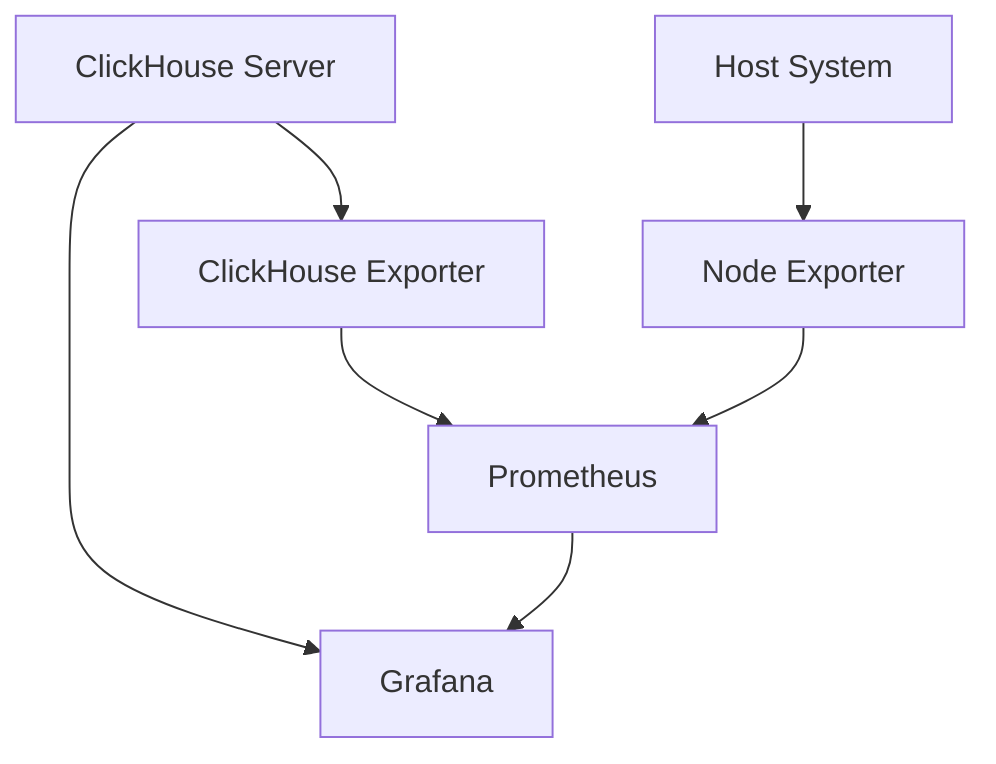

</div>
</div>

---
<div style="position: absolute; top: 1rem; right: 1rem; font-size: 0.8em; opacity: 0.6;">
<SlideCurrentNo /> / <SlidesTotal />
</div>

# Installation Options

<div grid="~ cols-2 gap-4">
<div>

## Docker Deployment
```bash
# Start Grafana container
docker run -d -p 3000:3000 --name grafana grafana/grafana

# Start ClickHouse container
docker run -d -p 8123:8123 -p 9000:9000 \
  --name clickhouse-server \
  --ulimit nofile=262144:262144 \
  clickhouse/clickhouse-server
```

</div>
<div>

## Kubernetes Deployment
```yaml
# Using Helm Charts
helm repo add grafana https://grafana.github.io/helm-charts
helm repo add clickhouse https://ClickHouse.github.io/helm-charts

helm install grafana grafana/grafana
helm install clickhouse clickhouse/clickhouse
```

</div>
</div>

---
<div style="position: absolute; top: 1rem; right: 1rem; font-size: 0.8em; opacity: 0.6;">
<SlideCurrentNo /> / <SlidesTotal />
</div>

# Configuration Basics

<div grid="~ cols-2 gap-4">
<div>

## Grafana Configuration
- Default port: 3000
- Default credentials: admin/admin
- Config file: `/etc/grafana/grafana.ini`
- Key settings:
  - Database connection
  - Authentication
  - SMTP for alerts
  - Plugin installation

</div>
<div>

## ClickHouse Configuration
- HTTP port: 8123
- Native port: 9000
- Config files:
  - `/etc/clickhouse-server/config.xml`
  - `/etc/clickhouse-server/users.xml`
- Key settings:
  - System tables exposure
  - Metrics collection
  - User permissions

</div>
</div>

---
<div style="position: absolute; top: 1rem; right: 1rem; font-size: 0.8em; opacity: 0.6;">
<SlideCurrentNo /> / <SlidesTotal />
</div>

# Integration Architecture

<div grid="~ cols-2 gap-4">
<div>

## Direct Connection
- Grafana connects directly to ClickHouse
- Uses ClickHouse HTTP interface
- Simple to set up
- Good for smaller installations
- Limited metrics collection

</div>
<div>

## Prometheus-based Setup
- More comprehensive metrics
- Historical metrics storage
- Better scalability
- More complex setup
- Industry standard approach
- Recommended for production

</div>
</div>

---
layout: section
---
<div style="position: absolute; top: 1rem; right: 1rem; font-size: 0.8em; opacity: 0.6;">
<SlideCurrentNo /> / <SlidesTotal />
</div>

# 2. Creating ClickHouse Data Sources

---
<div style="position: absolute; top: 1rem; right: 1rem; font-size: 0.8em; opacity: 0.6;">
<SlideCurrentNo /> / <SlidesTotal />
</div>

# Adding ClickHouse Data Source

<div grid="~ cols-2 gap-4">
<div>

## Direct ClickHouse Connection
1. Navigate to Configuration > Data Sources
2. Click "Add data source"
3. Search for "ClickHouse"
4. Enter connection details:
   - URL: `http://clickhouse-server:8123`
   - Database name
   - Username/password
   - Default settings

</div>
<div>

## Connection Settings
- Default port: 8123
- Connection timeout: 30s
- SSL/TLS options for security
- Verify connection with "Save & Test"
- Key HTTP headers:
  - X-ClickHouse-User
  - X-ClickHouse-Key

</div>
</div>

---
<div style="position: absolute; top: 1rem; right: 1rem; font-size: 0.8em; opacity: 0.6;">
<SlideCurrentNo /> / <SlidesTotal />
</div>

# ClickHouse Specific Settings

<div grid="~ cols-2 gap-4">
<div>

## Authorization Options
- HTTP Basic Auth
- Custom HTTP Headers
- Credentials: 
  - Default user/default
  - Create dedicated monitoring user
- Security best practice:
  - Read-only monitoring user
  - Access only to system tables

</div>
<div>

## Query Settings
- Max data points: 5000 (default)
- Additional settings:
  - max_execution_time
  - max_result_rows
  - max_result_bytes
  - result_overflow_mode
- Query timeout: 60s recommended

</div>
</div>

---
<div style="position: absolute; top: 1rem; right: 1rem; font-size: 0.8em; opacity: 0.6;">
<SlideCurrentNo /> / <SlidesTotal />
</div>

# Prometheus Data Source

<div grid="~ cols-2 gap-4">
<div>

## Adding Prometheus
1. Navigate to Configuration > Data Sources
2. Click "Add data source"
3. Search for "Prometheus"
4. Enter connection details:
   - URL: `http://prometheus:9090`
   - Default settings
   - Scrape interval: 15s

</div>
<div>

## ClickHouse Exporter Setup
```bash
# Run ClickHouse exporter
docker run -d --name clickhouse-exporter \
  -p 9116:9116 \
  -e CLICKHOUSE_USER=default \
  -e CLICKHOUSE_PASSWORD=default \
  -e CLICKHOUSE_URL=http://clickhouse-server:8123 \
  percona/clickhouse-exporter
```

</div>
</div>

---
<div style="position: absolute; top: 1rem; right: 1rem; font-size: 0.8em; opacity: 0.6;">
<SlideCurrentNo /> / <SlidesTotal />
</div>

# Multiple Data Sources Strategy

<div grid="~ cols-2 gap-4">
<div>

## Layered Approach
1. **System layer**: Node Exporter + Prometheus
   - CPU, memory, disk, network metrics
   
2. **Database layer**: ClickHouse direct connection
   - Query performance
   - Table metrics
   - Real-time query inspection

3. **Application layer**: Application metrics
   - Client connections
   - Query patterns
   - Business metrics

</div>
<div>

## Data Source Organization
- Use folders to organize data sources
- Consistent naming conventions
- Document connection details
- Version control dashboard definitions
- Use variables to switch between environments
- Test in non-production first

</div>
</div>

---
layout: section
---
<div style="position: absolute; top: 1rem; right: 1rem; font-size: 0.8em; opacity: 0.6;">
<SlideCurrentNo /> / <SlidesTotal />
</div>

# 3. Building Monitoring Dashboards

---
<div style="position: absolute; top: 1rem; right: 1rem; font-size: 0.8em; opacity: 0.6;">
<SlideCurrentNo /> / <SlidesTotal />
</div>

# Dashboard Structure

<div grid="~ cols-2 gap-4">
<div>

## Key Components
- Dashboard variables
- Row organization
- Panel types
- Refresh intervals
- Time range controls
- Annotations
- Links between dashboards

</div>
<div>

## Recommended Organization
- Overview dashboard
- Query performance dashboard
- Resource utilization dashboard
- Table storage dashboard
- Custom query dashboard
- Alerts overview

</div>
</div>

---
<div style="position: absolute; top: 1rem; right: 1rem; font-size: 0.8em; opacity: 0.6;">
<SlideCurrentNo /> / <SlidesTotal />
</div>

# Essential Panels

<div grid="~ cols-2 gap-4">
<div>

## Time Series Panels
- Query execution times
- Query counts
- Error rates
- CPU/Memory utilization
- Disk space utilization
- Connection counts

</div>
<div>

## Other Panel Types
- Gauge: Current resource utilization
- Stat: Key performance indicators
- Table: Active queries, slow queries
- Logs: Error logs, query logs
- Heatmap: Query duration distribution
- Bar gauge: Multi-metric comparison

</div>
</div>

---
<div style="position: absolute; top: 1rem; right: 1rem; font-size: 0.8em; opacity: 0.6;">
<SlideCurrentNo /> / <SlidesTotal />
</div>

# Creating an Overview Dashboard

<div grid="~ cols-2 gap-4">
<div>

## Top Row: Status at a Glance
- Server uptime
- Current connections
- Active queries
- Memory usage gauge
- Disk usage gauge
- CPU load gauge

</div>
<div>

## Middle & Bottom Rows
- Query rate (time series)
- Error rate (time series)
- Top 5 longest running queries (table)
- Largest tables (bar chart)
- Recent errors (logs panel)
- System load trends (time series)

</div>
</div>

---
<div style="position: absolute; top: 1rem; right: 1rem; font-size: 0.8em; opacity: 0.6;">
<SlideCurrentNo /> / <SlidesTotal />
</div>

# Dashboard Variables

<div grid="~ cols-2 gap-4">
<div>

## Common Variables
- Server selection
- Time range presets
- Database selection
- Table selection
- User selection
- Query type filter

</div>
<div>

## Implementation Example
```sql
-- Query for database variable
SELECT name 
FROM system.databases 
WHERE name NOT IN ('system', 'information_schema')

-- Query for table variable
SELECT name 
FROM system.tables 
WHERE database = '$database'
```

</div>
</div>

---
<div style="position: absolute; top: 1rem; right: 1rem; font-size: 0.8em; opacity: 0.6;">
<SlideCurrentNo /> / <SlidesTotal />
</div>

# Dashboard Examples

<div grid="~ cols-2 gap-4">
<div>

## Query Performance Dashboard


- Query execution time
- Query count by type
- Slow queries table
- Query error rate
- Query memory usage
- Query distribution by user

</div>
<div>

## System Resources Dashboard

- CPU usage by core
- Memory allocation
- Disk IOPS
- Network traffic
- Background merges
- Cache utilization

</div>
</div>

---
layout: section
---
<div style="position: absolute; top: 1rem; right: 1rem; font-size: 0.8em; opacity: 0.6;">
<SlideCurrentNo /> / <SlidesTotal />
</div>

# 4. Key Metrics to Monitor

---
<div style="position: absolute; top: 1rem; right: 1rem; font-size: 0.8em; opacity: 0.6;">
<SlideCurrentNo /> / <SlidesTotal />
</div>

# Query Performance Metrics

<div grid="~ cols-2 gap-4">
<div>

## Essential Metrics
- Query execution time
- Queries per second
- Slow query count
- Query memory usage
- Query CPU usage
- Query errors/exceptions
- Cache hit ratio
- Background merges impact

</div>
<div>

## ClickHouse Query Examples
```sql
-- Slow queries
SELECT query_id, query, 
       formatReadableTimeDelta(query_duration_ms/1000) as duration,
       read_rows, formatReadableSize(read_bytes) as read
FROM system.query_log
WHERE type = 'QueryFinish' 
  AND query_duration_ms > 1000
ORDER BY query_duration_ms DESC
LIMIT 10
```

</div>
</div>

---
<div style="position: absolute; top: 1rem; right: 1rem; font-size: 0.8em; opacity: 0.6;">
<SlideCurrentNo /> / <SlidesTotal />
</div>

# System Resource Metrics

<div grid="~ cols-2 gap-4">
<div>

## CPU Metrics
- CPU usage per core
- System/user CPU time
- CPU load average
- Context switches
- CPU iowait time
- Process CPU consumption
- Thread count

</div>
<div>

## Memory Metrics
- Memory usage
- Available memory
- Memory fragmentation
- Buffer pool utilization
- Swap usage
- ClickHouse memory tracking
- Memory usage by query
- Memory usage by table

</div>
</div>

---
<div style="position: absolute; top: 1rem; right: 1rem; font-size: 0.8em; opacity: 0.6;">
<SlideCurrentNo /> / <SlidesTotal />
</div>

# System Resource Metrics (cont.)

<div grid="~ cols-2 gap-4">
<div>

## Disk Metrics
- Disk space used/available
- Disk IOPS
- Disk latency
- Read/write throughput
- Disk queue length
- File descriptors usage
- Temporary file usage
- WAL/log file size

</div>
<div>

## Network Metrics
- Network bytes in/out
- Network packets in/out
- TCP connection states
- Network errors
- Retransmitted packets
- Network saturation
- Connection count
- Connection errors

</div>
</div>

---
<div style="position: absolute; top: 1rem; right: 1rem; font-size: 0.8em; opacity: 0.6;">
<SlideCurrentNo /> / <SlidesTotal />
</div>

# Table Size and Growth Metrics

<div grid="~ cols-2 gap-4">
<div>

## Table Metrics
- Total table size
- Row count
- Part count
- Column sizes
- Compression ratio
- Growth rate
- Merge activity
- Insert rate

</div>
<div>

## ClickHouse Query Examples
```sql
-- Table sizes and row counts
SELECT database, table,
       formatReadableSize(sum(bytes)) as size,
       sum(rows) as rows,
       max(modification_time) as latest_modification
FROM system.parts
WHERE active
GROUP BY database, table
ORDER BY sum(bytes) DESC
LIMIT 10
```

</div>
</div>

---
<div style="position: absolute; top: 1rem; right: 1rem; font-size: 0.8em; opacity: 0.6;">
<SlideCurrentNo /> / <SlidesTotal />
</div>

# Dashboard for Part-Level Analysis

<div grid="~ cols-2 gap-4">
<div>

## Important Part Metrics
- Part count by table
- Part size distribution
- Active vs. inactive parts
- Part age distribution
- Largest parts
- Recently modified parts
- Compression ratio by part
- Merge activity

</div>
<div>

## ClickHouse Query Example
```sql
-- Part count and size by partition
SELECT table, partition, 
       count() as parts,
       formatReadableSize(sum(bytes)) as size
FROM system.parts
WHERE active AND database = '$database'
GROUP BY table, partition
ORDER BY sum(bytes) DESC
LIMIT 20
```

</div>
</div>

---
<div style="position: absolute; top: 1rem; right: 1rem; font-size: 0.8em; opacity: 0.6;">
<SlideCurrentNo /> / <SlidesTotal />
</div>

# Database Specific Metrics

<div grid="~ cols-2 gap-4">
<div>

## ClickHouse Internal Metrics
- MergeTree table metrics
- ReplicatedMergeTree metrics
- Dictionary metrics
- Background pool tasks
- Background pool size
- Mark cache metrics
- Uncompressed cache metrics
- Query cache metrics

</div>
<div>

## Performance Tracking
- Query processing stages
- Memory tracking by component
- Data type efficiency
- Function execution times
- Mutation progress
- Replication lag
- Distributed query performance
- Zookeeper operations

</div>
</div>

---
layout: section
---
<div style="position: absolute; top: 1rem; right: 1rem; font-size: 0.8em; opacity: 0.6;">
<SlideCurrentNo /> / <SlidesTotal />
</div>

# 5. Alerting Configuration

---
<div style="position: absolute; top: 1rem; right: 1rem; font-size: 0.8em; opacity: 0.6;">
<SlideCurrentNo /> / <SlidesTotal />
</div>

# Grafana Alerting Overview

<div grid="~ cols-2 gap-4">
<div>

## Key Concepts
- Alert rules
- Alert instances
- Contact points
- Notification policies
- Silences
- Alert groups
- State history

</div>
<div>

## Alert States
- Normal: No issue detected
- Pending: Issue detected, within tolerance
- Alerting: Issue requires attention
- No data: Missing metrics
- Error: Alert evaluation problem

</div>
</div>

---
<div style="position: absolute; top: 1rem; right: 1rem; font-size: 0.8em; opacity: 0.6;">
<SlideCurrentNo /> / <SlidesTotal />
</div>

# Creating Alert Rules

<div grid="~ cols-2 gap-4">
<div>

## Alert Rule Creation Steps
1. Navigate to Alerting > Alert rules
2. Click "New alert rule"
3. Define query & conditions
4. Set evaluation interval
5. Configure notifications
6. Add labels and annotations

</div>
<div>

## Example Alert Rule
- Name: "High Query Error Rate"
- Query A: Error count from query_log
- Query B: Total query count
- Condition: A/B > 0.05 (5%)
- Evaluation: Every 1m
- For: 5m (pending duration)
- Labels: severity=warning, component=queries

</div>
</div>

---
<div style="position: absolute; top: 1rem; right: 1rem; font-size: 0.8em; opacity: 0.6;">
<SlideCurrentNo /> / <SlidesTotal />
</div>

# Essential ClickHouse Alerts

<div grid="~ cols-2 gap-4">
<div>

## System Resource Alerts
- High CPU usage (>80% for 5m)
- Low available memory (<10% for 5m)
- High disk usage (>85% usage)
- High iowait (>20% for 5m)
- Unusual network traffic
- File descriptor usage (>85%)

</div>
<div>

## Database Performance Alerts
- Slow query rate increase (>10%)
- Query error rate increase (>5%)
- High number of running queries
- Replication lag (>30s)
- Failed parts
- Table size abnormal growth
- Insertion rate drop
- Background pool task queue

</div>
</div>

---
<div style="position: absolute; top: 1rem; right: 1rem; font-size: 0.8em; opacity: 0.6;">
<SlideCurrentNo /> / <SlidesTotal />
</div>

# Alert Notification Channels

<div grid="~ cols-2 gap-4">
<div>

## Integration Options
- Email
- Slack
- Microsoft Teams
- PagerDuty
- OpsGenie
- VictorOps
- Webhook (custom integrations)
- Telegram
- Discord

</div>
<div>

## Configuration Example: Slack
```yaml
# Slack notification setup
name: ClickHouse Alerts
type: slack
settings:
  url: https://hooks.slack.com/services/XXX/YYY/ZZZ
  username: Grafana Alert
  icon_emoji: :rotating_light:
  mentionChannel: here
  mentionUsers: U012A3CDE
  token: xoxb-...
```

</div>
</div>

---
<div style="position: absolute; top: 1rem; right: 1rem; font-size: 0.8em; opacity: 0.6;">
<SlideCurrentNo /> / <SlidesTotal />
</div>

# Alert Grouping & Routing

<div grid="~ cols-2 gap-4">
<div>

## Notification Policy
- Group alerts by: server, component
- Default contact point
- Timing options:
  - Group wait: 30s
  - Group interval: 5m
  - Repeat interval: 4h
- Nested policies by severity

</div>
<div>

## Advanced Routing Example
```yaml
# Notification policy structure
routes:
- receiver: devops-team
  matchers:
    - severity=critical
  continue: true
- receiver: db-admin
  matchers:
    - component=~"database|replication"
  continue: false
- receiver: default-notifications
  continue: false
```

</div>
</div>

---
<div style="position: absolute; top: 1rem; right: 1rem; font-size: 0.8em; opacity: 0.6;">
<SlideCurrentNo /> / <SlidesTotal />
</div>

# Alert Visualization & Management

<div grid="~ cols-2 gap-4">
<div>

## Alert Dashboard
- Current alerts status
- Alert history
- Alert frequency
- Mean time to recovery
- Alert grouping by component
- Alert annotation visualization

</div>
<div>

## Silencing & Maintenance
- Creating silence periods
- Maintenance windows
- Silence by label matcher
- Silence comments
- Silence expiration
- Silence by alert rule
- Template silences for maintenance

</div>
</div>

---
<div style="position: absolute; top: 1rem; right: 1rem; font-size: 0.8em; opacity: 0.6;">
<SlideCurrentNo /> / <SlidesTotal />
</div>

# Real-World Alert Examples

<div grid="~ cols-2 gap-4">
<div>

## Query Performance Alert
```sql
-- Alert when >10 queries take >30 seconds
SELECT count() as slow_queries
FROM system.query_log
WHERE event_time > now() - 300
  AND query_duration_ms > 30000
  AND type = 'QueryFinish'
HAVING slow_queries >= 10
```

</div>
<div>

## Disk Space Alert
```sql
-- Alert when free disk space <15%
SELECT
  hostname,
  path,
  free / (free + used) * 100 as free_percent
FROM system.disks
WHERE free / (free + used) * 100 < 15
```

</div>
</div>

---
layout: section
---
<div style="position: absolute; top: 1rem; right: 1rem; font-size: 0.8em; opacity: 0.6;">
<SlideCurrentNo /> / <SlidesTotal />
</div>

# 6. Case Study & Best Practices

---
<div style="position: absolute; top: 1rem; right: 1rem; font-size: 0.8em; opacity: 0.6;">
<SlideCurrentNo /> / <SlidesTotal />
</div>

# Case Study: E-commerce Analytics Platform

<div grid="~ cols-2 gap-4">
<div>

## Environment
- 5-node ClickHouse cluster
- 100+ TB of data
- 3000+ queries per minute
- 200+ tables
- Critical dashboards for business users

</div>
<div>

## Monitoring Challenges
- Complex query patterns
- Daily data spikes during batch loads
- Seasonal traffic variations
- Query performance degradation
- Storage growth management
- High availability requirements

</div>
</div>

---
<div style="position: absolute; top: 1rem; right: 1rem; font-size: 0.8em; opacity: 0.6;">
<SlideCurrentNo /> / <SlidesTotal />
</div>

# Case Study: Solution Architecture

<div grid="~ cols-2 gap-4">
<div>

## Tiered Dashboards
1. **Executive Overview**
   - System health summary
   - Business KPIs

2. **Operational Dashboards**
   - Query performance
   - Resource utilization
   - Table sizes
   - Error rates

3. **Technical Dashboards**
   - Detailed metrics for DBAs
   - Query analysis
   - Part-level monitoring
   - Replication status

</div>
<div>

## Alert Strategy
- Critical alerts: Immediate notification
- Warning alerts: Business hours only
- Info alerts: Daily digest
- Maintenance window suppression
- Auto-remediation for common issues
- Runbook links in alert notifications
- Post-mortem automation

</div>
</div>

---
<div style="position: absolute; top: 1rem; right: 1rem; font-size: 0.8em; opacity: 0.6;">
<SlideCurrentNo /> / <SlidesTotal />
</div>

# Monitoring Best Practices

<div grid="~ cols-2 gap-4">
<div>

## Technical Recommendations
- Keep metric retention appropriate
- Use continuous queries for aggregation
- Balance dashboard refresh rate
- Apply proper variables for filtering
- Version control dashboards
- Regularly review and optimize alerts
- Set up monitoring for the monitoring system

</div>
<div>

## Organizational Recommendations
- Define clear ownership of alerts
- Document runbooks for common alerts
- Regular alert review process
- Training on dashboard creation
- Rotation for alert response
- Post-incident analysis
- Continuous dashboard improvement

</div>
</div>

---
<div style="position: absolute; top: 1rem; right: 1rem; font-size: 0.8em; opacity: 0.6;">
<SlideCurrentNo /> / <SlidesTotal />
</div>

# Key Takeaways

<div grid="~ cols-2 gap-4">
<div>

## Monitoring Strategy
- Comprehensive metrics collection
- Multi-layered dashboards
- Strategic alert configuration
- Balance between detail and usability
- Focus on actionable metrics
- Clear visualization of trends

</div>
<div>

## Next Steps
- Start with essential dashboards
- Gradually add complexity
- Tune alerts to reduce noise
- Document your monitoring setup
- Review and improve regularly
- Share knowledge across teams
- Automate common responses

</div>
</div>

---
layout: section
---
<div style="position: absolute; top: 1rem; right: 1rem; font-size: 0.8em; opacity: 0.6;">
<SlideCurrentNo /> / <SlidesTotal />
</div>


# Session 8: Real-world Use Cases
## Building a High-Performance Chat Application with ClickHouse


# 1. Schema Design for Message Storage

---
<div style="position: absolute; top: 1rem; right: 1rem; font-size: 0.8em; opacity: 0.6;">
<SlideCurrentNo /> / <SlidesTotal />
</div>

# Understanding Chat Application Requirements

<div grid="~ cols-2 gap-4">
<div>

## Key Requirements
- High volume message ingestion (millions/day)
- Real-time delivery (<100ms latency)
- Efficient retrieval of conversation history
- Full-text search capabilities
- Message analytics and aggregations
- Support for attachments and rich media
- Long-term message storage and archiving

</div>
<div>

## Data Characteristics
- Messages typically small (avg <1KB)
- Mostly immutable after creation
- Hot/cold access patterns (recent vs. old)
- Read-heavy for historical messages
- Write-heavy for active conversations
- Attachment metadata vs. content
- Mixed query patterns (point vs. analytical)

</div>
</div>

---
<div style="position: absolute; top: 1rem; right: 1rem; font-size: 0.8em; opacity: 0.6;">
<SlideCurrentNo /> / <SlidesTotal />
</div>

# Schema Design: Core Messages Table

```sql
CREATE TABLE chat.messages
(
    `message_id` UUID,
    `conversation_id` UUID,
    `sender_id` UUID,
    `message_text` String,
    `sent_timestamp` DateTime64(3),
    `delivered_timestamp` Nullable(DateTime64(3)),
    `read_timestamp` Nullable(DateTime64(3)),
    `message_type` Enum('TEXT', 'IMAGE', 'VIDEO', 'FILE', 'AUDIO', 'LOCATION', 'CONTACT', 'SYSTEM'),
    `attachment_id` Nullable(UUID),
    `attachment_type` Nullable(String),
    `attachment_size` Nullable(UInt64),
    `client_message_id` String,
    `is_edited` UInt8 DEFAULT 0,
    `is_deleted` UInt8 DEFAULT 0,
    `edit_timestamp` Nullable(DateTime64(3)),
    `reply_to_message_id` Nullable(UUID),
    `mentions` Array(UUID),
    `tags` Array(String),
    `metadata` Map(String, String),
    `ttl_timestamp` Nullable(DateTime)
)
ENGINE = MergeTree()
PARTITION BY toYYYYMM(sent_timestamp)
ORDER BY (conversation_id, sent_timestamp)
TTL sent_timestamp + INTERVAL 3 YEAR
SETTINGS index_granularity = 8192
```

---
<div style="position: absolute; top: 1rem; right: 1rem; font-size: 0.8em; opacity: 0.6;">
<SlideCurrentNo /> / <SlidesTotal />
</div>

# Partitioning Strategy

<div grid="~ cols-2 gap-4">
<div>

## Time-Based Partitioning
- Partition by month: `toYYYYMM(sent_timestamp)`
- Benefits:
  - Efficient pruning for time-range queries
  - Simpler archiving of old messages
  - Balanced partition sizes
  - Reduced merge workload
  - Better parallelization

</div>
<div>

## Alternative Strategies
- Partition by conversation category
  ```sql
  PARTITION BY (toYYYYMM(sent_timestamp), 
               conversation_type)
  ```

- Partition by organization (multi-tenant)
  ```sql
  PARTITION BY (toYYYYMM(sent_timestamp), 
               organization_id)
  ```

</div>
</div>

---
<div style="position: absolute; top: 1rem; right: 1rem; font-size: 0.8em; opacity: 0.6;">
<SlideCurrentNo /> / <SlidesTotal />
</div>

# Ordering Keys and Indices

<div grid="~ cols-2 gap-4">
<div>

## Primary Key Selection
```sql
-- Primary approach
ORDER BY (conversation_id, sent_timestamp)

-- Alternative for balanced load
ORDER BY (conversation_id, sender_id, sent_timestamp)
```

## Benefits
- Fast retrieval of conversation history
- Efficient range queries within conversations
- Good compression ratio
- Natural time-based sorting

</div>
<div>

## Secondary Indices
```sql
-- Improve search by sender
ALTER TABLE chat.messages
ADD INDEX idx_sender sender_id TYPE minmax;

-- Improve search by message type
ALTER TABLE chat.messages
ADD INDEX idx_message_type message_type TYPE set(100);

-- Full-text search
ALTER TABLE chat.messages
ADD INDEX idx_message_text message_text TYPE tokenbf_v1(512, 3, 0);
```

</div>
</div>

---
<div style="position: absolute; top: 1rem; right: 1rem; font-size: 0.8em; opacity: 0.6;">
<SlideCurrentNo /> / <SlidesTotal />
</div>

# Supporting Tables

<div grid="~ cols-2 gap-4">
<div>

## Conversations Table
```sql
CREATE TABLE chat.conversations
(
    `conversation_id` UUID,
    `conversation_name` String,
    `conversation_type` Enum('DIRECT', 'GROUP', 'CHANNEL'),
    `created_by` UUID,
    `created_at` DateTime64(3),
    `updated_at` DateTime64(3),
    `is_active` UInt8 DEFAULT 1,
    `metadata` Map(String, String),
    `member_count` UInt32,
    `organization_id` Nullable(UUID)
)
ENGINE = MergeTree()
ORDER BY conversation_id
```

</div>
<div>

## Conversation Members Table
```sql
CREATE TABLE chat.conversation_members
(
    `conversation_id` UUID,
    `user_id` UUID,
    `joined_at` DateTime64(3),
    `role` Enum('MEMBER', 'ADMIN', 'OWNER'),
    `last_read_message_id` Nullable(UUID),
    `last_read_timestamp` Nullable(DateTime64(3)),
    `is_muted` UInt8 DEFAULT 0,
    `notifications_enabled` UInt8 DEFAULT 1
)
ENGINE = MergeTree()
ORDER BY (conversation_id, user_id)
```

</div>
</div>

---
<div style="position: absolute; top: 1rem; right: 1rem; font-size: 0.8em; opacity: 0.6;">
<SlideCurrentNo /> / <SlidesTotal />
</div>

# Attachment Handling

<div grid="~ cols-2 gap-4">
<div>

## Attachment Metadata Table
```sql
CREATE TABLE chat.attachments
(
    `attachment_id` UUID,
    `message_id` UUID,
    `conversation_id` UUID,
    `sender_id` UUID,
    `filename` String,
    `file_type` String,
    `mime_type` String,
    `file_size` UInt64,
    `created_at` DateTime64(3),
    `storage_path` String,
    `thumbnail_path` Nullable(String),
    `is_image` UInt8,
    `width` Nullable(UInt32),
    `height` Nullable(UInt32),
    `duration_seconds` Nullable(Float64),
    `metadata` Map(String, String)
)
ENGINE = MergeTree()
PARTITION BY toYYYYMM(created_at)
ORDER BY (conversation_id, created_at)
```

</div>
<div>

## Storage Strategy
- Store actual files in object storage (S3, GCS)
- Keep metadata in ClickHouse
- Options for thumbnail generation:
  - On upload (eager)
  - On first access (lazy)
  - Scheduled background job
- TTL policies matching message retention
- Optional content extraction for search

</div>
</div>

---
<div style="position: absolute; top: 1rem; right: 1rem; font-size: 0.8em; opacity: 0.6;">
<SlideCurrentNo /> / <SlidesTotal />
</div>

# Materialized Views for Access Patterns

<div grid="~ cols-2 gap-4">
<div>

## User Message Timeline
```sql
CREATE MATERIALIZED VIEW chat.user_message_timeline
ENGINE = MergeTree()
PARTITION BY toYYYYMM(sent_timestamp)
ORDER BY (sender_id, sent_timestamp)
POPULATE AS
SELECT * FROM chat.messages
```

## Unread Messages Counter
```sql
CREATE MATERIALIZED VIEW chat.unread_counts
ENGINE = AggregatingMergeTree()
ORDER BY (user_id, conversation_id)
POPULATE AS
SELECT
    user_id,
    conversation_id,
    countState() AS unread_count
FROM chat.messages AS m
LEFT JOIN chat.conversation_members AS cm
  ON m.conversation_id = cm.conversation_id
WHERE m.sent_timestamp > cm.last_read_timestamp
GROUP BY user_id, conversation_id
```

</div>
<div>

## Message Search Index
```sql
CREATE MATERIALIZED VIEW chat.message_search_index
ENGINE = MergeTree()
ORDER BY (conversation_id, sent_timestamp)
POPULATE AS
SELECT
    message_id,
    conversation_id,
    sender_id,
    sent_timestamp,
    message_text,
    message_type,
    lower(message_text) AS message_text_lower,
    -- Extract terms for faster search
    splitByChar(' ', replaceRegexpAll(
       lower(message_text), 
       '[^a-zA-Z0-9 ]', 
       ' ')) AS terms
FROM chat.messages
```

</div>
</div>

---
<div style="position: absolute; top: 1rem; right: 1rem; font-size: 0.8em; opacity: 0.6;">
<SlideCurrentNo /> / <SlidesTotal />
</div>

# Integration with Vector Search

<div grid="~ cols-2 gap-4">
<div>

## Message Embeddings Table
```sql
CREATE TABLE chat.message_embeddings
(
    `message_id` UUID,
    `conversation_id` UUID,
    `embedding` Array(Float32),
    `sent_timestamp` DateTime64(3)
)
ENGINE = MergeTree()
ORDER BY conversation_id
SETTINGS index_granularity = 8192;
```

</div>
<div>

## Semantic Search Function
```sql
-- Create distance function
CREATE FUNCTION cosineDistance AS (a, b) -> 
1 - sum(a[i] * b[i] for i in range(length(a))) / 
(sqrt(sum(a[i] * a[i] for i in range(length(a)))) * 
 sqrt(sum(b[i] * b[i] for i in range(length(b)))));

-- Query example
SELECT m.*
FROM chat.messages AS m
JOIN chat.message_embeddings AS e
  ON m.message_id = e.message_id
WHERE e.conversation_id = '123e4567-...'
ORDER BY cosineDistance(e.embedding, [0.1, 0.2, ...]) ASC
LIMIT 10
```

</div>
</div>

---
layout: section
---
<div style="position: absolute; top: 1rem; right: 1rem; font-size: 0.8em; opacity: 0.6;">
<SlideCurrentNo /> / <SlidesTotal />
</div>

# 2. Handling Real-time Message Ingestion

---
<div style="position: absolute; top: 1rem; right: 1rem; font-size: 0.8em; opacity: 0.6;">
<SlideCurrentNo /> / <SlidesTotal />
</div>

# Message Flow Architecture

<div grid="~ cols-2 gap-4">
<div>

## High-Level Architecture
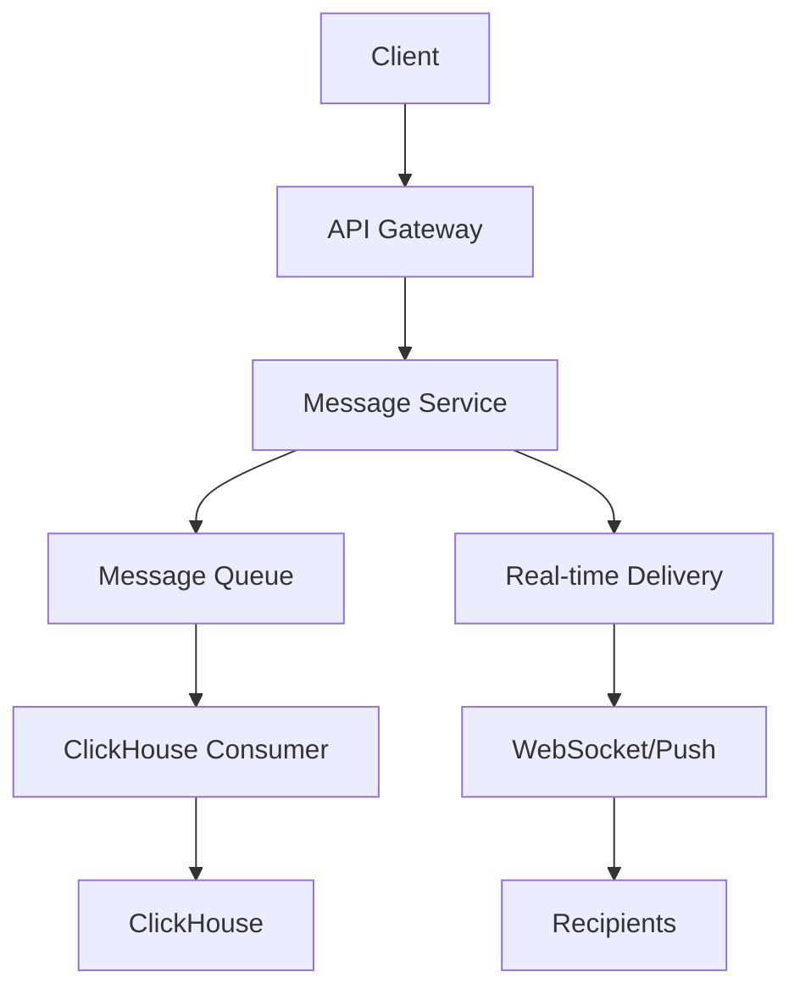

</div>
<div>

## Key Components
- **Message Service**: Validates, enriches messages
- **Message Queue**: Kafka/RabbitMQ for durability
- **ClickHouse Consumer**: Batch inserts
- **Real-time Delivery**: WebSockets/Push notifications
- **Acknowledgment Flow**: Delivery confirmations
- **Idempotency**: Handle duplicate messages
- **Ordering**: Sequence numbers for correct display

</div>
</div>

---
<div style="position: absolute; top: 1rem; right: 1rem; font-size: 0.8em; opacity: 0.6;">
<SlideCurrentNo /> / <SlidesTotal />
</div>

# ClickHouse Ingestion Patterns

<div grid="~ cols-2 gap-4">
<div>

## Asynchronous Batch Ingestion
- Queue-based approach
- Configurable batch sizes (500-5000 messages)
- Batch insert every 100-1000ms
- Trade-off between latency and throughput
- Benefits:
  - Higher throughput
  - Better compression
  - Reduced system load
  - More efficient INSERTs

</div>
<div>

## Implementation with Kafka
```python
# Pseudo-code for Kafka consumer
def process_message_batch(messages):
    # Group by table
    message_inserts = []
    attachment_inserts = []
    
    for msg in messages:
        message_inserts.append(format_for_insert(msg))
        if has_attachment(msg):
            attachment_inserts.append(
                format_attachment(msg))
    
    # Batch insert to ClickHouse
    if message_inserts:
        insert_batch(
            'chat.messages', message_inserts)
    if attachment_inserts:
        insert_batch(
            'chat.attachments', attachment_inserts)
```

</div>
</div>

---
<div style="position: absolute; top: 1rem; right: 1rem; font-size: 0.8em; opacity: 0.6;">
<SlideCurrentNo /> / <SlidesTotal />
</div>

# Optimization Techniques

<div grid="~ cols-2 gap-4">
<div>

## Insert Performance Optimization
- Use async inserts with wait_for_async_insert=0
- Buffer table for smoother writes
- Optimize max_insert_block_size
- Adjust background_pool_size for merges
- Use lower compression level for recent data
- Consider uncompressed_cache size increase
- Parallel inserts across shards

</div>
<div>

## Buffer Table Configuration
```sql
CREATE TABLE chat.messages_buffer AS chat.messages
ENGINE = Buffer(chat, messages, 16, 10, 100, 10000, 1000000, 10000000, 100000000)
```

## Async Insert Settings
```sql
-- Client settings
SET async_insert = 1;
SET wait_for_async_insert = 0;
SET async_insert_timeout = 5;

-- Server settings
SET max_threads = 16;
SET background_pool_size = 16;
```

</div>
</div>

---
<div style="position: absolute; top: 1rem; right: 1rem; font-size: 0.8em; opacity: 0.6;">
<SlideCurrentNo /> / <SlidesTotal />
</div>

# Guaranteeing Message Order and Consistency

<div grid="~ cols-2 gap-4">
<div>

## Ordering Strategies
- Client-side timestamps with ms precision
- Client-generated UUIDs for messages
- Sequence numbers within conversations
- Order by ingestion time as fallback
- Conflict resolution policies:
  - Last-writer-wins
  - Vector clocks
  - Preserving edit history

</div>
<div>

## Consistency Checks
```sql
-- Detect gaps in message sequence
SELECT
    conversation_id,
    toUInt64(max(sequence_number)) - 
    toUInt64(min(sequence_number)) - 
    count() + 1 AS gaps
FROM chat.messages
GROUP BY conversation_id
HAVING gaps > 0

-- Message delivery confirmation
INSERT INTO chat.message_status
(message_id, user_id, status, timestamp)
VALUES
('{message_id}', '{user_id}', 'DELIVERED', now())
```

</div>
</div>

---
<div style="position: absolute; top: 1rem; right: 1rem; font-size: 0.8em; opacity: 0.6;">
<SlideCurrentNo /> / <SlidesTotal />
</div>

# Handling Message Updates

<div grid="~ cols-2 gap-4">
<div>

## Edit/Delete Approaches
1. **Immutable with flags**:
   - Set is_deleted=1 or is_edited=1
   - Add edit history table

2. **ReplacingMergeTree**:
   - Update in place eventually
   - Latest version during queries
   
3. **Versioned Messages**:
   - Keep all versions with ver field
   - Filter by latest version in queries

</div>
<div>

## Implementation Example
```sql
-- Option 1: Update with mutation (slow)
ALTER TABLE chat.messages
UPDATE is_deleted = 1, edit_timestamp = now()
WHERE message_id = 'abc-123'

-- Option 2: Edit history table
CREATE TABLE chat.message_edits
(
    message_id UUID,
    edit_timestamp DateTime64(3),
    previous_text String,
    editor_id UUID,
    edit_reason Nullable(String)
)
ENGINE = MergeTree()
ORDER BY (message_id, edit_timestamp)
```

</div>
</div>

---
layout: section
---
<div style="position: absolute; top: 1rem; right: 1rem; font-size: 0.8em; opacity: 0.6;">
<SlideCurrentNo /> / <SlidesTotal />
</div>

# 3. Efficient Message Retrieval and Search

---
<div style="position: absolute; top: 1rem; right: 1rem; font-size: 0.8em; opacity: 0.6;">
<SlideCurrentNo /> / <SlidesTotal />
</div>

# Common Access Patterns

<div grid="~ cols-2 gap-4">
<div>

## Message Retrieval Patterns
1. **Recent conversations list**
   - Last message from each conversation
   
2. **Conversation history**
   - Messages by conversation, paginated
   
3. **Context retrieval**
   - Messages before/after specific point
   
4. **Unread messages**
   - New messages since last read

</div>
<div>

## Search Patterns
1. **Full-text search**
   - Across all user conversations
   
2. **Filtered search**
   - By date, type, sender
   
3. **Semantic search**
   - Finding similar messages
   
4. **Attachment search**
   - By filename, type, content

</div>
</div>

---
<div style="position: absolute; top: 1rem; right: 1rem; font-size: 0.8em; opacity: 0.6;">
<SlideCurrentNo /> / <SlidesTotal />
</div>

# Conversation History Queries

<div grid="~ cols-2 gap-4">
<div>

## Basic Conversation Load
```sql
-- Get recent messages (pagination)
SELECT *
FROM chat.messages
WHERE conversation_id = '{conversation_id}'
  AND is_deleted = 0
ORDER BY sent_timestamp DESC
LIMIT 50 OFFSET 0
```

## Loading Around a Message
```sql
-- Context retrieval (messages around target)
WITH target AS (
  SELECT sent_timestamp 
  FROM chat.messages 
  WHERE message_id = '{message_id}'
)
SELECT m.*
FROM chat.messages m, target
WHERE m.conversation_id = '{conversation_id}'
  AND m.sent_timestamp BETWEEN 
      target.sent_timestamp - INTERVAL 1 HOUR AND
      target.sent_timestamp + INTERVAL 10 MINUTE
ORDER BY m.sent_timestamp
```

</div>
<div>

## Conversation List with Last Message
```sql
-- Get conversations with latest message
SELECT
    c.conversation_id,
    c.conversation_name,
    c.conversation_type,
    c.member_count,
    m.message_id AS last_message_id,
    m.sender_id AS last_message_sender,
    m.message_text AS last_message_text,
    m.sent_timestamp AS last_message_time,
    unread.unread_count
FROM chat.conversations c
LEFT JOIN (
    -- Latest message per conversation
    SELECT
        conversation_id,
        argMax(message_id, sent_timestamp) AS message_id,
        max(sent_timestamp) AS max_time
    FROM chat.messages
    WHERE is_deleted = 0
    GROUP BY conversation_id
) latest ON c.conversation_id = latest.conversation_id
LEFT JOIN chat.messages m 
  ON latest.message_id = m.message_id
LEFT JOIN (
    -- Unread count for current user
    SELECT 
        conversation_id, 
        countMerge(unread_count) AS unread_count
    FROM chat.unread_counts
    WHERE user_id = '{current_user_id}'
    GROUP BY conversation_id
) unread ON c.conversation_id = unread.conversation_id
WHERE c.conversation_id IN (
    -- Only conversations user is member of
    SELECT conversation_id
    FROM chat.conversation_members
    WHERE user_id = '{current_user_id}'
)
ORDER BY latest.max_time DESC
LIMIT 20
```

</div>
</div>

---
<div style="position: absolute; top: 1rem; right: 1rem; font-size: 0.8em; opacity: 0.6;">
<SlideCurrentNo /> / <SlidesTotal />
</div>

# Search Implementation

<div grid="~ cols-2 gap-4">
<div>

## Basic Text Search
```sql
-- Simple text search
SELECT *
FROM chat.messages
WHERE conversation_id IN (
    SELECT conversation_id 
    FROM chat.conversation_members
    WHERE user_id = '{current_user_id}'
)
AND message_text ILIKE '%{search_term}%'
ORDER BY sent_timestamp DESC
LIMIT 50
```

## Optimized Text Search
```sql
-- Using materialized view with terms
SELECT m.*
FROM chat.message_search_index i
JOIN chat.messages m ON i.message_id = m.message_id
WHERE i.conversation_id IN (
    SELECT conversation_id 
    FROM chat.conversation_members
    WHERE user_id = '{current_user_id}'
)
AND hasAny(i.terms, ['term1', 'term2', 'term3'])
ORDER BY i.sent_timestamp DESC
LIMIT 50
```

</div>
<div>

## Advanced Filtered Search
```sql
-- Complex search with multiple filters
SELECT
    m.*,
    u.display_name AS sender_name,
    u.avatar_url AS sender_avatar
FROM chat.messages m
JOIN chat.users u ON m.sender_id = u.user_id
WHERE m.conversation_id IN (
    SELECT conversation_id 
    FROM chat.conversation_members
    WHERE user_id = '{current_user_id}'
)
AND m.sent_timestamp BETWEEN 
    parseDateTimeBestEffort('{start_date}') AND 
    parseDateTimeBestEffort('{end_date}')
AND m.is_deleted = 0
AND (
    m.message_text ILIKE '%{search_term}%'
    OR m.message_id IN (
        SELECT message_id
        FROM chat.attachments
        WHERE file_type IN ('image', 'document')
        AND filename ILIKE '%{search_term}%'
    )
)
AND if('{sender_id}' != '', m.sender_id = '{sender_id}', 1)
AND if('{message_type}' != '', 
       m.message_type = '{message_type}', 1)
ORDER BY m.sent_timestamp DESC
LIMIT 50 OFFSET {offset}
```

</div>
</div>

---
<div style="position: absolute; top: 1rem; right: 1rem; font-size: 0.8em; opacity: 0.6;">
<SlideCurrentNo /> / <SlidesTotal />
</div>

# Performance Optimization Techniques

<div grid="~ cols-2 gap-4">
<div>

## Query Optimization
- Use covering indices where possible
- Prewhere for column filtering
- Join order optimization
- Limit transferred columns
- Avoid expensive functions in WHERE
- Push filters to lowest level
- Only request needed columns
- Use materialized views for common patterns

</div>
<div>

## System Optimization
- Adjust max_threads for query parallelism
- Use query cache for repeated queries
- Set appropriate memory limits
- Query routing to specific replicas
- Consider distributed processing
- Monitor and tune cache settings:
  - mark_cache_size
  - uncompressed_cache_size

```sql
-- Client settings
SET max_threads = 8;
SET max_memory_usage = 10000000000;
SET use_uncompressed_cache = 1;
```

</div>
</div>

---
<div style="position: absolute; top: 1rem; right: 1rem; font-size: 0.8em; opacity: 0.6;">
<SlideCurrentNo /> / <SlidesTotal />
</div>

# Caching Strategies

<div grid="~ cols-2 gap-4">
<div>

## Multi-level Caching
1. **Application cache**
   - Redis for conversation lists
   - Recent message history
   - User profiles and settings
   
2. **Database caching**
   - ClickHouse query cache
   - Materialized views as cache
   - Uncompressed cache for hot data
   
3. **Client caching**
   - Local storage for conversation history
   - Memory cache for active conversations
   - Versioned resources with ETags

</div>
<div>

## Implementation Example
```python
# Pseudo-code for caching layer
def get_conversation_messages(conv_id, limit, offset):
    cache_key = f"conv:{conv_id}:msgs:{offset}:{limit}"
    
    # Try cache first
    cached = redis.get(cache_key)
    if cached:
        return json.loads(cached)
    
    # If not cached, query ClickHouse
    messages = clickhouse.query("""
        SELECT * FROM chat.messages
        WHERE conversation_id = {conv_id}
        ORDER BY sent_timestamp DESC
        LIMIT {limit} OFFSET {offset}
    """)
    
    # Cache for 60 seconds (short TTL for messages)
    redis.setex(cache_key, 60, json.dumps(messages))
    
    return messages
```

</div>
</div>

---
layout: section
---
<div style="position: absolute; top: 1rem; right: 1rem; font-size: 0.8em; opacity: 0.6;">
<SlideCurrentNo /> / <SlidesTotal />
</div>

# 4. User Analytics Queries

---
<div style="position: absolute; top: 1rem; right: 1rem; font-size: 0.8em; opacity: 0.6;">
<SlideCurrentNo /> / <SlidesTotal />
</div>

# Message Volume Analytics

<div grid="~ cols-2 gap-4">
<div>

## Message Volume by Time
```sql
-- Messages per hour
SELECT
    toStartOfHour(sent_timestamp) AS hour,
    count() AS message_count
FROM chat.messages
WHERE sent_timestamp >= now() - INTERVAL 7 DAY
GROUP BY hour
ORDER BY hour
```

## Message Volume by User
```sql
-- Top message senders
SELECT
    sender_id,
    count() AS message_count,
    min(sent_timestamp) AS first_message,
    max(sent_timestamp) AS last_message
FROM chat.messages
WHERE conversation_id = '{conversation_id}'
GROUP BY sender_id
ORDER BY message_count DESC
LIMIT 10
```

</div>
<div>

## Message Volume by Type
```sql
-- Message distribution by type
SELECT
    message_type,
    count() AS message_count,
    round(count() * 100.0 / sum(count()) OVER (), 2) AS percentage
FROM chat.messages
WHERE conversation_id = '{conversation_id}'
  AND sent_timestamp >= now() - INTERVAL 30 DAY
GROUP BY message_type
ORDER BY message_count DESC
```

## Attachment Volume
```sql
-- Attachment storage by type
SELECT
    file_type,
    count() AS file_count,
    formatReadableSize(sum(file_size)) AS total_size,
    round(avg(file_size)) AS avg_size
FROM chat.attachments
WHERE created_at >= now() - INTERVAL 30 DAY
GROUP BY file_type
ORDER BY sum(file_size) DESC
```

</div>
</div>

---
<div style="position: absolute; top: 1rem; right: 1rem; font-size: 0.8em; opacity: 0.6;">
<SlideCurrentNo /> / <SlidesTotal />
</div>

# User Engagement Analytics

<div grid="~ cols-2 gap-4">
<div>

## Response Time Analysis
```sql
-- Average response times
WITH responses AS (
    SELECT
        conversation_id,
        sender_id,
        sent_timestamp,
        lagInFrame(sender_id) 
          OVER (PARTITION BY conversation_id 
                ORDER BY sent_timestamp) AS prev_sender,
        lagInFrame(sent_timestamp) 
          OVER (PARTITION BY conversation_id 
                ORDER BY sent_timestamp) AS prev_timestamp
    FROM chat.messages
    WHERE sent_timestamp >= now() - INTERVAL 7 DAY
)
SELECT
    sender_id,
    count() AS response_count,
    avg(sent_timestamp - prev_timestamp) AS avg_response_time_seconds
FROM responses
WHERE sender_id != prev_sender
  AND (sent_timestamp - prev_timestamp) < 3600  -- within 1 hour
GROUP BY sender_id
ORDER BY avg_response_time_seconds ASC
```

</div>
<div>

## User Activity Patterns
```sql
-- Activity heat map (hour of day)
SELECT
    sender_id,
    toHour(sent_timestamp) AS hour_of_day,
    count() AS message_count
FROM chat.messages
WHERE sent_timestamp >= now() - INTERVAL 30 DAY
GROUP BY sender_id, hour_of_day
ORDER BY sender_id, hour_of_day

-- Active hours calculation
SELECT
    sender_id,
    uniq(toStartOfHour(sent_timestamp)) AS active_hours,
    count() AS message_count,
    round(count() / uniq(toStartOfHour(sent_timestamp)), 1) 
      AS messages_per_active_hour
FROM chat.messages
WHERE sent_timestamp >= now() - INTERVAL 30 DAY
GROUP BY sender_id
HAVING message_count > 100
ORDER BY messages_per_active_hour DESC
```

</div>
</div>

---
<div style="position: absolute; top: 1rem; right: 1rem; font-size: 0.8em; opacity: 0.6;">
<SlideCurrentNo /> / <SlidesTotal />
</div>

# Conversation Analytics

<div grid="~ cols-2 gap-4">
<div>

## Conversation Activity
```sql
-- Most active conversations
SELECT
    conversation_id,
    count() AS message_count,
    uniq(sender_id) AS unique_senders,
    min(sent_timestamp) AS first_message,
    max(sent_timestamp) AS last_message
FROM chat.messages
WHERE sent_timestamp >= now() - INTERVAL 30 DAY
GROUP BY conversation_id
ORDER BY message_count DESC
LIMIT 20
```

## Conversation Growth
```sql
-- Message volume growth by week
SELECT
    conversation_id,
    toStartOfWeek(sent_timestamp) AS week,
    count() AS message_count,
    uniq(sender_id) AS active_users
FROM chat.messages
WHERE sent_timestamp >= now() - INTERVAL 90 DAY
GROUP BY conversation_id, week
ORDER BY conversation_id, week
```

</div>
<div>

## Word Usage Analysis
```sql
-- Most common words in messages
WITH words AS (
    SELECT
        conversation_id,
        sent_timestamp,
        arrayJoin(splitByChar(' ', 
            replaceRegexpAll(
                lower(message_text), 
                '[^a-zA-Z0-9 ]', ' '
            ))) AS word
    FROM chat.messages
    WHERE sent_timestamp >= now() - INTERVAL 30 DAY
      AND length(message_text) > 0
)
SELECT
    word,
    count() AS frequency
FROM words
WHERE length(word) > 2
GROUP BY word
ORDER BY frequency DESC
LIMIT 100
```

## Sentiment Analysis Example
```sql
-- Assuming sentiment score column exists
SELECT
    conversation_id,
    toStartOfDay(sent_timestamp) AS day,
    avg(sentiment_score) AS avg_sentiment,
    count() AS message_count
FROM chat.message_sentiment
WHERE sent_timestamp >= now() - INTERVAL 30 DAY
GROUP BY conversation_id, day
ORDER BY conversation_id, day
```

</div>
</div>

---
<div style="position: absolute; top: 1rem; right: 1rem; font-size: 0.8em; opacity: 0.6;">
<SlideCurrentNo /> / <SlidesTotal />
</div>

# Retention and Engagement Metrics

<div grid="~ cols-2 gap-4">
<div>

## Daily/Weekly Active Users
```sql
-- Daily active users
SELECT
    toDate(sent_timestamp) AS day,
    uniq(sender_id) AS daily_active_users,
    count() AS total_messages,
    round(count() / uniq(sender_id), 1) AS messages_per_user
FROM chat.messages
WHERE sent_timestamp >= now() - INTERVAL 30 DAY
GROUP BY day
ORDER BY day

-- Weekly active users
SELECT
    toStartOfWeek(sent_timestamp) AS week,
    uniq(sender_id) AS weekly_active_users
FROM chat.messages
WHERE sent_timestamp >= now() - INTERVAL 90 DAY
GROUP BY week
ORDER BY week
```

</div>
<div>

## Cohort Retention Analysis
```sql
-- Cohort retention by week
WITH first_activity AS (
    -- First week of activity for each user
    SELECT
        sender_id,
        toStartOfWeek(min(sent_timestamp)) AS first_week
    FROM chat.messages
    GROUP BY sender_id
),
weekly_activity AS (
    -- Activity weeks for each user
    SELECT
        sender_id,
        toStartOfWeek(sent_timestamp) AS activity_week
    FROM chat.messages
    GROUP BY sender_id, activity_week
)
SELECT
    first_week,
    count(DISTINCT fa.sender_id) AS cohort_size,
    groupArray(
        (dateDiff('week', first_week, wa.activity_week),
         count(DISTINCT wa.sender_id) / 
         count(DISTINCT fa.sender_id))
    ) AS retention_by_week
FROM first_activity fa
LEFT JOIN weekly_activity wa ON fa.sender_id = wa.sender_id
WHERE first_week >= now() - INTERVAL 90 DAY
GROUP BY first_week
ORDER BY first_week
```

</div>
</div>

---
<div style="position: absolute; top: 1rem; right: 1rem; font-size: 0.8em; opacity: 0.6;">
<SlideCurrentNo /> / <SlidesTotal />
</div>

# Performance Monitoring Analytics

<div grid="~ cols-2 gap-4">
<div>

## Message Delivery Analysis
```sql
-- Delivery time analysis
SELECT
    toStartOfMinute(sent_timestamp) AS minute,
    avg(delivered_timestamp - sent_timestamp) AS avg_delivery_time_ms,
    count() AS message_count
FROM chat.messages
WHERE sent_timestamp >= now() - INTERVAL 24 HOUR
  AND delivered_timestamp IS NOT NULL
GROUP BY minute
ORDER BY minute
```

## Read Receipt Analysis
```sql
-- Time to read messages
SELECT
    toStartOfHour(sent_timestamp) AS hour,
    avg(read_timestamp - delivered_timestamp) AS avg_time_to_read_sec,
    median(read_timestamp - delivered_timestamp) AS median_time_to_read_sec,
    count() AS message
```
</div>
</div>

---
layout: section
---
<div style="position: absolute; top: 1rem; right: 1rem; font-size: 0.8em; opacity: 0.6;">
<SlideCurrentNo /> / <SlidesTotal />
</div>

# 6. Case Study & Best Practices

---
<div style="position: absolute; top: 1rem; right: 1rem; font-size: 0.8em; opacity: 0.6;">
<SlideCurrentNo /> / <SlidesTotal />
</div>

# Case Study: E-commerce Analytics Platform

<div grid="~ cols-2 gap-4">
<div>

## Environment
- 5-node ClickHouse cluster
- 100+ TB of data
- 3000+ queries per minute
- 200+ tables
- Critical dashboards for business users

</div>
<div>

## Monitoring Challenges
- Complex query patterns
- Daily data spikes during batch loads
- Seasonal traffic variations
- Query performance degradation
- Storage growth management
- High availability requirements

</div>
</div>

---
<div style="position: absolute; top: 1rem; right: 1rem; font-size: 0.8em; opacity: 0.6;">
<SlideCurrentNo /> / <SlidesTotal />
</div>

# Case Study: Solution Architecture

<div grid="~ cols-2 gap-4">
<div>

## Tiered Dashboards
1. **Executive Overview**
   - System health summary
   - Business KPIs

2. **Operational Dashboards**
   - Query performance
   - Resource utilization
   - Table sizes
   - Error rates

3. **Technical Dashboards**
   - Detailed metrics for DBAs
   - Query analysis
   - Part-level monitoring
   - Replication status

</div>
<div>

## Alert Strategy
- Critical alerts: Immediate notification
- Warning alerts: Business hours only
- Info alerts: Daily digest
- Maintenance window suppression
- Auto-remediation for common issues
- Runbook links in alert notifications
- Post-mortem automation

</div>
</div>

---
<div style="position: absolute; top: 1rem; right: 1rem; font-size: 0.8em; opacity: 0.6;">
<SlideCurrentNo /> / <SlidesTotal />
</div>

# Monitoring Best Practices

<div grid="~ cols-2 gap-4">
<div>

## Technical Recommendations
- Keep metric retention appropriate
- Use continuous queries for aggregation
- Balance dashboard refresh rate
- Apply proper variables for filtering
- Version control dashboards
- Regularly review and optimize alerts
- Set up monitoring for the monitoring system

</div>
<div>

## Organizational Recommendations
- Define clear ownership of alerts
- Document runbooks for common alerts
- Regular alert review process
- Training on dashboard creation
- Rotation for alert response
- Post-incident analysis
- Continuous dashboard improvement

</div>
</div>

---
<div style="position: absolute; top: 1rem; right: 1rem; font-size: 0.8em; opacity: 0.6;">
<SlideCurrentNo /> / <SlidesTotal />
</div>

# Key Takeaways

<div grid="~ cols-2 gap-4">
<div>

## Monitoring Strategy
- Comprehensive metrics collection
- Multi-layered dashboards
- Strategic alert configuration
- Balance between detail and usability
- Focus on actionable metrics
- Clear visualization of trends

</div>
<div>

## Next Steps
- Start with essential dashboards
- Gradually add complexity
- Tune alerts to reduce noise
- Document your monitoring setup
- Review and improve regularly
- Share knowledge across teams
- Automate common responses

</div>
</div>

---
<div style="position: absolute; top: 1rem; right: 1rem; font-size: 0.8em; opacity: 0.6;">
<SlideCurrentNo /> / <SlidesTotal />
</div>