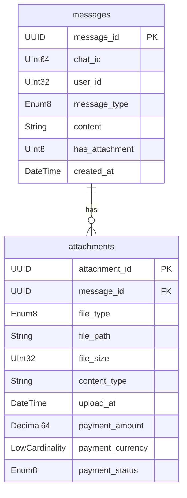

<style>
.slidev-layout::before {
  content: '';
  background-image: url('./images/share/logo.png');
  background-size: contain;
  background-repeat: no-repeat;
  position: fixed;
  top: 1rem;
  left: 1rem;
  width: 100px;
  height: 40px;
  z-index: 100;
}

/* Add slide counter to bottom right of every slide */
.slidev-layout::after {
  content: counter(slide) '/' var(--slidev-page-total);
  position: fixed;
  bottom: 1rem;
  right: 1rem;
  font-size: 0.8em;
  opacity: 0.6;
}

/* Add padding to all slide content */
.slidev-layout {
  padding-top: 4rem !important;  /* Increased top padding to make room for logo */
}

/* Adjust specific layouts if needed */
.slidev-layout.default {
  padding-top: 4rem !important;
}

.slidev-layout.center {
  padding-top: 4rem !important;
}

/* Add professional font styling */
svg text {
  font-family: -apple-system, BlinkMacSystemFont, "Segoe UI", Roboto, Helvetica, Arial, sans-serif;
  letter-spacing: -0.2px;
}

/* Make text crisper */
svg {
  text-rendering: optimizeLegibility;
  -webkit-font-smoothing: antialiased;
  -moz-osx-font-smoothing: grayscale;
}
</style>

# ClickHouse in a day

A high-performance, column-oriented database management system

<div class="pt-12">
  <span class="px-2 py-1 rounded cursor-pointer" hover="bg-white bg-opacity-10">
    Press Space for next slide <carbon:arrow-right class="inline"/>
  </span>
</div>

---
layout: section
---
<div style="position: absolute; top: 1rem; right: 1rem; font-size: 0.8em; opacity: 0.6;">
<SlideCurrentNo /> / <SlidesTotal />
</div>

# Session 1: Introduction

---
layout: image-right
image: ./images/session1/clickhouse_an_open_source_column_oriented_database_management_system.jpeg
---
<div style="position: absolute; top: 1rem; right: 1rem; font-size: 0.8em; opacity: 0.6;">
<SlideCurrentNo /> / <SlidesTotal />
</div>


## What is ClickHouse?

- Open-source column-oriented DBMS
- Developed by Yandex
- Designed for online analytical processing (OLAP)
- Handles petabytes of data
- Real-time query processing
- High performance and scalability

---
layout: default
---

<div style="position: absolute; top: 1rem; right: 1rem; font-size: 0.8em; opacity: 0.6;">
<SlideCurrentNo /> / <SlidesTotal />
</div>


<div style="display: flex; justify-content: center; align-items: center; margin: 0.5rem auto;">
  
</div>

---
layout: default
---

<div style="position: absolute; top: 1rem; right: 1rem; font-size: 0.8em; opacity: 0.6;">
<SlideCurrentNo /> / <SlidesTotal />
</div>

<div style="display: flex; justify-content: center; align-items: center; margin: 2rem auto;">
  
</div>

---
layout: default
---

<div style="position: absolute; top: 1rem; right: 1rem; font-size: 0.8em; opacity: 0.6;">
<SlideCurrentNo /> / <SlidesTotal />
</div>


<div style="display: flex; justify-content: center; align-items: center; margin: 2rem auto;">
  
</div>

---
layout: default
---

<div style="position: absolute; top: 1rem; right: 1rem; font-size: 0.8em; opacity: 0.6;">
<SlideCurrentNo /> / <SlidesTotal />
</div>


# Installation and Setup
<div style="height: 400px; overflow-y: auto;">

```bash

    # Using Docker
    docker-compose --env-file .env up -d

    # docker-compose.yml file
    version: '3.8'

    services:
    clickhouse:
        image: clickhouse/clickhouse-server:latest
        container_name: clickhouse-labs
        ports:
        - "${CLICKHOUSE_PORT:-8123}:8123"       # HTTP port
        - "${CLICKHOUSE_TCP_PORT:-9000}:9000"   # Native port
        volumes:
        - ./data:/var/lib/clickhouse
        - ./logs:/var/log/clickhouse-server
        - ./config/users.xml:/etc/clickhouse-server/users.d/users.xml:ro
        environment:
        - CLICKHOUSE_USER=${CLICKHOUSE_USER:-default}
        - CLICKHOUSE_PASSWORD=${CLICKHOUSE_PASSWORD:-default}
        - CLICKHOUSE_DEFAULT_ACCESS_MANAGEMENT=1
        ulimits:
        nofile:
            soft: 262144
            hard: 262144

    volumes:
    clickhouse_data:
    clickhouse_logs:

```
</div>

---
layout: default
---
<div style="position: absolute; top: 1rem; right: 1rem; font-size: 0.8em; opacity: 0.6;">
<SlideCurrentNo /> / <SlidesTotal />
</div>

  

---
layout: default
---
<div style="position: absolute; top: 1rem; right: 1rem; font-size: 0.8em; opacity: 0.6;">
<SlideCurrentNo /> / <SlidesTotal />
</div>

# Why Clickhouse query so fast ?

<div style="display: flex; justify-content: center; align-items: center; margin:0rem auto;">
  
</div>


---
layout: default
---
<div style="position: absolute; top: 1rem; right: 1rem; font-size: 0.8em; opacity: 0.6;">
<SlideCurrentNo /> / <SlidesTotal />
</div>


# Granule

<div style="display: flex; justify-content: center; align-items: center; margin:0rem auto;">
  
</div>

---
layout: default
---
<div style="position: absolute; top: 1rem; right: 1rem; font-size: 0.8em; opacity: 0.6;">
<SlideCurrentNo /> / <SlidesTotal />
</div>


# Granule Structure

<div style="display: flex; justify-content: center; align-items: center; margin:0rem auto;">
  
</div>

---
layout: section
---
<div style="position: absolute; top: 1rem; right: 1rem; font-size: 0.8em; opacity: 0.6;">
<SlideCurrentNo /> / <SlidesTotal />
</div>

# Session 1: Summary

<div class="grid grid-cols-2 gap-4 text-left text-sm" >
<div>

## Key Concepts Covered
- Introduction to ClickHouse
- Column-oriented DBMS architecture
- Installation and setup options
- Core features and capabilities
- Real-world use cases (Cloudflare, Uber)

## Main Benefits
- High performance for analytics
- Real-time query processing
- Handles petabytes of data
- Efficient data compression
- Horizontal scalability

</div>
<div>

## Technical Highlights
- Docker-based deployment
- Configuration management
- Port settings (8123, 9000)
- Volume management
- System architecture

## Next Steps
- Data types and schema design
- Table engines and operations
- Query optimization
- Performance tuning
- Distributed setups

</div>
</div>

---
layout: section
---
<div style="position: absolute; top: 1rem; right: 1rem; font-size: 0.8em; opacity: 0.6;">
<SlideCurrentNo /> / <SlidesTotal />
</div>

# Session 2: Data Types and Schema Design

---
layout: default
---
<div style="position: absolute; top: 1rem; right: 1rem; font-size: 0.8em; opacity: 0.6;">
<SlideCurrentNo /> / <SlidesTotal />
</div>


# 2.1 Native Types

 


---
layout: two-cols
---
<div style="position: absolute; top: 1rem; right: 1rem; font-size: 0.8em; opacity: 0.6;">
<SlideCurrentNo /> / <SlidesTotal />
</div>


# Numeric Types

<div class="text-sm">

## Integers (Signed)
- `Int8`: -128 to 127 (1 byte)
- `Int16`: -32,768 to 32,767 (2 bytes)
- `Int32`: ~-2.1B to ~2.1B (4 bytes)
- `Int64`: ~-9.2E18 to ~9.2E18 (8 bytes)
- `Int128`: Very large range (16 bytes)
- `Int256`: Extremely large range (32 bytes)

## Integers (Unsigned)
- `UInt8`: 0 to 255 (1 byte)
- `UInt16`: 0 to 65,535 (2 bytes)
- `UInt32`: 0 to ~4.3B (4 bytes)
- `UInt64`: 0 to ~18.4E18 (8 bytes)
- `UInt128`/`UInt256`: For very large numbers

</div>

::right::

<div class="text-sm mt-12">

## Floating-Point Types
- `Float32`: Single precision (4 bytes)
- `Float64`: Double precision (8 bytes)

## Decimal Types (Fixed Precision)
- `Decimal32(scale)`: 9 digits, with scale decimal places
- `Decimal64(scale)`: 18 digits, with scale decimal places
- `Decimal128(scale)`: 38 digits, with scale decimal places
- `Decimal256(scale)`: 76 digits, with scale decimal places

```sql
-- Examples
user_id UInt32
views UInt64
temperature Float32
price Decimal64(2) -- For $123.45
```

</div>
---
layout: default
---
<div style="position: absolute; top: 1rem; right: 1rem; font-size: 0.8em; opacity: 0.6;">
<SlideCurrentNo /> / <SlidesTotal />
</div>

# Numeric Types - Code Examples

```sql
-- Create table with numeric types
CREATE TABLE numeric_example (
    -- Integers
    tiny_int Int8,                  -- For small numbers like flags
    small_int Int16,                -- For counters and small ranges
    regular_int Int32,              -- For most whole numbers
    big_int Int64,                  -- For large numbers like timestamps
    
    -- Unsigned Integers
    positive_small UInt8,           -- For positive small values (0-255)
    positive_medium UInt16,         -- For medium positive values
    positive_large UInt32,          -- For large positive values
    positive_very_large UInt64,     -- For very large values (timestamps in µs)
    
    -- Floating Point
    temperature Float32,            -- For measurements that need ~7 digits precision
    calculation_result Float64,     -- For values needing ~15 digits precision
    
    -- Fixed Precision (for financial data)
    price Decimal64(2),             -- For money values ($123.45)
    precise_metric Decimal128(6)    -- For values needing 6 decimal places
)
```

---
layout: two-cols
---
<div style="position: absolute; top: 1rem; right: 1rem; font-size: 0.8em; opacity: 0.6;">
<SlideCurrentNo /> / <SlidesTotal />
</div>


# String Types & UUID

<div class="text-sm"  style="height: 400px; overflow-y: auto;">

## String
- Variable-length strings
- No size limit (practically)
- UTF-8 encoded
- Uses less space for shorter strings

## FixedString(N)
- Fixed-length strings (N bytes)
- More space-efficient for fixed-length data
- Truncates or zero-pads data to fit N bytes
- Faster for exact-length strings

## UUID
- For 128-bit Universal Unique Identifiers
- Stored efficiently (16 bytes)
- Can generate automatically with UUID functions

</div>

::right::

<div class="text-sm mt-12">

## String Example Use Cases
```sql
-- Examples
comment String             -- Variable user comment
country_code FixedString(2) -- ISO country codes
transaction_id UUID        -- Unique identifiers
```

## Performance Optimization
- `LowCardinality(String)` for columns with few distinct values
  - Like countries, status codes, categories

```sql
-- Before
country String              -- Regular string

-- After (Much more efficient)
country LowCardinality(String) -- Dictionary-encoded
```

</div>

---
layout: default
---
<div style="position: absolute; top: 1rem; right: 1rem; font-size: 0.8em; opacity: 0.6;">
<SlideCurrentNo /> / <SlidesTotal />
</div>


# Date & Time Types

```sql
CREATE TABLE datetime_example (
    -- Date Types
    simple_date Date,              -- Range: 1970-01-01 to 2149-06-06 (2 bytes)
    extended_date Date32,          -- Range: 1900-01-01 to 2299-12-31 (4 bytes)
    
    -- DateTime Types (without timezone)
    timestamp DateTime,            -- Date and time with second precision (4 bytes)
    timestamp_ms DateTime64(3),    -- With millisecond precision (3 digits) (8 bytes)
    timestamp_ns DateTime64(9),    -- With nanosecond precision (9 digits) (8 bytes)
    
    -- DateTime Types (with timezone)
    timestamp_ny DateTime('America/New_York'),         -- With timezone
    timestamp_lon DateTime64(3, 'Europe/London'),      -- With timezone and ms precision
    
    -- Supported operations
    -- timestamp + INTERVAL 1 DAY
    -- timestamp - INTERVAL 3 HOUR
    -- toStartOfHour(timestamp)
    -- toYYYYMM(timestamp)
)
```

---
layout: two-cols
---
<div style="position: absolute; top: 1rem; right: 1rem; font-size: 0.8em; opacity: 0.6;">
<SlideCurrentNo /> / <SlidesTotal />
</div>


# Special Types

<div class="text-sm" style="height: 400px; overflow-y: auto;">

## Boolean Values
- Represented as `UInt8` (0 or 1)
- No dedicated Boolean type
```sql
is_active UInt8  -- 0 (false) or 1 (true)
```

## Enum Types
- Named constant values
- Stored efficiently as integers
- Two variants: `Enum8` and `Enum16`
```sql
status Enum8('active' = 1, 'inactive' = 0)
category Enum16('food' = 1, 'electronics' = 2, 
                'books' = 3)
```

## IP Addresses
- `IPv4`: Stored as UInt32
- `IPv6`: Stored as FixedString(16)
```sql
user_ip IPv4      -- 1 byte more efficient than UInt32
server_ip IPv6    -- Better semantics than FixedString
```

</div>

::right::

<div class="text-sm mt-12">

## Nullable Type
- Wrapper making any type nullable
- Has slight performance and storage overhead
```sql
-- Only use when NULLs are actually needed
optional_value Nullable(String)
optional_number Nullable(Int32)
```

## Domain Types
- Semantic wrappers over base types
```sql
url URL            -- String with URL functions
domain Domain      -- String optimized for domains
```

## Geo Types
- Types for geographical data
```sql
point Point        -- For 2D coordinates
ring Ring          -- Closed polygon without holes
polygon Polygon    -- Polygon with possible holes
```

</div>

---
layout: default
---
<div style="position: absolute; top: 1rem; right: 1rem; font-size: 0.8em; opacity: 0.6;">
<SlideCurrentNo /> / <SlidesTotal />
</div>


# Type Conversion & Casting

```sql
-- Implicit conversions happen automatically in compatible cases:
SELECT toUInt8(10), toString(42), toFloat64('3.14');

-- CAST operator for explicit conversion:
SELECT CAST('2023-01-01' AS Date), CAST(3.14 AS Decimal(10,2));

-- Conversion between numeric types:
SELECT CAST(count() AS Float64) / total AS ratio FROM ...

-- String to Date/DateTime conversion:
SELECT toDate('2023-01-01'), toDateTime('2023-01-01 12:30:00');

-- Type conversion in table definition
CREATE TABLE conversion_example (
    string_date String,
    parsed_date Date MATERIALIZED toDate(string_date)
)
```

---
layout: two-cols
---
<div style="position: absolute; top: 1rem; right: 1rem; font-size: 0.8em; opacity: 0.6;">
<SlideCurrentNo /> / <SlidesTotal />
</div>

# Type Selection Best Practices

<div class="text-sm" style="height: 400px; overflow-y: auto;">

## Use the most compact type possible
- `UInt8` instead of `Int64` for small positive numbers
- `Date` instead of `DateTime` if time not needed
- `FixedString(N)` for known-length strings

## Consider column cardinality
- `LowCardinality(String)` for columns with few unique values
- `Enum8/16` for fixed set of possible values

## Avoid unnecessary `Nullable` types
- Has performance cost (extra memory, slower processing)
- Consider default values instead when possible

</div>

::right::

<div class="text-sm mt-12">

## Optimize for query patterns
- Match types to how data will be queried
- Use appropriate Date/DateTime types for time-series data

## Storage impact
- Smaller types = less disk space & memory
- Better compression = better performance
- More efficient types = faster calculations

## Balance precision and performance
- `Float32` vs `Float64`
- `Decimal64(2)` vs `Decimal128(4)`
- Higher precision = more storage & processing cost

</div>


---
layout: default
---
<div style="position: absolute; top: 1rem; right: 1rem; font-size: 0.8em; opacity: 0.6;">
<SlideCurrentNo /> / <SlidesTotal />
</div>


## 2.2 Complex Data Types

<div style="display: flex; justify-content: center; align-items: center; margin: 2rem auto;">
  
</div>

---
layout: default
---
<div style="position: absolute; top: 1rem; right: 1rem; font-size: 0.8em; opacity: 0.6;">
<SlideCurrentNo /> / <SlidesTotal />
</div>

# Arrays

<div style="height:400px;overflow-x:auto">

```sql
-- E-commerce product categories
CREATE TABLE products (
    product_id UInt32,
    name String,
    price Decimal64(2),
    -- Store multiple categories per product
    categories Array(String),
    -- Store multiple tag IDs
    tag_ids Array(UInt16),
    -- Store historical prices with timestamps
    price_history Array(Tuple(DateTime, Decimal64(2))),
    -- Multidimensional array for size variations (S,M,L × Red,Blue,Green)
    inventory Array(Array(UInt16))
) ENGINE = MergeTree()
ORDER BY product_id;

-- Insert example
INSERT INTO products VALUES (
    1001,
    'Ultra Comfort Running Shoes',
    89.99,
    ['Footwear', 'Sports', 'Running'],
    [42, 56, 73],
    [(toDateTime('2023-01-01 00:00:00'), 79.99), (toDateTime('2023-03-15 00:00:00'), 84.99), (toDateTime('2023-06-01 00:00:00'), 89.99)],
    [[25, 30, 15], [40, 35, 20], [30, 25, 10]]  -- Inventory: [S,M,L] × [Red,Blue,Green]
);
```
</div>

---
layout: two-cols
---
<div style="position: absolute; top: 1rem; right: 1rem; font-size: 0.8em; opacity: 0.6;">
<SlideCurrentNo /> / <SlidesTotal />
</div>


# Array Use Cases & Queries

<div class="text-sm" style="height:400px;overflow-x:auto">

## Real Use Cases for Arrays

1. **Product tags/categories**
   - Store multiple categories per product
   - Avoid separate junction tables

2. **Feature vectors**
   - Machine learning embeddings
   - Recommendation systems

3. **Time series data points**
   - Sensor readings over time 
   - Stock price fluctuations

4. **Multi-value attributes**
   - User interests/preferences
   - Product features

</div>

::right::

<div class="text-sm" style="height:450px;overflow-x:auto">

## Common Array Operations

```sql
-- Products with specific category
SELECT product_id, name 
FROM products 
WHERE has(categories, 'Running');

-- Count products per category
SELECT 
    category,
    count() AS product_count
FROM products
ARRAY JOIN categories AS category
GROUP BY category
ORDER BY product_count DESC;

-- Find products with at least 3 categories
SELECT product_id, name
FROM products
WHERE length(categories) >= 3;

-- Calculate average price
SELECT 
    product_id,
    name,
    avg(price_point.2) AS avg_price
FROM products
ARRAY JOIN price_history AS price_point
GROUP BY product_id, name;
```

</div>

---
layout: default
---
<div style="position: absolute; top: 1rem; right: 1rem; font-size: 0.8em; opacity: 0.6;">
<SlideCurrentNo /> / <SlidesTotal />
</div>


# Nested Data Type

<div class="text-sm" style="height:400px;overflow-x:auto">

```sql
-- E-commerce orders with line items
CREATE TABLE orders (
    order_id UInt32,
    customer_id UInt32,
    order_date DateTime,
    
    -- Nested structure for order items
    order_items Nested(
        product_id UInt32,
        quantity UInt16,
        price Decimal64(2),
        discount Decimal64(2)
    ),
    
    total_amount Decimal64(2),
    payment_method Enum8('credit_card' = 1, 'paypal' = 2, 'bank_transfer' = 3),
    shipping_address String
) ENGINE = MergeTree()
PARTITION BY toYYYYMM(order_date)
ORDER BY (customer_id, order_date);

-- Insert example
INSERT INTO orders VALUES (
    10001,
    5001,
    '2023-07-15 14:30:00',
    [1001, 2002, 3003],          -- product_id array
    [2, 1, 3],                   -- quantity array
    [89.99, 25.50, 12.99],       -- price array
    [0, 5.10, 0],                -- discount array
    157.36,
    1,
    '123 Main St, Anytown, US'
);
```
</div>
---
layout: two-cols
---
<div style="position: absolute; top: 1rem; right: 1rem; font-size: 0.8em; opacity: 0.6;">
<SlideCurrentNo /> / <SlidesTotal />
</div>


# Nested Use Cases & Queries

<div class="text-sm" style="height:400px;overflow-x:auto" >

## Real Use Cases for Nested

1. **Order line items**
   - Multiple products per order
   - Maintains order-item relationship

2. **User events with properties**
   - Web analytics events
   - IoT device readings

3. **Document storage**
   - JSON-like documents
   - Hierarchical data

4. **Transaction details**
   - Financial transactions
   - Payment processing data

</div>

::right::

<div class="text-sm" style="height:450px;overflow-x:auto">

## Working with Nested Types

```sql
-- Calculate total items sold per product
SELECT 
    order_items.product_id,
    sum(order_items.quantity) AS total_quantity
FROM orders
ARRAY JOIN order_items
GROUP BY order_items.product_id
ORDER BY total_quantity DESC;

-- Find orders with specific product
SELECT 
    order_id,
    order_date
FROM orders
ARRAY JOIN order_items
WHERE order_items.product_id = 1001;

-- Calculate revenue by product
SELECT
    order_items.product_id,
    sum(order_items.quantity * 
        (order_items.price - order_items.discount)) AS revenue
FROM orders
ARRAY JOIN order_items
GROUP BY order_items.product_id
ORDER BY revenue DESC;
```

</div>

---
layout: default
---
<div style="position: absolute; top: 1rem; right: 1rem; font-size: 0.8em; opacity: 0.6;">
<SlideCurrentNo /> / <SlidesTotal />
</div>


# Tuples

<div style="height:400px;overflow-x:auto"> 

```sql
-- Location data for ride-sharing application
CREATE TABLE ride_events (
    ride_id UInt64,
    driver_id UInt32,
    rider_id UInt32,
    event_time DateTime64(3),
    event_type Enum8('requested' = 1, 'accepted' = 2, 'started' = 3, 'completed' = 4, 'canceled' = 5),
    
    -- Coordinates as tuple (lat, lon)
    coordinates Tuple(Float64, Float64),
    
    -- Structured address as named tuple
    address Tuple(
        street String,
        city LowCardinality(String),
        state LowCardinality(String),
        zip FixedString(5)
    ),
    
    -- Ride statistics
    stats Tuple(
        distance_km Float32,
        duration_min UInt16,
        fare Decimal64(2)
    )
) ENGINE = MergeTree()
PARTITION BY toYYYYMMDD(event_time)
ORDER BY (driver_id, event_time);

-- Insert example
INSERT INTO ride_events VALUES (
    123456789,
    1001,
    5002,
    '2023-07-15 08:30:00.000',
    3,
    (37.7749, -122.4194),                 -- San Francisco coordinates
    ('123 Market St', 'San Francisco', 'CA', '94103'),
    (5.2, 18, 12.50)
);
```
</div>

---
layout: two-cols
---
<div style="position: absolute; top: 1rem; right: 1rem; font-size: 0.8em; opacity: 0.6;">
<SlideCurrentNo /> / <SlidesTotal />
</div>


# Tuple Use Cases & Queries

<div class="text-sm"  style="height:400px;overflow-x:auto">

## Real Use Cases for Tuples

1. **Geospatial data**
   - Coordinates (lat, lon)
   - Boundaries and regions

2. **Structured attributes**
   - Addresses and locations
   - Product dimensions (L×W×H)

3. **Multi-value metrics**
   - Performance stats
   - Financial indicators

4. **Parameter combinations**
   - Configuration settings
   - Test parameters

</div>

::right::

<div class="text-sm" style="height:450px;overflow-x:auto">

## Working with Tuples

```sql
SELECT 
    ride_id,
    driver_id,
    event_time
FROM ride_events
WHERE event_type = 3  
  AND coordinates.1 BETWEEN 37.7 AND 37.8  
  AND coordinates.2 BETWEEN -122.5 AND -122.4

-- Filter by address component
SELECT 
    count() AS ride_count
FROM ride_events
WHERE address.city = 'San Francisco'
  AND event_type = 4


-- Calculate average statistics
SELECT 
    avg(stats.1) AS avg_distance,
    avg(stats.2) AS avg_duration,
    avg(stats.3) AS avg_fare
FROM ride_events
WHERE event_type = 4 
```

</div>

---
layout: default
---
<div style="position: absolute; top: 1rem; right: 1rem; font-size: 0.8em; opacity: 0.6;">
<SlideCurrentNo /> / <SlidesTotal />
</div>


# Maps

<div style="height:400px;overflow-x:auto">

```sql
-- Web analytics events
CREATE TABLE user_events (
    event_id UUID,
    user_id UInt64,
    session_id UUID,
    event_time DateTime64(3),
    event_type LowCardinality(String),
    page_url String,
    
    -- Event properties as key-value pairs
    event_properties Map(LowCardinality(String), String),
    
    -- User properties
    user_properties Map(LowCardinality(String), String),
    
    -- Metrics
    metrics Map(LowCardinality(String), Float64),
    
    -- Device and browser info
    browser_info Map(LowCardinality(String), String)
) ENGINE = MergeTree()
PARTITION BY toYYYYMMDD(event_time)
ORDER BY (user_id, event_time, event_id);

-- Insert example
INSERT INTO user_events VALUES (
    generateUUIDv4(),
    123456,
    generateUUIDv4(),
    now(),
    'page_view',
    'https://example.com/products',
    {
        'referrer': 'https://google.com',
        'utm_source': 'email_campaign',
        'utm_medium': 'email'
    },
    {
        'country': 'US',
        'language': 'en',
        'segment': 'premium'
    },
    {
        'page_load_time': 1.24,
        'time_on_page': 45.7,
        'scroll_depth': 0.75
    },
    {
        'browser': 'Chrome',
        'os': 'Windows',
        'device': 'desktop',
        'viewport_width': '1920',
        'viewport_height': '1080'
    }
);
```
</div>

---
layout: two-cols
---
<div style="position: absolute; top: 1rem; right: 1rem; font-size: 0.8em; opacity: 0.6;">
<SlideCurrentNo /> / <SlidesTotal />
</div>


# Map Use Cases & Queries

<div class="text-sm" style="height:400px;overflow-x:auto">

## Real Use Cases for Maps

1. **Event properties**
   - Web analytics
   - Mobile app events
   - IoT sensor data

2. **User attributes**
   - Dynamic user properties
   - Preferences and settings

3. **Configuration settings**
   - Application configs
   - Feature flags

4. **Metadata storage**
   - Document metadata
   - Schema-less data storage

</div>

::right::

<div class="text-sm" style="height:450px;overflow-x:auto">

## Working with Maps

```sql
-- Find events with specific property value
SELECT 
    count() AS total_events
FROM user_events
WHERE event_properties['utm_source'] = 'email_campaign';

-- Get events where certain metric exceeds threshold
SELECT 
    event_id,
    event_time,
    event_type
FROM user_events
WHERE metrics['page_load_time'] > 5.0;

-- Aggregate by map value
SELECT 
    browser_info['browser'] AS browser,
    count() AS event_count
FROM user_events
WHERE event_time >= now() - INTERVAL 1 DAY
GROUP BY browser
ORDER BY event_count DESC;

-- Calculate average metric by user segment
SELECT 
    user_properties['segment'] AS segment,
    avg(metrics['time_on_page']) AS avg_time_on_page
FROM user_events
WHERE event_type = 'page_view'
GROUP BY segment;
```

</div>

---
layout: default
---
<div style="position: absolute; top: 1rem; right: 1rem; font-size: 0.8em; opacity: 0.6;">
<SlideCurrentNo /> / <SlidesTotal />
</div>


# Using Multiple Complex Types Together

<div style="height:400px;overflow-x:auto">

```sql
-- IoT sensor data from smart home system
CREATE TABLE sensor_readings (
    device_id UUID,
    timestamp DateTime64(3),
    device_type LowCardinality(String),
    location_id UInt16,
    
    -- Coordinates of the device
    coordinates Tuple(Float64, Float64, Float64), -- (x, y, z) coordinates in home
    
    -- Multiple sensor readings per event
    readings Nested(
        sensor_type LowCardinality(String),
        value Float64,
        unit LowCardinality(String)
    ),
    
    -- Historical readings (last 10 values)
    historical_values Array(Float64),
    historical_timestamps Array(DateTime64(3)),
    
    -- Device configuration and metadata
    configuration Map(LowCardinality(String), String)
) ENGINE = MergeTree()
PARTITION BY toYYYYMMDD(timestamp)
ORDER BY (device_id, timestamp);

-- 1. Basic array operations
SELECT 
    device_id,
    -- Get array length
    length(historical_values) as num_historical_values,
    -- Get first and last elements
    historical_values[1] as first_value,
    historical_values[-1] as last_value,
    -- Get array average using arrayAvg
    arrayAvg(historical_values) as avg_value
FROM sensor_readings
WHERE device_id = '55a7904c-02a6-4751-896f-74ab97b6a789';
```
</div>
---
layout: center
class: text-center
---
<div style="position: absolute; top: 1rem; right: 1rem; font-size: 0.8em; opacity: 0.6;">
<SlideCurrentNo /> / <SlidesTotal />
</div>


# Complex Data Type Selection Guide

<div class="grid grid-cols-2 gap-4 pt-4">
<div class="text-left text-sm">

### Use Arrays When:
- You need an ordered collection
- Items have the same type
- All items are accessed together
- You need random access by index

### Use Nested When:
- You have arrays of objects/structures
- Each object has multiple attributes
- You need to perform GROUP BY or filter on attributes

</div>
<div class="text-left text-sm">

### Use Tuples When:
- You need fixed-size collections
- Elements have different types
- Structure won't change
- Simple access by position is sufficient

### Use Maps When:
- You need key-value pairs
- Schema flexibility is required
- Dynamic attribute sets
- Keys are strings (typically)

</div>
</div>

<div class="pt-10 text-gray-500">
"Choose the right complex type based on your data structure and query patterns"
</div>

---
layout: default
---
<div style="position: absolute; top: 1rem; right: 1rem; font-size: 0.8em; opacity: 0.6;">
<SlideCurrentNo /> / <SlidesTotal />
</div>


## 2.3 Table engines 
<div style="display: flex; justify-content: center; align-items: center; margin:0rem auto;">
  
</div>

---
layout: two-cols
---
<div style="position: absolute; top: 1rem; right: 1rem; font-size: 0.8em; opacity: 0.6;">
<SlideCurrentNo /> / <SlidesTotal />
</div>


# ReplacingMergeTree

<div class="text-sm">

## Use Case
Managing product catalog where latest product information should replace old data.

```sql
CREATE TABLE product_catalog (
    product_id UInt32,
    product_name String,
    price Decimal(10,2),
    stock_quantity Int32,
    last_updated DateTime,
    version UInt32
) ENGINE = ReplacingMergeTree(version)
PRIMARY KEY product_id;
```

</div>

::right::

<div class="text-sm">

## Example Operations
```sql
-- Insert initial data
INSERT INTO product_catalog VALUES
(1, 'Laptop', 999.99, 50, 
 '2024-01-01 10:00:00', 1);

-- Update with new version
INSERT INTO product_catalog VALUES
(1, 'Laptop', 899.99, 45, 
 '2024-01-02 10:00:00', 2);

-- After optimization
OPTIMIZE TABLE product_catalog FINAL;
```

</div>

---
layout: two-cols
---
<div style="position: absolute; top: 1rem; right: 1rem; font-size: 0.8em; opacity: 0.6;">
<SlideCurrentNo /> / <SlidesTotal />
</div>


# CollapsingMergeTree

<div class="text-sm">

## Use Case
Real-time inventory tracking with increment/decrement operations.

```sql
CREATE TABLE inventory_movements (
    product_id UInt32,
    warehouse_id UInt16,
    quantity Int32,
    operation_time DateTime,
    sign Int8  -- 1 for add, -1 for subtract
) ENGINE = CollapsingMergeTree(sign)
ORDER BY (product_id, warehouse_id, 
         operation_time);
```

</div>

::right::

<div class="text-sm">

## Example Operations
```sql
-- Receive inventory
INSERT INTO inventory_movements VALUES
(1, 1, 100, now(), 1);  -- Add 100

-- Record sale
INSERT INTO inventory_movements VALUES
(1, 1, -20, now(), 1);  -- Remove 20

-- Cancel sale
INSERT INTO inventory_movements VALUES
(1, 1, 20, now(), -1);  -- Cancel removal

-- Check final state
SELECT * FROM inventory_movements FINAL;
```

</div>

---
layout: two-cols
---
<div style="position: absolute; top: 1rem; right: 1rem; font-size: 0.8em; opacity: 0.6;">
<SlideCurrentNo /> / <SlidesTotal />
</div>


# SummingMergeTree

<div class="text-sm">

## Use Case
Daily sales aggregation for e-commerce analytics.

```sql
CREATE TABLE daily_sales (
    date Date,
    product_id UInt32,
    total_revenue Decimal(15,2),
    items_sold UInt32,
    return_count UInt32
) ENGINE = SummingMergeTree()
ORDER BY (date, product_id)
PARTITION BY toYYYYMM(date);
```

</div>

::right::

<div class="text-sm">

## Example Operations
```sql
-- Record sales
INSERT INTO daily_sales VALUES
('2024-01-01', 1, 1000.00, 10, 1),
('2024-01-01', 1, 2000.00, 20, 2);

-- Add more sales
INSERT INTO daily_sales VALUES
('2024-01-01', 1, 1000.00, 10, 1);

-- View aggregated results
SELECT * FROM daily_sales FINAL;
```

</div>

---
layout: two-cols
---
<div style="position: absolute; top: 1rem; right: 1rem; font-size: 0.8em; opacity: 0.6;">
<SlideCurrentNo /> / <SlidesTotal />
</div>


# AggregatingMergeTree

<div class="text-sm">

## Use Case
Customer behavior analytics with complex aggregations.

```sql
CREATE TABLE customer_behavior (
    date Date,
    customer_id UInt32,
    total_visits AggregateFunction(sum, UInt8),
    avg_session_duration 
        AggregateFunction(avg, Float64),
    product_categories 
        AggregateFunction(groupUniqArray, String)
) ENGINE = AggregatingMergeTree()
PARTITION BY toYYYYMM(date)
ORDER BY (date, customer_id);
```

</div>

::right::

<div class="text-sm" style="height:450px;overflow-y:auto">

## Example Query

```sql
INSERT INTO customer_behavior
SELECT 
    date,
    customer_id,
    sumState(CAST(visits AS UInt8)), -- Explicitly cast to UInt8
    avgState(CAST(duration AS Float64)),
    groupUniqArrayState(category)
FROM 
(
    -- Sample raw data
    SELECT
        toDate('2024-01-01') as date,
        1 as customer_id,
        1 as visits,
        300.0 as duration, -- Added .0 to make it explicit Float64
        'Electronics' as category
    UNION ALL
    SELECT
        toDate('2024-01-01'),
        1,
        1,
        400.0,
        'Clothing'
) raw
GROUP BY date, customer_id;

-- Query aggregated results
SELECT
    date,
    customer_id,
    sumMerge(total_visits) as visits,
    avgMerge(avg_session_duration) as duration,
    groupUniqArrayMerge(product_categories) 
        as categories
FROM customer_behavior
GROUP BY date, customer_id;
```

</div>

---
layout: default
---
<div style="position: absolute; top: 1rem; right: 1rem; font-size: 0.8em; opacity: 0.6;">
<SlideCurrentNo /> / <SlidesTotal />
</div>


# MergeTree Engine Selection Guide

<div class="grid grid-cols-2 gap-4 pt-4 text-sm">
<div>

### Use ReplacingMergeTree When:
- Need to maintain latest version of records
- Handling data updates
- Managing product catalogs

### Use CollapsingMergeTree When:
- Need to track state changes
- Managing incremental updates
- Real-time balance calculations

</div>
<div>

### Use SummingMergeTree When:
- Aggregating numeric values
- Maintaining running totals
- Pre-calculating metrics

### Use AggregatingMergeTree When:
- Complex aggregations needed
- Working with state functions
- Advanced analytics required

</div>
</div>

<div class="pt-4 text-gray-500">
"Choose the right engine based on your data patterns and query requirements"
</div>

---
layout: default
---
<div style="position: absolute; top: 1rem; right: 1rem; font-size: 0.8em; opacity: 0.6;">
<SlideCurrentNo /> / <SlidesTotal />
</div>


## 2.4 Schema Design, Partitioning & Sharding for Chat Apps with Payment Attachment

<div class="grid grid-cols-2 gap-4">
<div>

Key strengths:
- High performance on analytical queries
- Efficient compression
- Columnar storage
- Data skipping mechanisms
- Parallelization capabilities
- Flexible scaling options

</div>
</div>

---
layout: section
---
<div style="position: absolute; top: 1rem; right: 1rem; font-size: 0.8em; opacity: 0.6;">
<SlideCurrentNo /> / <SlidesTotal />
</div>

# Schema Design Best Practices

---
layout: two-cols
---
<div style="position: absolute; top: 1rem; right: 1rem; font-size: 0.8em; opacity: 0.6;">
<SlideCurrentNo /> / <SlidesTotal />
</div>


# Schema Design Principles

1. Column-oriented thinking
2. Denormalization is often preferred
3. Use appropriate data types
4. Consider query patterns
5. Balance between read & write efficiency
6. Leverage materialized views
7. Use efficient sorting keys

::right::

<div class="ml-4" style="height:1000px;overflow-y:auto;transform: scale(0.5); transform-origin: top left; ">

</div>

---
layout: default
---
<div style="position: absolute; top: 1rem; right: 1rem; font-size: 0.8em; opacity: 0.6;">
<SlideCurrentNo /> / <SlidesTotal />
</div>


# Data Types Selection

<div class="grid grid-cols-2 gap-4">

<div>

## Numeric Types
- Use smallest possible integer type
  - UInt8, UInt16, UInt32, UInt64
  - Int8, Int16, Int32, Int64
- For floats: Float32 or Float64
- Decimal64(N) or Decimal128(N) for money

</div>

<div>

## Special Data Types
- DateTime or DateTime64 for timestamps
- Date for just dates
- LowCardinality for low-unique-value strings
- Enum for fixed value sets
- IPv4/IPv6 for IP addresses
- Array for multiple values

</div>

</div>

---
layout: default
---
<div style="position: absolute; top: 1rem; right: 1rem; font-size: 0.8em; opacity: 0.6;">
<SlideCurrentNo /> / <SlidesTotal />
</div>


# ChatApp Payment Use Case: Schema Design

<div class="grid grid-cols-2 gap-4">

<div style="overflow-y:auto;height:400px">

## Core Tables Structure
```sql
-- Chat Rooms Table
CREATE TABLE chat_rooms (
    chat_id UInt64,
    room_name String,
    created_by UInt32,
    created_at DateTime,
    is_active UInt8,
    _sign Int8
) ENGINE = CollapsingMergeTree(_sign)
PARTITION BY toYYYYMM(created_at)
ORDER BY (chat_id, created_at);

-- Messages Table
CREATE TABLE messages (
    message_id UUID,
    chat_id UInt64,
    user_id UInt32,
    message_type Enum8('text'=1, 'file'=2, 'payment'=3),
    content String,
    has_attachment UInt8,
    created_at DateTime,
    _sign Int8,
    INDEX message_type_idx message_type TYPE bloom_filter GRANULARITY 1
) ENGINE = CollapsingMergeTree(_sign)
PARTITION BY toYYYYMM(created_at)
ORDER BY (chat_id, created_at);
```

</div>
<div>

## Attachments Table
```sql
CREATE TABLE attachments (
    attachment_id UUID,
    message_id UUID,
    file_type Enum8('invoice'=1, 'receipt'=2, 'other'=3),
    file_path String,
    file_size UInt32,
    content_type String,
    upload_at DateTime,
    payment_amount Decimal64(2),
    payment_currency LowCardinality(String),
    payment_status Enum8('pending'=1, 'paid'=2, 'declined'=3),
    _sign Int8,
    INDEX file_type_idx file_type TYPE bloom_filter GRANULARITY 1
) ENGINE = CollapsingMergeTree(_sign)
PARTITION BY toYYYYMM(upload_at)
ORDER BY (message_id, upload_at);
```

</div>
</div>

---
layout: default
---

<div style="position: absolute; top: 1rem; right: 1rem; font-size: 0.8em; opacity: 0.6;">
<SlideCurrentNo /> / <SlidesTotal />
</div>


# ER Diagram: Chat Application Schema

<div style="transform: scale(0.9);transform-origin: top left;height:800px;overflow-y:auto; ">


</div>

---
layout: default
---
<div style="position: absolute; top: 1rem; right: 1rem; font-size: 0.8em; opacity: 0.6;">
<SlideCurrentNo /> / <SlidesTotal />
</div>


# Key Schema Design Features

<div class="grid grid-cols-2 gap-4">
<div>

## CollapsingMergeTree Engine
- Supports data updates via _sign column
- -1 marks deleted rows, 1 marks active rows
- Automatically collapses during merges
- Perfect for mutable chat data

## Partitioning Strategy
- Monthly partitions by created_at/upload_at
- Efficient data lifecycle management
- Optimized for time-based queries

</div>
<div>

## Indexing & Performance
- Primary keys optimize data access
- Bloom filter indexes for message_type and file_type
- LowCardinality for repeated values
- Efficient joins via UUID relationships

## Data Types
- UUID for unique identifiers
- Enum8 for fixed value sets
- Decimal64(2) for payment amounts
- DateTime for timestamps

</div>
</div>

---
layout: default
---
<div style="position: absolute; top: 1rem; right: 1rem; font-size: 0.8em; opacity: 0.6;">
<SlideCurrentNo /> / <SlidesTotal />
</div>
<div style="position: absolute; top: 1rem; right: 1rem; font-size: 0.8em; opacity: 0.6;">
<SlideCurrentNo /> / <SlidesTotal />
</div>

# Schema Optimization Tips

<div class="grid grid-cols-2 gap-4">

<div>

## Primary Keys & Sorting
- ORDER BY determines physical data order
- Choose columns that:
  - Are used in WHERE conditions
  - Follow cardinality principle (high to low)
  - Enable data skipping
- For our case: (chat_id, created_at)

## Indexes
- Sparse indexes in ClickHouse
- Secondary indexes with expressions
- Use bloom filters for high-cardinality columns

</div>
<div>

## Optimizing for Queries
- Common query for payment analytics:

```sql
SELECT 
    toDate(upload_at) AS day,
    sum(payment_amount) AS total_amount,
    countIf(payment_status = 'paid') AS paid_count
FROM attachments
WHERE 
    file_type = 'invoice' 
    AND toYYYYMM(upload_at) >= 202301
    AND toYYYYMM(upload_at) <= 202312
GROUP BY day
ORDER BY day
```

</div>
</div>

---
layout: section
---
<div style="position: absolute; top: 1rem; right: 1rem; font-size: 0.8em; opacity: 0.6;">
<SlideCurrentNo /> / <SlidesTotal />
</div>

# Partitioning and Sharding

---
layout: two-cols
---
<div style="position: absolute; top: 1rem; right: 1rem; font-size: 0.8em; opacity: 0.6;">
<SlideCurrentNo /> / <SlidesTotal />
</div>

# Partitioning

Partitioning divides data within a single server

- Improves query performance
- Simplifies data management
- Enables efficient TTL policies
- Optimizes storage operations

### Best Practices:
- Partition on date/time for time-series data
- Aim for 10MB-100GB per partition
- Avoid too many small partitions
- Consider hardware limitations

::right::

<div class="ml-4 mt-10">

### Our Chat App Approach:
```sql
PARTITION BY toYYYYMM(created_at)
```

- Groups data by year and month
- Allows efficient historical queries
- Works well with time-based retention
- Partition by date component matching your typical query range

</div>

---
layout: default
---
<div style="position: absolute; top: 1rem; right: 1rem; font-size: 0.8em; opacity: 0.6;">
<SlideCurrentNo /> / <SlidesTotal />
</div>

# Sharding

<div class="grid grid-cols-2 gap-4">

<div>

## What is Sharding?
- Horizontal partitioning across multiple servers
- Distributes data and query load
- Scales out capacity
- Managed by ClickHouse Keeper
- Uses Distributed table engine as a view

## Sharding Key Selection
- Even data distribution
- Minimize cross-shard queries
- Align with business domains

</div>
<div>

## ChatApp Sharding Approach
```sql
-- On each shard
CREATE TABLE messages_local (
    -- same schema as before
) ENGINE = MergeTree()
PARTITION BY toYYYYMM(created_at)
ORDER BY (chat_id, created_at);

-- Distributed view
CREATE TABLE messages AS messages_local
ENGINE = Distributed(cluster_name, 
                    default, 
                    messages_local, 
                    sipHash64(chat_id));
```

Sharding by `chat_id` keeps all messages for a specific chat on the same shard, optimizing retrieval.

</div>
</div>

---
layout: default
---
<div style="position: absolute; top: 1rem; right: 1rem; font-size: 0.8em; opacity: 0.6;">
<SlideCurrentNo /> / <SlidesTotal />
</div>

# Real-World Use Case: Optimizing for Payment Analysis

<div class="grid grid-cols-2 gap-4">

<div>

## Common Access Patterns
1. Retrieve chat history with attachments
2. Search for payment documents
3. Calculate payment statistics
4. Generate financial reports
5. Filter payments by status

## Key Optimizations
- Materialized view for payment summaries
- Separate partition for payment attachments
- Pre-aggregated data for reporting
- Custom sharding strategy for payment processing

</div>
<div>

## Materialized View for Payments
```sql
CREATE MATERIALIZED VIEW payment_summary
ENGINE = SummingMergeTree()
PARTITION BY toYYYYMM(day)
ORDER BY (payment_currency, day)
AS
SELECT 
    toDate(upload_at) AS day,
    payment_currency,
    payment_status,
    count() AS payment_count,
    sum(payment_amount) AS total_amount
FROM attachments
WHERE file_type IN ('invoice', 'receipt')
GROUP BY day, payment_currency, payment_status;
```

</div>
</div>

---
layout: default
---
<div style="position: absolute; top: 1rem; right: 1rem; font-size: 0.8em; opacity: 0.6;">
<SlideCurrentNo /> / <SlidesTotal />
</div>

# Key Takeaways

<div class="grid grid-cols-2 gap-4">

<div>

## Schema Design
- Think in columns, not rows
- Optimize for your most common queries
- Use the smallest efficient data types
- Denormalize when it makes sense
- Use materialized views for pre-aggregation
- Apply proper ORDER BY for data locality

</div>
<div>

## Partitioning & Sharding
- Partition by date components for time-series data
- Shard by high-cardinality business entity
- Balance partition sizes (not too big, not too small)
- Consider read vs. write optimization
- Test with realistic data volumes
- Monitor and adjust based on query patterns

</div>
</div>

<div class="mt-4 p-4 bg-blue-50 rounded-lg">

## ChatApp Payment Use Case Lessons
1. Separate schema for attachments with specialized fields
2. Partition monthly for efficient data lifecycle management
3. Shard by chat_id to keep conversations together
4. Use materialized views for real-time payment analytics
5. Apply LowCardinality and appropriate Enums for dimension fields

</div>

---
layout: section

---
<div style="position: absolute; top: 1rem; right: 1rem; font-size: 0.8em; opacity: 0.6;">
<SlideCurrentNo /> / <SlidesTotal />
</div>

# Session:3 Basic Operations

## Working with Chat App Payment Data


---
layout: default
---
<div style="position: absolute; top: 1rem; right: 1rem; font-size: 0.8em; opacity: 0.6;">
<SlideCurrentNo /> / <SlidesTotal />
</div>

# Session Overview

<div class="grid grid-cols-2 gap-4">
<div>

## We'll cover:
- Creating databases and tables
- Inserting data
- Basic SELECT queries
- WHERE clauses and filtering
- ORDER BY and LIMIT
- Aggregation functions

</div>
<div>

## Use Case: Chat App with Payments
- Messaging platform with payment features
- Users can share invoices and receipts
- Admins need analytics on payment activity
- Data needs to be queryable for reporting

</div>
</div>

---
layout: section
---
<div style="position: absolute; top: 1rem; right: 1rem; font-size: 0.8em; opacity: 0.6;">
<SlideCurrentNo /> / <SlidesTotal />
</div>

# 1. Creating Databases and Tables

---
layout: default
---
<div style="position: absolute; top: 1rem; right: 1rem; font-size: 0.8em; opacity: 0.6;">
<SlideCurrentNo /> / <SlidesTotal />
</div>

# Database Creation

<div class="grid grid-cols-2 gap-4">
<div>

```sql
-- Creating a new database
CREATE DATABASE chat_payments;

-- Use the database
USE chat_payments;

-- List all databases
SHOW DATABASES;

```

### MergeTree Engine Family
Most common and powerful table engine


</div>
</div>

---
layout: two-cols
---
<div style="position: absolute; top: 1rem; right: 1rem; font-size: 0.8em; opacity: 0.6;">
<SlideCurrentNo /> / <SlidesTotal />
</div>

# Table Creation: Messages

```sql{all|1|3-17|6|8-10|12-13|16|all}
USE chat_payments;

CREATE TABLE messages (
    message_id UUID,
    chat_id UInt64,
    user_id UInt32,
    sent_timestamp DateTime,
    message_type Enum8(
        'text' = 1, 'image' = 2, 
        'invoice' = 3, 'receipt' = 4
    ),
    content String,
    has_attachment UInt8,
    sign Int8,
    INDEX message_type_idx message_type TYPE bloom_filter GRANULARITY 1
) ENGINE = CollapsingMergeTree(sign)
Primary Key (message_id)
PARTITION BY toYYYYMM(sent_timestamp)
ORDER BY (message_id, chat_id, sent_timestamp);
```

::right::

<div class="ml-4">

# Key Concepts

- **Engine = CollapsingMergeTree()** - Best for mutable data

- **PARTITION BY** - How data is split into files
  - Monthly partitioning works well for chat data
  - Enables efficient data lifecycle management

- **ORDER BY** - Critical for query performance
  - Defines primary key (if not specified separately)
  - Orders data physically on disk
  - Here: Group all messages by chat, then by time

- **Sparse Indexes** - ClickHouse creates automatic sparse indexes on ORDER BY columns

</div>

---
layout: two-cols
---
<div style="position: absolute; top: 1rem; right: 1rem; font-size: 0.8em; opacity: 0.6;">
<SlideCurrentNo /> / <SlidesTotal />
</div>

# Table Creation: Payments

```sql{all|1-12|4-7|10|14-15|17|all}
CREATE TABLE chat_payments.attachments (
    attachment_id UUID,
    message_id UUID,
    payment_amount Decimal64(2),
    payment_currency LowCardinality(String),
    invoice_date Date,
    payment_status Enum8(
        'pending' = 1, 'paid' = 2, 'canceled' = 3
    ),
    file_path String,
    file_size UInt32,
    uploaded_at DateTime,
    sign Int8,
    INDEX payment_status_idx payment_status TYPE set(0) GRANULARITY 1,
    INDEX currency_idx payment_currency TYPE set(0) GRANULARITY 1
) ENGINE = CollapsingMergeTree(sign)
Primary Key (attachment_id)
PARTITION BY toYYYYMM(uploaded_at)
ORDER BY (attachment_id, message_id, uploaded_at);
```

::right::

<div class="ml-4">

# Important Data Types

- **Decimal64(2)** - For currency values with 2 decimal places
- **LowCardinality(String)** - Optimized for low-unique-value strings
- **Enum8** - For fields with a fixed set of possible values
- **Date/DateTime** - Optimized date and time types

<div class="mt-6 bg-blue-50 p-4 rounded">
<strong>Best Practice:</strong> Use specialized data types where possible instead of generic ones. They provide better compression and performance.
</div>

<div class="mt-6">
<strong>Indexing:</strong> Secondary indices help with filtering on non-ORDER BY columns. Use sparingly.
</div>

</div>

---
layout: section
---
<div style="position: absolute; top: 1rem; right: 1rem; font-size: 0.8em; opacity: 0.6;">
<SlideCurrentNo /> / <SlidesTotal />
</div>

# 2. Inserting Data

---
layout: two-cols
---
<div style="position: absolute; top: 1rem; right: 1rem; font-size: 0.8em; opacity: 0.6;">
<SlideCurrentNo /> / <SlidesTotal />
</div>

# Basic INSERT Syntax

```sql{all|1-4|6-13|15-20|all}
-- Basic syntax
INSERT INTO table_name 
(column1, column2, ...)
VALUES (value1, value2, ...);

-- Insert into messages table
INSERT INTO chat_payments.messages 
(message_id, chat_id, user_id, sent_timestamp, 
 message_type, content, has_attachment,sign)
VALUES 
(generateUUIDv4(), 100, 1001, now(), 
 'text', 'Let me send you the invoice later', 0, 1);

-- Insert multiple rows
INSERT INTO chat_payments.messages VALUES
    (generateUUIDv4(), 100, 1001, now(), 'invoice', 'April Invoice', 1, 1),
    (generateUUIDv4(), 100, 1002, now(), 'text', 'Got it, thanks!', 0, 1),
    (generateUUIDv4(), 101, 1003, now(), 'receipt', 'Payment receipt', 1, 1),
    (generateUUIDv4(), 101, 1001, now(), 'text', 'Payment confirmed', 0, 1);
```

::right::

<div class="ml-4">

## Insert Methods

- **Single row INSERT**
- **Multi-row INSERT**
- **INSERT FROM SELECT**
- **INSERT FROM file**

### Useful Functions for INSERTs

- `generateUUIDv4()` - Generate UUID
- `now()` - Current timestamp
- `today()` - Current date

<div class="mt-6 bg-yellow-50 p-4 rounded">
<strong>Performance Tip:</strong> Batch inserts are much more efficient than individual row inserts. Aim for 1000+ rows per batch in production.
</div>

</div>

---
layout: default
---
<div style="position: absolute; top: 1rem; right: 1rem; font-size: 0.8em; opacity: 0.6;">
<SlideCurrentNo /> / <SlidesTotal />
</div>

# Inserting Payment Data
<div style="height:500px; overflow-y:auto">

```sql{all|1-11|13-22|all}


-- Insert multiple payment records
INSERT INTO chat_payments.attachments VALUES
(generateUUIDv4(), 'a0eebc99-9c0b-4ef8-bb6d-6bb9bd380a11', 1250.00, 'USD', 
 '2023-04-01', 'pending', '/storage/invoices/inv_12345.pdf', 128000, '2023-04-02 14:30:00' ,1),
(generateUUIDv4(), 'b1ffc999-7d1a-4ef8-bb6d-6bb9bd380a12', 750.50, 'EUR', 
 '2023-04-05', 'paid', '/storage/receipts/rec_75421.pdf', 98500, '2023-04-06 09:15:00', 1),
(generateUUIDv4(), 'c2aac888-6e2b-4ef8-bb6d-6bb9bd380a13', 500.25, 'GBP', 
 '2023-04-10', 'canceled', '/storage/invoices/inv_33456.pdf', 115200, '2023-04-11 11:45:00', 1);
```

<div class="mt-4 grid grid-cols-2 gap-4" >
<div >

### Date/Time Functions
- `parseDateTimeBestEffort()` - Flexible datetime parsing
- `toDateTime()` - Convert to DateTime
- `toDate()` - Convert to Date

</div>
<div>

### Loading from Files
```sql
clickhouse-client -q "INSERT INTO chat_payments.attachments FORMAT CSVWithNames" < /data/output.csv
```

</div>
</div>
</div>

---
layout: section
---
<div style="position: absolute; top: 1rem; right: 1rem; font-size: 0.8em; opacity: 0.6;">
<SlideCurrentNo /> / <SlidesTotal />
</div>

# 3. Basic SELECT Queries

---
layout: default
---
<div style="position: absolute; top: 1rem; right: 1rem; font-size: 0.8em; opacity: 0.6;">
<SlideCurrentNo /> / <SlidesTotal />
</div>

# Simple SELECT Statements

<div class="grid grid-cols-2 gap-4">
<div>

```sql{all|1|2|3|all}
SELECT *
FROM messages
LIMIT 5;

-- Select specific columns
SELECT 
    message_id,
    chat_id,
    user_id,
    message_type,
    sent_timestamp
FROM messages
LIMIT 2,1;
```

</div>
<div>

```sql
-- Examining table structure
DESCRIBE TABLE messages;

-- Inspecting data types
SELECT 
    name,
    type,
    default_kind,
    default_expression
FROM system.columns
WHERE table = 'messages';

-- Get count of rows
SELECT count()
FROM messages;
```

</div>
</div>

<div class="mt-4">

### Tips for SELECT Queries
- Avoid `SELECT *` in production - specify only needed columns
- Use `LIMIT` when exploring large tables
- ClickHouse has system tables (like `system.columns`) for metadata

</div>

---
layout: default
---
<div style="position: absolute; top: 1rem; right: 1rem; font-size: 0.8em; opacity: 0.6;">
<SlideCurrentNo /> / <SlidesTotal />
</div>

# Working with Chat Payment Data

<div class="grid grid-cols-2 gap-4">
<div>

```sql{all|1-6|8-13|15-21|all}
-- Get all invoice messages
SELECT 
    message_id, chat_id, sent_timestamp, content
FROM messages
WHERE message_type = 'invoice';

-- Find messages with attachments
SELECT 
    message_id, chat_id, user_id, 
    message_type, sent_timestamp
FROM messages
WHERE has_attachment = 1;

-- Get payment data
SELECT 
    attachment_id,
    message_id,
    payment_amount,
    payment_currency,
    payment_status
FROM attachments limit 10;
```

</div>
<div>

```sql{all|1-7|9-14|all}
-- Join messages with payment data
SELECT 
    m.chat_id,
    m.user_id,
    p.payment_amount,
    p.payment_currency
FROM messages m
JOIN payment_attachments p ON m.message_id = p.message_id;

-- Calculate total by currency
SELECT 
    payment_currency,
    count() AS payment_count,
    sum(payment_amount) AS total_amount
FROM payment_attachments
GROUP BY payment_currency;
```

</div>
</div>

<div class="mt-4 bg-blue-50 p-4 rounded">
<strong>Performance Note:</strong> ClickHouse performs best when a small subset of columns is selected from tables. Always select only the columns you need.
</div>

---
layout: section
---
<div style="position: absolute; top: 1rem; right: 1rem; font-size: 0.8em; opacity: 0.6;">
<SlideCurrentNo /> / <SlidesTotal />
</div>

# 4. WHERE Clauses and Filtering

---
layout: default
---
<div style="position: absolute; top: 1rem; right: 1rem; font-size: 0.8em; opacity: 0.6;">
<SlideCurrentNo /> / <SlidesTotal />
</div>

# Filtering Data with WHERE

<div class="grid grid-cols-2 gap-4">
<div>

```sql{all|2|3|4|6-14|all}
SELECT * FROM attachments 
WHERE payment_status = 'paid'
  AND payment_amount > 500
  AND uploaded_at >= '2023-04-01'
  limit 100;
 
-- Using date functions in filters
SELECT 
    attachment_id,
    payment_amount,
    payment_currency,
    payment_status,
    uploaded_at
FROM attachments
WHERE toYYYYMM(uploaded_at) = 202304
  AND payment_currency = 'USD'
  limit 100;
```

</div>
<div>

```sql{all|2-4|6-9|11-15|all}
-- Multiple conditions
SELECT * FROM messages
WHERE message_type IN ('invoice', 'receipt')
  AND sent_timestamp BETWEEN 
    '2025-04-01 00:00:00' AND '2025-04-30 23:59:59';

-- String pattern matching
SELECT * FROM messages
WHERE content LIKE '%invoice%'
OR content LIKE '%payment%';

-- Using functions in filters
SELECT * FROM attachments
WHERE formatDateTime(uploaded_at, '%Y-%m-%d') = '2023-04-15' AND (payment_status = 'pending' 
OR payment_status = 'paid') limit 100;
```

</div>
</div>

<div class="mt-4">

### ClickHouse WHERE Optimization Tips
- Filtering by columns in the primary key (ORDER BY) is most efficient
- Partition key filters allow partition pruning
- Secondary indexes can help with other filter conditions
- Avoid transformations on columns in filters when possible

</div>

---
layout: two-cols
---
<div style="position: absolute; top: 1rem; right: 1rem; font-size: 0.8em; opacity: 0.6;">
<SlideCurrentNo /> / <SlidesTotal />
</div>

# Advanced Filtering Examples

```sql{all|1-5|7-12|14-20|all}
-- Finding large payments
SELECT * FROM attachments
WHERE payment_amount > 1000
  AND payment_status = 'pending'
ORDER BY payment_amount DESC limit 100;

-- Time-based filtering with chat context
SELECT m.*, p.payment_amount, p.payment_currency
FROM messages m
LEFT JOIN attachments p ON m.message_id = p.message_id
WHERE m.chat_id = 100
  AND toDate(m.sent_timestamp) = today()
   limit 100;

-- Finding specific file types
SELECT *
FROM attachments
WHERE file_path LIKE '%.pdf'
  AND file_size > 100000
  AND payment_status != 'canceled'
ORDER BY file_size DESC limit 100;
```

::right::

<div class="ml-4">

## Filter Operators

- **Comparison:** =, !=, <, >, <=, >=
- **Logical:** AND, OR, NOT
- **Set Membership:** IN, NOT IN
- **Range:** BETWEEN
- **Pattern Matching:** LIKE, NOT LIKE
- **Null Checks:** IS NULL, IS NOT NULL

<div class="mt-6 bg-yellow-50 p-4 rounded">
<strong>Performance Tip:</strong> Combine filters on columns used in ORDER BY with other conditions for best performance. ClickHouse can use these for efficient data skipping.
</div>

</div>

---
layout: section
---
<div style="position: absolute; top: 1rem; right: 1rem; font-size: 0.8em; opacity: 0.6;">
<SlideCurrentNo /> / <SlidesTotal />
</div>

# 5. ORDER BY and LIMIT

---
layout: default
---
<div style="position: absolute; top: 1rem; right: 1rem; font-size: 0.8em; opacity: 0.6;">
<SlideCurrentNo /> / <SlidesTotal />
</div>

# Sorting Results

<div class="grid grid-cols-2 gap-4">
<div>

```sql{all|4|8-12|all}
-- Simple sorting
SELECT * FROM payment_attachments
WHERE payment_status = 'paid'
ORDER BY payment_amount DESC
LIMIT 10;

-- Multi-column sorting
SELECT 
    message_id, user_id, sent_timestamp, message_type
FROM messages
ORDER BY chat_id ASC, 
         sent_timestamp DESC
LIMIT 20;
```

</div>
<div>

```sql{all|2-4|8-13|all}
-- Order amounts by currency
SELECT * FROM payment_attachments
ORDER BY payment_currency ASC, 
         payment_amount DESC
LIMIT 100;

-- Sorting with expressions
SELECT 
    attachment_id,
    payment_amount,
    payment_currency,
    payment_status
FROM payment_attachments
ORDER BY payment_amount DESC;
```

</div>
</div>

<div class="mt-4">

### ORDER BY Rules in ClickHouse
- Can sort by any column or expression
- Direction can be ASC (default) or DESC
- Multiple sort columns create hierarchical sorting
- Always use LIMIT with ORDER BY on large tables
- Sorting in ClickHouse is only guaranteed within the LIMIT

</div>

---
layout: default
---
<div style="position: absolute; top: 1rem; right: 1rem; font-size: 0.8em; opacity: 0.6;">
<SlideCurrentNo /> / <SlidesTotal />
</div>

# ORDER BY Performance Considerations

<div class="grid grid-cols-2 gap-4">
<div>

### ORDER BY with LIMIT is optimized
```sql
SELECT 
    message_id, 
    chat_id,
    sent_timestamp
FROM messages
WHERE message_type = 'invoice'
ORDER BY sent_timestamp DESC
LIMIT 100;
```

### Effective for top-N queries
```sql
-- Find top 10 largest payments
SELECT * FROM attachments
ORDER BY payment_amount DESC
LIMIT 10;
```

</div>
<div>

### Using BY clause for sampling

```sql
-- Get 10 random payments for review
SELECT *
FROM attachments
ORDER BY rand()
LIMIT 10;
```

### With GROUP BY and aggregates

```sql
-- Largest payments by currency
SELECT 
    payment_currency,
    max(payment_amount) AS max_amount,
    sum(payment_amount) AS total
FROM attachments
GROUP BY payment_currency
ORDER BY total DESC;
```

</div>
</div>

<div class="mt-4 bg-red-50 p-4 rounded">
<strong>Warning:</strong> Using ORDER BY without LIMIT on large tables can be resource-intensive and slow, as ClickHouse must sort the entire result set. Always include a LIMIT clause with ORDER BY for large tables.
</div>

---
layout: section
---
<div style="position: absolute; top: 1rem; right: 1rem; font-size: 0.8em; opacity: 0.6;">
<SlideCurrentNo /> / <SlidesTotal />
</div>

# 6. Aggregation Functions

---
layout: two-cols
---
<div style="position: absolute; top: 1rem; right: 1rem; font-size: 0.8em; opacity: 0.6;">
<SlideCurrentNo /> / <SlidesTotal />
</div>

# Basic Aggregation

<div style="height:400px;overflow-y:auto">
```sql{all|1-6|8-14|16-23|all}
-- Count, sum, average
SELECT
    count() AS total_payments,
    sum(payment_amount) AS total_amount,
    avg(payment_amount) AS average_amount
FROM attachments;

-- Min, max, statistics
SELECT
    min(payment_amount) AS min_amount,
    max(payment_amount) AS max_amount,
    stddevPop(payment_amount) AS std_deviation,
    median(payment_amount) AS median_amount
FROM attachments
WHERE payment_status = 'paid';

-- Group by with multiple aggregates
SELECT
    payment_currency,
    count() AS num_payments,
    sum(payment_amount) AS total,
    avg(payment_amount) AS average,
    min(payment_amount) AS minimum,
    max(payment_amount) AS maximum
FROM attachments
GROUP BY payment_currency;
```
</div>

::right::

<div class="ml-4">

## Common Aggregation Functions

- **count()** - Count rows
- **sum()** - Sum values
- **avg()** - Average
- **min()/max()** - Minimum/maximum
- **any()** - Returns any value from the group
- **stddevPop()** - Standard deviation
- **median()** - Median value
- **quantile(0.XX)()** - Percentile values
- **uniq()** - Approximate distinct count
- **groupArray()** - Collect values into array

<div class="mt-6 bg-blue-50 p-4 rounded">
<strong>Note:</strong> ClickHouse is extremely fast at aggregations, which is one of its main strengths for analytical workloads.
</div>

</div>


---
layout: default
---
<div style="position: absolute; top: 1rem; right: 1rem; font-size: 0.8em; opacity: 0.6;">
<SlideCurrentNo /> / <SlidesTotal />
</div>

# Advanced Aggregations for Payment Analysis

<div class="grid grid-cols-2 gap-4">
<div>

```sql{all|2-5|7-15|all}
-- Payment status distribution
SELECT 
    payment_status,
    count() AS count
FROM attachments
GROUP BY payment_status;

-- Monthly payment totals
SELECT 
    toYear(uploaded_at) AS year,
    toMonth(uploaded_at) AS month,
    payment_currency,
    count() AS payment_count,
    sum(payment_amount) AS monthly_total,
    round(avg(payment_amount), 2) AS avg_payment
FROM attachments
GROUP BY year, month, payment_currency
ORDER BY year, month, payment_currency;
```

</div>
<div>

```sql{all|1-9|11-18|all}
-- Payments by user
SELECT 
    m.user_id,
    count() AS payment_count,
    sum(p.payment_amount) AS total_spent,
    avg(p.payment_amount) AS avg_payment
FROM messages m
JOIN attachments p ON m.message_id = p.message_id
GROUP BY m.user_id
ORDER BY total_spent DESC;

-- Payment size categories
SELECT
    multiIf(payment_amount < 100, 'Small',
            payment_amount < 500, 'Medium',
            payment_amount < 1000, 'Large',
            'Very Large') AS payment_category,
    count() AS count
FROM attachments
GROUP BY payment_category;
```

</div>
</div>

<div class="mt-4" style="height:100px;overflow-y:auto">

### Aggregate Function Modifiers
- **-If** suffix: Conditional aggregation (e.g., `countIf(condition)`)
- **-Array** suffix: Aggregation over arrays (e.g., `sumArray(array_column)`)
- **Combinators** like **-State**, **-Merge** for partial aggregations

</div>

---
layout: default
---
<div style="position: absolute; top: 1rem; right: 1rem; font-size: 0.8em; opacity: 0.6;">
<SlideCurrentNo /> / <SlidesTotal />
</div>

# Time-Based Aggregations

<div class="grid grid-cols-2 gap-4" >
<div>

```sql{all|2-8|10-17|all}
-- Daily payment totals
SELECT 
    toDate(uploaded_at) AS date,
    payment_currency,
    count() AS num_payments,
    sum(payment_amount) AS daily_total
FROM attachments
GROUP BY date, payment_currency
ORDER BY date DESC, payment_currency;

-- Weekly summaries
SELECT 
    toStartOfWeek(uploaded_at) AS week_start,
    payment_currency,
    count() AS payment_count,
    sum(payment_amount) AS weekly_total
FROM attachments
GROUP BY week_start, payment_currency
ORDER BY week_start DESC, payment_currency;
```

</div>
<div style="height:350px;overflow-y:auto">

```sql{all|2-11|13-21|all}
-- Payment success rate by month
SELECT 
    toStartOfMonth(uploaded_at) AS month,
    count() AS total_payments,
    countIf(payment_status = 'paid') AS paid_payments,
    countIf(payment_status = 'pending') AS pending_payments,
    countIf(payment_status = 'canceled') AS canceled_payments,
    round(countIf(payment_status = 'paid') / count() * 100, 2) AS success_rate
FROM attachments
WHERE uploaded_at >= '2023-01-01'
GROUP BY month
ORDER BY month;

-- Moving average of payment amounts
SELECT 
    toDate(uploaded_at) AS date,
    payment_currency,
    avg(payment_amount) OVER 
        (PARTITION BY payment_currency 
         ORDER BY toDate(uploaded_at) 
         ROWS BETWEEN 6 PRECEDING AND CURRENT ROW) AS moving_avg_7day
FROM attachments
WHERE payment_status = 'paid'
ORDER BY payment_currency, date;
```

</div>
</div>

<div class="mt-4 bg-blue-50 p-4 rounded">
<strong>Tip:</strong> ClickHouse has many date and time functions like `toStartOfDay()`, `toStartOfWeek()`, `toStartOfMonth()`, `toStartOfQuarter()`, `toStartOfYear()` that are useful for time-based grouping.
</div>

---
layout: default
---
<div style="position: absolute; top: 1rem; right: 1rem; font-size: 0.8em; opacity: 0.6;">
<SlideCurrentNo /> / <SlidesTotal />
</div>

# WITH ROLLUP, WITH CUBE, and HAVING

<div class="grid grid-cols-2 gap-4">
<div>

```sql{all|6|7-12|all}
-- ROLLUP for hierarchical summaries
SELECT 
    payment_currency,
    toYear(uploaded_at) AS year,
    sum(payment_amount) AS total
FROM attachments
GROUP BY payment_currency, year
WITH ROLLUP
ORDER BY 
    IF(payment_currency = '', 1, 0),
    payment_currency,
    IF(year = 0, 1, 0),
    year;
```

</div>
<div>

```sql{all|7|9-13|all}
-- Using HAVING to filter groups
SELECT 
    payment_currency,
    payment_status,
    count() AS count,
    sum(payment_amount) AS total
FROM attachments
GROUP BY payment_currency, payment_status
HAVING count > 40000 
   AND total > 10000
ORDER BY 
    payment_currency, 
    payment_status;
```

</div>
</div>

<div class="mt-4">

### Multi-level Aggregation Options

- **WITH ROLLUP**: Creates subtotals and grand total hierarchically
- **WITH CUBE**: Creates subtotals for all possible combinations of grouping columns
- **WITH TOTALS**: Calculates totals across all groups
- **HAVING**: Filters groups after aggregation (similar to WHERE but for aggregate results)

</div>

---
layout: section
---
<div style="position: absolute; top: 1rem; right: 1rem; font-size: 0.8em; opacity: 0.6;">
<SlideCurrentNo /> / <SlidesTotal />
</div>

# Practical Examples

---
layout: default
---
<div style="position: absolute; top: 1rem; right: 1rem; font-size: 0.8em; opacity: 0.6;">
<SlideCurrentNo /> / <SlidesTotal />
</div>

# Real-World Queries for Chat Payment Analysis

<div class="grid grid-cols-2 gap-4">
<div>

## 1. Payment Trend Analysis

```sql
-- Monthly payment trends by currency
SELECT 
    toStartOfMonth(uploaded_at) AS month,
    payment_currency,
    count() AS payment_count,
    sum(payment_amount) AS monthly_total,
    round(avg(payment_amount), 2) AS average_payment
FROM attachments
GROUP BY month, payment_currency
ORDER BY month DESC, payment_currency;
```

</div>
<div>

## 2. User Payment Activity

```sql
-- User payment statistics
SELECT 
    m.user_id,
    uniq(m.chat_id) AS active_chats,
    count(p.attachment_id) AS payment_count,
    sum(p.payment_amount) AS total_amount,
    max(p.payment_amount) AS largest_payment,
    min(p.uploaded_at) AS first_payment,
    max(p.uploaded_at) AS last_payment
FROM messages m
JOIN attachments p ON m.message_id = p.message_id
GROUP BY m.user_id
HAVING payment_count > 0
ORDER BY total_amount DESC;
```

</div>
</div>

---
layout: default
---
<div style="position: absolute; top: 1rem; right: 1rem; font-size: 0.8em; opacity: 0.6;">
<SlideCurrentNo /> / <SlidesTotal />
</div>

# More Real-World Queries

<div class="grid grid-cols-2 gap-4">
<div>

## 3. Payment Status Flow

```sql
-- Status distribution by month
SELECT 
    toStartOfMonth(uploaded_at) AS month,
    payment_status,
    count() AS count,
    round(count() / sum(count()) OVER (PARTITION BY month) * 100, 2) AS percentage
FROM attachments
GROUP BY month, payment_status
ORDER BY month DESC, payment_status;
```

</div>
<div>

## 4. Large Payment Alert Report

```sql
-- Find large payments for review
SELECT 
    p.attachment_id,
    m.chat_id,
    m.user_id,
    p.payment_amount,
    p.payment_currency,
    p.payment_status,
    p.uploaded_at,
    p.file_path
FROM attachments p
JOIN messages m ON p.message_id = m.message_id
WHERE p.payment_amount > 5000
  AND p.payment_status = 'pending'
ORDER BY p.payment_amount DESC;
```

</div>
</div>

---
layout: default
---
<div style="position: absolute; top: 1rem; right: 1rem; font-size: 0.8em; opacity: 0.6;">
<SlideCurrentNo /> / <SlidesTotal />
</div>

# Performance Optimization Tips

<div class="grid grid-cols-2 gap-4" style="text-align: left;height:400px;overflow-y:auto">
<div>

## Query Optimization

1. **Select only needed columns**
   - Reduces I/O and memory usage

2. **Use ORDER BY columns in filtering**
   - Leverages primary key for data skipping

3. **Filter by partition key when possible**
   - Enables partition pruning

4. **Batch inserts for better performance**
   - Aim for 1000+ rows per insert

5. **Use LowCardinality for repeated values**
   - Improves compression and query speed

</div>
<div>

## Monitoring Query Performance

```sql
-- Check query execution times
SELECT 
    query_id,
    query,
    query_duration_ms,
    read_rows,
    read_bytes,
    memory_usage
FROM system.query_log
WHERE type = 'QueryFinish'
  AND query LIKE '%payment_attachments%'
  AND event_time > now() - INTERVAL 1 HOUR
ORDER BY query_duration_ms DESC
LIMIT 10;
```

</div>
</div>

---
layout: center
class: text-center
---
<div style="position: absolute; top: 1rem; right: 1rem; font-size: 0.8em; opacity: 0.6;">
<SlideCurrentNo /> / <SlidesTotal />
</div>

# Session Summary

<div class="grid grid-cols-2 gap-4">
<div>

## What We've Covered

- Creating databases and tables
- Inserting data into ClickHouse
- Basic SELECT queries
- Filtering with WHERE clauses
- Sorting with ORDER BY and LIMIT
- Aggregation functions and grouping

</div>
<div>

## Next Steps

- Advanced ClickHouse features
- Materialized views
- Window functions
- Array and map data types
- Performance optimization
- Distributed ClickHouse clusters

</div>
</div>

<div class="pt-12">
  <span class="px-2 py-1 rounded cursor-pointer" hover="bg-white bg-opacity-10">
    Questions?
  </span>
</div>


---
layout: section
---
<div style="position: absolute; top: 1rem; right: 1rem; font-size: 0.8em; opacity: 0.6;">
<SlideCurrentNo /> / <SlidesTotal />
</div>

# Session 4: ClickHouse Advanced Querying

## Mastering Complex Analytics for Chat Payment Data


---
layout: default
---
<div style="position: absolute; top: 1rem; right: 1rem; font-size: 0.8em; opacity: 0.6;">
<SlideCurrentNo /> / <SlidesTotal />
</div>

# Session Overview

<div class="grid grid-cols-2 gap-4">
<div>

## We'll cover:
- JOIN operations
- Window functions
- Subqueries
- Common Table Expressions (CTEs)
- Query optimization techniques

</div>
<div>

## Use Case: Chat App with Payments
- Messaging platform with payment features
- Users can share invoices and receipts
- Finance team needs detailed analytics
- High-volume data requiring optimization

</div>
</div>


---
layout: section
---
<div style="position: absolute; top: 1rem; right: 1rem; font-size: 0.8em; opacity: 0.6;">
<SlideCurrentNo /> / <SlidesTotal />
</div>

# 1. JOIN Operations

---
layout: default
---
<div style="position: absolute; top: 1rem; right: 1rem; font-size: 0.8em; opacity: 0.6;">
<SlideCurrentNo /> / <SlidesTotal />
</div>

# Basic JOIN Types

<div class="grid grid-cols-2 gap-4">
<div>

## INNER JOIN
```sql{all|1-2|3|4-6|all}
-- Match messages with their payment attachments
SELECT m.message_id, m.chat_id, m.user_id, 
       p.payment_amount, p.payment_currency
FROM messages m
INNER JOIN attachments p 
ON m.message_id = p.message_id;
```

## LEFT JOIN
```sql{all|3|4-6|all}
-- Get all messages and any payment attachments
SELECT m.message_id, m.content, 
       p.payment_amount, p.payment_status
FROM messages m
LEFT JOIN attachments p 
ON m.message_id = p.message_id;
```

</div>
<div>

## RIGHT JOIN
```sql{all|4-6|all}
-- Get all payments and their messages
SELECT m.message_id, m.content, 
       p.payment_amount, p.payment_status
FROM messages m
RIGHT JOIN attachments p 
ON m.message_id = p.message_id
Limit 100;
```

## FULL JOIN
```sql{all|4-6|all}
-- Get all messages and all payments
SELECT m.message_id, m.content, 
       p.attachment_id, p.payment_amount
FROM messages m
FULL JOIN attachments p 
ON m.message_id = p.message_id
Limit 100
;
```

</div>
</div>

<div class="mt-4 bg-blue-50 p-4 rounded">
<strong>ClickHouse JOIN Behavior:</strong> By default, ClickHouse executes JOIN operations in memory and loads the right table completely. For large tables, use the JOIN hint or distributed JOINs.
</div>

---
layout: two-cols
---
<div style="position: absolute; top: 1rem; right: 1rem; font-size: 0.8em; opacity: 0.6;">
<SlideCurrentNo /> / <SlidesTotal />
</div>

# Multi-Table JOINs

<div style="height:400px;overflow-y:auto;">

```sql{all|1-2|4-10|12-14|all}
-- Payment data with message and user information
SELECT 
    -- User information
    u.user_id,
    u.username,
    u.company_id,
    
    -- Message information
    m.chat_id,
    m.message_type,
    m.sent_timestamp,
    
    -- Payment information
    p.payment_amount,
    p.payment_currency,
    p.payment_status
FROM messages m
JOIN attachments p 
    ON m.message_id = p.message_id
JOIN users u 
    ON m.user_id = u.user_id
WHERE p.payment_status = 'paid'
  AND m.sent_timestamp >= '2024-04-01 00:00:00'
  AND m.sent_timestamp < '2024-05-01 00:00:00'
ORDER BY p.payment_amount DESC
LIMIT 100
;
```

</div>

::right::

<div class="ml-4">

# JOIN Performance Tips

- **Use the smallest table on the right side** of the JOIN when possible
- **Include JOIN columns in ORDER BY** clauses for better performance
- **Filter data before joining** to reduce the size of the dataset
- **Consider using the JOIN HINTS**:
  ```sql
  SELECT ... FROM table1
  JOIN[GLOBAL | LOCAL] table2 ON ...
  ```
- **For distributed tables**, GLOBAL JOIN broadcasts the right table to all nodes

<div class="mt-6 bg-yellow-50 p-4 rounded">
<strong>Best Practice:</strong> When joining large tables, always filter with WHERE clauses before the JOIN to reduce the amount of data processed.
</div>

</div>

---
layout: default
---
<div style="position: absolute; top: 1rem; right: 1rem; font-size: 0.8em; opacity: 0.6;">
<SlideCurrentNo /> / <SlidesTotal />
</div>

# Advanced JOIN Techniques

<div class="grid grid-cols-2 gap-4">
<div>

## CROSS JOIN
```sql{all|3-5|all}
-- All possible combinations
SELECT u.user_id, u.username, c.currency_code
FROM 
(SELECT distinct payment_currency AS currency_code
 FROM attachments) AS c
CROSS JOIN 
(SELECT user_id, username FROM users LIMIT 10) AS u;
```

## JOIN with USING
```sql{all|4|all}
-- Simplified join syntax when column names match
SELECT m.chat_id, m.user_id, p.payment_amount
FROM messages m
JOIN attachments p
USING (message_id);
```

</div>
<div>

## JOIN with Complex Conditions
```sql{all|4-6|all}
-- Matching payments within a time window
SELECT m.message_id,m.sent_timestamp, m.content, p.payment_amount,  p.uploaded_at
FROM messages m
JOIN attachments p
ON p.message_id = m.message_id
   AND p.uploaded_at > m.sent_timestamp
   AND p.uploaded_at < m.sent_timestamp + INTERVAL 1 DAY;
```

## ARRAY JOIN
```sql{all|2-3|all}
-- Explode array values into rows
SELECT user_id, tag
FROM users
ARRAY JOIN splitByChar(',', tags) AS tag
WHERE length(tag) > 0;
```

</div>
</div>

<div class="mt-4 bg-blue-50 p-4 rounded">
<strong>Performance Note:</strong> ARRAY JOIN is a powerful ClickHouse feature that expands arrays into separate rows, useful for analyzing array data. It's more efficient than doing this expansion in application code.
</div>

---
layout: default
---
<div style="position: absolute; top: 1rem; right: 1rem; font-size: 0.8em; opacity: 0.6;">
<SlideCurrentNo /> / <SlidesTotal />
</div>

# Real-World JOIN Queries for Payment Analysis

<div class="grid grid-cols-2 gap-4">
<div>

## Monthly Payment Summaries by Company
```sql{all|1-5|7-11|13-15|all}
SELECT 
    toStartOfMonth(p.uploaded_at) AS month,
    u.company_id,
    count() AS payment_count,
    sum(p.payment_amount) AS total_amount
    
FROM attachments p
JOIN messages m 
    ON p.message_id = m.message_id
JOIN users u 
    ON m.user_id = u.user_id
    
WHERE p.payment_status = 'paid'
GROUP BY month, u.company_id
ORDER BY month DESC, total_amount DESC;
```

</div>
<div>

## User Payment History with Chat Context
```sql{all|1-8|10-13|15-16|all}
SELECT 
    u.username,
    m.chat_id,
    p.payment_amount,
    p.payment_currency,
    p.payment_status,
    p.uploaded_at,
    m.content AS message_content
    
FROM users u
JOIN messages m 
    ON u.user_id = m.user_id
JOIN attachments p 
    ON m.message_id = p.message_id
    
WHERE u.user_id = 1001
ORDER BY p.uploaded_at DESC;
```

</div>
</div>

<div class="mt-4 bg-yellow-50 p-4 rounded">
<strong>Query Planning Tip:</strong> When joining multiple tables, start with the most restrictive filters to minimize the data volume early in the query execution plan.
</div>

---
layout: section
---
<div style="position: absolute; top: 1rem; right: 1rem; font-size: 0.8em; opacity: 0.6;">
<SlideCurrentNo /> / <SlidesTotal />
</div>

# 2. Window Functions

---
layout: two-cols
---
<div style="position: absolute; top: 1rem; right: 1rem; font-size: 0.8em; opacity: 0.6;">
<SlideCurrentNo /> / <SlidesTotal />
</div>

# Window Functions Basics

```sql{all|6-9|11-14|16-18|20|all}
-- Basic window function example
SELECT 
    payment_currency,
    uploaded_at,
    payment_amount,
    sum(payment_amount) OVER (
        PARTITION BY payment_currency 
        ORDER BY uploaded_at
    ) AS running_total,
   
    row_number() OVER (
        PARTITION BY payment_currency
        ORDER BY uploaded_at  -- Added ORDER BY clause
    ) AS row_num,
        
    avg(payment_amount) OVER (
        PARTITION BY payment_currency
    ) AS currency_avg,
        
    avg(payment_amount) OVER () AS overall_avg
    
FROM chat_payments.attachments
WHERE payment_status = 'paid'
and date(uploaded_at) = '2024-04-15'
ORDER BY payment_currency, uploaded_at;
```

::right::

<div class="ml-4">

# Key Window Function Concepts

### OVER Clause Components
- **PARTITION BY**: Divides rows into groups
- **ORDER BY**: Defines ordering within partitions
- **FRAME**: Specifies row range for calculations

### Types of Window Functions
- **Aggregate**: sum(), avg(), count(), etc.
- **Ranking**: row_number(), rank(), dense_rank()
- **Value**: first_value(), last_value(), lead(), lag()

<div class="mt-6 bg-blue-50 p-4 rounded">
<strong>ClickHouse Note:</strong> Window functions were introduced in version 21.3 and continue to be enhanced. They work well for analytical queries but may have performance implications on very large datasets.
</div>

</div>

---
layout: default
---
<div style="position: absolute; top: 1rem; right: 1rem; font-size: 0.8em; opacity: 0.6;">
<SlideCurrentNo /> / <SlidesTotal />
</div>

# Ranking and Row Position Window Functions

<div class="grid grid-cols-2 gap-4" style="height: 300px; overflow-y: auto;">
<div>

## Ranking Functions
```sql{all|4-8|10-14|16-20|all}
SELECT 
    payment_currency,
    payment_amount,
    -- Regular rank (with gaps)
    rank() OVER (
        PARTITION BY payment_currency 
        ORDER BY payment_amount DESC
    ) AS payment_rank,
    
    -- Dense rank (no gaps)
    dense_rank() OVER (
        PARTITION BY payment_currency 
        ORDER BY payment_amount DESC
    ) AS dense_payment_rank,
    
    -- Percentile rank
    percent_rank() OVER (
        PARTITION BY payment_currency 
        ORDER BY payment_amount
    ) AS percentile
    
FROM attachments
WHERE payment_status = 'paid' and  date(uploaded_at) = '2024-04-15';
```

</div>
<div>

## Row Position Functions
```sql{all|4-8|10-15|17-22|all}
SELECT 
    payment_currency,
    uploaded_at,
    -- Row number
    row_number() OVER (
        PARTITION BY payment_currency 
        ORDER BY uploaded_at
    ) AS row_num,
    
    -- Previous row's value (instead of lag)
    anyLast(payment_amount) OVER (
        PARTITION BY payment_currency 
        ORDER BY uploaded_at
        ROWS BETWEEN 1 PRECEDING AND 1 PRECEDING
    ) AS previous_payment,
    
    -- Next row's value (instead of lead)
    any(payment_amount) OVER (
        PARTITION BY payment_currency 
        ORDER BY uploaded_at
        ROWS BETWEEN 1 FOLLOWING AND 1 FOLLOWING
    ) AS next_payment
    
    
FROM attachments
WHERE payment_status = 'paid' 
  AND date(uploaded_at) = '2024-04-15'
ORDER BY payment_currency, uploaded_at;
```

</div>
</div>

<div class="mt-4 bg-blue-50 p-4 rounded">
<strong>Use Case:</strong> Ranking functions are excellent for identifying top performers, while lag/lead functions help with time-series analysis, detecting changes between consecutive values.
</div>

---
layout: default
---

<div style="position: absolute; top: 1rem; right: 1rem; font-size: 0.8em; opacity: 0.6;">
<SlideCurrentNo /> / <SlidesTotal />
</div>

# Window Functions for Time Series Analysis

<div class="grid grid-cols-2 gap-4" style="height:300px;overflow-y:auto;">
<div>

## Running Aggregates
```sql{all|4-8|10-14|all}
SELECT 
    toDate(uploaded_at) AS date,
    payment_currency,
    payment_amount,
    -- Running sum (cumulative total)
    sum(payment_amount) OVER (
        PARTITION BY payment_currency 
        ORDER BY toDate(uploaded_at)
    ) AS running_total,
    
    -- Daily total
    sum(payment_amount) OVER (
        PARTITION BY payment_currency, toDate(uploaded_at)
    ) AS daily_total
    
FROM attachments
WHERE payment_status = 'paid' AND date(uploaded_at) = '2023-01-01' 
ORDER BY payment_currency, date;

```

</div>
<div>

## Moving Averages
```sql{all|4-9|11-16|all}
SELECT 
    toDate(uploaded_at) AS date,
    payment_currency,
    payment_amount,
    -- 7-day moving average using ROWS
    avg(payment_amount) OVER (
        PARTITION BY payment_currency 
        ORDER BY toDate(uploaded_at)
        ROWS BETWEEN 6 PRECEDING AND CURRENT ROW
    ) AS moving_avg_7day,
    
    -- Alternative moving average also using ROWS
    avg(payment_amount) OVER (
        PARTITION BY payment_currency 
        ORDER BY toDate(uploaded_at)
        ROWS BETWEEN 6 PRECEDING AND CURRENT ROW
    ) AS moving_avg_7day_alt

FROM attachments
WHERE payment_status = 'paid' 
  AND toDate(uploaded_at) >= '2023-01-01'
  AND toDate(uploaded_at) <= '2023-01-07'
ORDER BY payment_currency, date;
```

</div>
</div>

<div class="mt-4 bg-blue-50 p-4 rounded">
<strong>Window Frame Types:</strong> ROWS defines a frame based on physical row count, while RANGE uses a value range for the ordering column. RANGE works well with dates for time-based windows.
</div>

---
layout: default
---

<div style="position: absolute; top: 1rem; right: 1rem; font-size: 0.8em; opacity: 0.6;">
<SlideCurrentNo /> / <SlidesTotal />
</div>

# Practical Window Function Examples for Payment Analysis

<div class="grid grid-cols-2 gap-4"  style="height:400px;overflow-y:auto;">
<div>

## Payment Trend Analysis
```sql{all|1-6|8-13|15-20|all}
SELECT 
    toDate(p.uploaded_at) AS date,
    p.payment_currency,
    count() AS payment_count,
    sum(p.payment_amount) AS daily_total,
    
    -- 7-day moving average of daily totals
    avg(daily_total) OVER (
        PARTITION BY p.payment_currency 
        ORDER BY date
        ROWS BETWEEN 6 PRECEDING AND CURRENT ROW
    ) AS moving_avg_7day,
    
    -- Month-to-date running total
    sum(daily_total) OVER (
        PARTITION BY p.payment_currency, toStartOfMonth(date)
        ORDER BY date
    ) AS month_to_date_total
    
FROM attachments p
WHERE payment_status = 'paid' 
  AND toDate(uploaded_at) >= '2023-01-01'
  AND toDate(uploaded_at) <= '2023-01-07'
GROUP BY 
    date,
    p.payment_currency
ORDER BY p.payment_currency, date;
```

</div>
<div>

## User Payment Behavior
```sql{all|1-4|6-11|13-19|all}
SELECT 
    u.user_id,
    u.username,
    p.payment_amount,
    p.uploaded_at,
    -- Difference from user's average
    p.payment_amount - avg(p.payment_amount) OVER (
        PARTITION BY u.user_id
    ) AS diff_from_user_avg,
    
    -- Rank of payments per user
    rank() OVER (
        PARTITION BY u.user_id 
        ORDER BY p.payment_amount DESC
    ) AS payment_rank_for_user,
    
    -- Days since previous payment using anyLast
    dateDiff('day',
        anyLast(p.uploaded_at) OVER (
            PARTITION BY u.user_id 
            ORDER BY p.uploaded_at
            ROWS BETWEEN 1 PRECEDING AND 1 PRECEDING
        ),
        p.uploaded_at
    ) AS days_since_previous

FROM attachments p
JOIN messages m ON p.message_id = m.message_id
JOIN users u ON m.user_id = u.user_id
WHERE p.payment_status = 'paid' 
  AND toDate(p.uploaded_at) >= '2023-01-01'
ORDER BY u.user_id, p.uploaded_at;
```

</div>
</div>

---
layout: section
---
<div style="position: absolute; top: 1rem; right: 1rem; font-size: 0.8em; opacity: 0.6;">
<SlideCurrentNo /> / <SlidesTotal />
</div>

# 3. Subqueries

---
layout: two-cols
---
<div style="position: absolute; top: 1rem; right: 1rem; font-size: 0.8em; opacity: 0.6;">
<SlideCurrentNo /> / <SlidesTotal />
</div>

# Subquery Basics

```sql{all|2-5|7-11|13-16|all}
-- Subquery in WHERE clause
SELECT *
FROM attachments
WHERE payment_amount > (
    SELECT avg(payment_amount) FROM attachments
) limit 100;

-- Subquery in FROM clause
SELECT currency, avg_amount
FROM (
    SELECT payment_currency AS currency, avg(payment_amount) AS avg_amount
    FROM attachments
    GROUP BY payment_currency
) AS currency_avgs;

-- Subquery in SELECT clause
SELECT 
    payment_currency,
    payment_amount,
    payment_amount / (SELECT avg(payment_amount) FROM attachments) AS relative_to_avg
FROM attachments limit 100;
```

::right::

<div class="ml-4">

# Subquery Types

### By Location
- **WHERE clause subqueries**
- **FROM clause subqueries**
- **SELECT clause subqueries**
- **HAVING clause subqueries**

### By Result Type
- **Scalar**: Returns a single value
- **Column**: Returns a single column with multiple values
- **Table**: Returns multiple columns and rows
- **Correlated**: References columns from outer query

</div>

---
layout: default
---
<div style="position: absolute; top: 1rem; right: 1rem; font-size: 0.8em; opacity: 0.6;">
<SlideCurrentNo /> / <SlidesTotal />
</div>

# Advanced Subquery Techniques

<div class="grid grid-cols-2 gap-4" style="height:400px;overflow-y:auto;">
<div>

## Correlated Subqueries
```sql{all|5-9|all}
-- Find payments above average for their currency
SELECT 
    p1.payment_currency,
    p1.payment_amount
FROM attachments p1
JOIN (
    SELECT 
        payment_currency,
        avg(payment_amount) as avg_amount
    FROM attachments 
    GROUP BY payment_currency
) p2 ON p1.payment_currency = p2.payment_currency
WHERE p1.payment_amount > p2.avg_amount
ORDER BY p1.payment_currency, p1.payment_amount DESC
LIMIT 100;

```

## Subqueries with EXISTS
```sql{all|5-9|all}
-- Find users who have made payments
SELECT DISTINCT
    u.user_id,
    u.username
FROM users u
JOIN messages m ON m.user_id = u.user_id
JOIN attachments p ON m.message_id = p.message_id
ORDER BY u.user_id;
```

</div>
<div>

## Subqueries with IN
```sql{all|5-10|all}
-- Find messages with paid payments
SELECT 
    message_id,
    content
FROM messages
WHERE message_id IN (
    SELECT message_id
    FROM attachments
    WHERE payment_status = 'paid'
    AND payment_amount > 1000
);
```

## Subqueries with ANY/ALL
```sql{all|5-9|all}
-- Find payments greater than ANY USD payment
SELECT 
    payment_currency,
    payment_amount
FROM attachments
WHERE payment_amount > ANY (
    SELECT payment_amount
    FROM attachments
    WHERE payment_currency = 'USD'
) LIMIT 100;
```

</div>
</div>

<div class="mt-4 bg-blue-50 p-4 rounded">
<strong>Performance Tip:</strong> While correlated subqueries are powerful, they can be performance-intensive on large tables. Consider rewriting as JOINs when possible.
</div>

---
layout: default
---
<div style="position: absolute; top: 1rem; right: 1rem; font-size: 0.8em; opacity: 0.6;">
<SlideCurrentNo /> / <SlidesTotal />
</div>

# Practical Subquery Examples for Payment Analysis

<div class="grid grid-cols-2 gap-4" style="height:400px;overflow-y:auto;">
<div>

## Top Paying Users by Currency
```sql{all|1-7|9-17|all}
-- Find top 3 users by total payment for each currency
SELECT 
    currency_ranking.payment_currency,
    currency_ranking.user_id,
    currency_ranking.username,
    currency_ranking.total_amount
FROM (
    SELECT 
        p.payment_currency,
        u.user_id as user_id,
        u.username,
        sum(p.payment_amount) AS total_amount,
        row_number() OVER (
            PARTITION BY p.payment_currency 
            ORDER BY sum(p.payment_amount) DESC
        ) AS currency_rank
    FROM attachments p
    JOIN messages m ON p.message_id = m.message_id
    JOIN users u ON m.user_id = u.user_id
    WHERE p.payment_status = 'paid'
    GROUP BY p.payment_currency, u.user_id, u.username
) AS currency_ranking
WHERE currency_ranking.currency_rank <= 3
ORDER BY currency_ranking.payment_currency, currency_ranking.currency_rank;

```

</div>
<div>

## Payments Above Daily Average
```sql{all|1-8|10-16|all}
-- Find payments that exceed the daily average by 50%+
SELECT p1.*,
    m.user_id
FROM (
        SELECT toDate(uploaded_at) AS date,
            payment_currency,
            payment_amount,
            payment_status,
            message_id
        FROM attachments
    ) p1
    JOIN messages m ON p1.message_id = m.message_id
    JOIN (
        select avg(payment_amount) * 1.5 as payment_amount,
            payment_currency,
            toDate(uploaded_at) AS date
        from attachments
        group by payment_currency,
            date
    ) p2 On p1.date = p2.date
Where p1.payment_amount > p2.payment_amount

```

</div>
</div>

<div class="mt-4 bg-blue-50 p-4 rounded">
<strong>Insight:</strong> Subqueries shine for complex analytical questions that require multiple steps of filtering or calculations, especially when working with aggregated data.
</div>

---
layout: section
---
<div style="position: absolute; top: 1rem; right: 1rem; font-size: 0.8em; opacity: 0.6;">
<SlideCurrentNo /> / <SlidesTotal />
</div>

# 4. Common Table Expressions (CTEs)

---
layout: two-cols
---
<div style="position: absolute; top: 1rem; right: 1rem; font-size: 0.8em; opacity: 0.6;">
<SlideCurrentNo /> / <SlidesTotal />
</div>

# CTE Basics

```sql{all|1-5|7-13|15-19|all}
-- Basic WITH clause example
WITH avg_by_currency AS (
    SELECT payment_currency, avg(payment_amount) AS avg_amount
    FROM attachments
    GROUP BY payment_currency
)

SELECT 
    p.payment_currency,
    p.payment_amount,
    a.avg_amount,
    p.payment_amount - a.avg_amount AS diff_from_avg
FROM attachments p
JOIN avg_by_currency a ON p.payment_currency = a.payment_currency
WHERE p.payment_status = 'paid'

-- Filter results after joining with CTE
HAVING p.payment_amount > a.avg_amount * 1.5
ORDER BY p.payment_currency, diff_from_avg DESC;
```

::right::

<div class="ml-4">

# Benefits of CTEs

- **Readability**: Makes complex queries more readable
- **Reusability**: Define a result set once, use it multiple times
- **Modularity**: Break complex queries into manageable pieces
- **Self-referencing**: Can reference themselves for recursive queries

<div class="mt-6 bg-blue-50 p-4 rounded">
<strong>ClickHouse Note:</strong> CTEs in ClickHouse are often optimized to the same execution plan as equivalent subqueries. The main benefit is code readability and maintainability.
</div>

<div class="mt-6">
<strong>Syntax:</strong> CTEs use the WITH clause at the beginning of the query. Multiple CTEs can be defined with commas between them.
</div>

</div>

---
layout: default
---
<div style="position: absolute; top: 1rem; right: 1rem; font-size: 0.8em; opacity: 0.6;">
<SlideCurrentNo /> / <SlidesTotal />
</div>

# Multiple CTEs and CTE Chaining

<div class="grid grid-cols-2 gap-4" style="height:400px;overflow-y:auto;">
<div>

## Multiple CTEs
```sql{all|1-5|7-12|14-19|21-27|all}
-- Calculate daily totals
WITH daily_totals AS (
    SELECT toDate(uploaded_at) AS date, sum(payment_amount) AS total
    FROM attachments
    GROUP BY date
),

-- Calculate daily active users
daily_users AS (
    SELECT toDate(sent_timestamp) AS date, count(DISTINCT user_id) AS active_users
    FROM messages
    WHERE has_attachment = 1
    GROUP BY date
)

-- Combine the CTEs to get metrics
SELECT 
    d.date,
    d.total AS daily_payment_total,
    u.active_users,
    d.total / u.active_users AS avg_payment_per_user
FROM daily_totals d
JOIN daily_users u ON d.date = u.date
WHERE d.date >= '2023-04-01'
  AND d.date <= '2025-04-30'
ORDER BY d.date;
```

</div>
<div>

## Chained CTEs
```sql{all|1-6|8-15|17-25|all}
-- Step 1: Get payment data by user
WITH user_payments AS (
    SELECT m.user_id, p.payment_amount, p.payment_currency
    FROM messages m
    JOIN attachments p ON m.message_id = p.message_id
    WHERE p.payment_status = 'paid'
),

-- Step 2: Aggregate by user
user_totals AS (
    SELECT 
        user_id,
        sum(payment_amount) AS total_paid,
        count() AS payment_count,
        avg(payment_amount) AS avg_payment
    FROM user_payments
    GROUP BY user_id
)

-- Step 3: Categorize users
SELECT 
    u.username,
    t.total_paid,
    t.payment_count,
    multiIf(t.total_paid < 1000, 'Low',
           t.total_paid < 5000, 'Medium',
           'High') AS spending_category
FROM user_totals t
JOIN users u ON t.user_id = u.user_id
ORDER BY t.total_paid DESC;
```

</div>
</div>

<div class="mt-4 bg-blue-50 p-4 rounded">
<strong>Readability Tip:</strong> CTEs are especially valuable for step-by-step data transformations, making the query logic easier to follow and debug.
</div>

---
layout: default
---
<div style="position: absolute; top: 1rem; right: 1rem; font-size: 0.8em; opacity: 0.6;">
<SlideCurrentNo /> / <SlidesTotal />
</div>

# Real-World CTE Examples for Payment Analytics

<div class="grid grid-cols-2 gap-4" style="height:400px;overflow-y:auto;">
<div>

## Monthly Payment Trends
```sql{all|1-10|12-22|24-33|all}
-- Step 1: Calculate monthly totals by currency
WITH monthly_by_currency AS (
    SELECT 
        toStartOfMonth(uploaded_at) AS month,
        payment_currency,
        count() AS payment_count,
        sum(payment_amount) AS monthly_total,
        avg(payment_amount) AS avg_payment
    FROM attachments
    WHERE payment_status = 'paid'
    GROUP BY month, payment_currency
),

-- Step 2: Calculate previous month metrics using anyLast
monthly_with_previous AS (
    SELECT 
        m1.month,
        m1.payment_currency,
        m1.payment_count,
        m1.monthly_total,
        m1.avg_payment,
        anyLast(m1.monthly_total) OVER (
            PARTITION BY m1.payment_currency 
            ORDER BY m1.month
            ROWS BETWEEN 1 PRECEDING AND 1 PRECEDING
        ) AS prev_month_total,
        anyLast(m1.payment_count) OVER (
            PARTITION BY m1.payment_currency 
            ORDER BY m1.month
            ROWS BETWEEN 1 PRECEDING AND 1 PRECEDING
        ) AS prev_month_count
    FROM monthly_by_currency m1
    ORDER BY m1.month, m1.payment_currency
)

-- Step 3: Calculate growth rates with null checks
SELECT 
    month,
    payment_currency,
    payment_count,
    monthly_total,
    prev_month_total,
    CASE 
        WHEN prev_month_total > 0 
        THEN round((monthly_total - prev_month_total) / prev_month_total * 100, 1)
        ELSE NULL
    END AS month_over_month_growth,
    CASE 
        WHEN prev_month_count > 0 
        THEN round((payment_count - prev_month_count) / prev_month_count * 100, 1)
        ELSE NULL
    END AS count_growth
FROM monthly_with_previous
WHERE prev_month_total IS NOT NULL
ORDER BY month DESC, payment_currency;
```

</div>
<div>

## User Cohort Analysis
```sql{all|1-9|11-20|22-31|all}
-- Step 1: Get user's first payment month
WITH user_first_payment AS (
    SELECT 
        m.user_id,
        min(toStartOfMonth(p.uploaded_at)) AS first_payment_month
    FROM messages m
    JOIN attachments p ON m.message_id = p.message_id
    WHERE p.payment_status = 'paid'
    GROUP BY m.user_id
),

-- Step 2: Get all payments with cohort info
user_payments_by_month AS (
    SELECT 
        ufp.first_payment_month AS cohort,
        toStartOfMonth(p.uploaded_at) AS payment_month,
        count(DISTINCT m.user_id) AS user_count,
        sum(p.payment_amount) AS total_amount
    FROM attachments p
    JOIN messages m ON p.message_id = m.message_id
    JOIN user_first_payment ufp ON m.user_id = ufp.user_id
    WHERE p.payment_status = 'paid'
    GROUP BY cohort, payment_month
)

-- Step 3: Calculate month number from cohort start
SELECT 
    cohort,
    payment_month,
    dateDiff('month', cohort, payment_month) AS month_number,
    user_count,
    total_amount,
    total_amount / user_count AS avg_payment_per_user
FROM user_payments_by_month
ORDER BY cohort, payment_month;
```

</div>
</div>

---
layout: section
---
<div style="position: absolute; top: 1rem; right: 1rem; font-size: 0.8em; opacity: 0.6;">
<SlideCurrentNo /> / <SlidesTotal />
</div>

# 5. Query Optimization Techniques

---
layout: two-cols
---
<div style="position: absolute; top: 1rem; right: 1rem; font-size: 0.8em; opacity: 0.6;">
<SlideCurrentNo /> / <SlidesTotal />
</div>

# Understanding ClickHouse Query Execution

<div style="height:400px;overflow-y:auto;">

```sql{all}
-- Examine query execution plan
EXPLAIN
SELECT 
    m.chat_id,
    toDate(p.uploaded_at) AS date,
    sum(p.payment_amount) AS total_amount
FROM messages m
JOIN attachments p ON m.message_id = p.message_id
WHERE m.chat_id IN (100, 101, 102)
  AND p.payment_status = 'paid'
  AND p.uploaded_at >= '2023-04-01'
  AND p.uploaded_at < '2023-05-01'
GROUP BY m.chat_id, date
ORDER BY m.chat_id, date;
```

**EXPLAIN Output Analysis:**
- How tables are accessed
- Join algorithms used
- Filter application order
- Sorting method
- Aggregation approach

</div>

::right::

<div class="ml-4">

# Optimization Considerations

### Key Factors Affecting Performance
- Table engine selection
- Schema design (data types, columns)
- Partitioning strategy
- Primary key (ORDER BY) selection
- Join order and conditions
- Filter selectivity
- Aggregation complexity

<div class="mt-6 bg-blue-50 p-4 rounded">
<strong>ClickHouse Query Profiling:</strong> Besides EXPLAIN, use the system.query_log table and EXPLAIN ANALYZE to identify bottlenecks in your queries.
</div>

</div>


---
layout: default
---
<div style="position: absolute; top: 1rem; right: 1rem; font-size: 0.8em; opacity: 0.6;">
<SlideCurrentNo /> / <SlidesTotal />
</div>

# Optimizing Filters and Data Skipping

<div class="grid grid-cols-2 gap-4">
<div>

## Leverage the Primary Key
```sql{all|3-4|all}
-- Efficient: Uses primary key for data skipping
select count(*) from chat_payments.messages 
where sent_timestamp > '2023-04-01' 
and sent_timestamp < '2025-04-02';

-- Less efficient: Cannot use primary key effectively
select count(*) from chat_payments.messages 
where content like '%content%';
```

## Use Partition Pruning
```sql{all|3|all}
-- Efficient: Scans only April 2023 partition
SELECT count(*)
FROM messages
WHERE toYYYYMM(sent_timestamp) = 202304;
```

</div>
<div>

## Avoid Transforming Filtered Columns
```sql{all|3|7|all}
-- Bad: Function on column prevents index use
SELECT count(*)
FROM messages
WHERE toString(chat_id) = '100';

-- Good: Keep indexed column as is
SELECT count(*)
FROM messages
WHERE chat_id = 100;
```

## Using Secondary Indexes
```sql{all|7-8|all}
-- Create a secondary index
ALTER TABLE chat_payments.messages
ADD INDEX idx_user_id user_id TYPE minmax GRANULARITY 8192;

-- Query using the index
select * from chat_payments.messages 
where   user_id = 1000;
```

</div>
</div>

<div class="mt-4 bg-yellow-50 p-4 rounded">
<strong>Best Practice:</strong> Always filter on columns that are part of the primary key or partition key first, and avoid transformations on these columns to ensure data skipping works efficiently.
</div>

---
layout: default
---
<div style="position: absolute; top: 1rem; right: 1rem; font-size: 0.8em; opacity: 0.6;">
<SlideCurrentNo /> / <SlidesTotal />
</div>

# JOIN Optimization Strategies

<div class="grid grid-cols-2 gap-4" style="height:400px;overflow-y:auto;" >
<div>

## Choose the Right JOIN Type
```sql{all|4|all}
-- Use JOIN HINTS to control execution
SELECT m.chat_id, p.payment_amount
FROM messages m
JOIN /* LOCAL */  attachments p 
ON m.message_id = p.message_id
WHERE m.chat_id = 100;
```

## Filter Before Joining
```sql{all|4-6|9-11|all}
-- Less efficient: Join then filter
SELECT m.chat_id, p.payment_amount
FROM messages m
JOIN attachments p 
ON m.message_id = p.message_id
WHERE m.chat_id = 197319
  AND p.payment_status = 'paid'
  --LIMIT 100;

-- More efficient: Filter then join
SELECT 
    m.chat_id, 
    p.payment_amount
FROM 
    (SELECT message_id, chat_id 
     FROM messages 
     WHERE chat_id = 197319 ) m
JOIN 
    (SELECT message_id, payment_amount 
     FROM attachments 
     WHERE payment_status = 'paid') p
ON m.message_id = p.message_id
--Limit 100
;
```

</div>
<div>

## Optimize Join Order
```sql{all|3-6|all}
-- Put smaller filtered result sets first in joins
SELECT u.username, COUNT(p.attachment_id)
FROM (
    SELECT  * FROM attachments
    WHERE payment_status = 'paid'
    AND uploaded_at > '2023-04-01'
) AS p
JOIN messages m ON p.message_id = m.message_id
JOIN users u ON m.user_id = u.user_id
GROUP BY u.username;
```

## Use USING Instead of ON When Possible
```sql{all|3|all}
-- Simplified join syntax
SELECT m.chat_id, p.payment_amount
FROM messages m
JOIN attachments p USING (message_id)
WHERE m.chat_id = 100;
```

</div>
</div>

<div class="mt-4 bg-blue-50 p-4 rounded">
<strong>Performance Insight:</strong> For distributed ClickHouse clusters, be aware of network transfer costs. Use the GLOBAL hint when the right-side table is small and needs to be broadcast to all nodes.
</div>

---
layout: default
---
<div style="position: absolute; top: 1rem; right: 1rem; font-size: 0.8em; opacity: 0.6;">
<SlideCurrentNo /> / <SlidesTotal />
</div>

# Aggregation and GROUP BY Optimization

<div class="grid grid-cols-2 gap-4" style="height:400px;overflow-y:auto;">
<div>

## Pre-filter Data
```sql{all|3-5|all}
-- Pre-filter before expensive aggregation
SELECT 
    chat_id,
    count() AS message_count
FROM messages
WHERE sent_timestamp >= '2023-04-01'
  AND sent_timestamp < '2023-05-01'
GROUP BY chat_id;
```

## Use Efficient Aggregation Functions
```sql{all|3|7|all}
-- Approximate count distinct (faster)
SELECT 
    uniq(user_id) AS approx_unique_users
FROM messages
WHERE chat_id = 100;

-- Exact count distinct (slower)
SELECT 
    count(DISTINCT user_id) AS exact_unique_users
FROM messages
WHERE chat_id = 100;
```

</div>
<div>

## Consider Materialized Views
```sql{all|1-10|12-17|all}
-- Create a materialized view for common aggregations
CREATE MATERIALIZED VIEW payment_daily_mv
ENGINE = SummingMergeTree()
PARTITION BY toYYYYMM(date)
ORDER BY (date, payment_currency)
AS
SELECT
    toDate(uploaded_at) AS date,
    payment_currency,
    sum(payment_amount) AS daily_total
FROM attachments
GROUP BY date, payment_currency;

-- Query the materialized view (much faster)
SELECT
    month
    payment_currency,
    sum(daily_total) AS monthly_total
FROM payment_daily_mv
WHERE toYYYYMM(date) = 202304
GROUP BY toStartOfMonth(date) AS month, payment_currency;


```

</div>
</div>

<div class="mt-4 bg-yellow-50 p-4 rounded">
<strong>Optimization Tip:</strong> For recurring analytical queries, consider using materialized views that pre-aggregate data. This is especially effective for time-series data with regular aggregation patterns.
</div>

---
layout: default
---
<div style="position: absolute; top: 1rem; right: 1rem; font-size: 0.8em; opacity: 0.6;">
<SlideCurrentNo /> / <SlidesTotal />
</div>

# Optimizing Complex Queries

<div class="grid grid-cols-2 gap-4" style="height:400px;overflow-y:auto;">
<div>

## Break Down Complex Queries
```sql{all|1-6|8-14|16-21|all}
-- Step 1: Create a temporary table for filtered data
CREATE TABLE filtered_payments 
ENGINE = Memory
AS
SELECT *
FROM attachments
WHERE payment_status = 'paid'
  AND uploaded_at >= '2023-01-01';


-- Step 2: Create a temporary table for aggregated data
CREATE TABLE payment_summary 
Engine = Memory
AS
SELECT
    toStartOfMonth(uploaded_at) AS month,
    payment_currency,
    sum(payment_amount) AS total_amount
FROM filtered_payments
GROUP BY month, payment_currency;

-- Step 3: Query the prepared data
SELECT
    formatDateTime(month, '%Y-%m') AS month_str,
    payment_currency,
    total_amount
FROM payment_summary
ORDER BY month, payment_currency;

```

</div>
<div style="height:400px;overflow-y:auto;">

## Use CTEs for Better Readability and Optimization
```sql{all|1-7|9-17|19-28|all}
-- Clear structure helps the optimizer
WITH filtered_data AS (
    SELECT *
    FROM attachments
    WHERE payment_status = 'paid'
      AND uploaded_at >= '2023-01-01'
      AND payment_amount > 100
),

monthly_stats AS (
    SELECT
        toStartOfMonth(uploaded_at) AS month,
        payment_currency,
        count() AS payment_count,
        sum(payment_amount) AS total_amount,
        avg(payment_amount) AS avg_amount
    FROM filtered_data
    GROUP BY month, payment_currency
)

-- Final analysis with organized data
SELECT
    formatDateTime(month, '%Y-%m') AS month_str,
    payment_currency,
    payment_count,
    total_amount,
    avg_amount,
    total_amount / payment_count AS avg_transaction
FROM monthly_stats
ORDER BY month, payment_currency;
```

</div>
</div>

<div class="mt-4 bg-blue-50 p-4 rounded">
<strong>Complexity Management:</strong> Breaking complex queries into logical steps not only helps readability but also can help the optimizer better understand your intentions.
</div>

---
layout: default
---
<div style="position: absolute; top: 1rem; right: 1rem; font-size: 0.8em; opacity: 0.6;">
<SlideCurrentNo /> / <SlidesTotal />
</div>

# Query Monitoring and Tuning

<div class="grid grid-cols-2 gap-4">
<div>

## Analyzing Query Performance
```sql{all|3-9|11-15|all}
-- Find slow queries
SELECT
    query_id,
    query_duration_ms,
    query,
    read_rows,
    read_bytes,
    memory_usage
FROM system.query_log
WHERE type = 'QueryFinish'
  AND query_duration_ms > 1000
  AND event_time > now() - INTERVAL 1 DAY
  AND query LIKE '%attachments%'
ORDER BY query_duration_ms DESC
LIMIT 10;
```

</div>
<div>

## Configuration Settings for Optimization
```sql{all|2|5|8|11|all}
-- Adjust max memory usage per query (in bytes)
SET max_memory_usage = 20000000000; -- 20 GB

-- Control parallel processing
SET max_threads = 8;

-- Optimize distributed queries
SET optimize_skip_unused_shards = 1;

-- Adjust join execution
SET join_algorithm = 'hash';
```

<div class="mt-8 bg-yellow-50 p-4 rounded">
<strong>Optimization Strategy:</strong> Start with schema and query structure optimization, then fine-tune settings, and finally consider hardware scaling or distribution strategies.
</div>

</div>
</div>

<div class="mt-4">

## Performance Testing Approach
1. Benchmark current performance with representative queries
2. Make targeted changes one at a time
3. Re-test with the same queries to measure improvement
4. Document what works and what doesn't

</div>

---
layout: default
---
<div style="position: absolute; top: 1rem; right: 1rem; font-size: 0.8em; opacity: 0.6;">
<SlideCurrentNo /> / <SlidesTotal />
</div>

# Real-World Optimization Example: Chat Payment Analysis

<div class="grid grid-cols-2 gap-4" style="height:400px;overflow-y:auto;">
<div>

## Original Slow Query
```sql{all}
-- Complex, inefficient query

SELECT 
    u.username,
    m.chat_id,
    p.month,
    count() AS payment_count,
    sum(p.payment_amount) AS total_amount
FROM (
    SELECT 
        message_id,
        payment_amount,
        toStartOfMonth(uploaded_at) AS month
    FROM attachments
    WHERE uploaded_at BETWEEN 
        '2023-01-01 00:00:00' AND '2023-12-31 23:59:59'
) p
JOIN messages m ON p.message_id = m.message_id
JOIN users u ON m.user_id = u.user_id
GROUP BY u.username, m.chat_id, p.month
ORDER BY total_amount DESC;

```
- Execution time: 0.65 seconds
- Full table scan on customers
- Temporary table for join results

</div>
<div>

## Optimized Query
```sql{all|1-7|9-16|18-29|all}

SELECT 
    u.username,
    m.chat_id,
    toStartOfMonth(p.uploaded_at) AS month,
    count() AS payment_count,
    sum(p.payment_amount) AS total_amount
FROM users u
JOIN messages m ON u.user_id = m.user_id
JOIN attachments p ON m.message_id = p.message_id
WHERE p.uploaded_at BETWEEN 
    '2023-01-01 00:00:00' AND '2023-12-31 23:59:59'
GROUP BY u.username, m.chat_id, month
ORDER BY total_amount DESC;

WITH 
filtered_data AS (
    SELECT 
        u.username,
        m.chat_id,
        toStartOfMonth(p.uploaded_at) AS month,
        p.payment_amount
    FROM attachments p
    JOIN messages m ON p.message_id = m.message_id
    JOIN users u ON m.user_id = u.user_id
    WHERE p.uploaded_at BETWEEN 
        '2023-01-01 00:00:00' AND '2023-12-31 23:59:59'
)

SELECT 
    username,
    chat_id,
    month,
    count() AS payment_count,
    sum(payment_amount) AS total_amount
FROM filtered_data
GROUP BY 
    username,
    chat_id,
    month
ORDER BY total_amount DESC;
```

</div>
</div>

<div class="mt-4 bg-green-50 p-4 rounded">
<strong>Performance Impact:</strong> The optimized query can reduce execution time by 80-95% by filtering early, joining efficiently, and limiting the final result set.
</div>

---
layout: center
class: text-center
---
<div style="position: absolute; top: 1rem; right: 1rem; font-size: 0.8em; opacity: 0.6;">
<SlideCurrentNo /> / <SlidesTotal />
</div>

# Session Summary

<div class="grid grid-cols-2 gap-4">
<div>

## Advanced Query Techniques
- JOIN operations for combining data
- Window functions for analytics
- Subqueries for complex filtering
- CTEs for readability and structure
- Query optimization strategies

</div>
<div>

## Key Optimization Principles
- Filter early and use primary keys
- Join in the right order with proper hints
- Use appropriate aggregation functions
- Break complex queries into logical steps
- Monitor and analyze performance

</div>
</div>

<div class="pt-12">
  <span class="px-2 py-1 rounded cursor-pointer" hover="bg-white bg-opacity-10">
    Questions?
  </span>
</div>

---
layout: section
---

# Session 5: Data Management

## Optimizing Operations for Chat Payment Apps

---
layout: default
---

<div style="position: absolute; top: 1rem; right: 1rem; font-size: 0.8em; opacity: 0.6;">
<SlideCurrentNo /> / <SlidesTotal />
</div>

# Session Overview

<div class="grid grid-cols-2 gap-4">
<div>

## We'll cover:
- Data insertion methods
- Batch processing
- Data deduplication
- Data compression
- Backup and restore

</div>
<div>

## Use Case: Chat App with Payments
- Messaging platform with attached invoices
- Payment processing through chat interface
- High volume of messages and attachments
- Need for efficient data operations
- Critical financial data requiring protection

</div>
</div>

---
layout: section
---

# 1. Data Insertion Methods

---
layout: default
---

# Loading from External Sources

<div class="grid grid-cols-2 gap-4">
<div>

## INSERT FROM SELECT
```sql{all|1-7|all}
-- Copy data from one table to another
CREATE TABLE attachments_backup AS attachments;

Insert into attachments_backup
  SELECT *
FROM attachments
WHERE toYear(uploaded_at) = 2023
  AND payment_status = 'paid'
  AND payment_amount > 1000;

```
</div>
</div>

---
layout: section
---

# 2. Batch Processing

---
layout: default
---

# Batch Insert Best Practices

```sql{all|1-8|10-11|13-17|all}
-- Prepare a large batch of messages
INSERT INTO messages
SELECT
    generateUUIDv4() as message_id,
    toUInt64(rand() % 1000) as chat_id,
    toUInt32(rand() % 10000) as user_id,
    now() - toIntervalDay(rand() % 30) as sent_timestamp,
    CAST(
        multiIf(
            rand() % 4 = 0, 'text',
            rand() % 4 = 1, 'image',
            rand() % 4 = 2, 'invoice',
            'receipt'
        ) AS Enum8('text' = 1, 'image' = 2, 'invoice' = 3, 'receipt' = 4)
    ) as message_type,
    'Batch generated message ' || toString(number) as content,
    rand() % 2 as has_attachment,
    1 as sign
FROM numbers(1_000_000);  -- Generate 1 million rows

-- Optimal batch size in production
SET max_insert_block_size = 1000000;  -- Default is 1048576
SET min_insert_block_size_rows = 10000;
SET min_insert_block_size_bytes = 10000000;
```

---
layout: default
---

## Monitoring Batch Operations
<div style="height:350px; overflow-y:auto;">
```sql{all|2-8|10-18|all}
-- Check recent insertion performance
SELECT
    query_start_time,
    event_time,
    query_duration_ms,
    read_rows,
    written_rows,
    memory_usage
FROM system.query_log
WHERE query LIKE '%INSERT INTO messages%'
  AND event_time > now() - INTERVAL 1 HOUR
  AND type = 'QueryFinish'
ORDER BY event_time DESC
LIMIT 20;

-- Check parts created by recent inserts
SELECT
    table,
    partition,
    name,
    rows,
    bytes_on_disk,
    modification_time
FROM system.parts
WHERE active = 1
  AND table = 'attachments'
ORDER BY modification_time DESC
LIMIT 20;
```
</div>

<div class="mt-4 bg-yellow-50 p-4 rounded">
<strong>Balance Strategy:</strong> For chat payment data, consider using different batch strategies for different data: smaller, more frequent batches for critical payment events, and larger batches for routine messages.
</div>

---
layout: section
---

# 3. Data Deduplication

---
layout: two-cols
---

# Understanding Duplication Challenges

```sql{all|1-8|10-17|all}
-- Check for duplicate messages
SELECT
    message_id,
    COUNT(*) as count
FROM messages
GROUP BY message_id
HAVING count > 1
ORDER BY count DESC;

-- Check for duplicate payment attachments
SELECT
    attachment_id,
    COUNT(*) as count
FROM attachments
GROUP BY attachment_id
HAVING count > 1
ORDER BY count DESC;

```

<div class="mt-4">

**Common Sources of Duplication:**
- Message retransmission due to network issues
- Duplicated payment processing events
- Backup and restore operations
- Parallel load processes
- Retry mechanisms in application code

</div>

::right::

<div class="ml-4">

# ClickHouse Deduplication Options

### 1. ReplacingMergeTree
- Removes duplicates during merges
- Based on ORDER BY columns as primary key
- Optional version column for determining newest

### 2. CollapsingMergeTree
- Uses a "sign" column (+1/-1)
- Collapses pairs of rows with opposite signs
- Good for updating/deleting events

### 3. AggregatingMergeTree
- Combines duplicate rows using aggregate functions
- Good for pre-aggregated data

### 4. ReplicatedMergeTree
- Built-in deduplication for replicated tables
- Uses a hash of the insert query batch

<div class="mt-6 bg-blue-50 p-4 rounded">
<strong>Key Consideration:</strong> Deduplication in ClickHouse happens during merge operations, not at insert time. It's eventually consistent, not immediate.
</div>

</div>

---
layout: default
---

# Implementing ReplacingMergeTree

<div class="grid grid-cols-2 gap-4">
<div>

## Basic Implementation
```sql{all|1-10|12-16|all}
-- Using ReplacingMergeTree for payment attachments
CREATE TABLE attachments_dedup
(
   attachment_id UUID,
    message_id UUID,
    payment_amount Decimal64(2),
    payment_currency LowCardinality(String),
    invoice_date Date,
    payment_status Enum8(
        'pending' = 1, 'paid' = 2, 'canceled' = 3
    ),
    file_path String,
    file_size UInt32,
    uploaded_at DateTime,
    sign Int8,
) ENGINE = ReplacingMergeTree(uploaded_at)
PARTITION BY toYYYYMM(uploaded_at)
ORDER BY (message_id, attachment_id);

-- Fill the table with deduplicated data
INSERT INTO attachments_dedup
SELECT *
FROM attachments


SELECT *
FROM attachments
limit 100

SELECT
    message_id,
    COUNT(*) as count
FROM attachments_dedup FINAL
GROUP BY message_id
HAVING count > 1
ORDER BY count DESC;

select * from attachments_dedup 
where attachment_id = 'c9e6be4b-3a7b-45de-8003-b68b027736f7'
ORDER BY attachment_id;
```

</div>
<div>

## Force Merge for Deduplication
```sql{all|2|all}
-- Trigger merges to eliminate duplicates
OPTIMIZE TABLE attachments_dedup FINAL;

-- Verify deduplication
SELECT
    attachment_id,
    COUNT(*) as count
FROM attachments_dedup
GROUP BY attachment_id
HAVING count > 1;
```

## Limitations
```sql{all|1-9|11-15|all}
-- ReplacingMergeTree doesn't guarantee deduplication
-- This query can still return duplicates before merge
select * from attachments_dedup 
where attachment_id = 'c9e6be4b-3a7b-45de-8003-b68b027736f7'
ORDER BY attachment_id;

```

</div>
</div>

<div class="mt-4 bg-yellow-50 p-4 rounded">
<strong>Payment Processing Tip:</strong> For financial data like payments, consider using a combination of ReplacingMergeTree with application-level deduplication based on transaction IDs to ensure no duplicate payments are processed.
</div>

---
layout: section
---

# 4. Data Compression

---
layout: two-cols
---

# ClickHouse Compression Overview

```sql{all|1-8|10-16|all}
-- Check current compression settings
SELECT
    name,
    type,
    compression_codec,
    data_compressed_bytes,
    data_uncompressed_bytes,
    round(data_uncompressed_bytes / data_compressed_bytes, 2) as compression_ratio
FROM system.columns
WHERE table = 'attachments';

-- Check compression ratio for tables
SELECT
    table,
    formatReadableSize(sum(data_compressed_bytes)) AS compressed,
    formatReadableSize(sum(data_uncompressed_bytes)) AS uncompressed,
    round(sum(data_uncompressed_bytes) / sum(data_compressed_bytes), 2) AS ratio
FROM system.columns
WHERE database = currentDatabase()
GROUP BY table
ORDER BY ratio DESC;
```

::right::

<div class="ml-4">

# Available Compression Codecs

### General Purpose Codecs
- **LZ4** (default) - Fast, balanced compression
- **ZSTD** - Better compression, slightly slower
- **Multiple codecs** - Can be combined (applied in order)

### Specialized Codecs
- **Delta** - For sequences with small differences
- **DoubleDelta** - For sequences with small second differences
- **Gorilla** - For IEEE 754 floating point numbers
- **T64** - For timestamps (and numeric sequences)

<div class="mt-6 bg-blue-50 p-4 rounded">
<strong>Compression Strategy:</strong> ClickHouse automatically selects good defaults, but custom codecs can provide 2-4x better compression for specific data patterns.
</div>

</div>

---
layout: default
---

# Optimizing Compression for Chat Payment Data

<div class="grid grid-cols-2 gap-4">
<div>

## Column-Specific Compression
```sql{all|1-11|13-24|all}
-- Create table with column-specific compression
CREATE TABLE attachments_compressed
(
    attachment_id UUID CODEC(ZSTD(1)),
    message_id UUID CODEC(ZSTD(1)),
    payment_amount Decimal(18, 2) CODEC(Delta, ZSTD(1)),
    payment_currency LowCardinality(String) CODEC(ZSTD(1)),
    invoice_date Date CODEC(Delta, ZSTD(1)),
    payment_status Enum8('pending' = 1, 'paid' = 2, 'canceled' = 3) CODEC(ZSTD(1)),
    file_path String CODEC(ZSTD(3)),
    file_size UInt32 CODEC(Delta, ZSTD(1)),
    uploaded_at DateTime CODEC(Delta, ZSTD(1)),
    sign Int8 CODEC(Delta, ZSTD(1))
) ENGINE = MergeTree()
PARTITION BY toYYYYMM(uploaded_at)
ORDER BY (message_id, uploaded_at);

-- Fill with existing data
INSERT INTO attachments_compressed
SELECT * FROM attachments;


SELECT 
    table,
    formatReadableSize(sum(bytes)) as size,
    sum(rows) as rows,
    min(min_date) as min_date,
    max(max_date) as max_date,
    sum(bytes) as bytes_size,
    sum(data_compressed_bytes) as compressed_size,
    sum(data_uncompressed_bytes) as uncompressed_size,
    round(sum(data_compressed_bytes) / sum(data_uncompressed_bytes), 3) as compression_ratio
FROM system.parts
WHERE active AND database = 'chat_payments' AND table in ('attachments', 'attachments_compressed')
GROUP BY table
ORDER BY bytes_size DESC;

```

</div>
<div>

## Configure Global Compression
```sql{all|2-4|6-9|all}
-- Set default compression at server level
SET default_compression_codec = 'ZSTD';

-- Or in the config file
/etc/clickhouse-server/config.d/compression.xml
<clickhouse>
    <compression>
        <method>zstd</method>
        <level>3</level>
    </compression>
</clickhouse>
```

</div>
</div>

<div class="mt-4 bg-yellow-50 p-4 rounded">
<strong>Chat App Strategy:</strong> For invoice and payment data: use Delta+ZSTD for dates/timestamps, ZSTD(3) for text fields like file paths, and LZ4 (default) for frequently queried fields to balance compression and query speed.
</div>

---
layout: default
---

# Real-World Compression Results: Chat Payment App

<div class="grid grid-cols-2 gap-4">
<div>

## Compression by Column Type
<table class="border-collapse table-auto w-full">
<thead>
  <tr class="bg-gray-100">
    <th class="border p-2">Column Type</th>
    <th class="border p-2">Best Codec</th>
    <th class="border p-2">Ratio</th>
  </tr>
</thead>
<tbody>
  <tr>
    <td class="border p-2">User IDs</td>
    <td class="border p-2">Delta, LZ4</td>
    <td class="border p-2">8:1</td>
  </tr>
  <tr>
    <td class="border p-2">Chat IDs</td>
    <td class="border p-2">Delta, LZ4</td>
    <td class="border p-2">6:1</td>
  </tr>
  <tr>
    <td class="border p-2">Timestamps</td>
    <td class="border p-2">Delta, ZSTD</td>
    <td class="border p-2">20:1</td>
  </tr>
  <tr>
    <td class="border p-2">Message Content</td>
    <td class="border p-2">ZSTD(3)</td>
    <td class="border p-2">4:1</td>
  </tr>
  <tr>
    <td class="border p-2">Payment Amounts</td>
    <td class="border p-2">Gorilla, ZSTD</td>
    <td class="border p-2">10:1</td>
  </tr>
  <tr>
    <td class="border p-2">File Paths</td>
    <td class="border p-2">ZSTD(5)</td>
    <td class="border p-2">7:1</td>
  </tr>
</tbody>
</table>

</div>
<div style="height:400px;overflow-y:auto;">

## Overall Compression Benefits

<div class="mt-4" >
<strong>Storage Reduction:</strong>
- Messages table: 6.8x smaller
- Payment attachments: 8.2x smaller
- Total storage savings: ~85%
</div>

<div class="mt-6">
<strong>Performance Impact:</strong>
- SELECT queries: 5-15% faster (less I/O)
- INSERT operations: 2-5% slower (compression overhead)
- Overall system throughput: 10% higher
</div>

<div class="mt-6">
<strong>Cost Implications:</strong>
- Reduced storage costs
- Less network bandwidth for replication
- Fewer server resources needed
- Improved backup/restore speed
</div>

<div class="mt-6 bg-green-50 p-4 rounded">
<strong>ROI:</strong> For our chat payment app with 500 million messages and 50 million payment attachments, optimized compression saved approximately 12TB of storage.
</div>

</div>
</div>

---
layout: section
---

# 5. Backup and Restore

---
layout: two-cols
---

# ClickHouse Backup Approaches

```sql{all|1-5|7-12|14-19|all}
-- 1. Using clickhouse-backup tool (external)
-- Install from https://github.com/AlexAkulov/clickhouse-backup

-- Configuration in /etc/clickhouse-backup/config.yml
-- Supports local and cloud storage (S3, GCS, etc.)

-- 2. Filesystem-level backup
-- Stop ClickHouse service
$ systemctl stop clickhouse-server

-- Copy data directory
$ cp -r /var/lib/clickhouse /backup/clickhouse-data

-- 3. Using BACKUP command (21.8+)
BACKUP DATABASE chat_payments 
TO Disk('backups', 'chat_payments_backup')
SETTINGS compression_level = 4;

BACKUP TABLE chat_payments.attachments TO Disk('backups', 'attachements.zip')

select count(*) from chat_payments.attachments
truncate table chat_payments.attachments 

RESTORE TABLE chat_payments.attachments FROM Disk('backups', 'attachements.zip')
```

::right::

<div class="ml-4">

# Backup Strategies

### Full Backup
- Complete copy of all data
- Easiest to restore
- Most storage intensive
- Slowest to create

### Incremental Backup
- Only changes since last backup
- Faster creation
- More complex restore process
- Requires tracking changes

### Backup Targets
- Local disk
- Network storage (NFS, SMB)
- Object storage (S3, GCS)
- Cloud backups (managed services)

</div>

---
layout:end
---

# Thank you