<style>
.slidev-layout::before {
  content: '';
  background-image: url('./images/share/logo.png');
  background-size: contain;
  background-repeat: no-repeat;
  position: fixed;
  top: 1rem;
  left: 1rem;
  width: 100px;
  height: 40px;
  z-index: 100;
}

/* Add slide counter to bottom right of every slide */
.slidev-layout::after {
  content: counter(slide) '/' var(--slidev-page-total);
  position: fixed;
  bottom: 1rem;
  right: 1rem;
  font-size: 0.8em;
  opacity: 0.6;
}

/* Add padding to all slide content */
.slidev-layout {
  padding-top: 4rem !important;  /* Increased top padding to make room for logo */
}

/* Adjust specific layouts if needed */
.slidev-layout.default {
  padding-top: 4rem !important;
}

.slidev-layout.center {
  padding-top: 4rem !important;
}

/* Add professional font styling */
svg text {
  font-family: -apple-system, BlinkMacSystemFont, "Segoe UI", Roboto, Helvetica, Arial, sans-serif;
  letter-spacing: -0.2px;
}

/* Make text crisper */
svg {
  text-rendering: optimizeLegibility;
  -webkit-font-smoothing: antialiased;
  -moz-osx-font-smoothing: grayscale;
}
</style>

# ClickHouse in a day

A high-performance, column-oriented database management system

<div class="pt-12">
  <span class="px-2 py-1 rounded cursor-pointer" hover="bg-white bg-opacity-10">
    Press Space for next slide <carbon:arrow-right class="inline"/>
  </span>
</div>

---
layout: section
---
<div style="position: absolute; top: 1rem; right: 1rem; font-size: 0.8em; opacity: 0.6;">
<SlideCurrentNo /> / <SlidesTotal />
</div>

# Session 1: Introduction

---
layout: image-right
image: ./images/session1/stack-integration-graph.svg
---


## What is ClickHouse?

- Open-source column-oriented DBMS
- Developed by Yandex
- Designed for online analytical processing (OLAP)
- Handles petabytes of data
- Real-time query processing
- High performance and scalability


---
layout: default
---

<div style="position: absolute; top: 1rem; right: 1rem; font-size: 0.8em; opacity: 0.6;">
<SlideCurrentNo /> / <SlidesTotal />
</div>


<div style="display: flex; justify-content: center; align-items: center; margin: 0.5rem auto;">
  
</div>


---
layout: default
---

<div style="position: absolute; top: 1rem; right: 1rem; font-size: 0.8em; opacity: 0.6;">
<SlideCurrentNo /> / <SlidesTotal />
</div>


<div style="display: flex; justify-content: center; align-items: center; margin: -2rem auto;">
  
</div>

---
layout: default
---

<div style="position: absolute; top: 1rem; right: -2rem; font-size: 0.8em; opacity: 0.6;">
<SlideCurrentNo /> / <SlidesTotal />
</div>

<div style="display: flex; justify-content: center; align-items: center; margin: -2rem auto;">
  
</div>

---
layout: default
---

<div style="position: absolute; top: 1rem; right: 1rem; font-size: 0.8em; opacity: 0.6;">
<SlideCurrentNo /> / <SlidesTotal />
</div>


<div style="display: flex; justify-content: center; align-items: center; margin: -2rem auto;">
  
</div>


---
layout: default
---
<div style="position: absolute; top: 1rem; right: 1rem; font-size: 0.8em; opacity: 0.6;">
<SlideCurrentNo /> / <SlidesTotal />
</div>

  

---
layout: default
---
<div style="position: absolute; top: 1rem; right: 1rem; font-size: 0.8em; opacity: 0.6;">
<SlideCurrentNo /> / <SlidesTotal />
</div>


<div style="display: flex; justify-content: center; align-items: center; margin:-1rem auto;">
  
</div>


---
layout: default
---
<div style="position: absolute; top: 1rem; right: 1rem; font-size: 0.8em; opacity: 0.6;">
<SlideCurrentNo /> / <SlidesTotal />
</div>


<div style="display: flex; justify-content: center; align-items: center; margin:-2rem auto;">
  
</div>

---
layout: default
---
<div style="position: absolute; top: 1rem; right: 1rem; font-size: 0.8em; opacity: 0.6;">
<SlideCurrentNo /> / <SlidesTotal />
</div>

<div style="display: flex; justify-content: center; align-items: center; margin:-2rem auto;">
  
</div>

---
layout: default
---

<div style="position: absolute; top: 1rem; right: 1rem; font-size: 0.8em; opacity: 0.6;">
<SlideCurrentNo /> / <SlidesTotal />
</div>


# Installation and Setup
<div style="height: 400px; overflow-y: auto;">

```bash

    # Using Docker
    docker-compose --env-file .env up -d

    # docker-compose.yml file
    version: '3.8'

    services:
    clickhouse:

        image: clickhouse/clickhouse-server:latest
        container_name: clickhouse
        ports:
        - "${CLICKHOUSE_PORT:-8123}:8123" # HTTP port
        - "${CLICKHOUSE_TCP_PORT:-9000}:9000" # Native port
        volumes:
        - ./clickhouse_data:/var/lib/clickhouse
        - ./clickhouse_logs:/var/log/clickhouse-server
        - ./config/users.xml:/etc/clickhouse-server/users.d/users.xml:ro
        - ./backup_disk.xml:/etc/clickhouse-server/config.d/backup_disk.xml:ro
        - ./clickhouse_backups:/backups
        environment:
        - CLICKHOUSE_USER=${CLICKHOUSE_USER:-default}
        - CLICKHOUSE_PASSWORD=${CLICKHOUSE_PASSWORD:-default}
        - CLICKHOUSE_DEFAULT_ACCESS_MANAGEMENT=1
    grafana:
        image: grafana/grafana:latest
        container_name: grafana
        ports:
        - "3000:3000"
        volumes:
        - ./grafana_data:/var/lib/grafana
        environment:
        - GF_SECURITY_ADMIN_USER=admin
        - GF_SECURITY_ADMIN_PASSWORD=admin
        restart: unless-stopped

    volumes:
    clickhouse_data:
    clickhouse_logs:
    clickhouse_backups:
    grafana_data:

```
</div>

---
layout: default
---

<div style="position: absolute; top: 1rem; right: 1rem; font-size: 0.8em; opacity: 0.6;">
<SlideCurrentNo /> / <SlidesTotal />
</div>

# Connect with Web Browser on Port 8123


---
layout: default
---

<div style="position: absolute; top: 1rem; right: 1rem; font-size: 0.8em; opacity: 0.6;">
<SlideCurrentNo /> / <SlidesTotal />
</div>

# Connect by SQLTools on VSCode


---
layout: section
---
<div style="position: absolute; top: 1rem; right: 1rem; font-size: 0.8em; opacity: 0.6;">
<SlideCurrentNo /> / <SlidesTotal />
</div>

# Session 1: Summary

<div class="grid grid-cols-2 gap-4 text-left text-sm" >
<div>

## Key Concepts Covered
- Introduction to ClickHouse
- Column-oriented DBMS architecture
- Installation and setup options
- Core features and capabilities
- Real-world use cases (Cloudflare, Uber)

## Main Benefits
- High performance for analytics
- Real-time query processing
- Handles petabytes of data
- Efficient data compression
- Horizontal scalability

</div>
<div>

## Technical Highlights
- Docker-based deployment
- Configuration management
- Port settings (8123, 9000)
- Volume management
- System architecture

## Next Steps
- Data types and schema design
- Table engines and operations
- Query optimization
- Performance tuning
- Distributed setups

</div>
</div>

---
layout: section
---
<div style="position: absolute; top: 1rem; right: 1rem; font-size: 0.8em; opacity: 0.6;">
<SlideCurrentNo /> / <SlidesTotal />
</div>

# Session 2: Data Types and Schema Design

---
layout: default
---
<div style="position: absolute; top: 1rem; right: 1rem; font-size: 0.8em; opacity: 0.6;">
<SlideCurrentNo /> / <SlidesTotal />
</div>


# 2.1 Native Types

 


---
layout: two-cols
---
<div style="position: absolute; top: 1rem; right: 1rem; font-size: 0.8em; opacity: 0.6;">
<SlideCurrentNo /> / <SlidesTotal />
</div>


# Numeric Types

<div class="text-sm">

## Integers (Signed)
- `Int8`: -128 to 127 (1 byte)
- `Int16`: -32,768 to 32,767 (2 bytes)
- `Int32`: ~-2.1B to ~2.1B (4 bytes)
- `Int64`: ~-9.2E18 to ~9.2E18 (8 bytes)
- `Int128`: Very large range (16 bytes)
- `Int256`: Extremely large range (32 bytes)

## Integers (Unsigned)
- `UInt8`: 0 to 255 (1 byte)
- `UInt16`: 0 to 65,535 (2 bytes)
- `UInt32`: 0 to ~4.3B (4 bytes)
- `UInt64`: 0 to ~18.4E18 (8 bytes)
- `UInt128`/`UInt256`: For very large numbers

</div>

::right::

<div class="text-sm mt-12">

## Floating-Point Types
- `Float32`: Single precision (4 bytes)
- `Float64`: Double precision (8 bytes)

## Decimal Types (Fixed Precision)
- `Decimal32(scale)`: 9 digits, with scale decimal places
- `Decimal64(scale)`: 18 digits, with scale decimal places
- `Decimal128(scale)`: 38 digits, with scale decimal places
- `Decimal256(scale)`: 76 digits, with scale decimal places

```sql
-- Examples
user_id UInt32
views UInt64
temperature Float32
price Decimal64(2) -- For $123.45
```

</div>
---
layout: default
---
<div style="position: absolute; top: 1rem; right: 1rem; font-size: 0.8em; opacity: 0.6;">
<SlideCurrentNo /> / <SlidesTotal />
</div>

# Numeric Types - Code Examples

```sql
-- Create table with numeric types
CREATE TABLE numeric_example (
    -- Integers
    tiny_int Int8,                  -- For small numbers like flags
    small_int Int16,                -- For counters and small ranges
    regular_int Int32,              -- For most whole numbers
    big_int Int64,                  -- For large numbers like timestamps
    
    -- Unsigned Integers
    positive_small UInt8,           -- For positive small values (0-255)
    positive_medium UInt16,         -- For medium positive values
    positive_large UInt32,          -- For large positive values
    positive_very_large UInt64,     -- For very large values (timestamps in µs)
    
    -- Floating Point
    temperature Float32,            -- For measurements that need ~7 digits precision
    calculation_result Float64,     -- For values needing ~15 digits precision
    
    -- Fixed Precision (for financial data)
    price Decimal64(2),             -- For money values ($123.45)
    precise_metric Decimal128(6)    -- For values needing 6 decimal places
)
```

---
layout: two-cols
---
<div style="position: absolute; top: 1rem; right: 1rem; font-size: 0.8em; opacity: 0.6;">
<SlideCurrentNo /> / <SlidesTotal />
</div>


# String Types & UUID

<div class="text-sm"  style="height: 400px; overflow-y: auto;">

## String
- Variable-length strings
- No size limit (practically)
- UTF-8 encoded
- Uses less space for shorter strings

## FixedString(N)
- Fixed-length strings (N bytes)
- More space-efficient for fixed-length data
- Truncates or zero-pads data to fit N bytes
- Faster for exact-length strings

## UUID
- For 128-bit Universal Unique Identifiers
- Stored efficiently (16 bytes)
- Can generate automatically with UUID functions

</div>

::right::

<div class="text-sm mt-12">

## String Example Use Cases
```sql
-- Examples
comment String             -- Variable user comment
country_code FixedString(2) -- ISO country codes
transaction_id UUID        -- Unique identifiers
```

## Performance Optimization
- `LowCardinality(String)` for columns with few distinct values
  - Like countries, status codes, categories

```sql
-- Before
country String              -- Regular string

-- After (Much more efficient)
country LowCardinality(String) -- Dictionary-encoded
```

</div>

---
layout: default
---
<div style="position: absolute; top: 1rem; right: 1rem; font-size: 0.8em; opacity: 0.6;">
<SlideCurrentNo /> / <SlidesTotal />
</div>


# Date & Time Types

```sql
CREATE TABLE datetime_example (
    -- Date Types
    simple_date Date,              -- Range: 1970-01-01 to 2149-06-06 (2 bytes)
    extended_date Date32,          -- Range: 1900-01-01 to 2299-12-31 (4 bytes)
    
    -- DateTime Types (without timezone)
    timestamp DateTime,            -- Date and time with second precision (4 bytes)
    timestamp_ms DateTime64(3),    -- With millisecond precision (3 digits) (8 bytes)
    timestamp_ns DateTime64(9),    -- With nanosecond precision (9 digits) (8 bytes)
    
    -- DateTime Types (with timezone)
    timestamp_ny DateTime('America/New_York'),         -- With timezone
    timestamp_lon DateTime64(3, 'Europe/London'),      -- With timezone and ms precision
    
    -- Supported operations
    -- timestamp + INTERVAL 1 DAY
    -- timestamp - INTERVAL 3 HOUR
    -- toStartOfHour(timestamp)
    -- toYYYYMM(timestamp)
)
```

---
layout: two-cols
---
<div style="position: absolute; top: 1rem; right: 1rem; font-size: 0.8em; opacity: 0.6;">
<SlideCurrentNo /> / <SlidesTotal />
</div>


# Special Types

<div class="text-sm" style="height: 400px; overflow-y: auto;">

## Boolean Values
- Represented as `UInt8` (0 or 1)
- No dedicated Boolean type
```sql
is_active UInt8  -- 0 (false) or 1 (true)
```

## Enum Types
- Named constant values
- Stored efficiently as integers
- Two variants: `Enum8` and `Enum16`
```sql
status Enum8('active' = 1, 'inactive' = 0)
category Enum16('food' = 1, 'electronics' = 2, 
                'books' = 3)
```

## IP Addresses
- `IPv4`: Stored as UInt32
- `IPv6`: Stored as FixedString(16)
```sql
user_ip IPv4      -- 1 byte more efficient than UInt32
server_ip IPv6    -- Better semantics than FixedString
```

</div>

::right::

<div class="text-sm mt-12">

## Nullable Type
- Wrapper making any type nullable
- Has slight performance and storage overhead
```sql
-- Only use when NULLs are actually needed
optional_value Nullable(String)
optional_number Nullable(Int32)
```

## Domain Types
- Semantic wrappers over base types
```sql
url URL            -- String with URL functions
domain Domain      -- String optimized for domains
```

## Geo Types
- Types for geographical data
```sql
point Point        -- For 2D coordinates
ring Ring          -- Closed polygon without holes
polygon Polygon    -- Polygon with possible holes
```

</div>

---
layout: default
---
<div style="position: absolute; top: 1rem; right: 1rem; font-size: 0.8em; opacity: 0.6;">
<SlideCurrentNo /> / <SlidesTotal />
</div>


# Type Conversion & Casting

```sql
-- Implicit conversions happen automatically in compatible cases:
SELECT toUInt8(10), toString(42), toFloat64('3.14');

-- CAST operator for explicit conversion:
SELECT CAST('2023-01-01' AS Date), CAST(3.14 AS Decimal(10,2));

-- Conversion between numeric types:
SELECT CAST(count() AS Float64) / total AS ratio FROM ...

-- String to Date/DateTime conversion:
SELECT toDate('2023-01-01'), toDateTime('2023-01-01 12:30:00');

-- Type conversion in table definition
CREATE TABLE conversion_example (
    string_date String,
    parsed_date Date MATERIALIZED toDate(string_date)
)
```

---
layout: default
---
<div style="position: absolute; top: 1rem; right: 1rem; font-size: 0.8em; opacity: 0.6;">
<SlideCurrentNo /> / <SlidesTotal />
</div>


## 2.2 Complex Data Types

<div style="display: flex; justify-content: center; align-items: center; margin: 0rem auto;">
  
</div>

---
layout: default
---
<div style="position: absolute; top: 1rem; right: 1rem; font-size: 0.8em; opacity: 0.6;">
<SlideCurrentNo /> / <SlidesTotal />
</div>

# Arrays

<div style="height:400px;overflow-x:auto">

```sql
-- E-commerce product categories
CREATE TABLE products (
    product_id UInt32,
    name String,
    price Decimal64(2),
    -- Store multiple categories per product
    categories Array(String),
    -- Store multiple tag IDs
    tag_ids Array(UInt16),
    -- Store historical prices with timestamps
    price_history Array(Tuple(DateTime, Decimal64(2))),
    -- Multidimensional array for size variations (S,M,L × Red,Blue,Green)
    inventory Array(Array(UInt16))
) ENGINE = MergeTree()
ORDER BY product_id;

-- Insert example
INSERT INTO products VALUES (
    1001,
    'Ultra Comfort Running Shoes',
    89.99,
    ['Footwear', 'Sports', 'Running'],
    [42, 56, 73],
    [(toDateTime('2023-01-01 00:00:00'), 79.99), (toDateTime('2023-03-15 00:00:00'), 84.99), (toDateTime('2023-06-01 00:00:00'), 89.99)],
    [[25, 30, 15], [40, 35, 20], [30, 25, 10]]  -- Inventory: [S,M,L] × [Red,Blue,Green]
);
```
</div>

---
layout: two-cols
---
<div style="position: absolute; top: 1rem; right: 1rem; font-size: 0.8em; opacity: 0.6;">
<SlideCurrentNo /> / <SlidesTotal />
</div>


# Array Use Cases & Queries

<div class="text-sm" style="height:400px;overflow-x:auto">

## Real Use Cases for Arrays

1. **Product tags/categories**
   - Store multiple categories per product
   - Avoid separate junction tables

2. **Feature vectors**
   - Machine learning embeddings
   - Recommendation systems

3. **Time series data points**
   - Sensor readings over time 
   - Stock price fluctuations

4. **Multi-value attributes**
   - User interests/preferences
   - Product features

</div>

::right::

<div class="text-sm" style="height:450px;overflow-x:auto">

## Common Array Operations

```sql
-- Products with specific category
SELECT product_id, name 
FROM products 
WHERE has(categories, 'Running');

-- Count products per category
SELECT 
    category,
    count() AS product_count
FROM products
ARRAY JOIN categories AS category
GROUP BY category
ORDER BY product_count DESC;

-- Find products with at least 3 categories
SELECT product_id, name
FROM products
WHERE length(categories) >= 3;

-- Calculate average price
SELECT 
    product_id,
    name,
    avg(price_point.2) AS avg_price
FROM products
ARRAY JOIN price_history AS price_point
GROUP BY product_id, name;
```

</div>

---
layout: default
---
<div style="position: absolute; top: 1rem; right: 1rem; font-size: 0.8em; opacity: 0.6;">
<SlideCurrentNo /> / <SlidesTotal />
</div>


# Nested Data Type

<div class="text-sm" style="height:400px;overflow-x:auto">

```sql
-- E-commerce orders with line items
CREATE TABLE orders (
    order_id UInt32,
    customer_id UInt32,
    order_date DateTime,
    
    -- Nested structure for order items
    order_items Nested(
        product_id UInt32,
        quantity UInt16,
        price Decimal64(2),
        discount Decimal64(2)
    ),
    
    total_amount Decimal64(2),
    payment_method Enum8('credit_card' = 1, 'paypal' = 2, 'bank_transfer' = 3),
    shipping_address String
) ENGINE = MergeTree()
PARTITION BY toYYYYMM(order_date)
ORDER BY (customer_id, order_date);

-- Insert example
INSERT INTO orders VALUES (
    10001,
    5001,
    '2023-07-15 14:30:00',
    [1001, 2002, 3003],          -- product_id array
    [2, 1, 3],                   -- quantity array
    [89.99, 25.50, 12.99],       -- price array
    [0, 5.10, 0],                -- discount array
    157.36,
    1,
    '123 Main St, Anytown, US'
);
```
</div>
---
layout: two-cols
---
<div style="position: absolute; top: 1rem; right: 1rem; font-size: 0.8em; opacity: 0.6;">
<SlideCurrentNo /> / <SlidesTotal />
</div>


# Nested Use Cases & Queries

<div class="text-sm" style="height:400px;overflow-x:auto" >

## Real Use Cases for Nested

1. **Order line items**
   - Multiple products per order
   - Maintains order-item relationship

2. **User events with properties**
   - Web analytics events
   - IoT device readings

3. **Document storage**
   - JSON-like documents
   - Hierarchical data

4. **Transaction details**
   - Financial transactions
   - Payment processing data

</div>

::right::

<div class="text-sm" style="height:450px;overflow-x:auto">

## Working with Nested Types

```sql
-- Calculate total items sold per product
SELECT 
    order_items.product_id,
    sum(order_items.quantity) AS total_quantity
FROM orders
ARRAY JOIN order_items
GROUP BY order_items.product_id
ORDER BY total_quantity DESC;

-- Find orders with specific product
SELECT 
    order_id,
    order_date
FROM orders
ARRAY JOIN order_items
WHERE order_items.product_id = 1001;

-- Calculate revenue by product
SELECT
    order_items.product_id,
    sum(order_items.quantity * 
        (order_items.price - order_items.discount)) AS revenue
FROM orders
ARRAY JOIN order_items
GROUP BY order_items.product_id
ORDER BY revenue DESC;
```

</div>

---
layout: default
---
<div style="position: absolute; top: 1rem; right: 1rem; font-size: 0.8em; opacity: 0.6;">
<SlideCurrentNo /> / <SlidesTotal />
</div>


# Tuples

<div style="height:400px;overflow-x:auto"> 

```sql
-- Location data for ride-sharing application
CREATE TABLE ride_events (
    ride_id UInt64,
    driver_id UInt32,
    rider_id UInt32,
    event_time DateTime64(3),
    event_type Enum8('requested' = 1, 'accepted' = 2, 'started' = 3, 'completed' = 4, 'canceled' = 5),
    
    -- Coordinates as tuple (lat, lon)
    coordinates Tuple(Float64, Float64),
    
    -- Structured address as named tuple
    address Tuple(
        street String,
        city LowCardinality(String),
        state LowCardinality(String),
        zip FixedString(5)
    ),
    
    -- Ride statistics
    stats Tuple(
        distance_km Float32,
        duration_min UInt16,
        fare Decimal64(2)
    )
) ENGINE = MergeTree()
PARTITION BY toYYYYMMDD(event_time)
ORDER BY (driver_id, event_time);

-- Insert example
INSERT INTO ride_events VALUES (
    123456789,
    1001,
    5002,
    '2023-07-15 08:30:00.000',
    3,
    (37.7749, -122.4194),                 -- San Francisco coordinates
    ('123 Market St', 'San Francisco', 'CA', '94103'),
    (5.2, 18, 12.50)
);
```
</div>

---
layout: two-cols
---
<div style="position: absolute; top: 1rem; right: 1rem; font-size: 0.8em; opacity: 0.6;">
<SlideCurrentNo /> / <SlidesTotal />
</div>


# Tuple Use Cases & Queries

<div class="text-sm"  style="height:400px;overflow-x:auto">

## Real Use Cases for Tuples

1. **Geospatial data**
   - Coordinates (lat, lon)
   - Boundaries and regions

2. **Structured attributes**
   - Addresses and locations
   - Product dimensions (L×W×H)

3. **Multi-value metrics**
   - Performance stats
   - Financial indicators

4. **Parameter combinations**
   - Configuration settings
   - Test parameters

</div>

::right::

<div class="text-sm" style="height:450px;overflow-x:auto">

## Working with Tuples

```sql
SELECT 
    ride_id,
    driver_id,
    event_time
FROM ride_events
WHERE event_type = 3  
  AND coordinates.1 BETWEEN 37.7 AND 37.8  
  AND coordinates.2 BETWEEN -122.5 AND -122.4

-- Filter by address component
SELECT 
    count() AS ride_count
FROM ride_events
WHERE address.city = 'San Francisco'
  AND event_type = 4


-- Calculate average statistics
SELECT 
    avg(stats.1) AS avg_distance,
    avg(stats.2) AS avg_duration,
    avg(stats.3) AS avg_fare
FROM ride_events
WHERE event_type = 4 
```

</div>

---
layout: default
---
<div style="position: absolute; top: 1rem; right: 1rem; font-size: 0.8em; opacity: 0.6;">
<SlideCurrentNo /> / <SlidesTotal />
</div>


# Maps

<div style="height:400px;overflow-x:auto">

```sql
-- Web analytics events
CREATE TABLE user_events (
    event_id UUID,
    user_id UInt64,
    session_id UUID,
    event_time DateTime64(3),
    event_type LowCardinality(String),
    page_url String,
    
    -- Event properties as key-value pairs
    event_properties Map(LowCardinality(String), String),
    
    -- User properties
    user_properties Map(LowCardinality(String), String),
    
    -- Metrics
    metrics Map(LowCardinality(String), Float64),
    
    -- Device and browser info
    browser_info Map(LowCardinality(String), String)
) ENGINE = MergeTree()
PARTITION BY toYYYYMMDD(event_time)
ORDER BY (user_id, event_time, event_id);

-- Insert example
INSERT INTO user_events VALUES (
    generateUUIDv4(),
    123456,
    generateUUIDv4(),
    now(),
    'page_view',
    'https://example.com/products',
    {
        'referrer': 'https://google.com',
        'utm_source': 'email_campaign',
        'utm_medium': 'email'
    },
    {
        'country': 'US',
        'language': 'en',
        'segment': 'premium'
    },
    {
        'page_load_time': 1.24,
        'time_on_page': 45.7,
        'scroll_depth': 0.75
    },
    {
        'browser': 'Chrome',
        'os': 'Windows',
        'device': 'desktop',
        'viewport_width': '1920',
        'viewport_height': '1080'
    }
);
```
</div>

---
layout: two-cols
---
<div style="position: absolute; top: 1rem; right: 1rem; font-size: 0.8em; opacity: 0.6;">
<SlideCurrentNo /> / <SlidesTotal />
</div>


# Map Use Cases & Queries

<div class="text-sm" style="height:400px;overflow-x:auto">

## Real Use Cases for Maps

1. **Event properties**
   - Web analytics
   - Mobile app events
   - IoT sensor data

2. **User attributes**
   - Dynamic user properties
   - Preferences and settings

3. **Configuration settings**
   - Application configs
   - Feature flags

4. **Metadata storage**
   - Document metadata
   - Schema-less data storage

</div>

::right::

<div class="text-sm" style="height:450px;overflow-x:auto">

## Working with Maps

```sql
-- Find events with specific property value
SELECT 
    count() AS total_events
FROM user_events
WHERE event_properties['utm_source'] = 'email_campaign';

-- Get events where certain metric exceeds threshold
SELECT 
    event_id,
    event_time,
    event_type
FROM user_events
WHERE metrics['page_load_time'] > 5.0;

-- Aggregate by map value
SELECT 
    browser_info['browser'] AS browser,
    count() AS event_count
FROM user_events
WHERE event_time >= now() - INTERVAL 1 DAY
GROUP BY browser
ORDER BY event_count DESC;

-- Calculate average metric by user segment
SELECT 
    user_properties['segment'] AS segment,
    avg(metrics['time_on_page']) AS avg_time_on_page
FROM user_events
WHERE event_type = 'page_view'
GROUP BY segment;
```

</div>

---
layout: default
---
<div style="position: absolute; top: 1rem; right: 1rem; font-size: 0.8em; opacity: 0.6;">
<SlideCurrentNo /> / <SlidesTotal />
</div>


# Using Multiple Complex Types Together

<div style="height:400px;overflow-x:auto">

```sql
-- IoT sensor data from smart home system
CREATE TABLE sensor_readings (
    device_id UUID,
    timestamp DateTime64(3),
    device_type LowCardinality(String),
    location_id UInt16,
    
    -- Coordinates of the device
    coordinates Tuple(Float64, Float64, Float64), -- (x, y, z) coordinates in home
    
    -- Multiple sensor readings per event
    readings Nested(
        sensor_type LowCardinality(String),
        value Float64,
        unit LowCardinality(String)
    ),
    
    -- Historical readings (last 10 values)
    historical_values Array(Float64),
    historical_timestamps Array(DateTime64(3)),
    
    -- Device configuration and metadata
    configuration Map(LowCardinality(String), String)
) ENGINE = MergeTree()
PARTITION BY toYYYYMMDD(timestamp)
ORDER BY (device_id, timestamp);

-- 1. Basic array operations
SELECT 
    device_id,
    -- Get array length
    length(historical_values) as num_historical_values,
    -- Get first and last elements
    historical_values[1] as first_value,
    historical_values[-1] as last_value,
    -- Get array average using arrayAvg
    arrayAvg(historical_values) as avg_value
FROM sensor_readings
WHERE device_id = '55a7904c-02a6-4751-896f-74ab97b6a789';
```
</div>
---
layout: center
class: text-center
---
<div style="position: absolute; top: 1rem; right: 1rem; font-size: 0.8em; opacity: 0.6;">
<SlideCurrentNo /> / <SlidesTotal />
</div>


# Complex Data Type Selection Guide

<div class="grid grid-cols-2 gap-4 pt-4">
<div class="text-left text-sm">

### Use Arrays When:
- You need an ordered collection
- Items have the same type
- All items are accessed together
- You need random access by index

### Use Nested When:
- You have arrays of objects/structures
- Each object has multiple attributes
- You need to perform GROUP BY or filter on attributes

</div>
<div class="text-left text-sm">

### Use Tuples When:
- You need fixed-size collections
- Elements have different types
- Structure won't change
- Simple access by position is sufficient

### Use Maps When:
- You need key-value pairs
- Schema flexibility is required
- Dynamic attribute sets
- Keys are strings (typically)

</div>
</div>

<div class="pt-10 text-gray-500">
"Choose the right complex type based on your data structure and query patterns"
</div>

---
layout: default
---
<div style="position: absolute; top: 1rem; right: 1rem; font-size: 0.8em; opacity: 0.6;">
<SlideCurrentNo /> / <SlidesTotal />
</div>

## 2.3 ClickHouse's Schema and Immutable Design

- Uses an **immutable storage model** where data parts are written once
- Parts are never modified (only merged later through background processes)
- No traditional ACID transactions with locking
- Allows duplicate values in "primary keys" (which primarily determine physical sorting)
- Achieves extremely high write throughput for batch operations
- Excels at analytical queries over large datasets


---
layout: default
---

<div style="position: absolute; top: 1rem; right: 1rem; font-size: 0.8em; opacity: 0.6;">
<SlideCurrentNo /> / <SlidesTotal />
</div>

<div style="height:450px;overflow-y:auto;">

</div>


---
layout: default
---

<div style="position: absolute; top: 1rem; right: 1rem; font-size: 0.8em; opacity: 0.6;">
<SlideCurrentNo /> / <SlidesTotal />
</div>

# Comparing Database Design Patterns

<div class="grid grid-cols-2 gap-4">
<div>

## Traditional RDBMS
- Mutable records (UPDATE in place)
- Strict constraints (UNIQUE, FK)
- ACID transactions with locking
- Row-oriented storage
- Complex index structures

</div>
<div>

## Immutable Designs
- Append-only data (no UPDATE)
- Event-based or time-based versioning
- Optimistic concurrency
- Columnar or specialized storage
- Time-based partitioning & organization

</div>
</div>

<div class="pt-6">
<v-click>

### Examine three key immutable patterns:
- **Event Sourcing**: Storing domain events as source of truth
- **Temporal Tables**: Tracking time validity of facts
- **Snapshot Pattern**: Periodic state captures

</v-click>
</div>

---

<div style="position: absolute; top: 1rem; right: 1rem; font-size: 0.8em; opacity: 0.6;">
<SlideCurrentNo /> / <SlidesTotal />
</div>

<div style="height:450px;overflow-y:auto;">

</div>

---

<div style="position: absolute; top: 1rem; right: 1rem; font-size: 0.8em; opacity: 0.6;">
<SlideCurrentNo /> / <SlidesTotal />
</div>

<div style="height:450px;overflow-y:auto;">

</div>
---

<div style="position: absolute; top: 1rem; right: 1rem; font-size: 0.8em; opacity: 0.6;">
<SlideCurrentNo /> / <SlidesTotal />
</div>

<div style="height:450px;overflow-y:auto;">

</div>

---

<div style="position: absolute; top: 1rem; right: 1rem; font-size: 0.8em; opacity: 0.6;">
<SlideCurrentNo /> / <SlidesTotal />
</div>

<div style="height:450px;overflow-y:auto;">

</div>


---

<div style="position: absolute; top: 1rem; right: 1rem; font-size: 0.8em; opacity: 0.6;">
<SlideCurrentNo /> / <SlidesTotal />
</div>

<div style="height:450px;overflow-y:auto;">

</div>

---
layout: default
---
<div style="position: absolute; top: 1rem; right: 1rem; font-size: 0.8em; opacity: 0.6;">
<SlideCurrentNo /> / <SlidesTotal />
</div>


## 2.4 Schema Design for Life Insurance Apps

### Conceptaul Design - Design Schema by `Noun`, `Verb` and  `Relationship` Technique

<div  style="overflow-y:auto;transform: scale(0.55); transform-origin: top left;">

</div>


---
layout: default
---
<div style="position: absolute; top: 1rem; right: 1rem; font-size: 0.8em; opacity: 0.6;">
<SlideCurrentNo /> / <SlidesTotal />
</div>

# Logical and Physical Design

```mermaid 
erDiagram
    customers {
        UInt64 customer_id
        String first_name
        String last_name
        String email
        String phone
        Date date_of_birth
        String address
        LowCardinality(String) city
        LowCardinality(String) state
        FixedString(10) zip_code
        Enum8 customer_type
        DateTime created_at
        UInt8 is_active
        Int8 _sign
    }

    agents {
        UInt32 agent_id
        String first_name
        String last_name
        String email
        String phone
        String license_number
        LowCardinality(String) territory
        Decimal64(4) commission_rate
        Date hire_date
        UInt8 is_active
        Int8 _sign
    }

    employees {
        UInt32 employee_id
        String first_name
        String last_name
        String email
        String phone
        String employee_number
        LowCardinality(String) department
        Decimal64(4) salary
        Date hire_date
        UInt8 is_active
        Int8 _sign
    }

    oic {
        UInt32 oic_id
        String first_name
        String last_name
        String email
        String phone
        String license_number
        LowCardinality(String) region
        Decimal64(4) commission_rate
        Date appointment_date
        UInt8 is_active
        Int8 _sign
    }

    policies {
        UUID policy_id
        UInt64 customer_id
        UInt32 agent_id
        Enum8 policy_type
        String policy_number
        Decimal64(2) coverage_amount
        Decimal64(2) premium_amount
        Decimal64(2) deductible_amount
        Date start_date
        Date end_date
        Enum8 status
        DateTime created_at
        Int8 _sign
    }

    claims {
        UUID claim_id
        UUID policy_id
        UInt64 customer_id
        Enum8  claim_type
        String claim_number
        Date incident_date
        DateTime reported_date
        Decimal64(2) claim_amount
        Decimal64(2) approved_amount
        Enum8 claim_status
        String description
        UInt32 adjuster_id
        Int8 _sign
    }

    policy_documents {
        UUID document_id
        UUID policy_id
        Enum8 document_type
        String file_path
        UInt32 file_size
        String content_type
        DateTime upload_date
        Date document_date
        Int8 _sign
    }
```

<div  style="overflow-y:auto;transform: scale(1); transform-origin: top left;">

</div>

---
layout: default
---

<div style="position: absolute; top: 1rem; right: 1rem; font-size: 0.8em; opacity: 0.6;">
<SlideCurrentNo /> / <SlidesTotal />
</div>

## 2.5 Table engines 
<div style="display: flex; justify-content: center; align-items: center; margin:0rem auto;">
  
</div>

---
layout: two-cols
---
<div style="position: absolute; top: 1rem; right: 1rem; font-size: 0.8em; opacity: 0.6;">
<SlideCurrentNo /> / <SlidesTotal />
</div>


# ReplacingMergeTree

<div class="text-sm" style="height:400px;overflow-y:auto;">

## Use Case
Life insurance policy master data with version control for policy updates.

```sql
CREATE TABLE policies
(
    policy_id UUID,
    customer_id UInt64,
    agent_id UInt32,
    policy_type Enum8('Term Life' = 1, 'Whole Life' = 2, 'Universal Life' = 3, 'Variable Life' = 4, 'Endowment' = 5),
    policy_number String,
    coverage_amount Decimal64(2),
    premium_amount Decimal64(2),
    deductible_amount Decimal64(2),
    start_date Date,
    end_date Date,
    status Enum8('Active' = 1, 'Lapsed' = 2, 'Terminated' = 3, 'Matured' = 4, 'Pending' = 5),
    created_at DateTime DEFAULT now(),
    version UInt32 DEFAULT 1
)
ENGINE = ReplacingMergeTree(version)
PARTITION BY (toYYYYMM(start_date), policy_type)
ORDER BY (policy_id, customer_id, start_date);
```

</div>

::right::

<div class="text-sm" style="height:500px;overflow-y:auto;">

## Example Operations
```sql
-- Insert initial policy
INSERT INTO policies (policy_id, customer_id, agent_id, policy_type, policy_number, coverage_amount, premium_amount, deductible_amount, start_date, end_date, status, created_at, updated_at, version) VALUES
('550e8400-e29b-41d4-a716-446655440000', 
 1001, 101, 'Term Life', 'LIFE-2024-001', 500000.00, 1200.00, 0.00, 
 '2024-01-01', '2044-01-01', 'Active', '2024-01-01 10:00:00', '2024-01-01 10:00:00', 1);

-- Update premium after underwriting review
INSERT INTO policies (policy_id, customer_id, agent_id, policy_type, policy_number, coverage_amount, premium_amount, deductible_amount, start_date, end_date, status, created_at, updated_at, version) VALUES
('550e8400-e29b-41d4-a716-446655440000', 
 1001, 101, 'Term Life', 'LIFE-2024-001', 500000.00, 1350.00, 0.00, 
 '2024-01-01', '2044-01-01', 'Active', '2024-01-01 10:00:00', '2024-01-15 14:30:00', 2);

-- Update coverage amount after policy amendment
INSERT INTO policies (policy_id, customer_id, agent_id, policy_type, policy_number, coverage_amount, premium_amount, deductible_amount, start_date, end_date, status, created_at, updated_at, version) VALUES
('550e8400-e29b-41d4-a716-446655440000', 
 1001, 101, 'Term Life', 'LIFE-2024-001', 750000.00, 1800.00, 0.00, 
 '2024-01-01', '2044-01-01', 'Active', '2024-01-01 10:00:00', '2024-02-01 09:15:00', 3);

-- Query all versions (before optimization)
SELECT policy_id, coverage_amount, premium_amount, updated_at, version 
FROM policies 
WHERE policy_id = '550e8400-e29b-41d4-a716-446655440000'
ORDER BY version;

-- Query latest version only
SELECT policy_id, coverage_amount, premium_amount, updated_at, version 
FROM policies FINAL
WHERE policy_id = '550e8400-e29b-41d4-a716-446655440000';

-- After optimization, only latest version remains
OPTIMIZE TABLE policies FINAL;
```

</div>

---
layout: two-cols
---
<div style="position: absolute; top: 1rem; right: 1rem; font-size: 0.8em; opacity: 0.6;">
<SlideCurrentNo /> / <SlidesTotal />
</div>


# CollapsingMergeTree

<div class="text-sm">

## Use Case
Premium payment tracking with corrections and reversals.

```sql
CREATE TABLE premium_transactions (
    policy_id UUID,
    transaction_id String,
    amount Decimal(10,2),
    transaction_type Enum8('Payment'=1, 'Refund'=2),
    transaction_date DateTime,
    payment_method String,
    sign Int8  -- 1 for record, -1 for cancel
) ENGINE = CollapsingMergeTree(sign)
ORDER BY (policy_id, transaction_id, 
         transaction_date);
```

</div>

::right::

<div class="text-sm">

## Example Operations
```sql
-- Record premium payment
INSERT INTO premium_transactions VALUES
('550e8400-e29b-41d4-a716-446655440000',
 'TXN-001', 1200.00, 'Payment', now(), 
 'Credit Card', 1);

-- Record processing error (duplicate charge)
INSERT INTO premium_transactions VALUES
('550e8400-e29b-41d4-a716-446655440000',
 'TXN-002', 1200.00, 'Payment', now(), 
 'Credit Card', 1);

-- Cancel duplicate transaction
INSERT INTO premium_transactions VALUES
('550e8400-e29b-41d4-a716-446655440000',
 'TXN-002', 1200.00, 'Payment', now(), 
 'Credit Card', -1);

-- Check final state
SELECT * FROM premium_transactions FINAL;
```

</div>

---
layout: two-cols
---
<div style="position: absolute; top: 1rem; right: 1rem; font-size: 0.8em; opacity: 0.6;">
<SlideCurrentNo /> / <SlidesTotal />
</div>


# SummingMergeTree

<div class="text-sm">

## Use Case
Daily premium collection aggregation for financial reporting.

```sql
CREATE TABLE daily_premium_collection (
    collection_date Date,
    agent_id UInt32,
    policy_type Enum8('Term'=1, 'Whole'=2, 'Universal'=3),
    total_premiums Decimal(15,2),
    policy_count UInt32,
    commission_amount Decimal(10,2)
) ENGINE = SummingMergeTree()
ORDER BY (collection_date, agent_id, policy_type)
PARTITION BY toYYYYMM(collection_date);
```

</div>

::right::

<div class="text-sm">

## Example Operations
```sql
-- Record morning collections
INSERT INTO daily_premium_collection VALUES
('2024-01-01', 101, 'Term', 5000.00, 4, 250.00),
('2024-01-01', 101, 'Whole', 8000.00, 2, 480.00);

-- Record afternoon collections  
INSERT INTO daily_premium_collection VALUES
('2024-01-01', 101, 'Term', 3000.00, 2, 150.00),
('2024-01-01', 101, 'Universal', 12000.00, 1, 720.00);

-- View aggregated daily totals
SELECT * FROM daily_premium_collection FINAL;
```

</div>

---

# VersionedCollapsingMergeTree

A powerful ClickHouse table engine for tracking versioned, reversible events in life insurance operations.

## How it works

- **sign**: Indicates policy status change (`1`) or reversal (`-1`)
- **version**: Tracks the version of the policy status
- When queried with `FINAL`, pairs of rows with the same primary key and version but opposite signs are collapsed
- Only the latest valid policy status remains

---

## Example: Policy Status Tracking

```sql
CREATE TABLE policy_status_history
(
    policy_id UUID,
    status Enum8('Active'=1, 'Lapsed'=2, 'Reinstated'=3, 'Terminated'=4),
    effective_date DateTime,
    reason_code String,
    version UInt32,
    sign Int8
) ENGINE = VersionedCollapsingMergeTree(sign, version)
ORDER BY (policy_id, effective_date, version);
```

## Sample Data

```sql
-- Policy becomes active
INSERT INTO policy_status_history VALUES 
('550e8400-e29b-41d4-a716-446655440000', 'Active', '2024-01-01 00:00:00', 'NEW_POLICY', 1, 1);

-- Policy lapses due to non-payment
INSERT INTO policy_status_history VALUES 
('550e8400-e29b-41d4-a716-446655440000', 'Lapsed', '2024-03-01 00:00:00', 'NON_PAYMENT', 2, 1);

-- Incorrect lapse - reverse it
INSERT INTO policy_status_history VALUES 
('550e8400-e29b-41d4-a716-446655440000', 'Lapsed', '2024-03-01 00:00:00', 'NON_PAYMENT', 2, -1);

-- Policy is reinstated
INSERT INTO policy_status_history VALUES 
('550e8400-e29b-41d4-a716-446655440000', 'Reinstated', '2024-03-05 00:00:00', 'PAYMENT_RECEIVED', 3, 1);
```

---

## Querying the Data

```sql
-- View all status changes (raw data)
SELECT * FROM policy_status_history;

-- View current policy status (collapsed rows)
SELECT * FROM policy_status_history FINAL;
```

- The `FINAL` keyword collapses insert/reversal pairs and shows only current valid status changes.

## Why use VersionedCollapsingMergeTree for Life Insurance?

- Track complex policy lifecycle events with ability to correct errors
- Maintain audit trail while querying current state efficiently
- Handle policy reinstatements, corrections, and status reversals

---
layout: two-cols
---
<div style="position: absolute; top: 1rem; right: 1rem; font-size: 0.8em; opacity: 0.6;">
<SlideCurrentNo /> / <SlidesTotal />
</div>

# AggregatingMergeTree

<div class="text-sm">

## Use Case
Claims analytics with complex aggregations for actuarial analysis.

```sql
CREATE TABLE claims_analytics (
    analysis_date Date,
    policy_type Enum8('Term'=1, 'Whole'=2, 'Universal'=3),
    age_group Enum8('18-30'=1, '31-45'=2, '46-60'=3, '60+'=4),
    total_claims AggregateFunction(sum, UInt32),
    avg_claim_amount AggregateFunction(avg, Decimal64(2)),
    claim_types AggregateFunction(groupUniqArray, String)
) ENGINE = AggregatingMergeTree()
PARTITION BY toYYYYMM(analysis_date)
ORDER BY (analysis_date, policy_type, age_group);
```

</div>

::right::

<div class="text-sm" style="height:450px;overflow-y:auto">

## Example Query

```sql
INSERT INTO claims_analytics
SELECT 
    analysis_date,
    policy_type,
    age_group,
    sumState(CAST(claim_count AS UInt32)),
    avgState(claim_amount),
    groupUniqArrayState(claim_type)
FROM 
(
    -- Sample claims data
    SELECT
        toDate('2024-01-01') as analysis_date,
        'Term' as policy_type,
        '31-45' as age_group,
        1 as claim_count,
        150000.00 as claim_amount,
        'Death Benefit' as claim_type
    UNION ALL
    SELECT
        toDate('2024-01-01'),
        'Term',
        '31-45',
        1,
        25000.00,
        'Disability'
) raw
GROUP BY analysis_date, policy_type, age_group;

-- Query aggregated results for actuarial analysis
SELECT
    analysis_date,
    policy_type,
    age_group,
    sumMerge(total_claims) as claims_count,
    avgMerge(avg_claim_amount) as avg_amount,
    groupUniqArrayMerge(claim_types) as claim_categories
FROM claims_analytics
GROUP BY analysis_date, policy_type, age_group;
```

</div>

---
layout: default
---
<div style="position: absolute; top: 1rem; right: 1rem; font-size: 0.8em; opacity: 0.6;">
<SlideCurrentNo /> / <SlidesTotal />
</div>

# MergeTree Engine Selection Guide

<div class="grid grid-cols-2 gap-4 pt-4 text-sm">
<div>

### Use ReplacingMergeTree When:
- Need to maintain latest version of records
- Handling data updates
- Managing product catalogs

### Use CollapsingMergeTree When:
- Need to track state changes
- Managing incremental updates
- Real-time balance calculations

### Use VersionedCollapsingMergeTree When:
- Versioning data, which might be deleted later.

</div>
<div>

### Use SummingMergeTree When:
- Aggregating numeric values
- Maintaining running totals
- Pre-calculating metrics

### Use AggregatingMergeTree When:
- Complex aggregations needed
- Working with state functions
- Advanced analytics required

</div>
</div>

<div class="pt-4 text-gray-500">
"Choose the right engine based on your data patterns and query requirements"
</div>

---
layout: section

---
<div style="position: absolute; top: 1rem; right: 1rem; font-size: 0.8em; opacity: 0.6;">
<SlideCurrentNo /> / <SlidesTotal />
</div>

# Session:3 Basic Operations

## Working with Life Insurance Data

---
layout: default
---
<div style="position: absolute; top: 1rem; right: 1rem; font-size: 0.8em; opacity: 0.6;">
<SlideCurrentNo /> / <SlidesTotal />
</div>

# Session Overview

<div class="grid grid-cols-2 gap-4">
<div>

## We'll cover:
- Creating databases and tables
- Inserting data
- Basic SELECT queries
- WHERE clauses and filtering
- ORDER BY and LIMIT
- Aggregation functions

</div>
<div>

## Use Case: Life Insurance Management System
- Policy administration and claims processing
- Premium collection and commission tracking
- Customer and agent data management
- Regulatory reporting and analytics
- Data needs to be queryable for business intelligence

</div>
</div>

---
layout: section
---
<div style="position: absolute; top: 1rem; right: 1rem; font-size: 0.8em; opacity: 0.6;">
<SlideCurrentNo /> / <SlidesTotal />
</div>

# 1. Creating Databases and Tables

---
layout: default
---
<div style="position: absolute; top: 1rem; right: 1rem; font-size: 0.8em; opacity: 0.6;">
<SlideCurrentNo /> / <SlidesTotal />
</div>

# Database Creation

<div class="grid grid-cols-2 gap-4">
<div>

```sql
-- Creating a new database
CREATE DATABASE life_insurance;

-- Use the database
USE life_insurance;

-- List all databases
SHOW DATABASES;

```

### MergeTree Engine Family
Most common and powerful table engine for life insurance data


</div>
</div>

---
layout: two-cols
---
<div style="position: absolute; top: 1rem; right: 1rem; font-size: 0.8em; opacity: 0.6;">
<SlideCurrentNo /> / <SlidesTotal />
</div>

# Table Creation: Policies

```sql{all|1|3-17|6|8-10|12-13|16|all}
USE life_insurance;

CREATE TABLE policies (
    policy_id UUID,
    customer_id UInt64,
    agent_id UInt32,
    policy_number String,
    policy_type Enum8(
        'Term' = 1, 'Whole' = 2, 
        'Universal' = 3, 'Variable' = 4
    ),
    coverage_amount Decimal64(2),
    premium_amount Decimal64(2),
    policy_status Enum8('Active'=1, 'Lapsed'=2, 'Terminated'=3),
    effective_date Date,
    sign Int8,
    INDEX policy_type_idx policy_type TYPE bloom_filter GRANULARITY 1
) ENGINE = CollapsingMergeTree(sign)
PRIMARY KEY (policy_id)
PARTITION BY toYYYYMM(effective_date)
ORDER BY (policy_id, customer_id, effective_date);
```

::right::

<div class="ml-4">

# Key Concepts

- **Engine = CollapsingMergeTree()** - Best for mutable policy data

- **PARTITION BY** - How data is split into files
  - Monthly partitioning works well for policy data
  - Enables efficient data lifecycle management

- **ORDER BY** - Critical for query performance
  - Defines primary key (if not specified separately)
  - Orders data physically on disk
  - Here: Group policies by ID, then customer, then date

- **Sparse Indexes** - ClickHouse creates automatic sparse indexes on ORDER BY columns

</div>

---
layout: two-cols
---
<div style="position: absolute; top: 1rem; right: 1rem; font-size: 0.8em; opacity: 0.6;">
<SlideCurrentNo /> / <SlidesTotal />
</div>

# Table Creation: Claims

```sql{all|1-12|4-7|10|14-15|17|all}
CREATE TABLE life_insurance.claims (
    claim_id UUID,
    policy_id UUID,
    customer_id UInt64,
    claim_amount Decimal64(2),
    claim_type Enum8(
        'Death' = 1, 'Disability' = 2, 
        'Maturity' = 3, 'Surrender' = 4
    ),
    claim_status Enum8(
        'Submitted' = 1, 'Processing' = 2, 
        'Approved' = 3, 'Paid' = 4, 'Denied' = 5
    ),
    incident_date Date,
    reported_date DateTime,
    processed_date DateTime,
    sign Int8,
    INDEX claim_status_idx claim_status TYPE set(0) GRANULARITY 1,
    INDEX claim_type_idx claim_type TYPE set(0) GRANULARITY 1
) ENGINE = CollapsingMergeTree(sign)
PRIMARY KEY (claim_id)
PARTITION BY toYYYYMM(reported_date)
ORDER BY (claim_id, policy_id, reported_date);
```

::right::

<div class="ml-4">

# Important Data Types

- **Decimal64(2)** - For currency values with 2 decimal places
- **Enum8** - For fields with a fixed set of possible values
- **Date/DateTime** - Optimized date and time types
- **UUID** - For unique identifiers

<div class="mt-6 bg-blue-50 p-4 rounded">
<strong>Best Practice:</strong> Use specialized data types where possible instead of generic ones. They provide better compression and performance.
</div>

<div class="mt-6">
<strong>Indexing:</strong> Secondary indices help with filtering on non-ORDER BY columns. Use sparingly.
</div>

</div>

---
layout: section
---
<div style="position: absolute; top: 1rem; right: 1rem; font-size: 0.8em; opacity: 0.6;">
<SlideCurrentNo /> / <SlidesTotal />
</div>

# 2. Inserting Data

---
layout: two-cols
---
<div style="position: absolute; top: 1rem; right: 1rem; font-size: 0.8em; opacity: 0.6;">
<SlideCurrentNo /> / <SlidesTotal />
</div>

# Basic INSERT Syntax

```sql{all|1-4|6-13|15-20|all}
-- Basic syntax
INSERT INTO table_name 
(column1, column2, ...)
VALUES (value1, value2, ...);

-- Insert into policies table
INSERT INTO life_insurance.policies VALUES
    (generateUUIDv4(), 1001, 201, 'Term Life', 'LIFE-2025-001', 500000.00, 1200.00, 0.00, today(), today() + INTERVAL 20 YEAR, 'Active', now(), now(), 1);

-- Insert multiple policies
INSERT INTO life_insurance.policies VALUES
    (generateUUIDv4(), 1002, 201, 'Whole Life', 'LIFE-2025-002', 250000.00, 2400.00, 0.00, today(), today() + INTERVAL 20 YEAR, 'Active', now(), now(), 1),
    (generateUUIDv4(), 1003, 202, 'Universal Life', 'LIFE-2025-003', 750000.00, 3600.00, 0.00, today(), today() + INTERVAL 20 YEAR, 'Active', now(), now(), 1),
    (generateUUIDv4(), 1004, 203, 'Term Life', 'LIFE-2025-004', 1000000.00, 4800.00, 0.00, today(), today() + INTERVAL 20 YEAR, 'Active', now(), now(), 1);
```

::right::

<div class="ml-4">

## Insert Methods

- **Single row INSERT**
- **Multi-row INSERT**
- **INSERT FROM SELECT**
- **INSERT FROM file**

### Useful Functions for INSERTs

- `generateUUIDv4()` - Generate UUID
- `now()` - Current timestamp
- `today()` - Current date

<div class="mt-6 bg-yellow-50 p-4 rounded">
<strong>Performance Tip:</strong> Batch inserts are much more efficient than individual row inserts. Aim for 1000+ rows per batch in production.
</div>

</div>

---
layout: default
---
<div style="position: absolute; top: 1rem; right: 1rem; font-size: 0.8em; opacity: 0.6;">
<SlideCurrentNo /> / <SlidesTotal />
</div>

# Inserting Claims Data
<div style="height:500px; overflow-y:auto">

```sql{all|1-11|13-22|all}
-- Insert multiple claim records
INSERT INTO claims VALUES
    (generateUUIDv4(), generateUUIDv4(), 1001, 'Death', 'CLM-2025-001', toDate('2025-04-01'), parseDateTimeBestEffort('2025-04-01 10:00:00'), 500000, 500000, 'Paid', 'Death benefit claim', 301, 1),
    (generateUUIDv4(), generateUUIDv4(), 1002, 'Disability', 'CLM-2025-002', toDate('2025-04-02'), parseDateTimeBestEffort('2025-04-02 10:00:00'), 60000, 60000, 'Paid', 'Disability insurance claim', 302, 1),
    (generateUUIDv4(), generateUUIDv4(), 1003, 'Surrender', 'CLM-2025-003', toDate('2025-04-03'), parseDateTimeBestEffort('2025-04-03 10:00:00'), 75000, 75000, 'Under Review', 'Policy surrender request', 303, 1),
    (generateUUIDv4(), generateUUIDv4(), 1004, 'Disability', 'CLM-2025-004', toDate('2025-04-04'), parseDateTimeBestEffort('2025-04-04 10:00:00'), 80000, 80000, 'Paid', 'Partial disability claim', 304, 1),
    (generateUUIDv4(), generateUUIDv4(), 1005, 'Death', 'CLM-2025-005', toDate('2025-04-05'), parseDateTimeBestEffort('2025-04-05 10:00:00'), 90000, 90000, 'Paid', 'Life insurance death claim', 305, 1),
    (generateUUIDv4(), generateUUIDv4(), 1006, 'Maturity', 'CLM-2025-006', toDate('2025-04-06'), parseDateTimeBestEffort('2025-04-06 10:00:00'), 100000, 0, 'Denied', 'Policy maturity claim - denied', 306, 1);
```

<div class="mt-4 grid grid-cols-2 gap-4" >
<div >

### Date/Time Functions
- `parseDateTimeBestEffort()` - Flexible datetime parsing
- `toDateTime()` - Convert to DateTime
- `toDate()` - Convert to Date

</div>
<div>

### Loading from Files
```sql
clickhouse-client -q "INSERT INTO life_insurance.claims FORMAT CSVWithNames" < /data/claims.csv
```

</div>
</div>
</div>

---
layout: section
---
<div style="position: absolute; top: 1rem; right: 1rem; font-size: 0.8em; opacity: 0.6;">
<SlideCurrentNo /> / <SlidesTotal />
</div>

# 3. Basic SELECT Queries

---
layout: default
---
<div style="position: absolute; top: 1rem; right: 1rem; font-size: 0.8em; opacity: 0.6;">
<SlideCurrentNo /> / <SlidesTotal />
</div>

# Simple SELECT Statements

<div class="grid grid-cols-2 gap-4">
<div>

```sql{all|1|2|3|all}
SELECT *
FROM policies
LIMIT 5;

-- Select specific columns
SELECT 
    policy_id,
    customer_id,
    agent_id,
    policy_type,
    start_date
FROM policies
LIMIT 10;

```

</div>
<div>

```sql
-- Examining table structure
DESCRIBE TABLE policies;

-- Inspecting data types
SELECT 
    name,
    type,
    default_kind,
    default_expression
FROM system.columns
WHERE table = 'policies';

-- Get count of rows
SELECT count()
FROM policies;
```

</div>
</div>

<div class="mt-4">

### Tips for SELECT Queries
- Avoid `SELECT *` in production - specify only needed columns
- Use `LIMIT` when exploring large tables
- ClickHouse has system tables (like `system.columns`) for metadata

</div>

---
layout: default
---
<div style="position: absolute; top: 1rem; right: 1rem; font-size: 0.8em; opacity: 0.6;">
<SlideCurrentNo /> / <SlidesTotal />
</div>

# Working with Life Insurance Data

<div class="grid grid-cols-2 gap-4">
<div>

```sql{all|1-6|8-13|15-21|all}
-- Get all active policies
SELECT 
    policy_id, 
    customer_id, 
    policy_number,
    policy_type,
    coverage_amount,
    premium_amount
FROM policies
WHERE status = 'Active';


-- Find high-value policies
SELECT 
    policy_id, customer_id, agent_id,
    policy_type, coverage_amount
FROM policies
WHERE coverage_amount > 500000;

-- Get claims data
SELECT 
    claim_id,
    policy_id,
    claim_amount,
    claim_type,
    claim_status
FROM claims 
LIMIT 10;
```

</div>
<div>

```sql{all|1-7|9-14|all}
-- Join policies with claims data
SELECT 
    p.policy_number,
    p.customer_id,
    c.claim_amount,
    c.claim_type
FROM policies p
JOIN claims c ON p.policy_id = c.policy_id;

-- Calculate total coverage by policy type
SELECT 
    policy_type,
    count() AS policy_count,
    sum(coverage_amount) AS total_coverage
FROM policies
GROUP BY policy_type;
```

</div>
</div>

<div class="mt-4 bg-blue-50 p-4 rounded">
<strong>Performance Note:</strong> ClickHouse performs best when a small subset of columns is selected from tables. Always select only the columns you need.
</div>

---
layout: section
---
<div style="position: absolute; top: 1rem; right: 1rem; font-size: 0.8em; opacity: 0.6;">
<SlideCurrentNo /> / <SlidesTotal />
</div>

# 4. WHERE Clauses and Filtering

---
layout: default
---
<div style="position: absolute; top: 1rem; right: 1rem; font-size: 0.8em; opacity: 0.6;">
<SlideCurrentNo /> / <SlidesTotal />
</div>

# Filtering Data with WHERE

<div class="grid grid-cols-2 gap-4">
<div>

```sql{all|2|3|4|6-14|all}
SELECT * FROM policies 
WHERE status = 'Active'
  AND coverage_amount > 500000
  AND effective_date >= '2024-01-01'
  LIMIT 100;
 
-- Using date functions in filters
SELECT 
    policy_id,
    policy_number,
    coverage_amount,
    premium_amount,
    effective_date
FROM policies
WHERE toYYYYMM(effective_date) = 202506
  AND policy_type = 'Term Life'
  LIMIT 100;
```

</div>
<div>

```sql{all|2-4|6-9|11-15|all}
-- Multiple conditions
SELECT * FROM claims
WHERE claim_type IN ('Death', 'Disability')
  AND reported_date BETWEEN 
    '2024-01-01 00:00:00' AND '2024-03-31 23:59:59';

-- String pattern matching
SELECT * FROM policies
WHERE policy_number LIKE 'LIFE-2024-%'
OR policy_number LIKE 'TERM-%';

-- Using functions in filters
SELECT * FROM claims
WHERE formatDateTime(reported_date, '%Y-%m-%d') = '2024-02-15' 
AND (claim_status = 'Under Review' 
OR claim_status = 'Approved') 
LIMIT 100;
```

</div>
</div>

<div class="mt-4">

### ClickHouse WHERE Optimization Tips
- Filtering by columns in the primary key (ORDER BY) is most efficient
- Partition key filters allow partition pruning
- Secondary indexes can help with other filter conditions
- Avoid transformations on columns in filters when possible

</div>

---
layout: two-cols
---
<div style="position: absolute; top: 1rem; right: 1rem; font-size: 0.8em; opacity: 0.6;">
<SlideCurrentNo /> / <SlidesTotal />
</div>

# Advanced Filtering Examples

```sql{all|1-5|7-12|14-20|all}
-- Finding large claims
SELECT * FROM claims
WHERE claim_amount > 100000
  AND claim_status = 'Reported'
ORDER BY claim_amount DESC LIMIT 100;

-- Time-based filtering with policy context
SELECT p.*, c.claim_amount, c.claim_type
FROM policies p
LEFT JOIN claims c ON p.policy_id = c.policy_id
WHERE p.customer_id = 1001
  AND toDate(p.effective_date) >= '2024-01-01'
   LIMIT 100;

-- Finding specific policy types
SELECT *
FROM policies
WHERE policy_type = 'Universal'
  AND premium_amount > 2000
  AND policy_status != 'Terminated'
ORDER BY premium_amount DESC LIMIT 100;
```

::right::

<div class="ml-4">

## Filter Operators

- **Comparison:** =, !=, <, >, <=, >=
- **Logical:** AND, OR, NOT
- **Set Membership:** IN, NOT IN
- **Range:** BETWEEN
- **Pattern Matching:** LIKE, NOT LIKE
- **Null Checks:** IS NULL, IS NOT NULL

<div class="mt-6 bg-yellow-50 p-4 rounded">
<strong>Performance Tip:</strong> Combine filters on columns used in ORDER BY with other conditions for best performance. ClickHouse can use these for efficient data skipping.
</div>

</div>

---
layout: section
---
<div style="position: absolute; top: 1rem; right: 1rem; font-size: 0.8em; opacity: 0.6;">
<SlideCurrentNo /> / <SlidesTotal />
</div>

# 5. ORDER BY and LIMIT

---
layout: default
---
<div style="position: absolute; top: 1rem; right: 1rem; font-size: 0.8em; opacity: 0.6;">
<SlideCurrentNo /> / <SlidesTotal />
</div>

# Sorting Results

<div class="grid grid-cols-2 gap-4">
<div>

```sql{all|4|8-12|all}
-- Simple sorting
SELECT * FROM policies
WHERE status = 'Active'
ORDER BY coverage_amount DESC
LIMIT 10;

-- Multi-column sorting
SELECT 
    policy_id, customer_id, effective_date, policy_type
FROM policies
ORDER BY customer_id ASC, 
         effective_date DESC
LIMIT 20;
```

</div>
<div>

```sql{all|2-4|8-13|all}
-- Order by premium amounts
SELECT * FROM policies
ORDER BY policy_type ASC, 
         premium_amount DESC
LIMIT 100;

-- Sorting with expressions
SELECT 
    policy_id,
    coverage_amount,
    premium_amount,
    status
FROM policies
ORDER BY coverage_amount DESC;
```

</div>
</div>

<div class="mt-4" style="height:150px;overflow-y:auto;">

### ORDER BY Rules in ClickHouse
- Can sort by any column or expression
- Direction can be ASC (default) or DESC
- Multiple sort columns create hierarchical sorting
- Always use LIMIT with ORDER BY on large tables
- Sorting in ClickHouse is only guaranteed within the LIMIT

</div>

---
layout: default
---
<div style="position: absolute; top: 1rem; right: 1rem; font-size: 0.8em; opacity: 0.6;">
<SlideCurrentNo /> / <SlidesTotal />
</div>

# ORDER BY Performance Considerations

<div class="grid grid-cols-2 gap-4">
<div>

### ORDER BY with LIMIT is optimized
```sql
SELECT 
    policy_id, 
    customer_id,
    effective_date
FROM policies
WHERE policy_type = 'Whole Life'
ORDER BY effective_date DESC
LIMIT 100;
```

### Effective for top-N queries
```sql
-- Find top 10 largest policies
SELECT * FROM policies
ORDER BY coverage_amount DESC
LIMIT 10;
```

</div>
<div>

### Using ORDER BY for sampling

```sql
-- Get 10 random policies for review
SELECT *
FROM policies
ORDER BY rand()
LIMIT 10;
```

### With GROUP BY and aggregates

```sql
-- Largest coverage by policy type
SELECT 
    policy_type,
    max(coverage_amount) AS max_coverage,
    sum(coverage_amount) AS total_coverage
FROM policies
GROUP BY policy_type
ORDER BY total_coverage DESC;
```

</div>
</div>

<div class="mt-4 bg-red-50 p-4 rounded">
<strong>Warning:</strong> Using ORDER BY without LIMIT on large tables can be resource-intensive and slow, as ClickHouse must sort the entire result set. Always include a LIMIT clause with ORDER BY for large tables.
</div>

---
layout: section
---
<div style="position: absolute; top: 1rem; right: 1rem; font-size: 0.8em; opacity: 0.6;">
<SlideCurrentNo /> / <SlidesTotal />
</div>

# 6. Aggregation Functions

---
layout: two-cols
---
<div style="position: absolute; top: 1rem; right: 1rem; font-size: 0.8em; opacity: 0.6;">
<SlideCurrentNo /> / <SlidesTotal />
</div>

# Basic Aggregation

<div style="height:400px;overflow-y:auto">
```sql{all|1-6|8-14|16-23|all}
-- Count, sum, average
SELECT
    count() AS total_policies,
    sum(coverage_amount) AS total_coverage,
    avg(premium_amount) AS average_premium
FROM policies;
-- Min, max, statistics
SELECT
    min(coverage_amount) AS min_coverage,
    max(coverage_amount) AS max_coverage,
    stddevPop(premium_amount) AS premium_std_dev,
    median(coverage_amount) AS median_coverage
FROM policies
WHERE status = 'Active';
-- Group by with multiple aggregates
SELECT
    policy_type,
    count() AS policy_count,
    sum(coverage_amount) AS total_coverage,
    avg(premium_amount) AS avg_premium,
    min(coverage_amount) AS min_coverage,
    max(coverage_amount) AS max_coverage
FROM policies
GROUP BY policy_type;
```
</div>

::right::

<div class="ml-4">

## Common Aggregation Functions

- **count()** - Count rows
- **sum()** - Sum values
- **avg()** - Average
- **min()/max()** - Minimum/maximum
- **any()** - Returns any value from the group
- **stddevPop()** - Standard deviation
- **median()** - Median value
- **quantile(0.XX)()** - Percentile values
- **uniq()** - Approximate distinct count
- **groupArray()** - Collect values into array


</div>


---
layout: default
---
<div style="position: absolute; top: 1rem; right: 1rem; font-size: 0.8em; opacity: 0.6;">
<SlideCurrentNo /> / <SlidesTotal />
</div>

# Advanced Aggregations for Insurance Analysis

<div class="grid grid-cols-2 gap-4">
<div>

```sql{all|2-5|7-15|all}
-- Policy status distribution
SELECT 
    status as policy_status,
    count() AS count
FROM policies
GROUP BY policy_status;

-- Monthly policy issuance
SELECT 
    toYear(effective_date) AS year,
    toMonth(effective_date) AS month,
    policy_type,
    count() AS policies_issued,
    sum(coverage_amount) AS total_coverage,
    round(avg(premium_amount), 2) AS avg_premium
FROM policies
GROUP BY year, month, policy_type
ORDER BY year, month, policy_type;
```

</div>
<div>

```sql{all|1-9|11-18|all}
-- Claims by customer
SELECT 
    c.customer_id,
    count() AS claim_count,
    sum(c.claim_amount) AS total_claims,
    avg(c.claim_amount) AS avg_claim
FROM claims c
JOIN policies p ON c.policy_id = p.policy_id
GROUP BY c.customer_id
ORDER BY total_claims DESC;

-- Coverage amount categories
SELECT
    multiIf(coverage_amount < 100000, 'Small',
            coverage_amount < 500000, 'Medium',
            coverage_amount < 1000000, 'Large',
            'Very Large') AS coverage_category,
    count() AS count
FROM policies
GROUP BY coverage_category;
```

</div>
</div>

---
layout: default
---
<div style="position: absolute; top: 1rem; right: 1rem; font-size: 0.8em; opacity: 0.6;">
<SlideCurrentNo /> / <SlidesTotal />
</div>

# Time-Based Aggregations

<div class="grid grid-cols-2 gap-4" >
<div>

```sql{all|2-8|10-17|all}
-- Daily policy issuance
SELECT 
    toDate(effective_date) AS date,
    policy_type,
    count() AS policies_issued,
    sum(coverage_amount) AS daily_coverage
FROM policies
GROUP BY date, policy_type
ORDER BY date DESC, policy_type;

-- Weekly claims summaries
SELECT 
    toStartOfWeek(reported_date) AS week_start,
    claim_type,
    count() AS claim_count,
    sum(claim_amount) AS weekly_claims
FROM claims
GROUP BY week_start, claim_type
ORDER BY week_start DESC, claim_type;
```

</div>
<div style="height:350px;overflow-y:auto">

```sql{all|2-11|13-21|all}
-- Claims processing efficiency by month
SELECT 
    toStartOfMonth(reported_date) AS month,
    count() AS total_claims,
    countIf(claim_status = 'Paid') AS paid_claims,
    countIf(claim_status = 'Processing') AS processing_claims,
    countIf(claim_status = 'Denied') AS denied_claims,
    round(countIf(claim_status = 'Paid') / count() * 100, 2) AS payout_rate
FROM claims
WHERE reported_date >= '2024-01-01'
GROUP BY month
ORDER BY month;

-- Moving average of policy premiums
SELECT 
    toDate(effective_date) AS date,
    policy_type,
    avg(premium_amount) OVER 
        (PARTITION BY policy_type 
         ORDER BY toDate(effective_date) 
         ROWS BETWEEN 6 PRECEDING AND CURRENT ROW) AS moving_avg_premium
FROM policies
WHERE status = 'Active'
ORDER BY policy_type, date;
```

</div>
</div>

---
layout: default
---
<div style="position: absolute; top: 1rem; right: 1rem; font-size: 0.8em; opacity: 0.6;">
<SlideCurrentNo /> / <SlidesTotal />
</div>

# WITH ROLLUP, WITH CUBE, and HAVING

<div class="grid grid-cols-2 gap-4">
<div>

```sql{all|6|7-12|all}
-- ROLLUP for hierarchical summaries
SELECT 
    policy_type,
    toYear(effective_date) AS year,
    sum(coverage_amount) AS total_coverage
FROM policies
GROUP BY policy_type, year
WITH ROLLUP
ORDER BY 
    IF(policy_type = '', 1, 0),
    policy_type,
    IF(year = 0, 1, 0),
    year;
```

</div>
<div>

```sql{all|7|9-13|all}
-- Using HAVING to filter groups
SELECT 
    policy_type,
    status as policy_status,
    count() AS count,
    sum(coverage_amount) AS total_coverage
FROM policies
GROUP BY policy_type, policy_status
HAVING count > 10 
   AND total_coverage > 1000000
ORDER BY 
    policy_type, 
    policy_status;
```

</div>
</div>

<div class="mt-4">

### Multi-level Aggregation Options

- **WITH ROLLUP**: Creates subtotals and grand total hierarchically
- **WITH CUBE**: Creates subtotals for all possible combinations of grouping columns
- **WITH TOTALS**: Calculates totals across all groups
- **HAVING**: Filters groups after aggregation (similar to WHERE but for aggregate results)

</div>

---
layout: section
---
<div style="position: absolute; top: 1rem; right: 1rem; font-size: 0.8em; opacity: 0.6;">
<SlideCurrentNo /> / <SlidesTotal />
</div>

# Practical Examples

---
layout: default
---
<div style="position: absolute; top: 1rem; right: 1rem; font-size: 0.8em; opacity: 0.6;">
<SlideCurrentNo /> / <SlidesTotal />
</div>

# Real-World Queries for Life Insurance Analysis

<div class="grid grid-cols-2 gap-4">
<div>

## 1. Policy Portfolio Analysis

```sql
-- Monthly policy trends by type
SELECT 
    toStartOfMonth(effective_date) AS month,
    policy_type,
    count() AS policy_count,
    sum(coverage_amount) AS total_coverage,
    round(avg(premium_amount), 2) AS average_premium
FROM policies
GROUP BY month, policy_type
ORDER BY month DESC, policy_type;
```

</div>
<div>

## 2. Customer Risk Profile

```sql
-- Customer policy statistics
SELECT 
    p.customer_id,
    count(p.policy_id) AS policy_count,
    sum(p.coverage_amount) AS total_coverage,
    sum(p.premium_amount) AS total_premiums,
    max(p.coverage_amount) AS largest_policy,
    min(p.effective_date) AS first_policy,
    max(p.effective_date) AS latest_policy
FROM policies p
GROUP BY p.customer_id
HAVING policy_count > 0
ORDER BY total_coverage DESC;
```

</div>
</div>

---
layout: default
---
<div style="position: absolute; top: 1rem; right: 1rem; font-size: 0.8em; opacity: 0.6;">
<SlideCurrentNo /> / <SlidesTotal />
</div>

# More Real-World Queries

<div class="grid grid-cols-2 gap-4">
<div>

## 3. Claims Analysis

```sql
-- Claims ratio by policy type
SELECT 
    p.policy_type,
    count(DISTINCT p.policy_id) AS total_policies,
    count(c.claim_id) AS total_claims,
    round(count(c.claim_id) / count(DISTINCT p.policy_id) * 100, 2) AS claims_ratio
FROM policies p
LEFT JOIN claims c ON p.policy_id = c.policy_id
GROUP BY p.policy_type
ORDER BY claims_ratio DESC;
```

</div>
<div>

## 4. High-Value Policy Alert Report

```sql
-- Find high-value policies for review
SELECT 
    p.policy_id,
    p.customer_id,
    p.agent_id,
    p.policy_number,
    p.coverage_amount,
    p.premium_amount,
    p.policy_type,
    p.effective_date
FROM policies p
WHERE p.coverage_amount > 1000000
  AND p.status = 'Active'
ORDER BY p.coverage_amount DESC;
```

</div>
</div>

---
layout: default
---
<div style="position: absolute; top: 1rem; right: 1rem; font-size: 0.8em; opacity: 0.6;">
<SlideCurrentNo /> / <SlidesTotal />
</div>

# Performance Optimization Tips

<div class="grid grid-cols-2 gap-4" style="text-align: left;height:400px;overflow-y:auto">
<div>

## Query Optimization

1. **Select only needed columns**
   - Reduces I/O and memory usage

2. **Use ORDER BY columns in filtering**
   - Leverages primary key for data skipping

3. **Filter by partition key when possible**
   - Enables partition pruning

4. **Batch inserts for better performance**
   - Aim for 1000+ rows per insert

5. **Use appropriate data types**
   - Improves compression and query speed

</div>
<div>

## Monitoring Query Performance

```sql
-- Check query execution times
SELECT 
    query_id,
    query,
    query_duration_ms,
    read_rows,
    read_bytes,
    memory_usage
FROM system.query_log
WHERE type = 'QueryFinish'
  AND query LIKE '%policies%'
  AND event_time > now() - INTERVAL 1 HOUR
ORDER BY query_duration_ms DESC
LIMIT 10;
```

</div>
</div>

---
layout: default
---
<div style="position: absolute; top: 1rem; right: 1rem; font-size: 0.8em; opacity: 0.6;">
<SlideCurrentNo /> / <SlidesTotal />
</div>

# Session Summary

<div class="grid grid-cols-2 gap-4">
<div>

## What We've Covered

- Creating databases and tables for life insurance
- Inserting policy and claims data
- Basic SELECT queries
- Filtering with WHERE clauses
- Sorting with ORDER BY and LIMIT
- Aggregation functions and grouping

</div>
<div>

## Next Steps

- Advanced ClickHouse features
- Materialized views for insurance reporting
- Window functions for actuarial analysis
- Array and map data types
- Performance optimization
- Distributed ClickHouse clusters

</div>
</div>

<div class="pt-12">
  <span class="px-2 py-1 rounded cursor-pointer" hover="bg-white bg-opacity-10">
    Questions?
  </span>
</div>

---
layout: section
---
<div style="position: absolute; top: 1rem; right: 1rem; font-size: 0.8em; opacity: 0.6;">
<SlideCurrentNo /> / <SlidesTotal />
</div>

# Session 4: ClickHouse Advanced Querying

## Mastering Complex Analytics for Life Insurance Data

---
layout: default
---
<div style="position: absolute; top: 1rem; right: 1rem; font-size: 0.8em; opacity: 0.6;">
<SlideCurrentNo /> / <SlidesTotal />
</div>

# Session Overview

<div class="grid grid-cols-2 gap-4">
<div>

## We'll cover:
- JOIN operations
- Window functions
- Subqueries
- Common Table Expressions (CTEs)
- Query optimization techniques

</div>
<div>

## Use Case: Life Insurance Management System
- Policy administration and claims processing
- Premium collection and commission tracking
- Customer and agent data management
- Actuarial analysis and risk assessment
- High-volume data requiring optimization

</div>
</div>

---
layout: section
---
<div style="position: absolute; top: 1rem; right: 1rem; font-size: 0.8em; opacity: 0.6;">
<SlideCurrentNo /> / <SlidesTotal />
</div>

# 1. JOIN Operations

---
layout: default
---
<div style="position: absolute; top: 1rem; right: 1rem; font-size: 0.8em; opacity: 0.6;">
<SlideCurrentNo /> / <SlidesTotal />
</div>

# Basic JOIN Types

<div class="grid grid-cols-2 gap-4">
<div>

## INNER JOIN
```sql{all|1-2|3|4-6|all}
-- Match policies with their claims
SELECT p.policy_id, p.customer_id, p.policy_number, 
       c.claim_amount, c.claim_type
FROM policies p
INNER JOIN claims c 
ON p.policy_id = c.policy_id;
```

## LEFT JOIN
```sql{all|3|4-6|all}
-- Get all policies and any claims
SELECT p.policy_id, p.policy_number, 
       c.claim_amount, c.claim_status
FROM policies p
LEFT JOIN claims c 
ON p.policy_id = c.policy_id;
```

</div>
<div>

## RIGHT JOIN
```sql{all|4-6|all}
-- Get all claims and their policies
SELECT p.policy_id, p.policy_number, 
       c.claim_amount, c.claim_status
FROM policies p
RIGHT JOIN claims c 
ON p.policy_id = c.policy_id
LIMIT 100;
```

## FULL JOIN
```sql{all|4-6|all}
-- Get all policies and all claims
SELECT p.policy_id, p.policy_number, 
       c.claim_id, c.claim_amount
FROM policies p
FULL JOIN claims c 
ON p.policy_id = c.policy_id
LIMIT 100;
```

</div>
</div>

---
layout: two-cols
---
<div style="position: absolute; top: 1rem; right: 1rem; font-size: 0.8em; opacity: 0.6;">
<SlideCurrentNo /> / <SlidesTotal />
</div>

# Multi-Table JOINs

<div style="height:400px;overflow-y:auto;">

```sql{all|1-2|4-10|12-14|all}
-- Claims data with policy and customer information
SELECT 
    -- Customer information
    cu.customer_id,
    cu.first_name,
    cu.last_name,
    
    -- Policy information
    p.policy_number,
    p.policy_type,
    p.effective_date,
    
    -- Claim information
    c.claim_amount,
    c.claim_type,
    c.claim_status
FROM policies p
JOIN claims c 
    ON p.policy_id = c.policy_id
JOIN customers cu 
    ON p.customer_id = cu.customer_id
WHERE c.claim_status = 'Approved'
  AND c.reported_date >= '2024-01-01 00:00:00'
  AND c.reported_date < '2024-07-01 00:00:00'
ORDER BY c.claim_amount DESC
LIMIT 100;
```

</div>

::right::

<div class="ml-4">

# JOIN Performance Tips

- **Use the smallest table on the right side** of the JOIN when possible
- **Include JOIN columns in ORDER BY** clauses for better performance
- **Filter data before joining** to reduce the size of the dataset
- **Consider using the JOIN HINTS**:
  ```sql
  SELECT ... FROM policies
  JOIN[GLOBAL | LOCAL] claims ON ...
  ```
- **For distributed tables**, GLOBAL JOIN broadcasts the right table to all nodes

<div class="mt-6 bg-yellow-50 p-4 rounded">
<strong>Best Practice:</strong> When joining large tables, always filter with WHERE clauses before the JOIN to reduce the amount of data processed.
</div>

</div>

---
layout: default
---
<div style="position: absolute; top: 1rem; right: 1rem; font-size: 0.8em; opacity: 0.6;">
<SlideCurrentNo /> / <SlidesTotal />
</div>

# Advanced JOIN Techniques

<div class="grid grid-cols-2 gap-4">
<div>

## CROSS JOIN
```sql{all|3-5|all}
-- All possible combinations of policy types and agents
SELECT pt.policy_type, a.agent_id, a.first_name
FROM 
(SELECT DISTINCT policy_type
 FROM policies) AS pt
CROSS JOIN 
(SELECT agent_id, first_name FROM agents LIMIT 10) AS a;
```

## JOIN with USING
```sql{all|4|all}
-- Simplified join syntax when column names match
SELECT p.policy_number, p.customer_id, c.claim_amount
FROM policies p
JOIN claims c
USING (policy_id);
```

</div>
<div>

## JOIN with Complex Conditions
```sql{all|4-6|all}

-- Matching claims within policy coverage period
SELECT p.policy_id, p.effective_date, p.policy_number, c.claim_amount, c.incident_date
FROM policies p
JOIN claims c
ON c.policy_id = p.policy_id
   AND c.incident_date >= p.effective_date;
```

## ARRAY JOIN
```sql{all|2-3|all}
-- Explode beneficiary arrays into rows
SELECT customer_id, beneficiary
FROM customers
ARRAY JOIN splitByChar(',', beneficiaries) AS beneficiary
WHERE length(beneficiary) > 0;
```

</div>
</div>

<div class="mt-4 bg-blue-50 p-4 rounded">
<strong>Performance Note:</strong> ARRAY JOIN is a powerful ClickHouse feature that expands arrays into separate rows, useful for analyzing array data like beneficiaries or coverage details.
</div>

---
layout: default
---
<div style="position: absolute; top: 1rem; right: 1rem; font-size: 0.8em; opacity: 0.6;">
<SlideCurrentNo /> / <SlidesTotal />
</div>

# Real-World JOIN Queries for Insurance Analysis

<div class="grid grid-cols-2 gap-4">
<div>

## Monthly Premium Collection by Agent
```sql{all|1-5|7-11|13-15|all}
SELECT 
    toStartOfMonth(p.effective_date) AS month,
    a.agent_id,
    a.first_name,
    a.last_name,
    count() AS policies_sold,
    sum(p.premium_amount) AS total_premiums
    
FROM policies p
JOIN agents a 
    ON p.agent_id = a.agent_id
    
WHERE p.status = 'Active'
GROUP BY month, a.agent_id, a.first_name, a.last_name
ORDER BY month DESC, total_premiums DESC;
```

</div>
<div>

## Customer Policy History with Claims
```sql{all|1-8|10-13|15-16|all}
SELECT 
    c.first_name,
    c.last_name,
    p.policy_number,
    p.coverage_amount,
    p.premium_amount,
    cl.claim_amount,
    cl.claim_status,
    cl.reported_date
    
FROM customers c
JOIN policies p 
    ON c.customer_id = p.customer_id
LEFT JOIN claims cl 
    ON p.policy_id = cl.policy_id
    
WHERE c.customer_id = 1001
ORDER BY cl.reported_date DESC;
```

</div>
</div>

---
layout: section
---
<div style="position: absolute; top: 1rem; right: 1rem; font-size: 0.8em; opacity: 0.6;">
<SlideCurrentNo /> / <SlidesTotal />
</div>

# 2. Window Functions

---
layout: default
---

<div style="position: absolute; top: 1rem; right: 1rem; font-size: 0.8em; opacity: 0.6;">
<SlideCurrentNo /> / <SlidesTotal />
</div>

<div style="display: flex; justify-content: center; align-items: center; margin: 0.5rem auto;">
  
</div>

---
layout: two-cols
---
<div style="position: absolute; top: 1rem; right: 1rem; font-size: 0.8em; opacity: 0.6;">
<SlideCurrentNo /> / <SlidesTotal />
</div>

# Window Functions Basics

<div style="height:400px;overflow-y:auto;">

```sql{all|6-9|11-14|16-18|20|all}
-- Basic window function example
SELECT 
    policy_type,
    effective_date,
    premium_amount,
    sum(premium_amount) OVER (
        PARTITION BY policy_type 
        ORDER BY effective_date
    ) AS running_premium_total,
   
    row_number() OVER (
        PARTITION BY policy_type
        ORDER BY effective_date
    ) AS policy_sequence,
        
    avg(premium_amount) OVER (
        PARTITION BY policy_type
    ) AS type_avg_premium,
        
    avg(premium_amount) OVER () AS overall_avg_premium
    
FROM life_insurance.policies
WHERE status = 'Active'
  AND date(effective_date) = '2024-04-15'
ORDER BY policy_type, effective_date;
```
</div>

::right::

<div class="ml-4">

# Key Window Function Concepts

### OVER Clause Components
- **PARTITION BY**: Divides rows into groups
- **ORDER BY**: Defines ordering within partitions
- **FRAME**: Specifies row range for calculations

### Types of Window Functions
- **Aggregate**: sum(), avg(), count(), etc.
- **Ranking**: row_number(), rank(), dense_rank()
- **Value**: first_value(), last_value(), lead(), lag()

</div>

---
layout: default
---
<div style="position: absolute; top: 1rem; right: 1rem; font-size: 0.8em; opacity: 0.6;">
<SlideCurrentNo /> / <SlidesTotal />
</div>

# Ranking and Row Position Window Functions

<div class="grid grid-cols-2 gap-4" style="height: 300px; overflow-y: auto;">
<div>

## Ranking Functions
```sql{all|4-8|10-14|16-20|all}
SELECT 
    policy_type,
    coverage_amount,
    -- Regular rank (with gaps)
    rank() OVER (
        PARTITION BY policy_type 
        ORDER BY coverage_amount DESC
    ) AS coverage_rank,
    
    -- Dense rank (no gaps)
    dense_rank() OVER (
        PARTITION BY policy_type 
        ORDER BY coverage_amount DESC
    ) AS dense_coverage_rank,
    
    -- Percentile rank
    percent_rank() OVER (
        PARTITION BY policy_type 
        ORDER BY coverage_amount
    ) AS percentile
    
FROM policies
WHERE status = 'Active' 
  AND date(effective_date) = '2024-04-15';
```

</div>
<div>

## Row Position Functions
```sql{all|4-8|10-15|17-22|all}
SELECT 
    policy_type,
    effective_date,
    -- Row number
    row_number() OVER (
        PARTITION BY policy_type 
        ORDER BY effective_date
    ) AS row_num,
    
    -- Previous row's premium
    anyLast(premium_amount) OVER (
        PARTITION BY policy_type 
        ORDER BY effective_date
        ROWS BETWEEN 1 PRECEDING AND 1 PRECEDING
    ) AS previous_premium,
    
    -- Next row's premium
    any(premium_amount) OVER (
        PARTITION BY policy_type 
        ORDER BY effective_date
        ROWS BETWEEN 1 FOLLOWING AND 1 FOLLOWING
    ) AS next_premium
    
FROM policies
WHERE status = 'Active' 
  AND date(effective_date) = '2024-04-15'
ORDER BY policy_type, effective_date;
```

</div>
</div>

<div class="mt-4 bg-blue-50 p-4 rounded">
<strong>Use Case:</strong> Ranking functions are excellent for identifying top-performing agents or high-value policies, while lag/lead functions help with policy sequence analysis and detecting premium changes.
</div>

---
layout: default
---
<div style="position: absolute; top: 1rem; right: 1rem; font-size: 0.8em; opacity: 0.6;">
<SlideCurrentNo /> / <SlidesTotal />
</div>

# Window Functions for Time Series Analysis

<div class="grid grid-cols-2 gap-4" style="height:300px;overflow-y:auto;">
<div>

## Running Aggregates
```sql{all|4-8|10-14|all}
SELECT 
    toDate(effective_date) AS date,
    policy_type,
    premium_amount,
    -- Running sum (cumulative premiums)
    sum(premium_amount) OVER (
        PARTITION BY policy_type 
        ORDER BY toDate(effective_date)
    ) AS running_premium_total,
    
    -- Daily total
    sum(premium_amount) OVER (
        PARTITION BY policy_type, toDate(effective_date)
    ) AS daily_premium_total
    
FROM policies
WHERE status = 'Active' 
  AND date(effective_date) = '2024-01-01' 
ORDER BY policy_type, date;
```

</div>
<div>

## Moving Averages
```sql{all|4-9|11-16|all}
SELECT 
    toDate(effective_date) AS date,
    policy_type,
    premium_amount,
    -- 7-day moving average of premiums
    avg(premium_amount) OVER (
        PARTITION BY policy_type 
        ORDER BY toDate(effective_date)
        ROWS BETWEEN 6 PRECEDING AND CURRENT ROW
    ) AS moving_avg_7day,
    
    -- Alternative moving average calculation
    avg(premium_amount) OVER (
        PARTITION BY policy_type 
        ORDER BY toDate(effective_date)
        ROWS BETWEEN 6 PRECEDING AND CURRENT ROW
    ) AS moving_avg_7day_alt

FROM policies
WHERE status = 'Active' 
  AND toDate(effective_date) >= '2024-01-01'
  AND toDate(effective_date) <= '2024-01-07'
ORDER BY policy_type, date;
```

</div>
</div>

<div class="mt-4 bg-blue-50 p-4 rounded">
<strong>Window Frame Types:</strong> ROWS defines a frame based on physical row count, while RANGE uses a value range for the ordering column. RANGE works well with dates for time-based analysis.
</div>

---
layout: default
---

# Practical Window Function Examples for Insurance Analysis

<div class="grid grid-cols-2 gap-4"  style="height:400px;overflow-y:auto;">
<div>

## Policy Issuance Trend Analysis
```sql{all|1-6|8-13|15-20|all}
SELECT 
    toDate(p.effective_date) AS date,
    p.policy_type,
    count() AS policies_issued,
    sum(p.premium_amount) AS daily_premium_total,
    
    -- 7-day moving average of daily totals
    avg(daily_premium_total) OVER (
        PARTITION BY p.policy_type 
        ORDER BY date
        ROWS BETWEEN 6 PRECEDING AND CURRENT ROW
    ) AS moving_avg_7day,
    
    -- Month-to-date running total
    sum(daily_premium_total) OVER (
        PARTITION BY p.policy_type, toStartOfMonth(date)
        ORDER BY date
    ) AS month_to_date_total
    
FROM policies p
WHERE status = 'Active' 
  AND toDate(effective_date) >= '2024-01-01'
  AND toDate(effective_date) <= '2024-01-07'
GROUP BY 
    date,
    p.policy_type
ORDER BY p.policy_type, date;
```

</div>
<div>

## Customer Policy Pattern Analysis
```sql{all|1-4|6-11|13-19|all}
SELECT 
    c.customer_id,
    c.first_name,
    c.last_name,
    p.coverage_amount,
    p.effective_date,
    -- Difference from customer's average
    p.coverage_amount - avg(p.coverage_amount) OVER (
        PARTITION BY c.customer_id
    ) AS diff_from_customer_avg,
    
    -- Rank of policies per customer
    rank() OVER (
        PARTITION BY c.customer_id 
        ORDER BY p.coverage_amount DESC
    ) AS coverage_rank_for_customer,
    
    -- Days since previous policy
    dateDiff('day',
        anyLast(p.effective_date) OVER (
            PARTITION BY c.customer_id 
            ORDER BY p.effective_date
            ROWS BETWEEN 1 PRECEDING AND 1 PRECEDING
        ),
        p.effective_date
    ) AS days_since_previous_policy

FROM policies p
JOIN customers c ON p.customer_id = c.customer_id
WHERE p.status = 'Active' 
  AND toDate(p.effective_date) >= '2024-01-01'
ORDER BY c.customer_id, p.effective_date;
```

</div>
</div>

---
layout: section
---
<div style="position: absolute; top: 1rem; right: 1rem; font-size: 0.8em; opacity: 0.6;">
<SlideCurrentNo /> / <SlidesTotal />
</div>

# 3. Subqueries

---
layout: two-cols
---
<div style="position: absolute; top: 1rem; right: 1rem; font-size: 0.8em; opacity: 0.6;">
<SlideCurrentNo /> / <SlidesTotal />
</div>

# Subquery Basics

```sql{all|2-5|7-11|13-16|all}
-- Subquery in WHERE clause
SELECT *
FROM policies
WHERE coverage_amount > (
    SELECT avg(coverage_amount) FROM policies
) LIMIT 100;

-- Subquery in FROM clause
SELECT policy_type, avg_coverage
FROM (
    SELECT policy_type, avg(coverage_amount) AS avg_coverage
    FROM policies
    GROUP BY policy_type
) AS type_averages;

-- Subquery in SELECT clause
SELECT 
    policy_type,
    coverage_amount,
    coverage_amount / (SELECT avg(coverage_amount) FROM policies) AS relative_to_avg
FROM policies LIMIT 100;
```

::right::

<div class="ml-4">

# Subquery Types

### By Location
- **WHERE clause subqueries**
- **FROM clause subqueries**
- **SELECT clause subqueries**
- **HAVING clause subqueries**

### By Result Type
- **Scalar**: Returns a single value
- **Column**: Returns a single column with multiple values
- **Table**: Returns multiple columns and rows
- **Correlated**: References columns from outer query

</div>

---
layout: default
---
<div style="position: absolute; top: 1rem; right: 1rem; font-size: 0.8em; opacity: 0.6;">
<SlideCurrentNo /> / <SlidesTotal />
</div>

# Advanced Subquery Techniques

<div class="grid grid-cols-2 gap-4" style="height:400px;overflow-y:auto;">
<div>

## Correlated Subqueries
```sql{all|5-9|all}
-- Find policies above average for their type
SELECT 
    p1.policy_type,
    p1.coverage_amount
FROM policies p1
JOIN (
    SELECT 
        policy_type,
        avg(coverage_amount) as avg_coverage
    FROM policies 
    GROUP BY policy_type
) p2 ON p1.policy_type = p2.policy_type
WHERE p1.coverage_amount > p2.avg_coverage
ORDER BY p1.policy_type, p1.coverage_amount DESC
LIMIT 100;
```

## Subqueries with EXISTS
```sql{all|5-9|all}
-- Find customers who have filed claims
SELECT DISTINCT
    c.customer_id,
    c.first_name,
    c.last_name
FROM customers c
JOIN policies p ON p.customer_id = c.customer_id
JOIN claims cl ON p.policy_id = cl.policy_id
ORDER BY c.customer_id;
```

</div>
<div>

## Subqueries with IN
```sql{all|5-10|all}
-- Find policies with approved claims
SELECT 
    policy_id,
    policy_number,
    coverage_amount
FROM policies
WHERE policy_id IN (
    SELECT policy_id
    FROM claims
    WHERE claim_status = 'Approved'
    AND claim_amount > 50000
);
```

## Subqueries with ANY/ALL
```sql{all|5-9|all}
-- Find claims greater than ANY Term policy premium
SELECT 
    claim_type,
    claim_amount
FROM claims
WHERE claim_amount > ANY (
    SELECT premium_amount
    FROM policies
    WHERE policy_type = 'Universal Life'
) LIMIT 100;
```

</div>
</div>

<div class="mt-4 bg-blue-50 p-4 rounded">
<strong>Performance Tip:</strong> While correlated subqueries are powerful, they can be performance-intensive on large tables. Consider rewriting as JOINs when possible.
</div>

---
layout: default
---
<div style="position: absolute; top: 1rem; right: 1rem; font-size: 0.8em; opacity: 0.6;">
<SlideCurrentNo /> / <SlidesTotal />
</div>

# Practical Subquery Examples for Insurance Analysis

<div class="grid grid-cols-2 gap-4" style="height:400px;overflow-y:auto;">
<div>

## Top Customers by Coverage by Policy Type
```sql{all|1-7|9-17|all}
-- Find top 3 customers by total coverage for each policy type
SELECT 
    type_ranking.policy_type,
    type_ranking.customer_id,
    type_ranking.first_name,
    type_ranking.last_name,
    type_ranking.total_coverage
FROM (
    SELECT 
        p.policy_type,
        c.customer_id,
        c.first_name,
        c.last_name,
        sum(p.coverage_amount) AS total_coverage,
        row_number() OVER (
            PARTITION BY p.policy_type 
            ORDER BY sum(p.coverage_amount) DESC
        ) AS type_rank
    FROM policies p
    JOIN customers c ON p.customer_id = c.customer_id
    WHERE p.status = 'Active'
    GROUP BY p.policy_type, c.customer_id, c.first_name, c.last_name
) AS type_ranking
WHERE type_ranking.type_rank <= 3
ORDER BY type_ranking.policy_type, type_ranking.type_rank;
```

</div>
<div>

## Claims Above Daily Average
```sql{all|1-8|10-16|all}
-- Find claims that exceed the daily average by 50%+
SELECT c1.*, p.policy_number, cu.first_name
FROM (
        SELECT toDate(reported_date) AS date,
            claim_type,
            claim_amount,
            claim_status,
            policy_id
        FROM claims
    ) c1
    JOIN policies p ON c1.policy_id = p.policy_id
    JOIN (
        SELECT avg(claim_amount) * 1.5 as avg_claim_amount,
            claim_type,
            toDate(reported_date) AS date
        FROM claims
        GROUP BY claim_type, date
    ) c2 ON c1.date = c2.date AND c1.claim_type = c2.claim_type
WHERE c1.claim_amount > c2.avg_claim_amount;
```

</div>
</div>

<div class="mt-4 bg-blue-50 p-4 rounded">
<strong>Insight:</strong> Subqueries excel for complex analytical questions requiring multiple filtering steps, especially when working with aggregated insurance data for risk assessment.
</div>

---
layout: section
---
<div style="position: absolute; top: 1rem; right: 1rem; font-size: 0.8em; opacity: 0.6;">
<SlideCurrentNo /> / <SlidesTotal />
</div>

# 4. Common Table Expressions (CTEs)

---
layout: two-cols
---
<div style="position: absolute; top: 1rem; right: 1rem; font-size: 0.8em; opacity: 0.6;">
<SlideCurrentNo /> / <SlidesTotal />
</div>

# CTE Basics

```sql{all|1-5|7-13|15-19|all}
-- Basic WITH clause example
WITH avg_by_policy_type AS (
    SELECT policy_type, avg(premium_amount) AS avg_premium
    FROM policies
    GROUP BY policy_type
)

SELECT 
    p.policy_type,
    p.premium_amount,
    a.avg_premium,
    p.premium_amount - a.avg_premium AS diff_from_avg
FROM policies p
JOIN avg_by_policy_type a ON p.policy_type = a.policy_type
WHERE p.policy_status = 'Active'

-- Filter results after joining with CTE
HAVING p.premium_amount > a.avg_premium * 1.5
ORDER BY p.policy_type, diff_from_avg DESC;
```

::right::

<div class="ml-4">

# Benefits of CTEs

- **Readability**: Makes complex queries more readable
- **Reusability**: Define a result set once, use it multiple times
- **Modularity**: Break complex queries into manageable pieces
- **Self-referencing**: Can reference themselves for recursive queries

<div class="mt-6 bg-blue-50 p-4 rounded">
<strong>ClickHouse Note:</strong> CTEs in ClickHouse are often optimized to the same execution plan as equivalent subqueries. The main benefit is code readability and maintainability.
</div>

<div class="mt-6">
<strong>Syntax:</strong> CTEs use the WITH clause at the beginning of the query. Multiple CTEs can be defined with commas between them.
</div>

</div>

---
layout: default
---
<div style="position: absolute; top: 1rem; right: 1rem; font-size: 0.8em; opacity: 0.6;">
<SlideCurrentNo /> / <SlidesTotal />
</div>

# Multiple CTEs and CTE Chaining

<div class="grid grid-cols-2 gap-4" style="height:400px;overflow-y:auto;">
<div>

## Multiple CTEs
```sql{all|1-5|7-12|14-19|21-27|all}
-- Calculate daily policy issuance
WITH daily_policies AS (
    SELECT toDate(effective_date) AS date, count() AS policies_issued
    FROM policies
    GROUP BY date
),

-- Calculate daily claims
daily_claims AS (
    SELECT toDate(reported_date) AS date, count() AS claims_reported
    FROM claims
    GROUP BY date
)

-- Combine the CTEs to get daily metrics
SELECT 
    dp.date,
    dp.policies_issued,
    COALESCE(dc.claims_reported, 0) AS claims_reported,
    CASE WHEN dp.policies_issued > 0 
         THEN dc.claims_reported / dp.policies_issued 
         ELSE 0 END AS claims_to_policy_ratio
FROM daily_policies dp
LEFT JOIN daily_claims dc ON dp.date = dc.date
WHERE dp.date >= '2024-01-01'
  AND dp.date <= '2024-01-31'
ORDER BY d.date;
```

</div>
<div>

## Chained CTEs
```sql{all|1-6|8-15|17-25|all}
-- Step 1: Get policy data by customer
WITH customer_policies AS (
    SELECT customer_id, coverage_amount, premium_amount, policy_type
    FROM policies
    WHERE policy_status = 'Active'
),

-- Step 2: Aggregate by customer
customer_totals AS (
    SELECT 
        customer_id,
        sum(coverage_amount) AS total_coverage,
        count() AS policy_count,
        avg(premium_amount) AS avg_premium
    FROM customer_policies
    GROUP BY customer_id
)

-- Step 3: Categorize users
SELECT 
    u.username,
    t.total_paid,
    t.payment_count,
    multiIf(t.total_paid < 1000, 'Low',
           t.total_paid < 5000, 'Medium',
           'High') AS spending_category
FROM user_totals t
JOIN users u ON t.user_id = u.user_id
ORDER BY t.total_paid DESC;
```

</div>
</div>

<div class="mt-4 bg-blue-50 p-4 rounded">
<strong>Readability Tip:</strong> CTEs are especially valuable for step-by-step data transformations in insurance analytics, making complex actuarial calculations easier to follow and debug.
</div>

---
layout: default
---
<div style="position: absolute; top: 1rem; right: 1rem; font-size: 0.8em; opacity: 0.6;">
<SlideCurrentNo /> / <SlidesTotal />
</div>

# Real-World CTE Examples for Insurance Analytics

<div class="grid grid-cols-2 gap-4" style="height:400px;overflow-y:auto;">
<div>

## Monthly Policy Performance Trends
```sql{all|1-10|12-22|24-33|all}
-- Step 1: Calculate monthly totals by policy type
WITH monthly_by_type AS (
    SELECT 
        toStartOfMonth(effective_date) AS month,
        policy_type,
        count() AS policies_issued,
        sum(coverage_amount) AS total_coverage,
        sum(premium_amount) AS total_premiums
    FROM policies
    WHERE policy_status = 'Active'
    GROUP BY month, policy_type
),

-- Step 2: Calculate previous month metrics
monthly_with_previous AS (
    SELECT 
        m1.month,
        m1.policy_type,
        m1.policies_issued,
        m1.total_coverage,
        m1.total_premiums,
        anyLast(m1.total_premiums) OVER (
            PARTITION BY m1.policy_type 
            ORDER BY m1.month
            ROWS BETWEEN 1 PRECEDING AND 1 PRECEDING
        ) AS prev_month_premiums,
        anyLast(m1.policies_issued) OVER (
            PARTITION BY m1.policy_type 
            ORDER BY m1.month
            ROWS BETWEEN 1 PRECEDING AND 1 PRECEDING
        ) AS prev_month_count
    FROM monthly_by_type m1
    ORDER BY m1.month, m1.policy_type
)

-- Step 3: Calculate growth rates
SELECT 
    month,
    policy_type,
    policies_issued,
    total_premiums,
    prev_month_premiums,
    CASE 
        WHEN prev_month_premiums > 0 
        THEN round((total_premiums - prev_month_premiums) / prev_month_premiums * 100, 1)
        ELSE NULL
    END AS premium_growth,
    CASE 
        WHEN prev_month_count > 0 
        THEN round((policies_issued - prev_month_count) / prev_month_count * 100, 1)
        ELSE NULL
    END AS policy_count_growth
FROM monthly_with_previous
WHERE prev_month_premiums IS NOT NULL
ORDER BY month DESC, policy_type;
```

</div>
<div>

## Customer Risk Cohort Analysis
```sql{all|1-9|11-20|22-31|all}
-- Step 1: Get customer's first policy month
WITH customer_first_policy AS (
    SELECT 
        customer_id,
        min(toStartOfMonth(p.effective_date)) AS first_policy_month
    FROM policies p
    WHERE p.status = 'Active'
    GROUP BY p.customer_id
),

-- Step 2: Get all policies with cohort info
customer_policies_by_month AS (
    SELECT 
        cfp.first_policy_month AS cohort,
        toStartOfMonth(p.effective_date) AS policy_month,
        count(DISTINCT p.customer_id) AS customer_count,
        sum(p.coverage_amount) AS total_coverage
    FROM policies p
    JOIN customer_first_policy cfp ON p.customer_id = cfp.customer_id
    WHERE p.status = 'Active'
    GROUP BY cohort, policy_month
)

-- Step 3: Calculate month number from cohort start
SELECT 
    cohort,
    policy_month,
    dateDiff('month', cohort, policy_month) AS month_number,
    customer_count,
    total_coverage,
    total_coverage / customer_count AS avg_coverage_per_customer
FROM customer_policies_by_month
ORDER BY cohort, policy_month;
```

</div>
</div>

---
layout: section
---
<div style="position: absolute; top: 1rem; right: 1rem; font-size: 0.8em; opacity: 0.6;">
<SlideCurrentNo /> / <SlidesTotal />
</div>

# Session Summary

<div class="text-left">

## Advanced Query Techniques for Life Insurance Analytics
- JOIN operations for combining policy, customer, and claims data
- Window functions for actuarial analysis and trend identification
- Subqueries for complex risk assessment filtering
- CTEs for readable policy portfolio analysis and reporting
</div>


---
layout: section
---

# Session 5: Data Management

## Optimizing Operations for Life Insurance Systems

---
layout: default
---

<div style="position: absolute; top: 1rem; right: 1rem; font-size: 0.8em; opacity: 0.6;">
<SlideCurrentNo /> / <SlidesTotal />
</div>

# Session Overview

<div class="grid grid-cols-2 gap-4">
<div>

## We'll cover:
- Data insertion methods
- Batch processing
- Data deduplication
- Data compression
- Backup and restore

</div>
<div>

## Use Case: Life Insurance Management System
- Policy administration and claims processing
- Premium collection and commission tracking
- Customer and agent data management
- High volume of policies and claims
- Critical financial data requiring protection
- Regulatory compliance and audit requirements

</div>
</div>

---
layout: section
---

# 1. Data Insertion Methods

---
layout: default
---

# Loading from External Sources

<div class="grid grid-cols-2 gap-4">
<div>

## INSERT FROM SELECT
```sql{all|1-7|all}
-- Copy data from one table to another
CREATE TABLE claims_backup AS claims;

INSERT INTO claims_backup
SELECT *
FROM claims
WHERE toYear(reported_date) = 2023
  AND claim_status = 'Paid'
  AND claim_amount > 50000;
```
</div>
</div>

---
layout: section
---

# 2. Batch Processing

---
layout: default
---

# Batch Insert Best Practices
<div style="height:400px; overflow-y:auto;">
```sql{all|1-8|10-11|13-17|all}
-- Prepare a large batch of policies
INSERT INTO policies
(policy_id, customer_id, agent_id, policy_number, policy_type, coverage_amount, premium_amount, deductible_amount, effective_date, end_date, status, created_at, updated_at, version)
SELECT
    generateUUIDv4() as policy_id,
    toUInt64(rand() % 100000) as customer_id,
    toUInt32(rand() % 1000) as agent_id,
    'LIFE-' || toString(toYear(now())) || '-' || toString(number) as policy_number,
    CAST(
        multiIf(
            rand() % 5 = 0, 'Term Life',
            rand() % 5 = 1, 'Whole Life',
            rand() % 5 = 2, 'Universal Life',
            rand() % 5 = 3, 'Variable Life',
            'Endowment'
        ) AS Enum8('Term Life' = 1, 'Whole Life' = 2, 'Universal Life' = 3, 'Variable Life' = 4, 'Endowment' = 5)
    ) as policy_type,
    round(rand() * 1000000 + 100000, 2) as coverage_amount,
    round(rand() * 5000 + 500, 2) as premium_amount,
    round(rand() * 1000, 2) as deductible_amount,
    (now() - toIntervalDay(rand() % 365))::Date as effective_date,
    (now() + toIntervalYear(20 + rand() % 20))::Date as end_date,
    CAST(
        multiIf(
            rand() % 10 = 0, 'Pending',
            rand() % 20 = 0, 'Lapsed',
            rand() % 50 = 0, 'Terminated',
            rand() % 100 = 0, 'Matured',
            'Active'
        ) AS Enum8('Active' = 1, 'Lapsed' = 2, 'Terminated' = 3, 'Matured' = 4, 'Pending' = 5)
    ) as status,
    now() as created_at,
    now() as updated_at,
    1 as version
FROM numbers(1_000_000);
```
</div>

---
layout: default
---

## Monitoring Batch Operations
<div style="height:350px; overflow-y:auto;">
```sql{all|2-8|10-18|all}
-- Check recent insertion performance
SELECT
    query_start_time,
    event_time,
    query_duration_ms,
    read_rows,
    written_rows,
    memory_usage
FROM system.query_log
WHERE query LIKE '%INSERT INTO policies%'
  AND event_time > now() - INTERVAL 1 HOUR
  AND type = 'QueryFinish'
ORDER BY event_time DESC
LIMIT 20;
-- Check parts created by recent inserts
SELECT
    table,
    partition,
    name,
    rows,
    bytes_on_disk,
    modification_time
FROM system.parts
WHERE active = 1
  AND table = 'claims'
ORDER BY modification_time DESC
LIMIT 20;
```
</div>

<div class="mt-4 bg-yellow-50 p-4 rounded">
<strong>Balance Strategy:</strong> For life insurance data, consider using different batch strategies: smaller, more frequent batches for critical claim events, and larger batches for routine policy updates and premium calculations.
</div>

---
layout: section
---

# 3. Data Deduplication

---
layout: two-cols
---

# Understanding Duplication Challenges

```sql{all|1-8|10-17|all}
-- Check for duplicate policies
SELECT
    policy_id,
    COUNT(*) as count
FROM policies
GROUP BY policy_id
HAVING count > 1
ORDER BY count DESC;
-- Check for duplicate claims
SELECT
    claim_id,
    COUNT(*) as count
FROM claims
GROUP BY claim_id
HAVING count > 1
ORDER BY count DESC;
```

<div class="mt-4">

</div>

::right::

<div class="ml-4">

# ClickHouse Deduplication Options

### 1. ReplacingMergeTree
- Removes duplicates during merges
- Based on ORDER BY columns as primary key
- Optional version column for determining newest

### 2. CollapsingMergeTree
- Uses a "sign" column (+1/-1)
- Collapses pairs of rows with opposite signs
- Good for policy updates and claim corrections

### 3. AggregatingMergeTree
- Combines duplicate rows using aggregate functions
- Good for pre-aggregated premium data

<div class="mt-6 bg-blue-50 p-4 rounded">
<strong>Key Consideration:</strong> Deduplication in ClickHouse happens during merge operations, not at insert time. It's eventually consistent, not immediate.
</div>

</div>

---
layout: default
---

# Implementing ReplacingMergeTree

<div class="grid grid-cols-2 gap-4">
<div>

## Basic Implementation
```sql{all|1-10|12-16|all}
-- Using ReplacingMergeTree for claims
CREATE TABLE claims_dedup
(
    claim_id UUID,
    policy_id UUID,
    customer_id UInt64,
    claim_type Enum8('Death' = 1, 'Disability' = 2, 'Maturity' = 3, 'Surrender' = 4, 'Loan' = 5),
    claim_number String,
    incident_date Date,
    reported_date DateTime DEFAULT now(),
    claim_amount Decimal64(2),
    approved_amount Decimal64(2) DEFAULT 0,
    claim_status Enum8('Reported' = 1, 'Under Review' = 2, 'Approved' = 3, 'Denied' = 4, 'Paid' = 5),
    description String,
    adjuster_id UInt32,
    _sign Int8 DEFAULT 1
)
ENGINE = CollapsingMergeTree(_sign)
PARTITION BY (toYYYYMM(reported_date), claim_status)
ORDER BY (claim_id, policy_id, reported_date)
SETTINGS index_granularity = 8192;

-- Fill the table with deduplicated data
INSERT INTO claims_dedup
SELECT *
FROM claims
LIMIT 100;

SELECT *
FROM claims
LIMIT 100;

SELECT
    policy_id,
    COUNT(*) as count
FROM claims_dedup FINAL
GROUP BY policy_id
HAVING count > 1
ORDER BY count DESC;

SELECT * FROM claims_dedup 
WHERE claim_id = 'c9e6be4b-3a7b-45de-8003-b68b027736f7'
ORDER BY claim_id;
```

</div>
<div>

## Force Merge for Deduplication
```sql{all|2|all}
-- Trigger merges to eliminate duplicates
OPTIMIZE TABLE claims_dedup FINAL;

-- Verify deduplication
SELECT
    claim_id,
    COUNT(*) as count
FROM claims_dedup
GROUP BY claim_id
HAVING count > 1;
```

## Limitations
```sql{all|1-9|11-15|all}
-- ReplacingMergeTree doesn't guarantee deduplication
-- This query can still return duplicates before merge
SELECT * FROM claims_dedup 
WHERE claim_id = 'c9e6be4b-3a7b-45de-8003-b68b027736f7'
ORDER BY claim_id;
```

</div>
</div>

<div class="mt-4 bg-yellow-50 p-4 rounded">
<strong>Insurance Processing Tip:</strong> For financial data like claims and premium payments, consider using a combination of ReplacingMergeTree with application-level deduplication based on transaction IDs to ensure no duplicate payments are processed.
</div>

---
layout: section
---

# 4. Data Compression

---
layout: two-cols
---

# ClickHouse Compression Overview

```sql{all|1-8|10-16|all}
-- Check current compression settings
SELECT
    name,
    type,
    compression_codec,
    data_compressed_bytes,
    data_uncompressed_bytes,
    round(data_uncompressed_bytes / data_compressed_bytes, 2) as compression_ratio
FROM system.columns
WHERE table = 'claims';

-- Check compression ratio for tables
SELECT
    table,
    formatReadableSize(sum(data_compressed_bytes)) AS compressed,
    formatReadableSize(sum(data_uncompressed_bytes)) AS uncompressed,
    round(sum(data_uncompressed_bytes) / sum(data_compressed_bytes), 2) AS ratio
FROM system.columns
WHERE database = currentDatabase()
GROUP BY table
ORDER BY ratio DESC;
```

::right::

<div class="ml-4">

# Available Compression Codecs

### General Purpose Codecs
- **LZ4** (default) - Fast, balanced compression
- **ZSTD** - Better compression, slightly slower
- **Multiple codecs** - Can be combined (applied in order)

### Specialized Codecs
- **Delta** - For sequences with small differences
- **DoubleDelta** - For sequences with small second differences
- **Gorilla** - For IEEE 754 floating point numbers
- **T64** - For timestamps (and numeric sequences)

<div class="mt-6 bg-blue-50 p-4 rounded">
<strong>Compression Strategy:</strong> ClickHouse automatically selects good defaults, but custom codecs can provide 2-4x better compression for specific data patterns.
</div>

</div>

---
layout: default
---

# Optimizing Compression for Life Insurance Data

<div class="grid grid-cols-2 gap-4">
<div>

## Column-Specific Compression
```sql{all|1-11|13-24|all}
-- Create table with column-specific compression
CREATE TABLE claims_compressed
(
    claim_id UUID CODEC(ZSTD(1)),
    policy_id UUID CODEC(ZSTD(1)),
    customer_id UInt64 CODEC(Delta, ZSTD(1)),
    claim_amount Decimal(18, 2) CODEC(Delta, ZSTD(1)),
    claim_type Enum8('Death' = 1, 'Disability' = 2, 'Maturity' = 3, 'Surrender' = 4) CODEC(ZSTD(1)),
    claim_status Enum8('Submitted' = 1, 'Processing' = 2, 'Approved' = 3, 'Paid' = 4, 'Denied' = 5) CODEC(ZSTD(1)),
    incident_date Date CODEC(Delta, ZSTD(1)),
    reported_date DateTime CODEC(Delta, ZSTD(1)),
    processed_date DateTime CODEC(Delta, ZSTD(1)),
    sign Int8 CODEC(Delta, ZSTD(1))
) ENGINE = MergeTree()
PARTITION BY toYYYYMM(reported_date)
ORDER BY (policy_id, reported_date);

-- Fill with existing data
INSERT INTO claims_compressed
SELECT * FROM claims;

SELECT 
    table,
    formatReadableSize(sum(bytes)) as size,
    sum(rows) as rows,
    min(min_date) as min_date,
    max(max_date) as max_date,
    sum(bytes) as bytes_size,
    sum(data_compressed_bytes) as compressed_size,
    sum(data_uncompressed_bytes) as uncompressed_size,
    round(sum(data_compressed_bytes) / sum(data_uncompressed_bytes), 3) as compression_ratio
FROM system.parts
WHERE active AND database = 'life_insurance' AND table in ('claims', 'claims_compressed')
GROUP BY table
ORDER BY bytes_size DESC;
```

</div>
<div>

## Configure Global Compression
```sql{all|2-4|6-9|all}
-- Set default compression at server level
SET default_compression_codec = 'ZSTD';

-- Or in the config file
/etc/clickhouse-server/config.d/compression.xml
<clickhouse>
    <compression>
        <method>zstd</method>
        <level>3</level>
    </compression>
</clickhouse>
```

</div>
</div>

<div class="mt-4 bg-yellow-50 p-4 rounded">
<strong>Insurance Strategy:</strong> For policy and claims data: use Delta+ZSTD for dates/timestamps and customer IDs, Gorilla+ZSTD for monetary amounts, and ZSTD(3) for text fields like policy descriptions, balancing compression and query speed.
</div>

---
layout: default
---

# Real-World Compression Results: Life Insurance System

<div class="grid grid-cols-2 gap-4">
<div>

## Compression by Column Type
<table class="border-collapse table-auto w-full">
<thead>
  <tr class="bg-gray-100">
    <th class="border p-2">Column Type</th>
    <th class="border p-2">Best Codec</th>
    <th class="border p-2">Ratio</th>
  </tr>
</thead>
<tbody>
  <tr>
    <td class="border p-2">Customer IDs</td>
    <td class="border p-2">Delta, LZ4</td>
    <td class="border p-2">12:1</td>
  </tr>
  <tr>
    <td class="border p-2">Policy Numbers</td>
    <td class="border p-2">ZSTD(3)</td>
    <td class="border p-2">8:1</td>
  </tr>
  <tr>
    <td class="border p-2">Dates/Timestamps</td>
    <td class="border p-2">Delta, ZSTD</td>
    <td class="border p-2">25:1</td>
  </tr>
  <tr>
    <td class="border p-2">Premium Amounts</td>
    <td class="border p-2">Gorilla, ZSTD</td>
    <td class="border p-2">15:1</td>
  </tr>
  <tr>
    <td class="border p-2">Coverage Amounts</td>
    <td class="border p-2">Gorilla, ZSTD</td>
    <td class="border p-2">18:1</td>
  </tr>
  <tr>
    <td class="border p-2">Agent Names</td>
    <td class="border p-2">ZSTD(5)</td>
    <td class="border p-2">6:1</td>
  </tr>
</tbody>
</table>

</div>
<div style="height:400px;overflow-y:auto;">

## Overall Compression Benefits

<div class="mt-4" >
<strong>Storage Reduction:</strong>
- Policies table: 9.2x smaller
- Claims table: 11.5x smaller
- Total storage savings: ~88%
</div>

<div class="mt-6">
<strong>Performance Impact:</strong>
- SELECT queries: 8-20% faster (less I/O)
- INSERT operations: 3-7% slower (compression overhead)
- Overall system throughput: 15% higher
</div>

<div class="mt-6">
<strong>Cost Implications:</strong>
- Reduced storage costs for compliance data
- Less network bandwidth for replication
- Fewer server resources needed
- Improved backup/restore speed
- Lower archival costs
</div>

<div class="mt-6 bg-green-50 p-4 rounded">
<strong>ROI:</strong> For our life insurance system with 100 million policies and 10 million claims, optimized compression saved approximately 45TB of storage and improved query performance by 15%.
</div>

</div>
</div>

---
layout: section
---

# 5. Backup and Restore

---
layout: two-cols
---

# ClickHouse Backup Approaches
<div style="height:400px;overflow-y:auto;">

```sql{all|1-5|7-12|14-19|all}
-- 1. Using clickhouse-backup tool (external)
-- Install from https://github.com/AlexAkulov/clickhouse-backup

-- Configuration in /etc/clickhouse-backup/config.yml
-- Supports local and cloud storage (S3, GCS, etc.)

-- 2. Filesystem-level backup
-- Stop ClickHouse service
$ systemctl stop clickhouse-server

-- Copy data directory
$ cp -r /var/lib/clickhouse /backup/clickhouse-data

-- 3. Using BACKUP command (21.8+)
BACKUP DATABASE life_insurance 
TO Disk('backups', 'life_insurance_backup')
SETTINGS compression_level = 4;

BACKUP TABLE life_insurance.claims 
TO Disk('backups', 'claims_backup.zip');

SELECT count(*) FROM life_insurance.claims;
TRUNCATE TABLE life_insurance.claims;

RESTORE TABLE life_insurance.claims 
FROM Disk('backups', 'claims_backup.zip');
```
</div>

::right::

<div class="ml-4">

# Backup Strategies for Insurance

### Full Backup
- Complete copy of all policy/claims data
- Easiest to restore for compliance
- Most storage intensive
- Required for regulatory audits

### Incremental Backup
- Only changes since last backup
- Faster for large policy databases
- More complex restore process
- Good for daily operational backups

### Backup Targets
- Local disk (compliance requirements)
- Network storage (disaster recovery)
- Object storage (long-term retention)
- Cloud backups (regulatory compliance)

<div class="mt-6 bg-red-50 p-4 rounded">
<strong>Regulatory Note:</strong> Insurance data often has strict retention and recovery requirements. Plan backup strategies to meet regulatory compliance needs.
</div>

</div>

---
layout: default
---

# Insurance-Specific Backup Considerations

<div class="grid grid-cols-2 gap-4">
<div>

## Regulatory Compliance Backup
```sql{all|1-8|10-15|17-22|all}
-- Backup critical regulatory data
BACKUP TABLE life_insurance.policies 
TO Disk('compliance_backups', 'policies_regulatory_2024')
SETTINGS 
    compression_level = 6,
    allow_non_empty_tables = 1,
    structure_only = 0,
    async = 0;

-- Backup claims for audit trail
BACKUP TABLE life_insurance.claims 
TO Disk('audit_backups', 'claims_audit_trail_2024')
SETTINGS 
    compression_level = 9,
    password = 'audit_password_2024';

-- Schedule automatic backups for different retention periods
-- Daily: 30 days retention
-- Weekly: 1 year retention  
-- Monthly: 7 years retention (regulatory requirement)
-- Annual: Permanent retention
```

</div>
<div>

## Point-in-Time Recovery
```sql{all|1-6|8-13|15-20|all}
-- Create incremental backup
BACKUP DATABASE life_insurance 
TO Disk('incremental_backups', 'daily_backup_2024_03_15')
SETTINGS 
    base_backup = Disk('incremental_backups', 'full_backup_2024_03_01'),
    async = 1;

-- Restore to specific point in time
RESTORE DATABASE life_insurance 
FROM Disk('incremental_backups', 'daily_backup_2024_03_15')
SETTINGS 
    allow_non_empty_tables = 1,
    structure_only = 0;

-- Verify restoration integrity
SELECT 
    table,
    count(*) as row_count,
    max(effective_date) as latest_policy_date,
    max(reported_date) as latest_claim_date
FROM (
    SELECT 'policies' as table, count(*) as count, max(effective_date) as effective_date, NULL as reported_date FROM policies
    UNION ALL
    SELECT 'claims' as table, count(*) as count, NULL as effective_date, max(reported_date) as reported_date FROM claims
) GROUP BY table;
```

</div>
</div>

<div class="mt-4 bg-blue-50 p-4 rounded">
<strong>Insurance Best Practice:</strong> Implement automated backup validation by periodically restoring backups to test environments and running data integrity checks to ensure policy and claims data can be recovered accurately.
</div>

---
layout: default
---

# Session Summary

<div class="grid grid-cols-2 gap-4">
<div>

## Data Management for Life Insurance

- **Efficient data insertion** for high-volume policy and claims processing
- **Batch processing optimization** for premium calculations and bulk operations
- **Deduplication strategies** to ensure data integrity in financial systems
- **Compression techniques** to optimize storage costs for compliance data
- **Backup and restore procedures** to meet regulatory requirements

</div>
<div>

## Key Benefits

- **Reduced storage costs** by 85-90% through compression
- **Improved query performance** through optimized data organization
- **Enhanced data integrity** through deduplication
- **Regulatory compliance** through proper backup strategies
- **Operational efficiency** through automated batch processes

</div>
</div>

<div class="pt-12">
  <span class="px-2 py-1 rounded cursor-pointer" hover="bg-white bg-opacity-10">
    Questions?
  </span>
</div>

---
layout: section
---

# Session 6: ClickHouse Performance Optimization

## Indexes, Query Optimization, Materialized Views & Projections

---
layout: default
---

# Session Overview

<div class="grid grid-cols-2 gap-4">
<div>

## We'll cover:
- Index types and usage
- Query optimization techniques
- Materialized views
- Projections

</div>
<div>

## Use Case: Life Insurance Management System
- Growing policy and claims volume
- Complex actuarial analytics needs
- High-cardinality customer and agent data
- Need for both real-time and historical analytics
- Ensuring sub-second response times for regulatory reporting

</div>
</div>

---
layout: default
---

# Our Data Model

<div class="grid grid-cols-2 gap-4">
<div>

## Policies Table
```sql
CREATE TABLE life_insurance.policies (
    policy_id UUID,
    customer_id UInt64,
    agent_id UInt32,
    policy_number String,
    policy_type Enum8(
        'Term' = 1, 'Whole' = 2, 
        'Universal' = 3, 'Variable' = 4
    ),
    coverage_amount Decimal64(2),
    premium_amount Decimal64(2),
    policy_status Enum8('Active'=1, 'Lapsed'=2, 'Terminated'=3),
    effective_date Date,
    sign Int8,
    INDEX policy_type_idx policy_type TYPE bloom_filter GRANULARITY 1
) ENGINE = CollapsingMergeTree(sign)
PRIMARY KEY (policy_id)
PARTITION BY toYYYYMM(effective_date)
ORDER BY (policy_id, customer_id, effective_date);
```

</div>
<div>

## Claims Table
```sql
CREATE TABLE life_insurance.claims (
    claim_id UUID,
    policy_id UUID,
    customer_id UInt64,
    claim_amount Decimal64(2),
    claim_type Enum8(
        'Death' = 1, 'Disability' = 2, 
        'Maturity' = 3, 'Surrender' = 4
    ),
    claim_status Enum8(
        'Submitted' = 1, 'Processing' = 2, 
        'Approved' = 3, 'Paid' = 4, 'Denied' = 5
    ),
    incident_date Date,
    reported_date DateTime,
    processed_date DateTime,
    sign Int8,
    INDEX claim_status_idx claim_status TYPE set(0) GRANULARITY 1,
    INDEX claim_type_idx claim_type TYPE set(0) GRANULARITY 1
) ENGINE = CollapsingMergeTree(sign)
PRIMARY KEY (claim_id)
PARTITION BY toYYYYMM(reported_date)
ORDER BY (claim_id, policy_id, reported_date);
```

</div>
</div>

---
layout: section
---

# 1. Index Types and Usage

---
layout: default
---

# ClickHouse Indexing Overview

<div class="grid grid-cols-2 gap-4" style="height:400px;overflow-y:auto;">
<div>

## Primary Key (Sparse Index)
```sql{all|9|all}
-- Primary key defined by ORDER BY
CREATE TABLE policies (
    policy_id UUID,
    customer_id UInt64,
    agent_id UInt32,
    policy_number String,
    policy_type Enum8('Term'=1, 'Whole'=2, 
                    'Universal'=3, 'Variable'=4),
    coverage_amount Decimal64(2),
    /* other fields */
) ENGINE = MergeTree()
PARTITION BY toYYYYMM(effective_date)
ORDER BY (customer_id, effective_date);

-- Primary key doesn't have to match ORDER BY
-- But it usually should
CREATE TABLE example (...)
ENGINE = MergeTree()
ORDER BY (customer_id, effective_date)
PRIMARY KEY (customer_id);
```

</div>
<div>

## How Primary Keys Work in ClickHouse

<div class="mt-4">
<strong>Sparse Indexing Structure:</strong>
- Not a traditional B-tree index
- Creates 1 index entry per data block (~8192 rows)
- Index marks point to granules (data blocks)
- Enables efficient data skipping
</div>

<div class="mt-6">
<strong>Key Characteristics:</strong>
- Optimized for range scans, not point lookups
- Cardinality matters: high → low cardinality
- No unique constraint enforcement
- Stored in memory for fast access
</div>

<div class="mt-6 bg-blue-50 p-4 rounded">
<strong>Key Insight:</strong> ClickHouse's sparse primary index is designed for scanning large ranges efficiently, not for single-row lookups. Design with analytical query patterns in mind.
</div>

</div>
</div>

---
layout: two-cols
---

# Skip Indexes

<div style="height:400px;overflow-y:auto;">

```sql{all|1-6|8-18|20-25|all}
-- Create a new index on an existing table
ALTER TABLE claims
ADD INDEX claim_status_idx
claim_status TYPE set(0)
GRANULARITY 3;

-- Create a table with a secondary index
CREATE TABLE policies_indexed (
    policy_id UUID,
    customer_id UInt64,
    coverage_amount Decimal64(2),
    policy_status Enum8('Active'=1, 'Lapsed'=2, 'Terminated'=3, 'Matured'=4),
    effective_date Date,
    /* other fields */
    
    INDEX status_idx policy_status TYPE set(100) GRANULARITY 4,
    INDEX coverage_idx coverage_amount TYPE minmax GRANULARITY 4
) ENGINE = MergeTree()
PARTITION BY toYYYYMM(effective_date)
ORDER BY (customer_id, effective_date);

-- Forcing the use of a secondary index
SELECT count(*) FROM claims
WHERE claim_status = 'Approved'
SETTINGS use_skip_indexes = 1,
         force_index_by_date = 0;
```
</div>

::right::

<div class="ml-4" style="height:400px;overflow-y:auto;">

# Skip Index Types

### Set
- Good for low cardinality columns (enum types)
- Stores unique values for each granule
- `TYPE set(max_rows)`

### MinMax
- Good for ranges of values
- Stores min/max values for each granule
- `TYPE minmax`

### Bloom Filter
- Good for high cardinality columns
- Probabilistic data structure
- `TYPE bloom_filter(false_positive)`

<div class="mt-6 bg-yellow-50 p-4 rounded">
<strong>Performance Impact:</strong> Secondary indexes can improve query performance by 10-1000x for specific filters, but add storage overhead and slow down INSERTs.
</div>

</div>

---
layout: default
---

# Optimizing Indexes for Life Insurance Data

<div class="grid grid-cols-2 gap-4" style="height:400px;overflow-y:auto;">
<div>

## Primary Key Optimization
```sql{all|4-5|all}
-- Optimizing policies table primary key
CREATE TABLE life_insurance.policies_optimized (
    policy_id UUID,
    customer_id UInt64,
    agent_id UInt32,
    policy_number String,
    policy_type Enum8(
        'Term' = 1, 'Whole' = 2, 
        'Universal' = 3, 'Variable' = 4
    ),
    coverage_amount Decimal64(2),
    premium_amount Decimal64(2),
    policy_status Enum8('Active'=1, 'Lapsed'=2, 'Terminated'=3),
    effective_date Date,
    sign Int8
) ENGINE = CollapsingMergeTree(sign)
PARTITION BY toYYYYMM(effective_date)
ORDER BY (customer_id, toStartOfMonth(effective_date), policy_type, agent_id);

-- Query using optimized primary key
SELECT 
    toDate(effective_date) AS date,
    count() AS policies_issued
FROM policies_optimized
WHERE customer_id = 1001
  AND effective_date >= '2024-01-01'
  AND effective_date < '2024-12-31'
  AND policy_type = 'Term' 
GROUP BY date
ORDER BY date;
```

</div>
<div>

## Skip Index Recommendations
```sql{all|10-12|all}
-- Optimized claims with strategic indexes
CREATE TABLE life_insurance.claims_optimized (
    claim_id UUID CODEC(ZSTD(1)),
    policy_id UUID CODEC(ZSTD(1)),
    customer_id UInt64 CODEC(Delta, ZSTD(1)),
    claim_amount Decimal64(2) CODEC(Delta, ZSTD(1)),
    claim_type Enum8(
        'Death' = 1, 'Disability' = 2, 
        'Maturity' = 3, 'Surrender' = 4
    ) CODEC(ZSTD(1)),
    claim_status Enum8(
        'Submitted' = 1, 'Processing' = 2, 
        'Approved' = 3, 'Paid' = 4, 'Denied' = 5
    ) CODEC(ZSTD(1)),
    incident_date Date CODEC(Delta, ZSTD(1)),
    reported_date DateTime CODEC(Delta, ZSTD(1)),
    processed_date DateTime CODEC(Delta, ZSTD(1)),
    sign Int8 CODEC(ZSTD(1)),
    
    -- Improved indexes
    INDEX claim_status_idx claim_status TYPE set(0) GRANULARITY 1,
    INDEX claim_type_idx claim_type TYPE set(0) GRANULARITY 1,
    INDEX claim_amount_idx claim_amount TYPE minmax GRANULARITY 1,
    INDEX customer_idx customer_id TYPE minmax GRANULARITY 1
) ENGINE = CollapsingMergeTree(sign)
PARTITION BY toYYYYMM(reported_date)
ORDER BY (policy_id, reported_date, claim_id, sign)
SETTINGS 
    index_granularity = 8192,
    min_bytes_for_wide_part = 10485760,
    enable_mixed_granularity_parts = 1;

-- Analyzing the effectiveness of indexes
SELECT
    type,
    name,
    data_uncompressed_bytes,
    data_compressed_bytes,
    data_compressed_bytes / data_uncompressed_bytes as ratio
FROM system.data_skipping_indices
WHERE table = 'claims_optimized';
```

</div>
</div>

<div class="mt-4 bg-blue-50 p-4 rounded">
<strong>Insurance Strategy:</strong> For life insurance systems, consider composite primary keys that include policy_type to optimize filtering for specific product lines, and add secondary indexes on claim_status and coverage amount ranges for actuarial analysis.
</div>

---
layout: default
---

# Index Usage Tips and Troubleshooting

<div class="grid grid-cols-2 gap-4" style="height:400px;overflow-y:auto;">
<div>

## Diagnosing Index Usage
```sql{all|2-3|5-13|all}
-- Check if a query uses the index
EXPLAIN indexes = 1
SELECT * FROM claims WHERE claim_status = 'Approved';

-- Analyze missed index opportunities
SELECT
    query_id,
    query,
    read_rows,
    read_bytes,
    query_duration_ms
FROM system.query_log
WHERE query LIKE '%claims%'
    AND read_rows > 1000000
    AND event_time > now() - INTERVAL 1 DAY
    AND type = 'QueryFinish'
ORDER BY query_duration_ms DESC;
```

## Common Index Mistakes
- Putting low-cardinality columns first in ORDER BY
- Creating too many secondary indexes
- Using indexes on columns with frequent updates
- Expecting unique constraint behavior
- Creating indexes on highly correlated columns

</div>
<div>

## Index Maintenance
```sql{all}
-- Rebuild all secondary indexes
ALTER TABLE claims
DROP INDEX claim_status_idx,
ADD INDEX claim_status_idx claim_status TYPE set(0) GRANULARITY 4;

SELECT 
    database,
    table,
    name as index_name,
    type as index_type,
    expr as index_expression,
    granularity
FROM system.data_skipping_indices
ORDER BY database, table, index_name;

-- List primary key and sorting key information
SELECT
    database,
    table,
    primary_key,
    sorting_key,
    partition_key
FROM system.tables
WHERE engine LIKE '%MergeTree'
ORDER BY database, table;
```

</div>
</div>

<div class="mt-4 bg-yellow-50 p-4 rounded">
<strong>Benchmarking:</strong> Always measure the actual performance impact of indexes on your specific query patterns. Monitor system.query_log to identify queries that would benefit from better indexing.
</div>

---
layout: section
---

# 2. Query Optimization Techniques

---
layout: two-cols
---

# Understanding ClickHouse Query Execution

```sql{all|1-2|4-12|all}
-- View the query execution plan
EXPLAIN SELECT * FROM life_insurance.claims WHERE claim_status = 'Approved';
-- More detailed explain with settings
EXPLAIN pipeline
SELECT
    customer_id,
    count() AS policy_count,
    sum(if(policy_type = 'Term', 1, 0)) AS term_count
FROM life_insurance.policies
WHERE customer_id IN (1001, 1002, 1003)
GROUP BY customer_id;
```

<div class="mt-4">

## EXPLAIN Output Analysis
- Table read method (MergeTree)
- Index usage (primary or secondary)
- Estimated rows to read
- Filters applied (and order)
- Optimizations performed
- Join algorithms (if applicable)

</div>

::right::

<div class="ml-4">

# Query Execution Flow

### 1. Parse and analyze
- SQL parsing
- Syntax validation
- Semantic analysis

### 2. Query optimization
- Predicate pushdown
- Join reordering
- Index selection

### 3. Distributed planning
- Shard pruning
- Query routing

### 4. Physical execution
- Data reading
- Filtering
- Transformations
- Result formation

<div class="mt-6 bg-blue-50 p-4 rounded">
<strong>Performance Tip:</strong> ClickHouse's query optimizer is continuously improving but still benefits from careful query design. Learning to read EXPLAIN output is essential for performance tuning.
</div>

</div>

---
layout: default
---

# Optimizing WHERE Clauses

<div class="grid grid-cols-2 gap-4" style="height:400px;overflow-y:auto;">
<div>

## Filter Optimization Principles
```sql{all|3-5|7-10|12-16|all}
-- Bad: Non-indexed filter first
SELECT count(*) FROM policies
WHERE policy_type = 'Term Life'
  AND customer_id = 1001
  AND effective_date >= '2024-01-01';

-- Good: Primary key columns first
SELECT count(*) FROM policies
WHERE customer_id = 1001
  AND effective_date >= '2024-01-01'
  AND policy_type = 'Term Life';

-- Avoid transformations on indexed columns
-- Bad:
SELECT count(*) FROM policies
WHERE toDate(effective_date) = '2024-01-01';
-- Good:
SELECT count(*) FROM policies
WHERE effective_date >= '2024-01-01'
  AND effective_date < '2024-01-02';
```

</div>
<div>

## Partition Pruning
```sql{all|3|all}
-- Efficient: Scans only specific partitions
SELECT * FROM policies
WHERE toYYYYMM(effective_date) = 202401
  AND customer_id = 1001;

-- Force partition pruning
SELECT count(*) FROM claims
WHERE toYYYYMM(reported_date) = 202401
SETTINGS force_optimize_skip_unused_shards = 1;
```

## IN Clause Optimization
```sql{all|3-7|9-12|all}
-- Optimize large IN lists
-- Bad: Large inline list
SELECT count(*) FROM policies
WHERE customer_id IN (
    1001, 1002, 1003, 1004, 1005, 1006, 1007, 1008, 1009, 1010,
    /* hundreds more values */
);

-- Better: Use a temporary table
WITH [1001, 1002, 1003, 1004, 1005, 1006, 1007, 1008, 1009, 1010] as customer_ids
SELECT count(*) FROM policies
WHERE customer_id IN customer_ids;
```

</div>
</div>

<div class="mt-4 bg-yellow-50 p-4 rounded">
<strong>Filter Order Matters:</strong> When combining filters, always place conditions on primary key columns first, then on secondary indexes, followed by other conditions. This helps ClickHouse skip unnecessary data blocks.
</div>

---
layout: default
---

# JOIN Optimization

<div class="grid grid-cols-2 gap-4" style="height:400px;overflow-y:auto;">
<div>

## JOIN Strategies
```sql{all|3-6|8-12|14-19|all}
-- Filter before joining
SELECT p.customer_id, c.claim_amount
FROM (
    SELECT * FROM policies 
    WHERE customer_id = 1001 
) AS p
JOIN claims c ON p.policy_id = c.policy_id;

-- Use JOIN hints
SELECT p.customer_id, c.claim_amount
FROM policies p
JOIN /* LOCAL */ claims c
ON p.policy_id = c.policy_id
WHERE p.customer_id = 1001;

-- JOIN for time-based matching
SELECT p.customer_id, p.effective_date, c.claim_amount
FROM policies p
JOIN claims c
USING (policy_id)
JOIN customers cu
ON p.customer_id = cu.customer_id
WHERE c.claim_type = 'Death';
```

</div>
<div>

## JOIN Algorithm Selection
```sql{all|3|9|all}
-- Hash join (default, good for equality joins)
SELECT toDate(incident_date) incident_date, sum(claim_amount) total_amount, claim_type 
FROM policies p
JOIN claims c ON p.policy_id = c.policy_id
GROUP BY incident_date, claim_type
SETTINGS join_algorithm = 'hash';

-- Grace hash join (for large tables)
SELECT toDate(incident_date) incident_date, sum(claim_amount) total_amount, claim_type 
FROM policies p
JOIN claims c ON p.policy_id = c.policy_id
GROUP BY incident_date, claim_type
SETTINGS join_algorithm = 'grace_hash';

SELECT toDate(incident_date) incident_date, sum(claim_amount) total_amount, claim_type 
FROM policies p
JOIN claims c ON p.policy_id = c.policy_id
GROUP BY incident_date, claim_type
SETTINGS join_algorithm = 'parallel_hash';
```

## Memory Management for JOINs
```sql{all|1-4|6-9|all}
-- Limit memory for large joins
SET max_bytes_in_join = 1000000000; -- 1GB
SET join_overflow_mode = 'break';
SET max_joined_block_size_rows = 500000;

-- For distributed queries
SET distributed_product_mode = 'local';
SET optimize_skip_unused_shards = 1;
SET optimize_distributed_group_by_sharding_key = 1;
```

</div>
</div>

<div class="mt-4 bg-blue-50 p-4 rounded">
<strong>Insurance JOIN Strategy:</strong> For joining policy data with claims, pre-filter both tables aggressively by date ranges and customer segments. Consider creating specialized joining tables if the same joins are performed frequently in actuarial reports.
</div>

---
layout: default
---

# Aggregation and GROUP BY Optimization

<div class="grid grid-cols-2 gap-4">
<div>

## Efficient Aggregation
```sql{all|3-4|6-7|9-13|all}
-- Use specialized aggregate functions
-- For approximate distinct counts
SELECT uniq(customer_id) FROM policies;
-- Instead of: SELECT count(DISTINCT customer_id) FROM policies;

-- For quantiles
SELECT quantileTDigest(0.95)(toFloat64(claim_amount)) FROM claims;

-- Instead of sorting and manual calculation

-- Combine multiple aggregations
SELECT
    claim_status,
    count() AS count,
    sum(claim_amount) AS total,
    round(avg(claim_amount), 2) AS average
FROM claims
GROUP BY claim_status;
```

</div>
<div>

## GROUP BY Optimization
```sql{all|1-8|10-17|all}
-- Leverage ORDER BY for grouped data
SELECT
    customer_id,
    toDate(effective_date) AS date,
    count() AS policy_count
FROM policies
WHERE customer_id IN (1001, 1002, 1003)
GROUP BY customer_id, date
ORDER BY customer_id, date;

-- Use WITH TOTALS for summary rows
SELECT
    policy_type,
    claim_status,
    sum(claim_amount) AS total
FROM policies p
JOIN claims c ON p.policy_id = c.policy_id
GROUP BY policy_type, claim_status
WITH TOTALS
ORDER BY policy_type, claim_status;
```

## Memory Settings for Aggregation
```sql{all}
-- Control memory usage for aggregations
SET max_bytes_before_external_group_by = 2000000000;
SET group_by_overflow_mode = 'any';
```

</div>
</div>

<div class="mt-4 bg-yellow-50 p-4 rounded">
<strong>Insight:</strong> ClickHouse shines at aggregation queries. For complex actuarial analytics on policy and claims data, consider pre-aggregating common metrics in materialized views rather than calculating them repeatedly.
</div>

---
layout: default
---

# Other Query Optimization Techniques

<div class="grid grid-cols-2 gap-4" style="height:450px;overflow-y:auto;">
<div>

## LIMIT Optimization
```sql{all|1-5|7-12|all}
-- Use LIMIT with ORDER BY
SELECT * FROM policies
WHERE customer_id = 1001
ORDER BY effective_date DESC
LIMIT 100;

-- Using LIMIT BY for top-N per group
SELECT
    customer_id,
    effective_date,
    policy_number
FROM policies
ORDER BY effective_date DESC
LIMIT 5 BY customer_id;
```

</div>
<div>

## Optimizing String Operations
```sql{all|3-4|6-8|all}
-- Avoid expensive string operations
-- Bad
SELECT * FROM policies WHERE policy_number LIKE '%TERM%';

-- Better - use a secondary index
-- tokenbf_v1(size_of_bloom_filter_in_bytes, number_of_hash_functions, random_seed)

ALTER TABLE policies
ADD INDEX policy_number_idx policy_number TYPE tokenbf_v1(512, 3, 0)
GRANULARITY 4;
```

## Query Cache
```sql{all}
SELECT some_expensive_calculation(coverage_amount, premium_amount)
FROM policies
SETTINGS use_query_cache = true, query_cache_min_query_duration = 5000;
```

</div>
</div>

<div class="mt-4 bg-blue-50 p-4 rounded">
<strong>Incremental Optimization:</strong> Focus on optimizing the most frequent and expensive queries first. Monitor system.query_log to identify slow queries, and apply targeted optimizations based on EXPLAIN output.
</div>

---
layout: section
---

# 3. Materialized Views

---
layout: two-cols
---

# Materialized View Basics
<div style="height:400px;overflow-y:auto;">
```sql{all|1-9|11-21|all}
-- Daily policy issuance summary
CREATE MATERIALIZED VIEW daily_policy_summary
ENGINE = SummingMergeTree()
PARTITION BY toYYYYMM(policy_date)
ORDER BY (policy_date, policy_type, agent_id)
AS
SELECT 
    toDate(effective_date) as policy_date,
    policy_type,
    agent_id,
    count() as policies_issued,
    sum(coverage_amount) as total_coverage,
    sum(premium_amount) as total_premiums
FROM policies
WHERE status = 'Active'
GROUP BY policy_date, policy_type, agent_id;
-- Materialized view for claims statistics
CREATE MATERIALIZED VIEW monthly_claims_summary
ENGINE = SummingMergeTree()
PARTITION BY toYYYYMM(claim_month)
ORDER BY (claim_month, claim_type, claim_status)
AS
SELECT 
    toStartOfMonth(reported_date) as claim_month,
    claim_type,
    claim_status,
    count() as claims_count,
    sum(claim_amount) as total_claim_amount,
    sum(approved_amount) as total_approved_amount
FROM claims
WHERE _sign > 0
GROUP BY claim_month, claim_type, claim_status;
```
</div>

::right::

<div class="ml-4">

# Key Concepts

### How Materialized Views Work
- Pre-computed query results stored as tables
- Automatically updated when source data changes
- Uses a specialized MergeTree engine
- Can transform data during insertion

### Common Use Cases
- Pre-aggregated actuarial metrics and KPIs
- Policy and claims dimensional data models
- Custom data transformations for reporting
- Real-time regulatory dashboards

### Benefits
- Dramatically faster queries (10-1000x)
- Reduced computational load
- Simplified complex actuarial queries
- Better resource utilization

<div class="mt-6 bg-blue-50 p-4 rounded">
<strong>Storage Trade-off:</strong> Materialized views consume additional storage but can pay for themselves in query performance, especially for frequently run regulatory reports.
</div>

</div>

---
layout: default
---

# Specialized Materialized View Engines

<div class="grid grid-cols-2 gap-4" style="height:400px;overflow-y:auto;">
<div>

## SummingMergeTree
```sql{all|2|8-17|all}
-- Aggregates numeric columns during merges
CREATE MATERIALIZED VIEW daily_claims_mv
ENGINE = SummingMergeTree()
PARTITION BY toYYYYMM(date)
ORDER BY (date, claim_type)
AS
SELECT
    toDate(reported_date) AS date,
    claim_type,
    count() AS claim_count,
    sum(claim_amount) AS total_amount,
    min(claim_amount) AS min_amount,
    max(claim_amount) AS max_amount,
    uniq(policy_id) AS unique_policies,
    uniqExact(customer_id) AS unique_customers
FROM claims c
JOIN policies p ON c.policy_id = p.policy_id
GROUP BY date, claim_type;
```

</div>
<div>

## AggregatingMergeTree
```sql{all|2|5-12|all}
-- More flexible aggregation with state functions
CREATE MATERIALIZED VIEW claims_stats_aggr_mv
ENGINE = AggregatingMergeTree()
PARTITION BY toYYYYMM(date)
ORDER BY (date, claim_type)
AS
SELECT
    toDate(reported_date) AS date,
    claim_type,
    countState() AS claim_count,
    sumState(claim_amount) AS sum_amount,
    avgState(claim_amount) AS avg_amount,
    quantilesState(0.5, 0.9, 0.95)(claim_amount) AS amount_quantiles
FROM claims
GROUP BY date, claim_type;

-- Then query with corresponding Merge functions
SELECT
    date,
    claim_type,
    countMerge(claim_count) AS claim_count,
    sumMerge(sum_amount) AS total_amount,
    avgMerge(avg_amount) AS average_amount,
    quantilesMerge(0.5, 0.9, 0.95)(amount_quantiles) AS quantiles
FROM claims_stats_aggr_mv
GROUP BY date, claim_type
ORDER BY date ASC, claim_type ASC;
```

</div>
</div>

<div class="mt-4 bg-yellow-50 p-4 rounded">
<strong>Engine Selection:</strong> For actuarial analytics in life insurance, use SummingMergeTree for straightforward counting and summing, but consider AggregatingMergeTree when you need complex statistical aggregates like percentiles for risk assessment.
</div>

---
layout: default
---

# Real-Time Materialized Views

<div class="grid grid-cols-2 gap-4" style="height:400px;overflow-y:auto;">
<div >

## TO Syntax for Automatic Updates
```sql
-- Creates view and populates from new inserts
CREATE MATERIALIZED VIEW policy_summary_mv
TO policy_summary
AS
SELECT
    toDate(p.effective_date) AS date,
    count() AS policy_count,
    sum(p.coverage_amount) AS total_coverage
FROM policies p 
WHERE p.policy_type = 'Term Life'
GROUP BY date;

-- View will be populated automatically when
-- new data is inserted into policies
```

## Initial Population
```sql{all}
-- Populate view with existing data
INSERT INTO policy_summary
SELECT
    toDate(p.effective_date) AS date,
    count() AS policy_count,
    sum(p.coverage_amount) AS total_coverage
FROM policies p 
WHERE p.policy_type = 'Term Life'
GROUP BY date;
```

</div>
<div>

## Live Dashboards with Materialized Views
```sql
-- Creating a real-time regulatory dashboard source
CREATE MATERIALIZED VIEW regulatory_dashboard_mv
ENGINE = SummingMergeTree()
PARTITION BY toStartOfDay(event_time)
ORDER BY (event_time, dimension)
TTL event_time + INTERVAL 90 DAY
AS
SELECT
    toStartOfHour(reported_date) AS event_time,
    claim_status AS dimension,
    count() AS event_count,
    sum(claim_amount) AS amount
FROM claims
WHERE reported_date BETWEEN now() - INTERVAL 90 DAY AND now()
GROUP BY event_time, dimension
ORDER BY event_time DESC;

INSERT INTO regulatory_dashboard_mv
SELECT
    toStartOfHour(reported_date) AS event_time,
    claim_status AS dimension,
    count() AS event_count,
    sum(claim_amount) AS amount
FROM claims
WHERE reported_date BETWEEN now() - INTERVAL 90 DAY AND now()
GROUP BY event_time, dimension
ORDER BY event_time DESC;

-- Query for regulatory dashboard
SELECT
    event_time,
    dimension,
    sum(event_count) AS count,
    sum(amount) AS total_amount
FROM regulatory_dashboard_mv
WHERE event_time >= now() - INTERVAL 24 HOUR
GROUP BY event_time, dimension
ORDER BY event_time;
```

</div>
</div>

<div class="mt-4 bg-blue-50 p-4 rounded">
<strong>Regulatory Strategy:</strong> For life insurance systems with regulatory reporting requirements, create materialized views with time-based partitioning and appropriate TTL. This provides fast dashboard queries while maintaining compliance data retention.
</div>

---
layout: default
---

# Materialized View Maintenance

<div class="grid grid-cols-2 gap-4" style="height:400px;overflow-y:auto;">
<div>

## Managing Materialized Views
```sql{all|1-3|5-8|10-13|all}
-- List all materialized views
SELECT name, engine FROM system.tables
WHERE engine LIKE '%Materialized%';

-- Details about materialized views
SELECT * FROM system.tables
WHERE database = currentDatabase()
  AND engine LIKE '%Materialized%';

-- Drop a materialized view
DROP TABLE claims_stats_aggr_mv;
-- or
DROP VIEW claims_stats_aggr_mv;
```

## Refreshing a Materialized View
```sql{all|1-5|7-13|all}
-- Force a full refresh by recreating
DROP TABLE claims_stats_mv;
CREATE MATERIALIZED VIEW claims_stats_mv
/* same definition as before */
AS SELECT /* ... */;

INSERT INTO claims_stats_mv
SELECT /* ... */;

-- Trigger merges to update summation
OPTIMIZE TABLE claims_stats_mv FINAL;
```

</div>
<div>

## Performance Monitoring
```sql{all|2-9|11-17|all}
-- Monitor materialized view usage
SELECT 
    database,
    name as view_name,
    engine,
    create_table_query,
    engine_full
FROM system.tables 
WHERE engine = 'MaterializedView'
ORDER BY database, view_name;

-- Monitor query performance with materialized views
SELECT * FROM system.query_log
WHERE query LIKE '%claims_stats_mv%'
AND type = 'QueryFinish';
```

## Best Practices
- Keep materialized views focused on specific actuarial needs
- Monitor storage usage and update frequency
- Consider a TTL for time-series materialized views
- Use DETACH/ATTACH for maintenance
- Use TO syntax for real-time regulatory dashboards

</div>
</div>

<div class="mt-4 bg-yellow-50 p-4 rounded">
<strong>Materialized View Strategy:</strong> Create materialized views for your most common and expensive actuarial queries. For life insurance systems, focus on claims trend analysis, policy type aggregations, and customer risk patterns.
</div>

---
layout: section
---

# 4. Projections

---
layout: two-cols
---

# Introduction to Projections

<div style="height:400px;overflow-y:auto;">
```sql{all|1-8|10-19|all}
-- Understanding projections vs materialized views
-- Materialized view: separate table
CREATE TABLE policies_projection
(
   ... 
    -- Projection 1: Policy Type Analysis
    PROJECTION policy_type_analysis (
        SELECT 
            policy_type,
            status,
            toStartOfMonth(effective_date) as month,
            count() as policy_count,
            sum(coverage_amount) as total_coverage,
            sum(premium_amount) as total_premiums,
            avg(coverage_amount) as avg_coverage
        GROUP BY policy_type, status, month
    ),
    
    -- Projection 2: Customer Portfolio
    PROJECTION customer_portfolio (
        SELECT 
            customer_id,
            agent_id,
            count() as policy_count,
            sum(coverage_amount) as total_coverage,
            sum(premium_amount) as total_premiums,
            groupUniqArray(policy_type) as policy_types,
            max(effective_date) as latest_policy_date
        GROUP BY customer_id, agent_id
    ),
    
    -- Projection 3: Agent Performance
    PROJECTION agent_performance (
        SELECT 
            agent_id,
            policy_type,
            toStartOfMonth(effective_date) as month,
            count() as policies_sold,
            sum(coverage_amount) as total_coverage,
            sum(premium_amount) as total_premiums,
            uniq(customer_id) as unique_customers
        GROUP BY agent_id, policy_type, month
    ),
    
    -- Projection 4: Time-based Analysis
    PROJECTION time_analysis (
        SELECT 
            toStartOfMonth(effective_date) as month,
            toStartOfWeek(effective_date) as week,
            policy_type,
            status,
            count() as policy_count,
            sum(coverage_amount) as total_coverage
        GROUP BY month, week, policy_type, status
    )
)
ENGINE = MergeTree()
PARTITION BY (toYYYYMM(effective_date), policy_type)
ORDER BY (effective_date, customer_id, policy_type, policy_id)
PRIMARY KEY (effective_date, customer_id)
SETTINGS index_granularity = 8192;
```
</div>

::right::

<div class="ml-4">

# Projections vs Materialized Views

### Key Differences
- **Ownership**: Projections are part of the table
- **Consistency**: Always consistent with base table
- **Visibility**: Transparent to queries
- **Maintenance**: Managed by ClickHouse
- **Usage**: Automatic selection by optimizer

### Benefits of Projections
- Alternate sorting orders for actuarial queries
- Pre-aggregated policy/claims data
- Specialized data layout for regulatory reporting
- Lower maintenance overhead
- Automatic query routing

</div>

---
layout: default
---

# Session Summary

<div class="grid grid-cols-2 gap-4">
<div>

## Performance Optimization for Life Insurance

- **Index optimization** for fast policy and claims lookups
- **Query optimization** for complex actuarial analytics
- **Materialized views** for regulatory reporting and dashboards  
- **Projections** for automatic query acceleration

</div>
<div>

## Key Performance Benefits

- **10-1000x faster** analytical queries through proper indexing
- **Sub-second response times** for regulatory reports
- **Reduced resource usage** through query optimization
- **Real-time dashboards** via materialized views
- **Transparent acceleration** with projections

</div>
</div>

<div class="pt-12">
  <span class="px-2 py-1 rounded cursor-pointer" hover="bg-white bg-opacity-10">
    Questions?
  </span>
</div>

---
layout: section
---
#  Session 7. Monitoring with Grafana
---

## Path : labs/session7/docker-compose.yml
```bash
docker compose up -d
```
1. Open Browser go to `localhost:3000` .

2. Login to Grafana default user:`admin` password: `admin`.


---
layout: two-cols
---
3. Add new conections then select `Clickhouse`.

4. Add new data source.


::right::
5. Set database connection string configuration.


6. Click tab `Dashboards` then import each dashboard.


---
layout: default
---
## Congraduation!


---
layout: section
---

# Session 8: Security and Access Control

## User Management, Roles, and Permissions for Life Insurance Systems

---
layout: default
---

# Session Overview

<div class="grid grid-cols-2 gap-4">
<div>

## We'll cover:
- User management (CREATE USER)
- Role-based access control (CREATE ROLE)
- GRANT and REVOKE permissions
- Database and table access control
- Row-level security
- Resource limitations and quotas

</div>
<div>

## Use Case: Life Insurance Management System
- Multi-tenant environment with different user types
- Sensitive customer and policy data protection
- Regulatory compliance requirements (GDPR, HIPAA)
- Agent access controls and territory restrictions
- Audit trails and access monitoring
- Performance resource management

</div>
</div>

---
layout: section
---

# 1. User Management

---
layout: default
---

# Creating and Managing Users

<div class="grid grid-cols-2 gap-4">
<div>

## Basic User Creation
```sql{all|1-4|6-10|12-16|all}
-- Create a basic user
CREATE USER agent_john 
IDENTIFIED WITH plaintext_password BY 'SecurePass123!'
HOST ANY;

-- Create user with specific host restrictions
CREATE USER underwriter_mary 
IDENTIFIED WITH sha256_password BY 'UW_SecurePass456!'
HOST IP '192.168.1.0/24', '10.0.0.0/8'
SETTINGS readonly = 1;

-- Create user with password validation
CREATE USER claims_adjuster_bob
IDENTIFIED WITH sha256_password BY 'Claims_Pass789!'
HOST REGEXP '.*\.company\.com'
SETTINGS max_memory_usage = 1000000000; -- 1GB limit
```

</div>
<div>

## Advanced User Configuration
```sql{all|1-8|10-16|18-22|all}
-- Create user with profile and default database
CREATE USER policy_analyst_alice
IDENTIFIED WITH sha256_password BY 'Analyst_Pass2024!'
HOST ANY
DEFAULT DATABASE life_insurance
SETTINGS PROFILE 'analyst_profile'
GRANTEES agent_john, underwriter_mary
ADD GRANTEES claims_adjuster_bob;

-- Create readonly user for reporting
CREATE USER report_viewer
IDENTIFIED WITH plaintext_password BY 'ReadOnly_2024!'
HOST ANY
DEFAULT DATABASE life_insurance
SETTINGS readonly = 2, -- Can change session settings
         max_result_rows = 1000000,
         max_execution_time = 300; -- 5 minutes

-- Show all users
SHOW USERS;

-- Show user details
SHOW CREATE USER agent_john;
```

</div>
</div>

<div class="mt-4 bg-blue-50 p-4 rounded">
<strong>Security Best Practice:</strong> Always use strong passwords and restrict host access. For life insurance systems, consider using sha256_password or better authentication methods and implement IP whitelisting.
</div>

---
layout: section
---

# 2. Role-Based Access Control

---
layout: default
---

# Creating and Managing Roles

<div class="grid grid-cols-2 gap-4">
<div>

## Basic Role Creation
```sql{all|1-3|5-8|10-13|all}
-- Create roles for different job functions
CREATE ROLE agent_role;
CREATE ROLE underwriter_role;
CREATE ROLE claims_adjuster_role;

-- Create role with settings
CREATE ROLE analyst_role
SETTINGS readonly = 1,
         max_memory_usage = 2000000000; -- 2GB

-- Create role with default grants
CREATE ROLE manager_role
SETTINGS readonly = 0,
         max_execution_time = 1800; -- 30 minutes
```

</div>
<div>

## Role Assignment
```sql{all|1-4|6-10|12-16|all}
-- Assign roles to users
GRANT agent_role TO agent_john;
GRANT underwriter_role TO underwriter_mary;
GRANT claims_adjuster_role TO claims_adjuster_bob;

-- Assign multiple roles
GRANT agent_role, analyst_role TO policy_analyst_alice;

-- Set default role
ALTER USER agent_john DEFAULT ROLE agent_role;

-- Grant role with ADMIN option
GRANT manager_role TO senior_manager 
WITH ADMIN OPTION;

-- Show user's roles
SHOW GRANTS FOR agent_john;
```

</div>
</div>

---
layout: section
---

# 3. GRANT and REVOKE Permissions

---
layout: default
---

# Database and Table Permissions

<div class="grid grid-cols-2 gap-4">
<div>

## Database Level Permissions
```sql{all|1-4|6-9|11-14|all}
-- Grant database access
GRANT SHOW DATABASES ON *.* TO agent_role;
GRANT SHOW TABLES ON life_insurance.* TO agent_role;
GRANT SHOW COLUMNS ON life_insurance.* TO agent_role;

-- Grant database-wide permissions
GRANT SELECT ON life_insurance.* TO analyst_role;
GRANT INSERT ON life_insurance.* TO data_entry_role;
GRANT CREATE TABLE ON life_insurance.* TO admin_role;

-- Grant all permissions on database
GRANT ALL ON life_insurance.* TO dba_role;
REVOKE DROP ON life_insurance.* FROM dba_role; -- Except DROP
```

</div>
<div>

## Table Level Permissions
```sql{all|1-5|7-12|14-18|all}
-- Grant table-specific permissions
GRANT SELECT ON life_insurance.policies TO agent_role;
GRANT INSERT ON life_insurance.policies TO underwriter_role;
GRANT UPDATE ON life_insurance.policies TO underwriter_role;
GRANT DELETE ON life_insurance.policies TO manager_role;

-- Grant column-specific permissions
GRANT SELECT(policy_id, customer_id, policy_type, coverage_amount) 
ON life_insurance.policies TO agent_role;

-- Exclude sensitive columns
GRANT SELECT ON life_insurance.customers TO agent_role;
REVOKE SELECT(ssn, bank_account) ON life_insurance.customers FROM agent_role;

-- Grant ALTER permissions
GRANT ALTER ON life_insurance.policies TO underwriter_role;
GRANT ALTER COLUMN ON life_insurance.claims TO claims_manager_role;
GRANT ALTER DELETE ON life_insurance.temp_data TO cleanup_role;
```

</div>
</div>

---
layout: default
---

# Advanced Permission Control

<div class="grid grid-cols-2 gap-4">
<div>

## SELECT, INSERT, ALTER Examples
```sql{all|1-6|8-13|15-20|all}
-- Detailed SELECT permissions
GRANT SELECT ON life_insurance.policies TO agent_role;
GRANT SELECT(policy_id, coverage_amount, premium_amount) 
ON life_insurance.policies TO limited_agent_role;

-- Fine-grained SELECT with conditions
GRANT SELECT ON life_insurance.claims TO claims_adjuster_role;

-- INSERT permissions with restrictions
GRANT INSERT ON life_insurance.new_policies TO underwriter_role;
GRANT INSERT(customer_id, policy_type, coverage_amount) 
ON life_insurance.applications TO agent_role;

-- Comprehensive INSERT example
GRANT INSERT ON life_insurance.claims TO claims_adjuster_role;

-- ALTER permissions for schema changes
GRANT ALTER ON life_insurance.policies TO schema_admin_role;
GRANT ALTER ADD COLUMN ON life_insurance.* TO developer_role;
GRANT ALTER MODIFY COLUMN ON life_insurance.claims TO claims_manager_role;
```

</div>
<div>

## System and Administrative Permissions
```sql{all|1-5|7-11|13-17|all}
-- System monitoring permissions
GRANT SELECT ON system.query_log TO monitoring_role;
GRANT SELECT ON system.processes TO monitoring_role;
GRANT SELECT ON system.metrics TO monitoring_role;
GRANT SHOW PROCESSLIST ON *.* TO monitoring_role;

-- Administrative permissions
GRANT CREATE USER ON *.* TO user_admin_role;
GRANT CREATE ROLE ON *.* TO user_admin_role;
GRANT ALTER USER ON *.* TO user_admin_role;
GRANT DROP USER ON *.* TO user_admin_role;

-- Checking permissions
SHOW GRANTS FOR agent_john;
SHOW GRANTS FOR agent_role;

-- Check current user permissions
SHOW GRANTS;
```

</div>
</div>

---
layout: section
---

# 4. Row-Level Security

---
layout: default
---

# Implementing Row-Level Security

<div class="grid grid-cols-2 gap-4">
<div>

## Row Policy Basics
```sql{all|1-6|8-15|17-23|all}
-- Create row policy for agent territory restrictions

CREATE ROW POLICY agent_territory_policy ON life_insurance.policies
FOR SELECT USING agent_id = currentUser()
TO agent_role;

-- Row policy with custom conditions
DROP ROW POLICY IF EXISTS agent_access_policy ON life_insurance.policies;
CREATE ROW POLICY agent_access_policy ON life_insurance.policies
FOR SELECT USING agent_id IN (
    SELECT agent_id FROM life_insurance.agent_territories 
    WHERE territory = getUserTerritory(currentUser())
    AND territory_status = 'Active'
)
TO agent_role;

-- Row policy for customer data protection
CREATE ROW POLICY customer_privacy_policy ON life_insurance.customers
FOR SELECT USING customer_id IN (
    SELECT customer_id FROM life_insurance.policies 
    WHERE agent_id = currentUser()
    AND policy_status = 'Active'
)
TO agent_role;
```

</div>
<div>

## Advanced Row Limitations
```sql{all|1-10|12-19|21-26|all}
-- Time-based and status-based access control
CREATE ROW POLICY recent_claims_policy ON life_insurance.claims
FOR SELECT USING 
    reported_date >= now() - INTERVAL 90 DAY
    AND (
        claim_status != 'Confidential' 
        OR hasRole(currentUser(), 'senior_adjuster_role')
    )
    AND claim_amount <= getUserClaimLimit(currentUser())
TO claims_adjuster_role;

-- Multi-condition row policy for underwriters
CREATE ROW POLICY underwriter_policy ON life_insurance.policies
FOR ALL USING 
    (policy_status = 'Active' OR hasRole(currentUser(), 'manager_role'))
    AND (coverage_amount <= 1000000 OR hasRole(currentUser(), 'senior_underwriter_role'))
    AND effective_date >= now() - INTERVAL 2 YEAR
TO underwriter_role;

-- Show row policies
SHOW ROW POLICIES;
SHOW CREATE ROW POLICY agent_territory_policy ON life_insurance.policies;

-- Drop row policy
DROP ROW POLICY agent_territory_policy ON life_insurance.policies;
```

</div>
</div>

---
layout: section
---

# 5. Resource Limitations and Memory Control

---
layout: default
---

# Memory and Execution Limits

<div class="grid grid-cols-2 gap-4">
<div>

## User-Level Resource Limits
```sql{all|1-8|10-17|19-24|all}
-- Set memory limits for users
ALTER USER agent_john 
SETTINGS max_memory_usage = 1000000000, -- 1GB
         max_memory_usage_for_user = 2000000000, -- 2GB total
         max_execution_time = 300, -- 5 minutes
         max_result_rows = 1000000,
         max_result_bytes = 100000000; -- 100MB

-- Set limits for reporting users
ALTER USER report_viewer
SETTINGS max_memory_usage = 4000000000, -- 4GB
         max_execution_time = 1800, -- 30 minutes
         max_result_rows = 10000000,
         readonly = 2,
         max_concurrent_queries_for_user = 3;

-- Set limits for batch processing users
ALTER USER etl_user
SETTINGS max_memory_usage = 8000000000, -- 8GB
         max_execution_time = 7200, -- 2 hours
         max_insert_block_size = 1000000,
         max_concurrent_queries_for_user = 2;
```

</div>
<div>

## Role-Level Resource Limits
```sql{all|1-7|9-15|17-22|all}
-- Set limits for roles
ALTER ROLE analyst_role
SETTINGS max_memory_usage = 2000000000,
         max_execution_time = 600,
         max_result_rows = 5000000,
         readonly = 1,
         max_concurrent_queries_for_user = 2;

-- Set limits for agent role
ALTER ROLE agent_role
SETTINGS max_memory_usage = 500000000, -- 500MB
         max_execution_time = 120, -- 2 minutes
         max_result_rows = 100000,
         readonly = 1;

-- Create resource profile
CREATE SETTINGS PROFILE heavy_computation_profile
SETTINGS max_memory_usage = 16000000000, -- 16GB
         max_execution_time = 3600, -- 1 hour
         max_threads = 8;
```

</div>
</div>

---
layout: default
---

# Query and Connection Quotas

<div class="grid grid-cols-2 gap-4">
<div>

## Query Quotas
```sql{all|1-7|9-14|16-21|all}
-- Create quota for different user types
CREATE QUOTA agent_quota 
FOR INTERVAL 1 HOUR MAX queries = 1000, errors = 100, result_rows = 10000000
FOR INTERVAL 1 DAY MAX queries = 5000, errors = 200, result_rows = 50000000
TO agent_role;

-- Create quota for analysts
CREATE QUOTA analyst_quota
FOR INTERVAL 1 HOUR MAX queries = 100, errors = 20, result_rows = 100000000, execution_time = 3600
FOR INTERVAL 1 DAY MAX queries = 500, errors = 50, result_rows = 1000000000, execution_time = 14400
TO analyst_role;

-- Create quota for reporting
CREATE QUOTA reporting_quota
FOR INTERVAL 1 HOUR MAX queries = 50, errors = 10, execution_time = 7200
FOR INTERVAL 1 DAY MAX queries = 200, errors = 20, execution_time = 28800
TO report_viewer;

-- Show quotas
SHOW QUOTAS;
SHOW CREATE QUOTA agent_quota;
```

</div>
<div>

## Quota Management
```sql{all|1-5|7-11|13-17|all}
-- Modify existing quota
ALTER QUOTA agent_quota 
FOR INTERVAL 1 HOUR MAX queries = 1500, errors = 150
TO agent_role, senior_agent_role;

-- Drop quota
DROP QUOTA old_quota;

-- Show quota usage
SELECT * FROM system.quota_usage WHERE quota_name = 'agent_quota';

-- Show current user's quota limits
SELECT * FROM system.quotas_usage WHERE user_name = currentUser();

-- Create unlimited quota for admin
CREATE QUOTA admin_quota 
FOR INTERVAL 1 HOUR MAX queries = 0, errors = 0 -- 0 means unlimited
TO admin_role;
```

</div>
</div>

---
layout: section
---

# 6. Security Best Practices

---
layout: default
---

# Security Implementation Best Practices

<div class="grid grid-cols-2 gap-4">
<div>

## Authentication and Authorization
```sql{all|1-8|10-17|19-25|all}
-- 1. Use strong authentication
CREATE USER secure_analyst
IDENTIFIED WITH sha256_password BY 'StrongP@ssw0rd2024!'
HOST IP '10.0.0.0/8'
SETTINGS readonly = 1,
         max_memory_usage = 2000000000
DEFAULT ROLE analyst_role;

-- 2. Implement role hierarchy
CREATE ROLE base_user_role 
SETTINGS readonly = 1, max_execution_time = 300;

CREATE ROLE insurance_agent_role 
SETTINGS max_memory_usage = 1000000000;

GRANT base_user_role TO insurance_agent_role;

-- 3. Use row-level security for data isolation
CREATE ROW POLICY agent_data_isolation ON life_insurance.policies
FOR SELECT USING agent_id IN (
    SELECT agent_id FROM life_insurance.agent_assignments 
    WHERE user_name = currentUser()
)
TO insurance_agent_role;
```

</div>
<div>

## Monitoring and Auditing
```sql{all|1-8|10-16|18-23|all}
-- 1. Monitor user activities
SELECT 
    user,
    query_start_time,
    query_duration_ms,
    read_rows,
    read_bytes,
    query
FROM system.query_log 
WHERE event_time > now() - INTERVAL 1 DAY
ORDER BY query_start_time DESC;

-- 2. Track permission changes
SELECT 
    event_time,
    user,
    command,
    thread_id
FROM system.query_log 
WHERE query LIKE '%GRANT%' OR query LIKE '%REVOKE%'
ORDER BY event_time DESC;

-- 3. Monitor resource usage
SELECT 
    user,
    quota_name,
    max_queries,
    queries,
    max_errors,
    errors
FROM system.quota_usage;
```

</div>
</div>

---
layout: center
class: text-center
---

# Session Summary

<div class="grid grid-cols-2 gap-4">
<div>

## Security and Access Control

- **User Management**: CREATE USER with strong authentication
- **Role-Based Access**: CREATE ROLE with hierarchical permissions  
- **GRANT/REVOKE**: Database, table, SELECT, INSERT, ALTER permissions
- **Row-Level Security**: Data isolation and territory restrictions
- **Resource Limits**: Memory, execution time, and query quotas
- **Compliance**: Audit trails and regulatory requirements

</div>
<div>

## Key Security Benefits

- **Data Protection**: Row-level security and column restrictions
- **Resource Management**: Prevent resource exhaustion attacks
- **Audit Compliance**: Complete activity tracking and monitoring
- **Role Separation**: Clear separation of duties and responsibilities
- **Scalable Security**: Role-based system scales with organization
- **Regulatory Compliance**: Meet insurance industry requirements

</div>
</div>

<div class="pt-12">
  <span class="px-2 py-1 rounded cursor-pointer" hover="bg-white bg-opacity-10">
    Questions?
  </span>
</div>

---
layout: end
---

# Thank you
